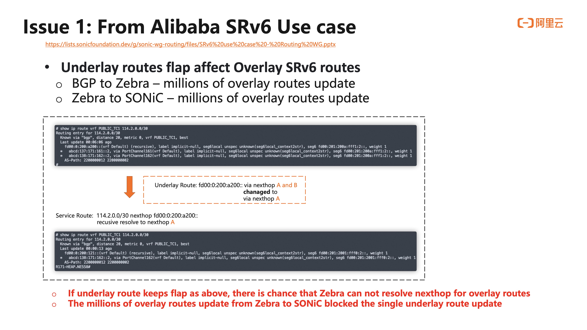
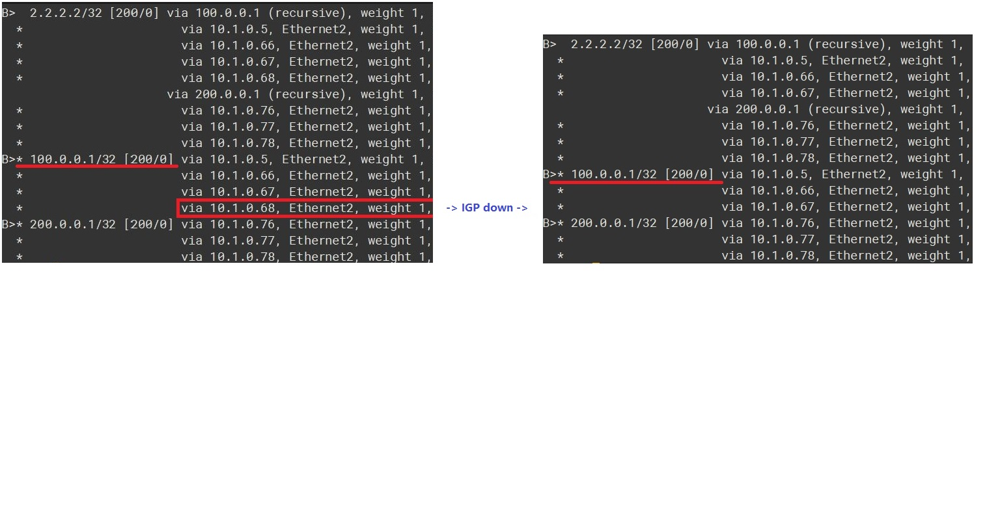
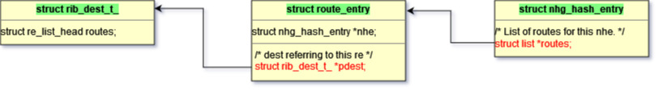
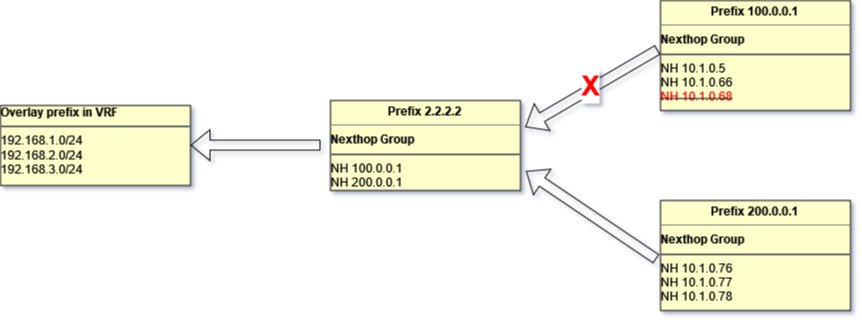

<!-- omit in toc -->
# Recursive Route Handling HLD
<!-- omit in toc -->
### Revision
| Rev |     Date    |       Author           | Change Description                |
|:---:|:-----------:|:----------------------:|-----------------------------------|
| 0.1 | Oct    2023 |                        | Initial Draft                     |

<!-- omit in toc -->
## Table of Content
- [Goal and Scope](#goal-and-scope)
  - [FRR's Current Limitations](#frrs-current-limitations)
- [FRR Current Approaches](#frr-current-approaches)
  - [NH dependency tree](#nh-dependency-tree)
  - [NHT list from route node](#nht-list-from-route-node)
  - [zebra\_rib\_evaluate\_rn\_nexthops](#zebra_rib_evaluate_rn_nexthops)
  - [Zebra triggers routes redownloading from protocol process](#zebra-triggers-routes-redownloading-from-protocol-process)
- [Triggers Events](#triggers-events)
- [High Level Design](#high-level-design)
- [Low Level Design](#low-level-design)
  - [Recursive nexthop change notification](#recursive-nexthop-change-notification)
  - [Dataplane refresh for Nexthop group change](#dataplane-refresh-for-nexthop-group-change)
  - [Zebra changes](#zebra-changes)
  - [FPM's new schema for recursive NHG](#fpms-new-schema-for-recursive-nhg)
  - [Orchagent changes](#orchagent-changes)
  - [NHG update Handling](#nhg-update-handling)
- [Unit Test](#unit-test)
- [References](#references)

## Goal and Scope
A recursive route is a routing mechanism in which the routing decision for a specific destination is determined by referring to another routing table, which is then looked up recursively until a final route is resolved. Recursive routing is a key concept in routing protocols and is often used in complex network topologies to ensure that data reaches its intended destination, even when that destination is not directly reachable from the originating device. In many cases, recursive routes are used in VPN or tunneling scenarios.

### FRR's Current Limitations
FRR zebra uses struct nexthop to track next hop information. If it is a recursive nexthop, its flags field would be set NEXTHOP_FLAG_RECURSIVE bit and its resolved field stores a pointer which points a list of nexthops obtained by recursive resolution. Therefore zebra keeps hierarchical relationships on the recursive nexthops. 

Because the Linux kernel lacks support for recursive routes, FRR zebra flattens the next-hop information of recursive routes when transferring it from Zebra to FPM or the Linux kernel. Currently, when a path goes down, zebra would inform various protocol processes and let them replay routes update events accordingly. 

This leads an issue discussed in the SONiC Routing Working Group (https://lists.sonicfoundation.dev/g/sonic-wg-routing/files/SRv6%20use%20case%20-%20Routing%20WG.pptx).

<figure align=center>
    
    <figcaption>Figure 1. Alibaba issue Underlay routes flap affecting Overlay SRv6 routes <figcaption>
</figure> 

The enhancement is discussed in https://datatracker.ietf.org/doc/draft-ietf-rtgwg-bgp-pic/. This HLD is outline an approach which could prevent BGP load balancing updates from being triggered by IGP load balancing updates. This is essentially the recursive VPN route support. 

Note: 
- This HLD only focus on recursive VPN routes support. Since SONiC doesn't have MPLS VPN support in master, the testing would focus on EVPN and SRv6 VPN only. 
- The similar approach could be applied to global table's recursive routes support. But that requires SAI APIs. Therefore, global table's recursive routes support is not in the scope of this HLD.

## FRR Current Approaches
### NH dependency tree
struct nexthop contains two fields, *resolved and *reparent for tracking nexthop resolution's dependencies. 

	/* Nexthops obtained by recursive resolution.
	 *
	 * If the nexthop struct needs to be resolved recursively,
	 * NEXTHOP_FLAG_RECURSIVE will be set in flags and the nexthops
	 * obtained by recursive resolution will be added to `resolved'.
	 */
	struct nexthop *resolved;
	/* Recursive parent */
	struct nexthop *rparent;

https://github.com/FRRouting/frr/blob/858cc75b434344ae0b25eccaf6eef03debe4a031/lib/nexthop.h#L99C1-L105C26

When a routing entry (re) is processed by rib_process(), it calls nexthop_active_update() to parse and refresh the nexthop active state. By nexthop_set_resolved(), *resolved is set to the nexthop of the route used to resolve this nexthop, *rparent will also be correspondingly set and the flag of this nexthop is set to NEXTHOP_FLAG_RECURSIVE.

### NHT list from route node
Each route node (struct rib_dest_t ) contains a nht field which lists out all nht prefixes which depend on this route node. 

	/*
	 * The list of nht prefixes that have ended up
	 * depending on this route node.
	 * After route processing is returned from
	 * the data plane we will run evaluate_rnh
	 * on these prefixes.
	 */
	struct rnh_list_head nht;

nht is updated by zebra_rnh_store_in_routing_table() and zebra_rnh_remove_from_routing_table().

### zebra_rib_evaluate_rn_nexthops

list https://github.com/FRRouting/frr/blob/master/zebra/zebra_rib.c#L850C1-L856C45

zebra_rib_evaluate_rn_nexthops() leverage the above list to trigger each depending recursive nh to get reevaluated.
It starts from the incoming route node (rn) and retrieves its nht (NextHop Track) list. Then, it iterates through each prefix in the nht list, utilizing the prefix to invoke zebra_evaluate_rnh(). This function implements the functionality of NHG updating.

When zebra triggers NHG update:
1. Zebra rib process(route add/del/update).
2. Dplane process complete.
3. Dplane route notify is received.

### Zebra triggers routes redownloading from protocol process
Routes redownloading is triggered at the end of zebra_rib_evaluate_rn_nexthops(). Its main process is as follows:

1. Identify the new route entry to resolve nexthops in the nht list.
2. Compare the new route entry with the old one, update the nexthop resolving state as the new route entry, and then send a nexthop change notification to protocol clients.
3. Protocol clients recalculate the path associated with the nexthop, then resend the route to Zebra.
4. The route's nexthop is recursively resolved, and the recursive one will be flattened.
5. Pass the route to rib process.
6. Call zebra_rib_evaluate_rn_nexthops(), then go to step 1. This loop procedure builds/refreshes the recursive route chain.

## Triggers Events
Here are a list of trigger events which we want to take care for getting faster routes convergence and minimizing hardware traffic loss. 

| Trigger Types |     Events    |       Possible handling          | 
|:---|:-----------|:----------------------|
| IGP local failure | A local link goes down | Local interface routes would be removed. From this event, zebra_rib_evaluate_rn_nexthops() would be triggered. |
| IGP remote failture | A remote link goes down, IGP leaf's reachability is not changed, only IGP paths are updated. | IGP updates IGP leaf's NHG. No need to trigger BGP update since reachability is not changed. The handling would via zebra_rib_evaluate_rn_nexthops(). It is recursive route handling case. |
| IGP remote failure  | A remote IGP node failure or a remote IGP node is unreachable. But the remote PE route could be re-resolved via a new IGP path | IGP triggers IGP leaf delete event, which triggers zebra_rib_evaluate_rn_nexthops(). Since remote PE is still reachable, it is recursive route handling case. |
| IGP remote failure  | A remote PE node failure or a remote PE node is unreachable | IGP triggers IGP leaf delete event, which triggers zebra_rib_evaluate_rn_nexthops(). This is the PIC handling case. |
| BGP remote failure  | BGP remote node down | It should be detected by IGP remote node down first before BGP reacts. This is the PIC handling case |
| BGP remote failure | Remote BGP does not response, remote PE is still available. | BGP will trigger leaf updates. It is a BGP bug situation in deployment and not in this HLD's scope |
| BGP local failure | local BGP does not response.| It is a BGP bug situation in deployment and not in this HLD's scope |

## High Level Design
The main changes are in the following areas

- Zebra would have an option to enable recursive route support. In this mode, zebra would pass both underlay and overlay NHGs to fpm. But zebra will still pass collapsed NHG to Linux kernel. 
- fpm needs to add a new schema to take each member as NHG id and update APP DB.
- orchagent picks up event from APP DB and trigger NHG programming. Neighorch needs to handle this new schema without change too much on existing codes.

## Low Level Design
### Zebra changes
#### Recursive nexthop change notification
Consider the case of recursive routes in the following diagram:

<figure align=center>
    
    <figcaption>Figure 2. EVPN Underlay recursive routes convergence<figcaption>
</figure> 

As described in the section "Routes Redownloading" above, if the prefix 100.0.0.1 via 10.1.0.68 is withdrawn from the IGP node, Zebra will explicitly redownload routes twice for recursive convergence with the help of the BGP client, one for the prefix 10.1.0.68 and another for the prefix 2.2.2.2. In this scenario, since the reachability of the prefix 2.2.2.2 remains unchanged and also Zebra has the dependency relationships between recursive NHGs, there is a chance to improve Zebra for fast route convergence by itself.

##### Data Structure Modifications
In order to enable Zebra to "Redownload Routes" without notifying protocol clients, it should be able to obtain the route node associated with the NHG that has undergone changes. Some pointer fields need to be added in the data structures below

<figure align=center>
    
    <figcaption>Figure 3. data structure modification for routes backwalk<figcaption>
</figure>

Functions below initialize the backwalk pointers

/* Add RE to head of the route node. */
static void rib_link(struct route_node *rn, struct route_entry *re, int process)
{
	rib_dest_t *dest;
	afi_t afi;
	const char *rmap_name;

	assert(re && rn);

	dest = rib_dest_from_rnode(rn);
	if (!dest) {
		if (IS_ZEBRA_DEBUG_RIB_DETAILED)
			rnode_debug(rn, re->vrf_id, "rn %p adding dest", rn);

		dest = zebra_rib_create_dest(rn);
	}

	re_list_add_head(&dest->routes, re);
	re->pdest = dest;
        ...	
 }

 int route_entry_update_nhe(struct route_entry *re,
			   struct nhg_hash_entry *new_nhghe)
{
	struct nhg_hash_entry *old;
	int ret = 0;

	if (new_nhghe == NULL) {
		if (re->nhe) {
			if (re->nhe->routes)
				listnode_delete(re->nhe->routes, re);
			zebra_nhg_decrement_ref(re->nhe);
		}
		re->nhe = NULL;
		goto done;
	}

	if ((re->nhe_id != 0) && re->nhe && (re->nhe != new_nhghe)) {
		old = re->nhe;

		route_entry_attach_ref(re, new_nhghe);
		if (!new_nhghe->routes)
			new_nhghe->routes = list_new();
		listnode_add(new_nhghe->routes, re);
		if (old) {
			if (old->routes)
				listnode_delete(old->routes, re);
			zebra_nhg_decrement_ref(old);
		}
	} else if (!re->nhe) {
		/* This is the first time it's being attached */
		route_entry_attach_ref(re, new_nhghe);
		if (!new_nhghe->routes)
			new_nhghe->routes = list_new();
		listnode_add(new_nhghe->routes, re);
	}

done:
	return ret;
}

After each routing operation, zebra_rib_evaluate_rn_nexthops() triggers routes redownloading through NHG backwalk. The backwalk should be stopped at the first NHG that is marked as NEXTHOP_GROUP_RECURSIVE; then Zebra only needs to update the NHG chain affected by the NHG that has undergone changes.

<figure align=center>
    
    <figcaption>Figure 4. routes backwalk update<figcaption>
</figure>

### Dataplane refresh for Nexthop group change
TODO:

### FPM's new schema for recursive NHG
TODO

### Orchagent changes
TODO

## Unit Test
TODO

## References
- https://github.com/sonic-net/SONiC/pull/1425
- https://github.com/eddieruan-alibaba/SONiC/blob/eruan-pic/doc/bgp_pic/bgp_pic.md
