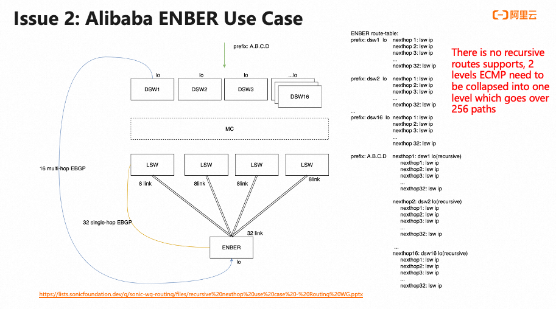
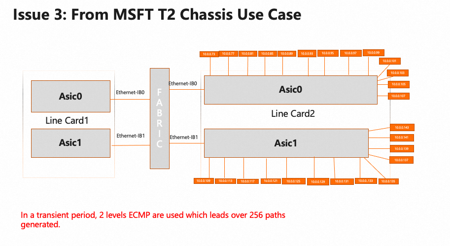

<!-- omit in toc -->
# Recursive Route Handling HLD
<!-- omit in toc -->
### Revision
| Rev |     Date    |       Author           | Change Description                |
|:---:|:-----------:|:----------------------:|-----------------------------------|
| 0.1 | Oct    2023 |                        | Initial Draft                     |

<!-- omit in toc -->
## Table of Content

## Goal and Scope
A recursive route is a routing mechanism in which the routing decision for a specific destination is determined by referring to another routing table, which is then lookuped up recursively until a final route is resolved. Recursive routing is a key concept in routing protocols and is often used in complex network topologies to ensure that data reaches its intended destination, even when that destination is not directly reachable from the originating device. In many cases, recursive routes are used in VPN or tunneling scenarios. For VPN cases' handling, it would be done via BGP PIC HLD. For this HLD, we focus on global table's recursive routes' handling

### FRR's Current Limitations
FRR zebra uses struct nexthop to track next hop information. If it is a recursive nexthop, its flags field would be set NEXTHOP_FLAG_RECURSIVE bit and its resolved field stores a pointer which points a list of nexthops obtained by recursive resolution. Therefore zebra keeps hierarchical relationships on the recursive nexthops. Because the Linux kernel lacks support for recursive routes, FRR zebra flattens the next-hop information of recursive routes when transferring it from Zebra to FPM or the Linux kernel.

#### FRR flattens nexthop
TODO: Find out how we flatten nexthop, via zebra_nhg_install_kernel() ?? if using ALL_NEXTHOPS_PTR??

#define ALL_NEXTHOPS_PTR(head, nhop)					\
	(nhop) = ((head)->nexthop);					\
	(nhop);								\
	(nhop) = nexthop_next(nhop)

/*
 * Iteration step for ALL_NEXTHOPS macro:
 * This is the tricky part. Check if `nexthop' has
 * NEXTHOP_FLAG_RECURSIVE set. If yes, this implies that `nexthop' has
 * at least one nexthop attached to `nexthop->resolved', which will be
 * the next one.
 *
 * If NEXTHOP_FLAG_RECURSIVE is not set, `nexthop' will progress in its
 * current chain. In case its current chain end is reached, it will move
 * upwards in the recursion levels and progress there. Whenever a step
 * forward in a chain is done, recursion will be checked again.
 * In a nustshell, it's equivalent to a pre-traversal order assuming that
 * left branch is 'resolved' and right branch is 'next':
 * https://en.wikipedia.org/wiki/Tree_traversal#/media/File:Sorted_binary_tree_preorder.svg
 */
struct nexthop *nexthop_next(const struct nexthop *nexthop)
{
	if (CHECK_FLAG(nexthop->flags, NEXTHOP_FLAG_RECURSIVE))
		return nexthop->resolved;

	if (nexthop->next)
		return nexthop->next;

	for (struct nexthop *par = nexthop->rparent; par; par = par->rparent)
		if (par->next)
			return par->next;

	return NULL;
}

### Issue from Alibaba Use Case
<figure align=center>
    
    <figcaption>Figure 1. Alibaba Issue for Recursive Rerouting <figcaption>
</figure> 
In Alibaba use case, there are 16 multi-hop eBGP paths over 32 single-hop eBGP paths. Due to FRR flattens all nexthop groups, zebra generates over 256 paths and trigger an zebra internal issue, uint8 is used for num_path. 

### Issue from MSFT Use Case
<figure align=center>
    
    <figcaption>Figure 2. MSFT Issue for Recursive Rerouting <figcaption>
</figure> 
In MSFT use case, there is a transient preriod, 2 levels of ECMP groups are used which leads over 256 paths generated. That leads to a zebra crash issue. 

### Recursive Routes Convergences Improvements
The main benefits for adding recursive routes support is to improve routes convergence time when underlay paths changes. When overlay nexthops' reachabilities are not changed in this event, there is no need to update overlay NHG or routes. But due to zebra flattens all NHG, currently, this kind of updates can't be avoided. 

## High Level Design
The main changes are in the following areas

- Zebra would have an option to enable recursive route support. In this mode, zebra would pass both underlay and overlay NHGs to fpm. But zebra will still pass collapsed NHG to Linux kernel. 
- fpm needs to add a new schema to take each member as NHG id and update APP DB.
- orchagent picks up event from APP DB and trigger NHG programming. Neighorch needs to handle this new schema without change too much on existing codes.
- SAI needs to add APIs to support NHG over NHG case.
- https://github.com/sonic-net/SONiC/pull/1425 doesn't handle NHG update case, which would be handled in this HLD for improving route convergence. 

## Low Level Design
### Zebra skip flattening codes for FPM and program multi level NHGs
TODO:
1. How to skip flattening NHG.
2. Need to add a level field in NHG
3. For the global table, if we have more than 2 levels, we need to program the bottom most one, and collapsed the remaining ones. HW only supports up to 2 levels. 
4. Once VPN is enabled, we will collapse all underlay levels, a.k.a we don't enable recursive route support. 

### FPM's new schema for recursive NHG
TODO

### Orchagent changes
TODO

### SAI API changes
TODO: need Hasan and Praveen's help

### NHG update Handling
TODO
1. how to handle local interface down event
2. how to handle IGP remote peer down event
3. how to handle BGP remote peer down event

## Unit Test
TODO

## References
- https://github.com/sonic-net/SONiC/pull/1425
- https://github.com/eddieruan-alibaba/SONiC/blob/eruan-pic/doc/bgp_pic/bgp_pic.md
