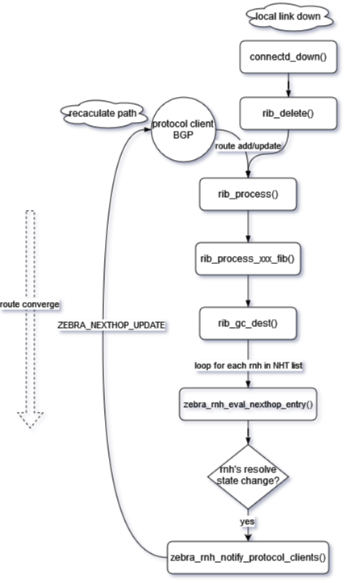
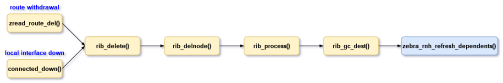

<!-- omit in toc -->
# Recursive Route Handling HLD
<!-- omit in toc -->
## Revision
| Rev |     Date    |       Author           | Change Description                |
|:---:|:-----------:|:----------------------:|-----------------------------------|
| 0.1 | Oct    2023 | Yongxin.Cao            | Initial Draft                     |

<!-- omit in toc -->
## Table of Content
- [Goal and Scope](#goal-and-scope)
- [Requirements Overview](#requirements-overview)
- [Zebra Current Approach for Recursive Routes](#zebra-current-approach-for-recursive-routes)
  - [Data Structure for Recursive Handling](#data-structure-for-recursive-handling)
    - [NH Dependency Tree](#nh-dependency-tree)
    - [NHT List from Route Node](#nht-list-from-route-node)
  - [Recursive Route Handling](#recursive-route-handling)
- [High Level Design](#high-level-design)
  - [Triggers Events for Recursive Handling](#triggers-events-for-recursive-handling)
  - [Optimization of Recursive Route Handling](#optimization-of-recursive-route-handling)
    - [Data Structure Modifications](#data-structure-modifications)
      - [struct nhg\_hash\_entry](#struct-nhg_hash_entry)
      - [struct route\_entry](#struct-route_entry)
      - [struct rnh](#struct-rnh)
    - [The Handling of zebra\_rnh\_refresh\_dependents()](#the-handling-of-zebra_rnh_refresh_dependents)
  - [Nexthop Group Preserving](#nexthop-group-preserving)
    - [Data Structure Modifications](#data-structure-modifications-1)
    - [The Handling of nexthop\_active\_update()](#the-handling-of-nexthop_active_update)
    - [The Handling of rib\_add\_multipath\_nhe()](#the-handling-of-rib_add_multipath_nhe)
  - [Route Withdrawal](#route-withdrawal)
    - [Data Structure Modifications](#data-structure-modifications-2)
    - [Fast Convergence Handling for Route Withdrawal](#fast-convergence-handling-for-route-withdrawal)
  - [Special Considerations for EVPN Overlay Routes](#special-considerations-for-evpn-overlay-routes)
  - [Dataplane Refresh for Recursive route](#dataplane-refresh-for-recursive-route)
  - [FPM's new schema for recursive nexthop group](#fpms-new-schema-for-recursive-nexthop-group)
  - [Orchagent changes](#orchagent-changes)
- [Unit Test](#unit-test)
  - [Normal Case's Forwarding Chain Information](#normal-cases-forwarding-chain-information)
  - [Test Case 1: local link failure](#test-case-1-local-link-failure)
  - [Test Case 2: IGP remote link/node failure](#test-case-2-igp-remote-linknode-failure)
  - [Test Case 3: IGP remote PE failure](#test-case-3-igp-remote-pe-failure)
  - [Test Case 4: BGP remote PE node failure](#test-case-4-bgp-remote-pe-node-failure)
  - [Test Case 5: Remote PE-CE link failure](#test-case-5-remote-pe-ce-link-failure)
- [References](#references)

## Goal and Scope
A recursive route is a routing mechanism in which the routing decision for a specific destination is determined by referring to another routing table, which is then looked up recursively until a final route is resolved. Recursive routing is a key concept in routing protocols and is often used in complex network topologies to ensure that data reaches its intended destination, even when that destination is not directly reachable from the originating device. In many cases, recursive routes are used in VPN or tunneling scenarios.

- This HLD focus on recursive route convergence handling. Since SONiC doesn't have MPLS VPN support in master, the testing would focus on EVPN and SRv6 VPN only. 
- The approach applied to the handling of recursive routes in Per-VRF.

## Requirements Overview
This HLD focuses on Zebra and introduces two enhancements for recursive routes. The first is to recalculate route changes (additions/updates/withdrawals) independently, without relying on the protocol client in certain cases. The second is to optimize the convergence logic of recursive route. If Zebra serves as the control plane, then corresponding adjustments may be made to FPM and Orchagent to collaborate with it, thereby enhancing the overall efficiency of route convergence.

- Fpm needs to add a new schema to take each member as nexthop group ID and update APP DB. (Rely on BRCM and NTT's changes)
- Orchagent picks up event from APP DB and trigger nexthop group programming. Neighorch needs to handle this new schema without change too much on existing codes. (Rely on BRCM and NTT's changes)

## Zebra Current Approach for Recursive Routes
Zebra uses struct nexthop to track nexthop information. If it is a recursive nexthop, its flags field would be set NEXTHOP_FLAG_RECURSIVE bit and its resolved field stores a pointer which points a list of nexthops obtained by recursive resolution. Therefore Zebra keeps hierarchical relationships on the recursive nexthops. Because the Linux kernel lacks support for recursive routes, FRR Zebra flattens the next-hop information of recursive routes when transferring it from Zebra to FPM or the Linux kernel. Currently, when a path goes down, Zebra would inform various protocol processes and let them replay routes update events accordingly. 

This leads an issue discussed in the SONiC Routing Working Group (https://lists.sonicfoundation.dev/g/sonic-wg-routing/files/SRv6%20use%20case%20-%20Routing%20WG.pptx).

<figure align=center>
    
    <figcaption>Figure 1. Alibaba issue Underlay routes flap affecting Overlay SRv6 routes <figcaption>
</figure> 

To solve this issue, we need to introduce Prefix Independent Convergence (PIC) to FRR/SONiC. PIC concept is described in IEFT https://datatracker.ietf.org/doc/draft-ietf-rtgwg-bgp-pic/. It is not a BGP feature, but a RIB/FIB feeature on the device. PIC has two basic concepts, PIC core and PIC edge. The following HLD focuses on PIC edge's enhancement https://datatracker.ietf.org/doc/draft-ietf-rtgwg-bgp-pic/. This HLD is outline an approach which could prevent BGP load balancing updates from being triggered by IGP load balancing updates, a.k.a PIC core approach for the recursive VPN route support. 

### Data Structure for Recursive Handling
#### NH Dependency Tree
struct nexthop contains two fields, *resolved and *reparent for tracking nexthop resolution's dependencies. 

	/* Nexthops obtained by recursive resolution.
	 *
	 * If the nexthop struct needs to be resolved recursively,
	 * NEXTHOP_FLAG_RECURSIVE will be set in flags and the nexthops
	 * obtained by recursive resolution will be added to `resolved'.
	 */
	struct nexthop *resolved;
	/* Recursive parent */
	struct nexthop *rparent;

https://github.com/FRRouting/frr/blob/858cc75b434344ae0b25eccaf6eef03debe4a031/lib/nexthop.h#L99C1-L105C26

In Zebra, when a routing entry is processed by rib_process(), it calls nexthop_active_update() to parse and refresh the nexthop active state. Then, *resolved is set to the nexthop of the route used to resolve this nexthop, and the flag NEXTHOP_FLAG_RECURSIVE is set to the nexthop to indicate its recursive state.

#### NHT List from Route Node
Each route node (struct rib_dest_t) contains an nht field, which stores all nexthop prefixes that depend on this route node.

	/*
	 * The list of nht prefixes that have ended up
	 * depending on this route node.
	 * After route processing is returned from
	 * the data plane we will run evaluate_rnh
	 * on these prefixes.
	 */
	struct rnh_list_head nht;

This list is updated when a new route is added or a nexthop is registered by the protocol clients.

### Recursive Route Handling
The handling is carried out during the replay of route updates, and zebra_rib_evaluate_rn_nexthops() can be seen as the entry point for this process. It starts from the incoming route node and retrieves its NHT list. Then, it iterates through each nexthop(prefix) in the NHT list, utilizing the prefix to invoke zebra_evaluate_rnh(). This function works as follows:

1. Identify the new route entry to resolve the nexthop
2. Compare the new route entry with the previous one, if they are not same, update the nexthop resolving state as the new route entry, and then send a nexthop change notification to protocol clients
3. Protocol clients recalculate the path associated with the nexthop, then resend the corresponding route to Zebra.
4. Zebra processes this route and the route's nexthop is recursively resolved and also flattened
6. At the end of route updating, zebra_rib_evaluate_rn_nexthops() is called with the route's NHT list, and then it returns to step 1. This loop procedure contributes to recursive route convergence

## High Level Design

### Triggers Events for Recursive Handling
Here are a list of trigger events which we want to take care for getting recursive route convergence and minimizing hardware traffic loss. 

| Trigger Types |     Events    |       Possible handling          | 
|:---|:-----------|:----------------------|
| Case 1: IGP local failure | A local link goes down | Currently Orchagent handles local link down event and triggers a quick fixup which removes the failed path in HW ECMP. Zebra will be triggered from connected_down() handling. BGP may be informed to install a backup path if needed. This is a special PIC core case, a.k.a PIC local |
| Case 2: IGP remote link/node failture  | A remote link goes down, IGP leaf's reachability is not changed, only IGP paths are updated. | IGP gets route withdraw events from IGP peer. It would inform zebra with updated paths. Zebra would be triggered from zread_route_add() with updated path list. It is the PIC core handling case. |
| Case 3: IGP remote PE failure  | A remote PE node is unreachable in IGP domain. | IGP triggers IGP leaf delete event. Zebra will be triggered from zread_route_del(). It is the PIC edge handling case |
| Case 4: BGP remote PE node failure  | BGP remote node down | It should be detected by IGP remote node down first before BGP reacts, a.k.a the same as the above steps. This is the PIC edge handling case.|
| Case 5: Remote PE-CE link failure | This is remote PE's PIC local case.  | Remote PE will trigger PIC local handling for quick traffic fix up. Local PE will be updated after BGP gets informed. |

### Optimization of Recursive Route Handling
Consider the case of recursive routes for EVPN underlay

    B>  2.2.2.2/32 [200/0] via 100.0.0.1 (recursive), weight 1, 00:11:50
      *                      via 10.1.0.16, Ethernet1, weight 1, 00:11:50
      *                      via 10.1.0.17, Ethernet2, weight 1, 00:11:50
      *                      via 10.1.0.18, Ethernet3, weight 1, 00:11:50
                           via 200.0.0.1 (recursive), weight 1, 00:11:50
      *                      via 10.1.0.26, Ethernet4, weight 1, 00:11:50
      *                      via 10.1.0.27, Ethernet5, weight 1, 00:11:50
      *                      via 10.1.0.28, Ethernet6, weight 1, 00:11:50
    B>* 100.0.0.0/24 [200/0] via 10.1.0.16, Ethernet1, weight 1, 00:11:57
      *                      via 10.1.0.17, Ethernet2, weight 1, 00:11:57
      *                      via 10.1.0.18, Ethernet3, weight 1, 00:11:57
    B>* 200.0.0.0/24 [200/0] via 10.1.0.26, Ethernet4, weight 1, 00:11:50
      *                      via 10.1.0.27, Ethernet5, weight 1, 00:11:50
      *                      via 10.1.0.28, Ethernet6, weight 1, 00:11:50

If the path 10.1.0.28 of prefix 200.0.0.0/24 is removed, Zebra will explicitly update both routes for recursive convergence with the help of the BGP client, one for 200.0.0.0/24 and another for 2.2.2.2/32. In this scenario, although the route 200.0.0.0/24 has one path removed, but its reachability for route 2.2.2.2/32 remains unchanged . Zebra has the dependency relationships between these recursive routes, so there is a chance to improve Zebra for route convergence by itself.

<figure align=center>
    
    <figcaption>Figure 2. path remove for recursive route<figcaption>
</figure>

#### Data Structure Modifications
In order to enable Zebra to update routes without notifying protocol clients, it should be able to obtain the route node associated with the nexthop that has undergone changes. Some back pointer fields need to be added.

<figure align=center>
    
    <figcaption>Figure 3. data structure modification for routes update<figcaption>
</figure>

##### struct nhg_hash_entry 
New field struct list *routes in struct nhg_hash_entry

    struct nhg_hash_entry {
        ...

        struct nhg_connected_tree_head nhg_depends, nhg_dependents;

        /* List of routes for this nhe. */
        struct list *routes;

        ...
    }

##### struct route_entry
New field struct list *routes in struct route_entry

    struct route_entry {       
        ...

        /* dest referring to this re */
        struct rib_dest_t_ *pdest;

        ...
    }

Functions initialize the backwalk pointers.
``` c
static void rib_link(struct route_node *rn, struct route_entry *re, int process)
{
    rib_dest_t *dest;
    afi_t afi;
    const char *rmap_name;

    ...

    re_list_add_head(&dest->routes, re);
    re->pdest = dest;

    ...	
}
```

``` c
int route_entry_update_nhe(struct route_entry *re, struct nhg_hash_entry *new_nhghe)
{
    struct nhg_hash_entry *old;
    int ret = 0;

    if (new_nhghe == NULL) {
        if (re->nhe) {
            if (re->nhe->routes)
                listnode_delete(re->nhe->routes, re);
                zebra_nhg_decrement_ref(re->nhe);
            }
            re->nhe = NULL;
            goto done;
    }

    if ((re->nhe_id != 0) && re->nhe && (re->nhe != new_nhghe)) {
        old = re->nhe;

        route_entry_attach_ref(re, new_nhghe);
        if (!new_nhghe->routes)
            new_nhghe->routes = list_new();
        listnode_add(new_nhghe->routes, re);
        if (old) {
            if (old->routes)
                listnode_delete(old->routes, re);
            zebra_nhg_decrement_ref(old);
        }
    } else if (!re->nhe) {
        /* This is the first time it's being attached */
        route_entry_attach_ref(re, new_nhghe);
        if (!new_nhghe->routes)
            new_nhghe->routes = list_new();
        listnode_add(new_nhghe->routes, re);
    }
done:
    return ret;
}
```

##### struct rnh
zebra_rib_evaluate_rn_nexthops() triggers routes updating through nexthop backwalk. Without the assistance of protocol clients, a method needs to be introduced for looking up nexthop hash struct(nhe) based on the prefix of the NHT list. e.g. Finding the nhe based on the prefix 100.0.0.1.

A new field nhe_id is added for this purpose.

    struct rnh {
        ...

        /* nhe id currently associated */
        uint32_t nhe_id;

        ...
    }

This field provides information about which nhe is associated with the NHT prefix.

nhg_id_rnh_add() is used to set this field and it is invoked each time a new singleton nhe is created in zebra_nhe_find().
``` c
static void nhg_id_rnh_add(struct nhg_hash_entry *nhe)
```
``` c
static bool zebra_nhe_find(struct nhg_hash_entry **nhe, /* return value */
               struct nhg_hash_entry *lookup,
               struct nhg_connected_tree_head *nhg_depends,
               afi_t afi, bool from_dplane)
{
    bool created = false;
    bool recursive = false;
    struct nhg_hash_entry *newnhe, *backup_nhe;
    struct nexthop *nh = NULL;

    ...

done:
    /* Reset time since last update */
    (*nhe)->uptime = monotime(NULL);

    if (created)
        nhg_id_rnh_add(*nhe);

    return created;
}
```

#### The Handling of zebra_rnh_refresh_dependents()

This new function is inserted into the existing route convergence process, allowing Zebra to achieve route convergence in the case where the reachability of recursive routes remains unchanged.

Provide a brief description of Zebra's original recursive convergence process.

<figure align=center>
    
    <figcaption>Figure 4. route convergence process<figcaption>
</figure>

Route/Nexthop dependents are built or refreshed from the bottom up with each invocation of zebra_rnh_eval_nexthop_entry().

After the insertion of zebra_rnh_refresh_dependents() into the original recursive convergence process.

<figure align=center>
    
    <figcaption>Figure 5. zebra_rnh_refresh_dependents()<figcaption>
</figure>

The logic in the red portion of the code will achieve fast route convergence updating. But it won't completely disable the protocol client's notification mechanism because when the reachability of routes that the NHT list depends on changes, i.e., when the routes it depends on change completely to another one, Zebra will still use the original protocol client notify mechanism for route convergence. In other words, the blue portion will only take effect when there's an increase or decrease in the paths corresponding to the nexthop group that doesn't affect route reachability.

zebra_rnh_refresh_dependents() is called as follows:

``` c
static void zebra_rnh_eval_nexthop_entry(struct zebra_vrf *zvrf, afi_t afi,
					 int force, struct route_node *nrn,
					 struct rnh *rnh,
					 struct route_node *prn,
					 struct route_entry *re)
{
    ...
    zebra_rnh_remove_from_routing_table(rnh);
    if (!prefix_same(&rnh->resolved_route, prn ? &prn->p : NULL)) {
        if (prn)
            prefix_copy(&rnh->resolved_route, &prn->p);
        else {
                /*
                * Just quickly store the family of the resolved
                * route so that we can reset it in a second here
                */
                int family = rnh->resolved_route.family;

                memset(&rnh->resolved_route, 0, sizeof(struct prefix));
                rnh->resolved_route.family = family;
        }

        copy_state(rnh, re, nrn);
        state_changed = 1;
    } else if (compare_state(re, rnh->state)) {
        if (!CHECK_FLAG(re->flags, ROUTE_ENTRY_NHG_ID_PRESERVED))
            zebra_rnh_refresh_dependents(rnh);
        copy_state(rnh, re, nrn);
    }
    zebra_rnh_store_in_routing_table(rnh);
    ...
}
```

Explanation of the functions above:

1. rib_process() eventually calls zebra_rnh_eval_nexthop_entry() after finishing the route updating task
2. zebra_rnh_eval_nexthop_entry() see if a tracked nexthop entry (rnh) has undergone any change, If the rnh's resolution has changed, then it meets the fast convergence condition, zebra_rnh_refresh_dependents() is invoked, otherwise, the original protocol client notify mechanism is used, as step 6, zebra_rnh_notify_protocol_clients()
3. zebra_rnh_refresh_dependents() finds the corresponding nexthop group (nhe), then uses this nhe as parameter for zebra_rnh_eval_dependents()
4. zebra_rnh_eval_dependents() walks back and find the routes depends on the nhe, then requeue the routes to working queue for rib_process() again. A new flag ROUTE_ENTRY_NHG_ID_PRESERVED (struct route_entry) is set for this route, to indicate that its recursive reachability is unchanged
5. In each round of rib_process(), the rnh's resolving route status will be checked in zebra_rnh_eval_nexthop_entry(). The backwalk for route convergence stops if the rnh is resolved on a route with ROUTE_ENTRY_NHG_ID_PRESERVED flag or the rnh list is empty.

### Nexthop Group Preserving
By the original approach of routes updating, once the IGP routing changes, NHG refresh will proceed along the reverse path of dependency, so all NHGs on that direction will be recreated. As shown in the diagram, when the IGP node 10.0.1.28 is up, all dependent NHGs originating from it will be recreated, as indicated by the red text in the diagram.

<figure align=center>
    
    <figcaption>Figure 6. NHG dependents<figcaption>
</figure>

<figure align=center>
    
    <figcaption>Figure 7. NHG dependents (IGP node 10.0.1.28 is up)<figcaption>
</figure>

However, for the view of the reachability of NHG 68, 61, 62, there is no need to refresh them for recursive route again (68 for prefix 2.2.2.2 and 61, 62 for 200.0.0.1), since the reachability hasn't changed. If these NHGs remain unchanged, it means that the nhe for them can be reused and the dependents chain have no changes too.

After introducing the "Nexthop Group Preserving" enhancement, the desired goal is as illustrated in the following diagram.

<figure align=center>
    
    <figcaption>Figure 8. NHG dependents preserved (IGP node 10.0.1.28 is up)<figcaption>
</figure>

The dependent NHG chain all the way up for the newly added path NHG 64 is untouched.

#### Data Structure Modifications
``` c
/* The nexthop group id should remain unchanged during resolving */
#define ROUTE_ENTRY_NHG_ID_PRESERVED      0x80
```
This new flag for struct route_entry indicates that the nexthop group shouldn't change during route's recursive resolving, it also implies that the route with this flag only has some nexthop path change, but the reachability of it remains same.

#### The Handling of nexthop_active_update()
The modification made to nexthop_active_update() preserves the associated nexthop group of routes with the ROUTE_ENTRY_NHG_ID_PRESERVED flag set during recursive route resolution. It recursively resolves them in place. Once the resolution is complete, the nexthop group itself is reused, and no new nexthop groups are created.

#### The Handling of rib_add_multipath_nhe()
TODO: Route adding part for this function need to be tuned. In the case of that the new route entry replaces the old one, we need to reuse the original nhe and only updates its associated nhg to the new ones, then attach it to the new route entry and set ROUTE_ENTRY_NHG_ID_PRESERVED to this route entry. This may achieve the goal of preserving NHG?

### Route Withdrawal
As shown in the example of recursive routes for EVPN underlay above, rib deletion is triggered by the local interface going down or by an explicit route withdrawal message from the BGP client. It is handled in rib_gc_dest(), while zebra_rnh_refresh_dependents() is called for all the rnh that depend on the removed route. So route withdrawal shares the same logic of route updating.

<figure align=center>
    
    <figcaption>Figure 9. rib deletion code path<figcaption>
</figure>

Assuming interface Ethernet6 is down, in the context of "Nexthop Group Preserving", the nexthop group dependent state is as illustrated in the following diagram

<figure align=center>
    
    <figcaption>Figure 10. NHG dependents preserved (Ethernet6 is down)<figcaption>
</figure>

The dependent NHG chain all the way up from NHG 62 is untouched.

#### Data Structure Modifications
As described in the "route updating" section.

#### Fast Convergence Handling for Route Withdrawal
As described in the "route updating" section.

### Special Considerations for EVPN Overlay Routes
TODO:

### Dataplane Refresh for Recursive route
TODO: As the recursive nexthop group and its dependents remain unchanged, Zebra is able to skip reinstall the route again? Instead of only update the nexthop group to kernel?

### FPM's new schema for recursive nexthop group
We rely on BRCM and NTT's changes.

### Orchagent changes
We rely on BRCM and NTT's changes.

## Unit Test
### Normal Case's Forwarding Chain Information
### Test Case 1: local link failure
<figure align=center>
    
    <figcaption>Figure 11.local link failure <figcaption>
</figure>

### Test Case 2: IGP remote link/node failure
<figure align=center>
    
    <figcaption>Figure 12. IGP remote link/node failure
 <figcaption>
</figure>

### Test Case 3: IGP remote PE failure
<figure align=center>
    
    <figcaption>Figure 13. IGP remote PE failure
 <figcaption>
</figure>

### Test Case 4: BGP remote PE node failure
<figure align=center>
    
    <figcaption>Figure 14. BGP remote PE node failure
 <figcaption>
</figure>

### Test Case 5: Remote PE-CE link failure
<figure align=center>
    
    <figcaption>Figure 15. Remote PE-CE link failure
 <figcaption>
</figure>

## References
- https://github.com/sonic-net/SONiC/pull/1425
- https://datatracker.ietf.org/doc/draft-ietf-rtgwg-bgp-pic/
- https://github.com/sonic-net/SONiC/blob/master/doc/pic/bgp_pic_arch_doc.md
- https://github.com/eddieruan-alibaba/SONiC/blob/eruan-pic/doc/bgp_pic/bgp_pic.md
