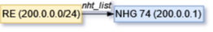
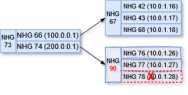

<!-- omit in toc -->
# Recursive Route Handling HLD
<!-- omit in toc -->
## Revision
| Rev |     Date    |       Author           | Change Description                |
|:---:|:-----------:|:----------------------:|-----------------------------------|
| 0.1 | Oct    2023 |                        | Initial Draft                     |

<!-- omit in toc -->
## Table of Content
- [Goal](#goal)
- [Requirements Overview](#requirements-overview)
- [Zebra Current Approach for Recursive Routes](#zebra-current-approach-for-recursive-routes)
  - [Data Structure for Recursive Handling](#data-structure-for-recursive-handling)
    - [Nexthop Dependency Tree](#nexthop-dependency-tree)
    - [NHT List from Route Node](#nht-list-from-route-node)
  - [Recursive Route Handling](#recursive-route-handling)
- [High Level Design](#high-level-design)
  - [Triggers Events for Recursive Handling](#triggers-events-for-recursive-handling)
  - [Nexthop Fixup Handling](#nexthop-fixup-handling)
    - [Nexthop ID Change](#nexthop-id-change)
    - [zebra\_rnh\_fixup\_depends()](#zebra_rnh_fixup_depends)
    - [Nexthop Group Proposed Changes](#nexthop-group-proposed-changes)
    - [Nexthop Dependency State](#nexthop-dependency-state)
    - [Segments of Nexthop Dependency](#segments-of-nexthop-dependency)
  - [Dataplane Refresh for Recursive Route](#dataplane-refresh-for-recursive-route)
  - [FPM's New Schema for Recursive Nexthop Group](#fpms-new-schema-for-recursive-nexthop-group)
  - [Orchagent Changes](#orchagent-changes)
- [Unit Test](#unit-test)
  - [Normal Case's Forwarding Chain Information](#normal-cases-forwarding-chain-information)
  - [Test Case 1: local link failure](#test-case-1-local-link-failure)
  - [Test Case 2: IGP remote link/node failure](#test-case-2-igp-remote-linknode-failure)
  - [Test Case 3: IGP remote PE failure](#test-case-3-igp-remote-pe-failure)
  - [Test Case 4: BGP remote PE node failure](#test-case-4-bgp-remote-pe-node-failure)
  - [Test Case 5: Remote PE-CE link failure](#test-case-5-remote-pe-ce-link-failure)
- [References](#references)

## Goal
This document is for reducing packet loss window when Zebra handles convergence of recursive routes on SONiC. Since SONiC doesn't have MPLS VPN support in master, the testing would focus on EVPN and SRv6 VPN only. 

## Requirements Overview
Because the Linux kernel lacks support for recursive routes, FRR Zebra flattens the nexthop information of recursive routes when transferring it from Zebra to FPM or the Linux kernel. Currently, when a path goes down, Zebra would inform various protocol processes and let them replay routes update events accordingly. This leads an issue discussed in the SONiC Routing Working Group (https://lists.sonicfoundation.dev/g/sonic-wg-routing/files/SRv6%20use%20case%20-%20Routing%20WG.pptx).

<figure align=center>
    
    <figcaption>Figure 1. Alibaba issue Underlay routes flap affecting Overlay SRv6 routes <figcaption>
</figure>

To solve this issue, we need to introduce Prefix Independent Convergence (PIC) to FRR/SONiC. PIC concept is described in IEFT https://datatracker.ietf.org/doc/draft-ietf-rtgwg-bgp-pic/. It is not a BGP feature, but a RIB/FIB feature on the device. PIC has two basic concepts, PIC core and PIC edge. The following HLD focuses on PIC edge's enhancement https://github.com/eddieruan-alibaba/SONiC/blob/eruan-pic/doc/pic/bgp_pic_edge.md. This HLD is outline an approach which could prevent BGP load balancing updates from being triggered by IGP load balancing updates, a.k.a PIC core approach for the recursive VPN route support.

## Zebra Current Approach for Recursive Routes
### Data Structure for Recursive Handling
#### Nexthop Dependency Tree
struct nexthop contains two fields, *resolved and *reparent for tracking nexthop resolution's dependencies. 

	/* Nexthops obtained by recursive resolution.
	 *
	 * If the nexthop struct needs to be resolved recursively,
	 * NEXTHOP_FLAG_RECURSIVE will be set in flags and the nexthops
	 * obtained by recursive resolution will be added to `resolved'.
	 */
	struct nexthop *resolved;
	/* Recursive parent */
	struct nexthop *rparent;

https://github.com/FRRouting/frr/blob/858cc75b434344ae0b25eccaf6eef03debe4a031/lib/nexthop.h#L99C1-L105C26

In Zebra, when a routing entry is processed by rib_process() function, it calls nexthop_active_update() to parse and refresh the nexthop resolving state. Then, *resolved is set to the nexthop of the route used to resolve this nexthop, and the flag NEXTHOP_FLAG_RECURSIVE is set to the nexthop to indicate its recursive state.

#### NHT List from Route Node
Each route node (struct rib_dest_t) contains an nht field, which stores all nexthop prefixes that depend on this route node.

	/*
	 * The list of nht prefixes that have ended up
	 * depending on this route node.
	 * After route processing is returned from
	 * the data plane we will run evaluate_rnh
	 * on these prefixes.
	 */
	struct rnh_list_head nht;

This list is updated when a new route is added or a nexthop is registered by the protocol clients.

### Recursive Route Handling
A brief description of Zebra's current recursive convergence process below

<figure align=center>
    
    <figcaption>Figure 2. route convergence process<figcaption>
</figure>

Recursive route handling is carried out during the replay of route updates, and zebra_rib_evaluate_rn_nexthops() can be seen as the entry point for this process. It starts from the incoming route node and retrieves its NHT list. Then, it iterates through each nexthop (prefix) in the NHT list, utilizing the prefix to invoke zebra_evaluate_rnh().

## High Level Design

### Triggers Events for Recursive Handling
Here are a list of trigger events which we want to take care for getting recursive route convergence and minimizing hardware traffic loss. 

| Trigger Types |     Events    |       Possible handling          | 
|:---|:-----------|:----------------------|
| Case 1: IGP local failure | A local link goes down | Currently Orchagent handles local link down event and triggers a quick fixup which removes the failed path in HW ECMP. Zebra will be triggered from connected_down() handling. BGP may be informed to install a backup path if needed. This is a special PIC core case, a.k.a PIC local |
| Case 2: IGP remote link/node failture  | A remote link goes down, IGP leaf's reachability is not changed, only IGP paths are updated. | IGP gets route withdraw events from IGP peer. It would inform zebra with updated paths. Zebra would be triggered from zread_route_add() with updated path list. It is the PIC core handling case. |
| Case 3: IGP remote PE failure  | A remote PE node is unreachable in IGP domain. | IGP triggers IGP leaf delete event. Zebra will be triggered from zread_route_del(). It is the PIC edge handling case |
| Case 4: BGP remote PE node failure  | BGP remote node down | It should be detected by IGP remote node down first before BGP reacts, a.k.a the same as the above steps. This is the PIC edge handling case.|
| Case 5: Remote PE-CE link failure | This is remote PE's PIC local case.  | Remote PE will trigger PIC local handling for quick traffic fix up. Local PE will be updated after BGP gets informed. |

### Nexthop Fixup Handling
Consider the case of recursive routes for EVPN underlay

    B>  2.2.2.2/32 [200/0] via 100.0.0.1 (recursive), weight 1, 00:11:50
      *                      via 10.1.0.16, Ethernet1, weight 1, 00:11:50
      *                      via 10.1.0.17, Ethernet1, weight 1, 00:11:50
      *                      via 10.1.0.18, Ethernet1, weight 1, 00:11:50
                           via 200.0.0.1 (recursive), weight 1, 00:11:50
      *                      via 10.1.0.26, Ethernet1, weight 1, 00:11:50
      *                      via 10.1.0.27, Ethernet1, weight 1, 00:11:50
      *                      via 10.1.0.28, Ethernet1, weight 1, 00:11:50
    B>* 100.0.0.0/24 [200/0] via 10.1.0.16, Ethernet1, weight 1, 00:11:57
      *                      via 10.1.0.17, Ethernet1, weight 1, 00:11:57
      *                      via 10.1.0.18, Ethernet1, weight 1, 00:11:57
    B>* 200.0.0.0/24 [200/0] via 10.1.0.26, Ethernet1, weight 1, 00:11:50
      *                      via 10.1.0.27, Ethernet1, weight 1, 00:11:50
      *                      via 10.1.0.28, Ethernet1, weight 1, 00:11:50

If the path 10.1.0.28 of prefix 200.0.0.0/24 is removed, Zebra will explicitly update both routes for recursive convergence with the help of the BGP client, one for 200.0.0.0/24 and another for 2.2.2.2/32. In this scenario, although the route 200.0.0.0/24 has one path removed, but its reachability for route 2.2.2.2/32 remains unchanged. To avoid packet loss, it's crucial to do a quick refresh of nexthops in dataplane before Zebra completes its route convergence process. This approach would help underlay routes' traffic loss as well. No need to call out overlay routes explicitly.

<figure align=center>
    
    <figcaption>Figure 3. the path removed for recursive route<figcaption>
</figure>

#### Nexthop ID Change
When Zebra creates a hash entry for the NHG, it uses the IP of the nexthop and its resolved nexthop as the conditions for calculating the hash key. Therefore, every time a new nexthop is registered with Zebra, it creates a new entry, even if a corresponding hash entry already exists. As a result, the nexthop ID will also change.

``` c
uint32_t nexthop_group_hash(const struct nexthop_group *nhg)
{
    struct nexthop *nh;
    uint32_t key = 0;

    for (ALL_NEXTHOPS_PTR(nhg, nh))
        key = jhash_1word(nexthop_hash(nh), key);

    return key;
}
```
To facilitate the handling of nexthop fixup, it is necessary to keep it unchanged during the recursive nexthop convergence process. Therefore, we consider not using the resolved nexthop as one of the conditions for generating the hash key. Instead, we will use the following API for generating the hash key.

``` c
uint32_t nexthop_group_hash_no_recurse(const struct nexthop_group *nhg)
{
	struct nexthop *nh;
	uint32_t key = 0;

	/*
	 * We are not interested in hashing over any recursively
	 * resolved nexthops
	 */
	for (nh = nhg->nexthop; nh; nh = nh->next)
		key = jhash_1word(nexthop_hash(nh), key);

	return key;
}
```

#### zebra_rnh_fixup_depends()

This newly added function is inserted into the existing route convergence process, enabling Zebra to refresh nexthops in the dataplane before notifying the protocol client of route updates.

<figure align=center>
    
    <figcaption>Figure 5. zebra_rnh_fixup_depends()<figcaption>
</figure>

The function in the blue serves a quick nexthop refreshing. It runs before the protocol client's notification for route updating.

zebra_rnh_fixup_depends() is called as follows

``` c
static void zebra_rnh_eval_nexthop_entry(struct zebra_vrf *zvrf, afi_t afi,
					 int force, struct route_node *nrn,
					 struct rnh *rnh,
					 struct route_node *prn,
					 struct route_entry *re)
{
    ...
    zebra_rnh_remove_from_routing_table(rnh);
    if (!prefix_same(&rnh->resolved_route, prn ? &prn->p : NULL)) {
        if (prn)
            prefix_copy(&rnh->resolved_route, &prn->p);
        else {
                int family = rnh->resolved_route.family;

                memset(&rnh->resolved_route, 0, sizeof(struct prefix));
                rnh->resolved_route.family = family;
        }

        copy_state(rnh, re, nrn);
        state_changed = 1;
    } else if (compare_state(re, rnh->state)) {
        copy_state(rnh, re, nrn);
        state_changed = 1;
    }
    zebra_rnh_store_in_routing_table(rnh);

    if (state_changed || force) {
        /* New added for dataplane quick refresh */
        zebra_rnh_fixup_depends(rnh);

        zebra_rnh_notify_protocol_clients(zvrf, afi, nrn, rnh, prn,
                              rnh->state);
        zebra_rnh_process_pseudowires(zvrf->vrf->vrf_id, rnh);
    }
}
```

A brief explanation of the above process (with more detailed available in the subsequent sections):
1. rib_process() eventually calls zebra_rnh_eval_nexthop_entry() after finishing one route updating task
2. If a tracked nexthop has resolved paths changed (as in the if else branch where compare_state() is located in the above code snippet), zebra_rnh_fixup_depends() will be invoked for the quick dataplane fixup which might stop traffic loss via removing failed path before the protocol client notification is sent
3. Zebra continues the client notify process, proceeding with the next round of recursive route iteration to refresh the resolution of nexthops to their final state

#### Nexthop Group Proposed Changes

As currently implemented, when Zebra adds or updates a route, it creates a new Nexthop Group (NHG) for that route. So, in the process of the route convergence mentioned above, even if the reachability of the NHG (such as 200.0.0.1) hasn't changed, this NHG will be recreated during the convergence process. As shown in the diagram, when the path 10.0.1.28 is removed, all dependent NHGs originating from it will be recreated, as indicated by the red text in the diagram.

<figure align=center>
    
    <figcaption>Figure 6. nexthop changes when routes converge in current FRR approach<figcaption>
</figure>

In order to facilitate a quick refresh by the dataplane, the recursive NHGs meeting the following conditions should be preserved:
- NHG of a singleton nexthop
- NHG for a group of unchanged singleton nexthops

#### Nexthop Dependency State

As in the previous section, due to the NHG proposed changes, the final status of the nexthop dependency is expected as follows:

<figure align=center>
    
    <figcaption>Figure 7. final status of the nexthop dependency of preserved NHG<figcaption>
</figure>

#### Segments of Nexthop Dependency
Assuming BGP detects the node 10.0.1.28 is down, it sends a route update to Zebra with only two remaining paths. After Zebra updates this route, it reaches the state shown in Figure 7. Using this state as the starting point, the process for a quick dataplane refresh is as follows:

1. Zebra is informed the routes update of two paths for 200.0.0.0/24 (path 10.0.1.28 is removed), Zebra updates this route with new NHG 90 which has the two paths, then sends the route to dataplane. This is the current approach that Zebra used and it would recover all traffic for route 200.0.0.0/24 in hardware.
<figure align=center>
    
</figure>

2. Zebra iterates nht list of the route 200.0.0.0/24, then hands each rnh (as above NHG74 is found) in the list to zebra_rnh_fixup_depends().
<figure align=center>
    
</figure>

3. Afterwards, zebra_rnh_fixup_depends() utilizes the rnh to locate the corresponding NHG, and proceeds with a two-step dataplane quick refresh based on the dependency relationships stored in NHG 74.
- step a, get NHG 75 by "nhg_depends" field in struct nhg_hash_entry, replaces its path with NHG 90's, then make a quick refresh to dataplane for NHG 75
- step b, get NHG 73 by using "nhg_dependents" field in struct nhg_hash_entry, then make a quick refresh to dataplane for NHG 73. There is no need to update NHG 73's path again, since these NHGs have unchanged dependencies in the current state, NHG 73 has five paths updated after the previous step

The steps above immediately reflect the reachability status of ECMP paths and prevent packet loss, as Zebra just needs to refresh the two NHGs 73, 75 into the dataplane.
<figure align=center>
    
</figure>

4. When zebra_rnh_fixup_depends() is done, Zebra continues its original processing，calling zebra_rnh_notify_protocol_clients() to inform BGP that 200.0.0.1 as nexthop is changed.
5. BGP triggers 2.2.2.2 and other routes updates which via 200.0.0.1. During 2.2.2.2's Zebra route handling, it may go back to step 2 for 2.2.2.2's rnh list if it is not empty. For these steps, Zebra proceeds with route convergence as usual, inform protocol client, let protocol client decides if needs to update routes based on the changes on reachability and metrics. 

### FPM's New Schema for Recursive Nexthop Group
We rely on BRCM and NTT's changes.

### Orchagent Changes
We rely on BRCM and NTT's changes.

## Unit Test
### Normal Case's Forwarding Chain Information
### Test Case 1: local link failure
<figure align=center>
    
    <figcaption>Figure 8.local link failure <figcaption>
</figure>

### Test Case 2: IGP remote link/node failure
<figure align=center>
    
    <figcaption>Figure 9. IGP remote link/node failure
 <figcaption>
</figure>

### Test Case 3: IGP remote PE failure
<figure align=center>
    
    <figcaption>Figure 10. IGP remote PE failure
 <figcaption>
</figure>

### Test Case 4: BGP remote PE node failure
<figure align=center>
    
    <figcaption>Figure 11. BGP remote PE node failure
 <figcaption>
</figure>

### Test Case 5: Remote PE-CE link failure
<figure align=center>
    
    <figcaption>Figure 12. Remote PE-CE link failure
 <figcaption>
</figure>

## References
- https://github.com/sonic-net/SONiC/pull/1425
- https://datatracker.ietf.org/doc/draft-ietf-rtgwg-bgp-pic/
- https://github.com/sonic-net/SONiC/blob/master/doc/pic/bgp_pic_arch_doc.md
- https://github.com/eddieruan-alibaba/SONiC/blob/eruan-pic/doc/bgp_pic/bgp_pic.md
