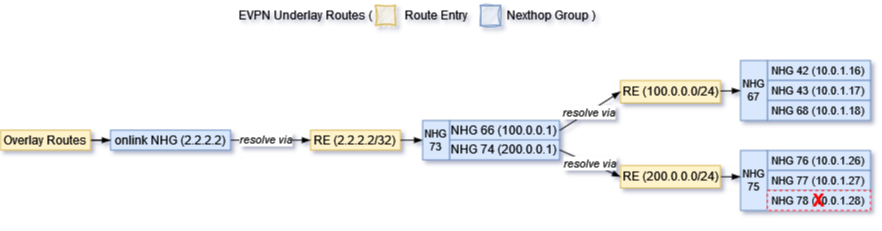

<!-- omit in toc -->
# Recursive Route Handling HLD
<!-- omit in toc -->
## Revision
| Rev |     Date    |       Author           | Change Description                |
|:---:|:-----------:|:----------------------:|-----------------------------------|
| 0.1 | Oct    2023 |                        | Initial Draft                     |

<!-- omit in toc -->
## Table of Content
- [Scope](#scope)
- [Requirements Overview](#requirements-overview)
- [Zebra Current Approach for Recursive Routes](#zebra-current-approach-for-recursive-routes)
  - [Data Structure for Recursive Handling](#data-structure-for-recursive-handling)
    - [Nexthop Dependency Tree](#nexthop-dependency-tree)
    - [NHT List from Route Node](#nht-list-from-route-node)
  - [Recursive Route Handling](#recursive-route-handling)
- [High Level Design](#high-level-design)
  - [Triggers Events for Recursive Handling](#triggers-events-for-recursive-handling)
  - [Nexthop Refresh Handling](#nexthop-refresh-handling)
    - [Data Structure Modifications](#data-structure-modifications)
      - [struct rnh](#struct-rnh)
    - [zebra\_rnh\_refresh\_depends()](#zebra_rnh_refresh_depends)
    - [Nexthop Group Preserving](#nexthop-group-preserving)
    - [Nexthop Dependency State](#nexthop-dependency-state)
    - [Segments of Nexthop Dependency for Dplane Rrefresh](#segments-of-nexthop-dependency-for-dplane-rrefresh)
  - [Data Plane Refresh for Recursive Route](#data-plane-refresh-for-recursive-route)
  - [FPM's New Schema for Recursive Nexthop Group](#fpms-new-schema-for-recursive-nexthop-group)
  - [Orchagent Changes](#orchagent-changes)
- [Unit Test](#unit-test)
  - [Normal Case's Forwarding Chain Information](#normal-cases-forwarding-chain-information)
  - [Test Case 1: local link failure](#test-case-1-local-link-failure)
  - [Test Case 2: IGP remote link/node failure](#test-case-2-igp-remote-linknode-failure)
  - [Test Case 3: IGP remote PE failure](#test-case-3-igp-remote-pe-failure)
  - [Test Case 4: BGP remote PE node failure](#test-case-4-bgp-remote-pe-node-failure)
  - [Test Case 5: Remote PE-CE link failure](#test-case-5-remote-pe-ce-link-failure)
- [References](#references)

## Scope
This document is for reducing packet loss when Zebra handles convergence for millions of recursive routes on SONiC. Since SONiC doesn't have MPLS VPN support in master, the testing would focus on EVPN and SRv6 VPN only. 

## Requirements Overview
This HLD introducing a method for fast recovering from packet loss in the event of underlay ECMP path changes. Since Zebra serves as the control plane on SONiC, then corresponding adjustments may be made to FPM and Orchagent to collaborate with it.
- Fpm needs to add a new schema to take each member as nexthop group ID and update APP DB. (Rely on BRCM and NTT's changes)
- Orchagent picks up event from APP DB and trigger nexthop group programming. Neighorch needs to handle this new schema without change too much on existing codes. (Rely on BRCM and NTT's changes)

Because the Linux kernel lacks support for recursive routes, FRR Zebra flattens the nexthop information of recursive routes when transferring it from Zebra to FPM or the Linux kernel. Currently, when a path goes down, Zebra would inform various protocol processes and let them replay routes update events accordingly. This leads an issue discussed in the SONiC Routing Working Group (https://lists.sonicfoundation.dev/g/sonic-wg-routing/files/SRv6%20use%20case%20-%20Routing%20WG.pptx).

<figure align=center>
    
    <figcaption>Figure 1. Alibaba issue Underlay routes flap affecting Overlay SRv6 routes <figcaption>
</figure>

To solve this issue, we need to introduce Prefix Independent Convergence (PIC) to FRR/SONiC. PIC concept is described in IEFT https://datatracker.ietf.org/doc/draft-ietf-rtgwg-bgp-pic/. It is not a BGP feature, but a RIB/FIB feature on the device. PIC has two basic concepts, PIC core and PIC edge. The following HLD focuses on PIC edge's enhancement https://github.com/eddieruan-alibaba/SONiC/blob/eruan-pic/doc/pic/bgp_pic_edge.md. This HLD is outline an approach which could prevent BGP load balancing updates from being triggered by IGP load balancing updates, a.k.a PIC core approach for the recursive VPN route support.

## Zebra Current Approach for Recursive Routes
### Data Structure for Recursive Handling
#### Nexthop Dependency Tree
struct nexthop contains two fields, *resolved and *reparent for tracking nexthop resolution's dependencies. 

	/* Nexthops obtained by recursive resolution.
	 *
	 * If the nexthop struct needs to be resolved recursively,
	 * NEXTHOP_FLAG_RECURSIVE will be set in flags and the nexthops
	 * obtained by recursive resolution will be added to `resolved'.
	 */
	struct nexthop *resolved;
	/* Recursive parent */
	struct nexthop *rparent;

https://github.com/FRRouting/frr/blob/858cc75b434344ae0b25eccaf6eef03debe4a031/lib/nexthop.h#L99C1-L105C26

In Zebra, when a routing entry is processed by rib_process() function, it calls nexthop_active_update() to parse and refresh the nexthop resolving state. Then, *resolved is set to the nexthop of the route used to resolve this nexthop, and the flag NEXTHOP_FLAG_RECURSIVE is set to the nexthop to indicate its recursive state.

#### NHT List from Route Node
Each route node (struct rib_dest_t) contains an nht field, which stores all nexthop prefixes that depend on this route node.

	/*
	 * The list of nht prefixes that have ended up
	 * depending on this route node.
	 * After route processing is returned from
	 * the data plane we will run evaluate_rnh
	 * on these prefixes.
	 */
	struct rnh_list_head nht;

This list is updated when a new route is added or a nexthop is registered by the protocol clients.

### Recursive Route Handling
A brief description of Zebra's current recursive convergence process below

<figure align=center>
    
    <figcaption>Figure 2. route convergence process<figcaption>
</figure>

Recursive route handling is carried out during the replay of route updates, and zebra_rib_evaluate_rn_nexthops() can be seen as the entry point for this process. It starts from the incoming route node and retrieves its NHT list. Then, it iterates through each nexthop (prefix) in the NHT list, utilizing the prefix to invoke zebra_evaluate_rnh(). The processing works as follows:

1. identify the new route entry to resolve the nexthop
2. compare the new route entry with the previous one, if they are not same, update the nexthop resolving state as the new route entry, and then send a nexthop change notification to protocol clients
3. protocol clients recalculate the path associated with the nexthop, then resend the corresponding route update to Zebra.
4. Zebra processes this route and the route's nexthop is recursively resolved and also flattened
6. at the end of route updating, zebra_rib_evaluate_rn_nexthops() is called with the route's NHT list, and then it returns to step 1. This loop procedure contributes to recursive route convergence

## High Level Design

### Triggers Events for Recursive Handling
Here are a list of trigger events which we want to take care for getting recursive route convergence and minimizing hardware traffic loss. 

| Trigger Types |     Events    |       Possible handling          | 
|:---|:-----------|:----------------------|
| Case 1: IGP local failure | A local link goes down | Currently Orchagent handles local link down event and triggers a quick fixup which removes the failed path in HW ECMP. Zebra will be triggered from connected_down() handling. BGP may be informed to install a backup path if needed. This is a special PIC core case, a.k.a PIC local |
| Case 2: IGP remote link/node failture  | A remote link goes down, IGP leaf's reachability is not changed, only IGP paths are updated. | IGP gets route withdraw events from IGP peer. It would inform zebra with updated paths. Zebra would be triggered from zread_route_add() with updated path list. It is the PIC core handling case. |
| Case 3: IGP remote PE failure  | A remote PE node is unreachable in IGP domain. | IGP triggers IGP leaf delete event. Zebra will be triggered from zread_route_del(). It is the PIC edge handling case |
| Case 4: BGP remote PE node failure  | BGP remote node down | It should be detected by IGP remote node down first before BGP reacts, a.k.a the same as the above steps. This is the PIC edge handling case.|
| Case 5: Remote PE-CE link failure | This is remote PE's PIC local case.  | Remote PE will trigger PIC local handling for quick traffic fix up. Local PE will be updated after BGP gets informed. |

### Nexthop Refresh Handling
Consider the case of recursive routes for EVPN underlay

    B>  2.2.2.2/32 [200/0] via 100.0.0.1 (recursive), weight 1, 00:11:50
      *                      via 10.1.0.16, Ethernet1, weight 1, 00:11:50
      *                      via 10.1.0.17, Ethernet1, weight 1, 00:11:50
      *                      via 10.1.0.18, Ethernet1, weight 1, 00:11:50
                           via 200.0.0.1 (recursive), weight 1, 00:11:50
      *                      via 10.1.0.26, Ethernet1, weight 1, 00:11:50
      *                      via 10.1.0.27, Ethernet1, weight 1, 00:11:50
      *                      via 10.1.0.28, Ethernet1, weight 1, 00:11:50
    B>* 100.0.0.0/24 [200/0] via 10.1.0.16, Ethernet1, weight 1, 00:11:57
      *                      via 10.1.0.17, Ethernet1, weight 1, 00:11:57
      *                      via 10.1.0.18, Ethernet1, weight 1, 00:11:57
    B>* 200.0.0.0/24 [200/0] via 10.1.0.26, Ethernet1, weight 1, 00:11:50
      *                      via 10.1.0.27, Ethernet1, weight 1, 00:11:50
      *                      via 10.1.0.28, Ethernet1, weight 1, 00:11:50

If the path 10.1.0.28 of prefix 200.0.0.0/24 is removed, Zebra will explicitly update both routes for recursive convergence with the help of the BGP client, one for 200.0.0.0/24 and another for 2.2.2.2/32. In this scenario, although the route 200.0.0.0/24 has one path removed, but its reachability for route 2.2.2.2/32 remains unchanged. To avoid packet loss, it's crucial to do a quick refresh of nexthops in dataplane for the overlay routes before Zebra completes its route convergence process.

<figure align=center>
    
    <figcaption>Figure 3. a path removed for recursive route<figcaption>
</figure>

#### Data Structure Modifications
##### struct rnh
zebra_rib_evaluate_rn_nexthops() triggers routes updating through nexthop backwalk. Without the assistance of protocol clients, a method needs to be introduced for looking up nexthop hash struct (nhe) based on the prefix of the NHT list. e.g. Finding the nhe based on the prefix 200.0.0.1.

A new field nhe_id is added for this purpose.

    struct rnh {
        ...

        /* nhe id currently associated */
        uint32_t nhe_id;

        ...
    }

This field provides information about which nhe is associated with the NHT prefix.

nhg_id_rnh_add() is used to set this field and it is invoked each time a new singleton nhe is created in zebra_nhe_find().
``` c
static void nhg_id_rnh_add(struct nhg_hash_entry *nhe)
```
``` c
static bool zebra_nhe_find(struct nhg_hash_entry **nhe, /* return value */
               struct nhg_hash_entry *lookup,
               struct nhg_connected_tree_head *nhg_depends,
               afi_t afi, bool from_dplane)
{
    ...

done:
    /* Reset time since last update */
    (*nhe)->uptime = monotime(NULL);

    if (created)
        nhg_id_rnh_add(*nhe);

    return created;
}
```

#### zebra_rnh_refresh_depends()

This newly added function is inserted into the existing route convergence process, enabling Zebra to refresh nexthops in the dataplane before notifying the protocol client of route updates.

<figure align=center>
    
    <figcaption>Figure 5. zebra_rnh_refresh_depends()<figcaption>
</figure>

The function in the blue serves a quick nexthop refreshing. It runs before the protocol client's notification for route updating.

zebra_rnh_refresh_depends() is called as follows:

``` c
static void zebra_rnh_eval_nexthop_entry(struct zebra_vrf *zvrf, afi_t afi,
					 int force, struct route_node *nrn,
					 struct rnh *rnh,
					 struct route_node *prn,
					 struct route_entry *re)
{
    ...
    zebra_rnh_remove_from_routing_table(rnh);
    if (!prefix_same(&rnh->resolved_route, prn ? &prn->p : NULL)) {
        if (prn)
            prefix_copy(&rnh->resolved_route, &prn->p);
        else {
                /*
                * Just quickly store the family of the resolved
                * route so that we can reset it in a second here
                */
                int family = rnh->resolved_route.family;

                memset(&rnh->resolved_route, 0, sizeof(struct prefix));
                rnh->resolved_route.family = family;
        }

        copy_state(rnh, re, nrn);
        state_changed = 1;
    } else if (compare_state(re, rnh->state)) {
        zebra_rnh_refresh_depends(rnh);        
        copy_state(rnh, re, nrn);
        state_changed = 1;
    }
    zebra_rnh_store_in_routing_table(rnh);
    ...
}
```

Explanation of the functions above:

1. rib_process() eventually calls zebra_rnh_eval_nexthop_entry() after finishing one route updating task
2. If a tracked nexthop has resolution changed, zebra_rnh_refresh_depends() is invoked before the protocol client notification is sent
3. zebra_rnh_refresh_depends() finds the corresponding nexthop group (nhe) and its parent nhe, and then push both of them to dataplane for a quick refresh to avoid packet loss
4. Zebra continues the client notify process, proceeding with the next round of recursive route iteration to refresh the resolution of nexthops to their final state

#### Nexthop Group Preserving

As currently implemented, when Zebra adds or updates a route, it creates a new Nexthop Group (NHG) for that route. So, in the process of the route convergence mentioned above, even if the reachability of the NHG (such as 200.0.0.1) hasn't changed, this NHG will be recreated during the convergence process. As shown in the diagram, when the path 10.0.1.28 is removed, all dependent NHGs originating from it will be recreated, as indicated by the red text in the diagram.

<figure align=center>
    
    <figcaption>Figure 6. nexthop changes when routes converge<figcaption>
</figure>

In order to facilitate a fast refresh by the dataplane, the NHGs meeting the following conditions should be preserved:
- NHG of a singleton nexthop
- NHG for a group of unchanged singleton nexthops

#### Nexthop Dependency State

As in the previous section, if NHGs can be preserved, the final status of the nexthop dependency is as follows:

<figure align=center>
    
    <figcaption>Figure 7. final status of the nexthop dependency of preserved NHG<figcaption>
</figure>

#### Segments of Nexthop Dependency for Dplane Rrefresh
So a quick dataplane refresh operates as follows:

1. Find the current NHG 200.0.0.1, flatten its dependencies, and then utilize it to refresh the dataplane:

<figure align=center>
    
</figure>

2. Find the parent NHG of 200.0.0.1, which is associated with onlink NHG 2.2.2.2, flatten its dependencies, and then utilize it to refresh the dataplane:

<figure align=center>
    
</figure>

3. To immediately reflect the reachability status of ECMP paths and prevent packet loss, Zebra simply needs to push the two NHGs (73, 74) into the dataplane. Following this, Zebra proceeds with route convergence as usual, leaving all dependent NHGs originating from NHG 90 untouched.

### Data Plane Refresh for Recursive Route
Zebra only refreshes the NHG to the dataplane for a quick packet loss fix.

### FPM's New Schema for Recursive Nexthop Group
We rely on BRCM and NTT's changes.

### Orchagent Changes
We rely on BRCM and NTT's changes.

## Unit Test
### Normal Case's Forwarding Chain Information
### Test Case 1: local link failure
<figure align=center>
    
    <figcaption>Figure 8.local link failure <figcaption>
</figure>

### Test Case 2: IGP remote link/node failure
<figure align=center>
    
    <figcaption>Figure 9. IGP remote link/node failure
 <figcaption>
</figure>

### Test Case 3: IGP remote PE failure
<figure align=center>
    
    <figcaption>Figure 10. IGP remote PE failure
 <figcaption>
</figure>

### Test Case 4: BGP remote PE node failure
<figure align=center>
    
    <figcaption>Figure 11. BGP remote PE node failure
 <figcaption>
</figure>

### Test Case 5: Remote PE-CE link failure
<figure align=center>
    
    <figcaption>Figure 12. Remote PE-CE link failure
 <figcaption>
</figure>

## References
- https://github.com/sonic-net/SONiC/pull/1425
- https://datatracker.ietf.org/doc/draft-ietf-rtgwg-bgp-pic/
- https://github.com/sonic-net/SONiC/blob/master/doc/pic/bgp_pic_arch_doc.md
- https://github.com/eddieruan-alibaba/SONiC/blob/eruan-pic/doc/bgp_pic/bgp_pic.md
