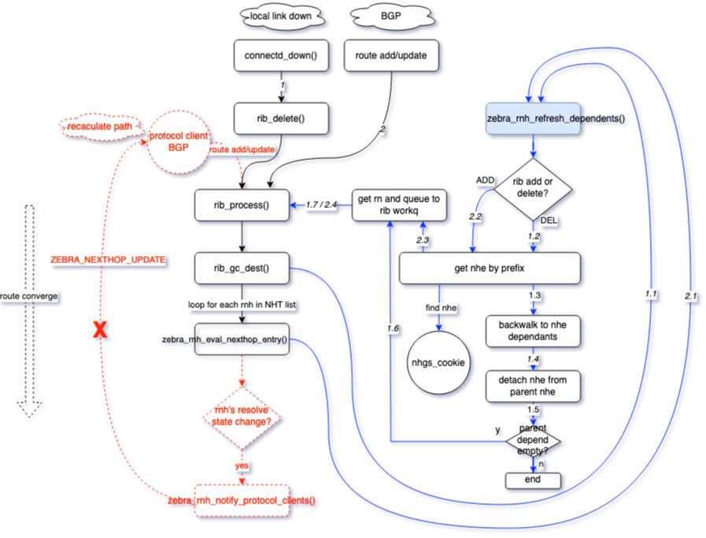

<!-- omit in toc -->
# Recursive Route Handling HLD
<!-- omit in toc -->
## Revision
| Rev |     Date    |       Author           | Change Description                |
|:---:|:-----------:|:----------------------:|-----------------------------------|
| 0.1 | Oct    2023 |                        | Initial Draft                     |

<!-- omit in toc -->
## Table of Content
- [Goal and Scope](#goal-and-scope)
- [FRR's Current Limitations](#frrs-current-limitations)
- [Triggers Events](#triggers-events)
- [FRR Current Approaches](#frr-current-approaches)
  - [NH Dependency Tree](#nh-dependency-tree)
  - [NHT List from Route Node](#nht-list-from-route-node)
  - [NHG Update Trigger](#nhg-update-trigger)
- [High Level Design](#high-level-design)
- [Low Level Design](#low-level-design)
  - [Routes Updating](#routes-updating)
    - [Data Structure Modifications](#data-structure-modifications)
      - [struct nhg\_hash\_entry](#struct-nhg_hash_entry)
      - [struct route\_entry](#struct-route_entry)
      - [struct rnh](#struct-rnh)
    - [Routes Updating Handling](#routes-updating-handling)
  - [Fast Convergence for Route Withdrawal](#fast-convergence-for-route-withdrawal)
    - [Data Structure Modifications](#data-structure-modifications-1)
    - [Fast Convergence Handling](#fast-convergence-handling)
  - [The Handling of zebra\_rnh\_refresh\_dependents()](#the-handling-of-zebra_rnh_refresh_dependents)
  - [Dataplane refresh for Nexthop group change](#dataplane-refresh-for-nexthop-group-change)
  - [FPM's new schema for recursive NHG](#fpms-new-schema-for-recursive-nhg)
  - [Orchagent changes](#orchagent-changes)
- [Unit Test](#unit-test)
  - [Normal Case's Forwarding Chain Information](#normal-cases-forwarding-chain-information)
  - [Test Case 1: local link failure](#test-case-1-local-link-failure)
  - [Test Case 2: IGP remote link/node failure](#test-case-2-igp-remote-linknode-failure)
  - [Test Case 3: IGP remote PE failure](#test-case-3-igp-remote-pe-failure)
  - [Test Case 4: BGP remote PE node failure](#test-case-4-bgp-remote-pe-node-failure)
  - [Test Case 5: Remote PE-CE link failure](#test-case-5-remote-pe-ce-link-failure)
- [References](#references)

## Goal and Scope
A recursive route is a routing mechanism in which the routing decision for a specific destination is determined by referring to another routing table, which is then looked up recursively until a final route is resolved. Recursive routing is a key concept in routing protocols and is often used in complex network topologies to ensure that data reaches its intended destination, even when that destination is not directly reachable from the originating device. In many cases, recursive routes are used in VPN or tunneling scenarios.

## FRR's Current Limitations
FRR Zebra uses struct nexthop to track next hop information. If it is a recursive nexthop, its flags field would be set NEXTHOP_FLAG_RECURSIVE bit and its resolved field stores a pointer which points a list of nexthops obtained by recursive resolution. Therefore Zebra keeps hierarchical relationships on the recursive nexthops. 

Because the Linux kernel lacks support for recursive routes, FRR Zebra flattens the next-hop information of recursive routes when transferring it from Zebra to FPM or the Linux kernel. Currently, when a path goes down, Zebra would inform various protocol processes and let them replay routes update events accordingly. 

This leads an issue discussed in the SONiC Routing Working Group (https://lists.sonicfoundation.dev/g/sonic-wg-routing/files/SRv6%20use%20case%20-%20Routing%20WG.pptx).

<figure align=center>
    
    <figcaption>Figure 1. Alibaba issue Underlay routes flap affecting Overlay SRv6 routes <figcaption>
</figure> 

To solve this issue, we need to introduce Prefix Independent Convergence (PIC) to FRR/SONiC. PIC concept is described in IEFT https://datatracker.ietf.org/doc/draft-ietf-rtgwg-bgp-pic/. It is not a BGP feature, but a RIB/FIB feeature on the device. PIC has two basic concepts, PIC core and PIC edge. The following HLD focuses on PIC edge's enhancement https://datatracker.ietf.org/doc/draft-ietf-rtgwg-bgp-pic/. This HLD is outline an approach which could prevent BGP load balancing updates from being triggered by IGP load balancing updates, a.k.a PIC core approach for the recursive VPN route support. 

Note: 
- This HLD only focus on recursive VPN routes support. Since SONiC doesn't have MPLS VPN support in master, the testing would focus on EVPN and SRv6 VPN only. 
- The similar approach could be applied to global table's recursive routes support. But that requires SAI APIs. Therefore, global table's recursive routes support is not in the scope of this HLD.(?? TODO It is per-vrf recursive enhancement, so the global will also benefit from this enhancement ??)

## Triggers Events
Here are a list of trigger events which we want to take care for getting faster routes convergence and minimizing hardware traffic loss. 

| Trigger Types |     Events    |       Possible handling          | 
|:---|:-----------|:----------------------|
| Case 1: IGP local failure | A local link goes down | Currently Orchagent handles local link down event and triggers a quick fixup which removes the failed path in HW ECMP. Zebra will be triggered from connected_down() handling. BGP may be informed to install a backup path if needed. This is a special PIC core case, a.k.a PIC local |
| Case 2: IGP remote link/node failture  | A remote link goes down, IGP leaf's reachability is not changed, only IGP paths are updated. | IGP gets route withdraw events from IGP peer. It would inform zebra with updated paths. Zebra would be triggered from zread_route_add() with updated path list. It is the PIC core handling case. |
| Case 3: IGP remote PE failure  | A remote PE node is unreachable in IGP domain. | IGP triggers IGP leaf delete event. Zebra will be triggered from zread_route_del(). It is the PIC edge handling case |
| Case 4: BGP remote PE node failure  | BGP remote node down | It should be detected by IGP remote node down first before BGP reacts, a.k.a the same as the above steps. This is the PIC edge handling case.|
| Case 5: Remote PE-CE link failure | This is remote PE's PIC local case.  | Remote PE will trigger PIC local handling for quick traffic fix up. Local PE will be updated after BGP gets informed. |

## FRR Current Approaches
### NH Dependency Tree
struct nexthop contains two fields, *resolved and *reparent for tracking nexthop resolution's dependencies. 

	/* Nexthops obtained by recursive resolution.
	 *
	 * If the nexthop struct needs to be resolved recursively,
	 * NEXTHOP_FLAG_RECURSIVE will be set in flags and the nexthops
	 * obtained by recursive resolution will be added to `resolved'.
	 */
	struct nexthop *resolved;
	/* Recursive parent */
	struct nexthop *rparent;

https://github.com/FRRouting/frr/blob/858cc75b434344ae0b25eccaf6eef03debe4a031/lib/nexthop.h#L99C1-L105C26

When a routing entry is processed by rib_process(), it calls nexthop_active_update() to parse and refresh the nexthop active state. By nexthop_set_resolved(), *resolved is set to the nexthop of the route used to resolve this nexthop, *rparent will also be correspondingly set and the flag of this nexthop is set to NEXTHOP_FLAG_RECURSIVE.

### NHT List from Route Node
Each route node (struct rib_dest_t ) contains a nht field which lists out all NHT prefixes which depend on this route node. 

	/*
	 * The list of nht prefixes that have ended up
	 * depending on this route node.
	 * After route processing is returned from
	 * the data plane we will run evaluate_rnh
	 * on these prefixes.
	 */
	struct rnh_list_head nht;

nht is updated by zebra_rnh_store_in_routing_table() and zebra_rnh_remove_from_routing_table().

### NHG Update Trigger
Zebra will trigger routes update in the following locations

- After each invocation of rib_process()
- After rib_process_result() for processing after async dataplane update
- After rib_process_dplane_notify() for the dataplane has detected some change to a route
- After zfpm_build_route_updates() for deleting the destination if necessary

NHG update is carried out during replay of routes updating and zebra_rib_evaluate_rn_nexthops() can be seen as the entry point for this process. It starts from the incoming route node and retrieves its NHT list. Then it iterates through each prefix in the NHT list, utilizing the prefix to invoke zebra_evaluate_rnh().

1. Identify the new route entry to resolve nexthops in the NHT list.
2. Compare the new route entry with the old one, update the nexthop resolving state as the new route entry, and then send a nexthop change notification to protocol clients.
3. Protocol clients recalculate the path associated with the nexthop, then resend the route to Zebra.
4. Pass the route to rib_process().
5. The route's nexthop is recursively resolved, and the recursive one will be flattened.
6. Call zebra_rib_evaluate_rn_nexthops(), then go to step 1. This loop procedure builds/refreshes the recursive NHG chain.

## Requirements Overview
This HLD focus on Zebra and introduces two enhancements for the recursive route. The first is to recalculate the route on route add/update independently, without relying on the protocol client for route updating. The second is to optimize the convergence logic of recursive nexthop group in the case of route withdrawal. If Zebra serves as the control plane, then corresponding adjustments will be made to FPM and Orchagent to collaborate with it, thereby enhancing the overall efficiency of route convergence.

- Fpm needs to add a new schema to take each member as NHG id and update APP DB. (Rely on BRCM and NTT's NHG changes)
- Orchagent picks up event from APP DB and trigger NHG programming. Neighorch needs to handle this new schema without change too much on existing codes. (Rely on BRCM and NTT's NHG changes)

## High Level Design

### Routes Updating
Consider the case of recursive routes for EVPN underlay

    B>  2.2.2.2/32 [200/0] (127) via 100.0.0.1 (recursive), weight 1, 00:00:02
      *                            via 10.1.0.65, Ethernet1, weight 1, 00:00:02
      *                            via 10.1.0.66, Ethernet2, weight 1, 00:00:02
      *                            via 10.1.0.67, Ethernet3, weight 1, 00:00:02
                                 via 200.0.0.1 (recursive), weight 1, 00:00:02
      *                            via 10.1.0.76, Ethernet4, weight 1, 00:00:02
      *                            via 10.1.0.77, Ethernet5, weight 1, 00:00:02
      *                            via 10.1.0.78, Ethernet6, weight 1, 00:00:02
    B>* 100.0.0.0/24 [200/0] (123) via 10.1.0.65, Ethernet1, weight 1, 00:00:02
      *                            via 10.1.0.66, Ethernet2, weight 1, 00:00:02
      *                            via 10.1.0.67, Ethernet3, weight 1, 00:00:02
    B>* 200.0.0.0/24 [200/0] (108) via 10.1.0.76, Ethernet4, weight 1, 00:00:53
      *                            via 10.1.0.77, Ethernet5, weight 1, 00:00:53
      *                            via 10.1.0.78, Ethernet6, weight 1, 00:00:53

As described in the above section, if node 10.1.0.67 for prefix 100.0.0.0/24 is gone, Zebra will explicitly update both routes for recursive convergence with the help of the BGP client, one for the prefix 100.0.0.0/24 and another for the prefix 2.2.2.2/32.

In this scenario, since the reachability of the prefix 2.2.2.2 remains unchanged and also Zebra has the dependency relationships between recursive nexthop groups, there is a chance to improve Zebra for route convergence by itself.

#### Data Structure Modifications
In order to enable Zebra to update routes without notifying protocol clients, it should be able to obtain the route node associated with the nexthop group that has undergone changes. Some back pointer fields need to be added.

<figure align=center>
    
    <figcaption>Figure 2. data structure modification for routes update<figcaption>
</figure>

##### struct nhg_hash_entry 
New field struct list *routes in struct nhg_hash_entry

    struct nhg_hash_entry {
        ...

        struct nhg_connected_tree_head nhg_depends, nhg_dependents;

        /* List of routes for this nhe. */
        struct list *routes;

        ...
    }

##### struct route_entry
New field struct list *routes in struct route_entry

    struct route_entry {       
        ...

        /* dest referring to this re */
        struct rib_dest_t_ *pdest;

        ...
    }

Functions initialize the backwalk pointers.
``` c
static void rib_link(struct route_node *rn, struct route_entry *re, int process)
{
    rib_dest_t *dest;
    afi_t afi;
    const char *rmap_name;

    ...

    re_list_add_head(&dest->routes, re);
    re->pdest = dest;

    ...	
}
```

``` c
int route_entry_update_nhe(struct route_entry *re, struct nhg_hash_entry *new_nhghe)
{
    struct nhg_hash_entry *old;
    int ret = 0;

    if (new_nhghe == NULL) {
        if (re->nhe) {
            if (re->nhe->routes)
                listnode_delete(re->nhe->routes, re);
                zebra_nhg_decrement_ref(re->nhe);
            }
            re->nhe = NULL;
            goto done;
    }

    if ((re->nhe_id != 0) && re->nhe && (re->nhe != new_nhghe)) {
        old = re->nhe;

        route_entry_attach_ref(re, new_nhghe);
        if (!new_nhghe->routes)
            new_nhghe->routes = list_new();
        listnode_add(new_nhghe->routes, re);
        if (old) {
            if (old->routes)
                listnode_delete(old->routes, re);
            zebra_nhg_decrement_ref(old);
        }
    } else if (!re->nhe) {
        /* This is the first time it's being attached */
        route_entry_attach_ref(re, new_nhghe);
        if (!new_nhghe->routes)
            new_nhghe->routes = list_new();
        listnode_add(new_nhghe->routes, re);
    }
done:
    return ret;
}
```

##### struct rnh
zebra_rib_evaluate_rn_nexthops() triggers routes updating through nexthop group backwalk. Without the assistance of protocol clients, a method needs to be introduced for looking up nexthop group based on the prefix of the NHT list. e.g. Finding the nexthop group based on the prefix 100.0.0.1.

A new field nhe_id is added for this purpose.

    struct rnh {
        ...

        /* nhe id currently associated */
        uint32_t nhe_id;

        ...
    }

This field provides information about which nhe is associated with the NHT prefix. nhg_id_rnh_add() is used to set this field and it is invoked each time a new nhe is created in zebra_nhe_find().

``` C
static bool zebra_nhe_find(struct nhg_hash_entry **nhe, /* return value */
               struct nhg_hash_entry *lookup,
               struct nhg_connected_tree_head *nhg_depends,
               afi_t afi, bool from_dplane)
{
    bool created = false;
    bool recursive = false;
    struct nhg_hash_entry *newnhe, *backup_nhe;
    struct nexthop *nh = NULL;

    ...

done:
    /* Reset time since last update */
    (*nhe)->uptime = monotime(NULL);

    if (created)
        nhg_id_rnh_add(*nhe);

    return created;
}
```

``` c
static void nhg_id_rnh_add(struct nhg_hash_entry *nhe)
{
    struct prefix p;
    struct rnh *rnh;
    struct nexthop *nexthop;
    struct in_addr local_ipv4;
    struct in_addr *ipv4;
    afi_t afi = AFI_IP;

    if (!nhe)
        return;

    nexthop = nhe->nhg.nexthop;

    /* IPv4/6 singleton nexthop */
    if (!nexthop->next && nexthop->type >= NEXTHOP_TYPE_IPV4
        && nexthop->type <= NEXTHOP_TYPE_IPV6_IFINDEX
        && CHECK_FLAG(nhe->flags, NEXTHOP_GROUP_VALID)) {

        switch (nexthop->type) {
            case NEXTHOP_TYPE_IPV6:
            case NEXTHOP_TYPE_IPV6_IFINDEX:
                afi = AFI_IP6;
                break;
            case NEXTHOP_TYPE_IPV4:
            case NEXTHOP_TYPE_IPV4_IFINDEX:
                afi = AFI_IP;
                break;
            default:
                break;
        }

        /* Validation for ipv4 mapped ipv6 nexthop. */
        if (IS_MAPPED_IPV6(&nexthop->gate.ipv6)) {
            afi = AFI_IP;
            ipv4 = &local_ipv4;
            ipv4_mapped_ipv6_to_ipv4(&nexthop->gate.ipv6, ipv4);
        } else {
            ipv4 = &nexthop->gate.ipv4;
        }

        /* Make lookup prefix. */
        memset(&p, 0, sizeof(struct prefix));
        switch (afi) {
            case AFI_IP:
                p.family = AF_INET;
                p.prefixlen = IPV4_MAX_PREFIXLEN;
                p.u.prefix4 = *ipv4;
                break;
            case AFI_IP6:
                p.family = AF_INET6;
                p.prefixlen = IPV6_MAX_PREFIXLEN;
                p.u.prefix6 = nexthop->gate.ipv6;
                break;
            default:
                break;
        }

        rnh = zebra_lookup_rnh(&p, nexthop->vrf_id, RNH_NEXTHOP_TYPE);

        if (rnh && rnh->nhe_id != nhe->id) {
            if (IS_ZEBRA_DEBUG_NHG) {
                char buf[PREFIX_STRLEN] = "";
                zlog_debug("%s: Add nhe %d (vrf %s, NH %s)",
                    __func__, nhe->id, vrf_id_to_name(nexthop->vrf_id),
                    prefix2str(&p, buf, sizeof(buf)));
            }
            rnh->nhe_id = nhe->id;
        }
    }
}
```

#### Routes Updating Handling
The original approach of routes updating starts when zebra_rib_evaluate_rn_nexthops() function is called and stops when the route node's NHT list is empty. In other words, it stops when there are no nexthops resolving depending on this route node. During this backwalk process for route updating, the nhe of these routes is recreated, along with its ID being changed. However, at dplane/fpm level, there is no need to refresh the recursive NHG for prefix 2.2.2.2 and 100.0.0.1 again, since the reachability for both of them hasn't changed, and the ID of this recursive NHG could remain unchanged.

<figure align=center>
    
    <figcaption>Figure 4. NHG ID change for route convergence<figcaption>
</figure>

To maintain the NHG ID unchanged for recursive NHG, refer to the zebra_rnh_refresh_dependents section for the details.

The newly added zebra_rnh_refresh_dependents() handles the routes updating, replacing the protocol client's notification. It will be detailed in the following sections.

### Fast Convergence for Route Withdrawal
As the case of recursive routes for EVPN underlay

    B>  2.2.2.2/32 [200/0] (127) via 100.0.0.1 (recursive), weight 1, 00:00:02
      *                            via 10.1.0.65, Ethernet1, weight 1, 00:00:02
      *                            via 10.1.0.66, Ethernet2, weight 1, 00:00:02
      *                            via 10.1.0.67, Ethernet3, weight 1, 00:00:02
                                 via 200.0.0.1 (recursive), weight 1, 00:00:02
      *                            via 10.1.0.76, Ethernet4, weight 1, 00:00:02
      *                            via 10.1.0.77, Ethernet5, weight 1, 00:00:02
      *                            via 10.1.0.78, Ethernet6, weight 1, 00:00:02
    B>* 100.0.0.0/24 [200/0] (123) via 10.1.0.65, Ethernet1, weight 1, 00:00:02
      *                            via 10.1.0.66, Ethernet2, weight 1, 00:00:02
      *                            via 10.1.0.67, Ethernet3, weight 1, 00:00:02
    B>* 200.0.0.0/24 [200/0] (108) via 10.1.0.76, Ethernet4, weight 1, 00:00:53
      *                            via 10.1.0.77, Ethernet5, weight 1, 00:00:53
      *                            via 10.1.0.78, Ethernet6, weight 1, 00:00:53

If the local interface Ethernet6 is down or the route "200.0.0.0/24 via 10.1.0.78, Ethernet6" receives an explicit withdrawal from the IGP node.

<figure align=center>
    
    <figcaption>Figure 5. rib deletion<figcaption>
</figure>

Rib deletion for interface down or route withdrawal is handled in rib_process(), then zebra_rnh_refresh_dependents() also handles route withdrawal case.

#### Data Structure Modifications
No Zebra original data structure modification is required as it leverages Zebra's NHG dependents chain.

#### Fast Convergence Handling
Fast convergence for route withdrawal is also handled in the zebra_rnh_refresh_dependents(). The detailed is in the next section.

### The Handling of zebra_rnh_refresh_dependents()

This new function is inserted into the existing route convergence process, allowing Zebra to autonomously achieve route convergence in the case where the reachability of recursive routes remains unchanged.

Provide a brief description of Zebra's original recursive convergence process.

<figure align=center>
    
    <figcaption>Figure 6. route convergence process<figcaption>
</figure>

Route/Nexthop dependents are built or refreshed from the bottom up with each invocation of zebra_rnh_eval_nexthop_entry().

After the insertion of zebra_rnh_refresh_dependents into the original recursive convergence process.

<figure align=center>
    
    <figcaption>Figure 7. zebra_rnh_refresh_dependents()<figcaption>
</figure>

The route convergence logic in the red will be replaced by the blue section.

In step 1.7/2.4, a new flag ROUTE_ENTRY_NHG_ID_PRESERVED added in struct route_entry. The flag is set if the associated nhe's reachability is unchanged, after that rib_process() skip the routes which has this flag.

### Dataplane refresh for Nexthop group change
As the recursive NHG ID remains unchanged, Zebra is able to bypass forwarding this route to Dplane/FPM. In other words, the backwalk in Dplane/FPM terminates at the recursive NHG route.

### FPM's new schema for recursive NHG
We rely on BRCM and NTT's NHG changes.

### Orchagent changes
We rely on BRCM and NTT's NHG changes.

## Unit Test
### Normal Case's Forwarding Chain Information
### Test Case 1: local link failure
<figure align=center>
    
    <figcaption>Figure 8.local link failure <figcaption>
</figure>

### Test Case 2: IGP remote link/node failure
<figure align=center>
    
    <figcaption>Figure 9. IGP remote link/node failure
 <figcaption>
</figure>

### Test Case 3: IGP remote PE failure
<figure align=center>
    
    <figcaption>Figure 10. IGP remote PE failure
 <figcaption>
</figure>

### Test Case 4: BGP remote PE node failure
<figure align=center>
    
    <figcaption>Figure 11. BGP remote PE node failure
 <figcaption>
</figure>

### Test Case 5: Remote PE-CE link failure
<figure align=center>
    
    <figcaption>Figure 12. Remote PE-CE link failure
 <figcaption>
</figure>

## References
- https://github.com/sonic-net/SONiC/pull/1425
- https://datatracker.ietf.org/doc/draft-ietf-rtgwg-bgp-pic/
- https://github.com/sonic-net/SONiC/blob/master/doc/pic/bgp_pic_arch_doc.md
- https://github.com/eddieruan-alibaba/SONiC/blob/eruan-pic/doc/bgp_pic/bgp_pic.md
