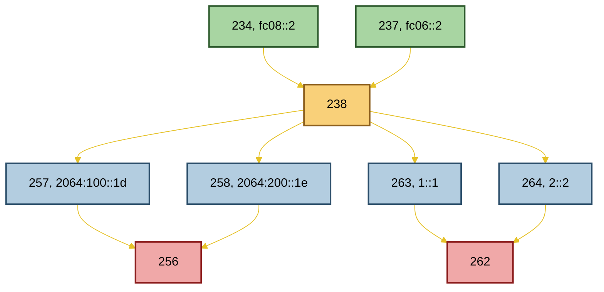
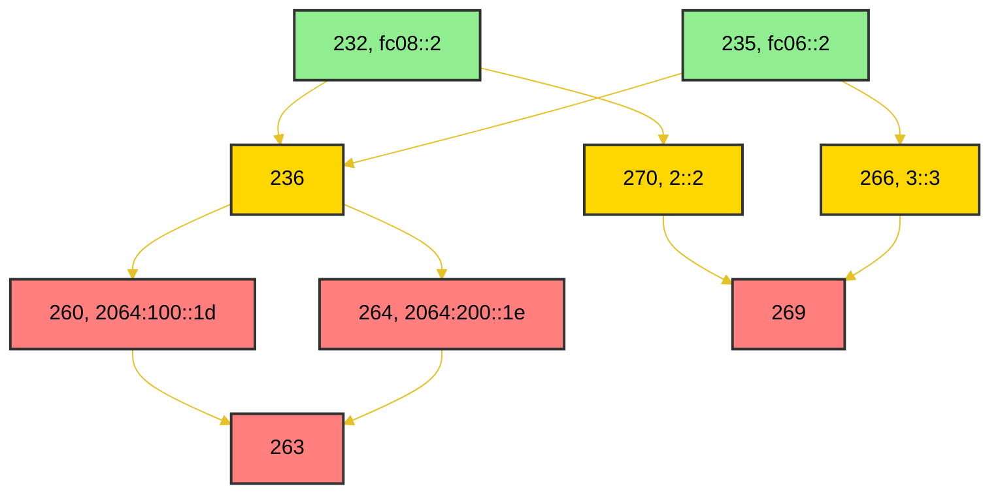
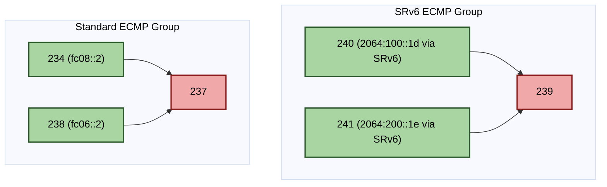

<h1 align="center">RIB FIB Route Convergence Handling LLD </h1>

# Table of Contents <!-- omit in toc -->
- [Problem Statements](#problem-statements)
  - [AI Spec for code generating](#ai-spec-for-code-generating)
- [FRR Modifications](#frr-modifications)
  - [RNH event information](#rnh-event-information)
    - [Core RNH Tracking Fields](#core-rnh-tracking-fields)
    - [Change Detection Logic](#change-detection-logic)
  - [Dplane Integration: New Event Type \& Context Structure](#dplane-integration-new-event-type--context-structure)
    - [New Dplane Operation Enum](#new-dplane-operation-enum)
    - [Extended Dplane Context](#extended-dplane-context)
    - [RNH Info Structure Definition](#rnh-info-structure-definition)
    - [Event Generation Workflow](#event-generation-workflow)
  - [FPM Message Serialization (SONiC Integration)](#fpm-message-serialization-sonic-integration)
- [SONiC-fib Enhancements for NHT events](#sonic-fib-enhancements-for-nht-events)
- [FPMsyncd Modifications](#fpmsyncd-modifications)
  - [Existing NHG MGR codes](#existing-nhg-mgr-codes)
  - [`fib_nhg_trigger_node_quick_fixup()`](#fib_nhg_trigger_node_quick_fixup)
    - [Part 1: Global Table Context Backwalk](#part-1-global-table-context-backwalk)
    - [Part 2: VPN Context Backwalk](#part-2-vpn-context-backwalk)
  - [`fib_nhg_back_walk()`](#fib_nhg_back_walk)
    - [Parameters](#parameters)
    - [Design \& Extensibility](#design--extensibility)
    - [Execution Flow](#execution-flow)
  - [Changes for Part 1](#changes-for-part-1)
    - [Changes in  `class RIBNHGEntry`](#changes-in--class-ribnhgentry)
      - [New Field: `m_resolved_enable_group`](#new-field-m_resolved_enable_group)
      - [Method Update: `RIBNHGEntry::getNextHopGroupFields()`](#method-update-ribnhgentrygetnexthopgroupfields)
    - [`fib_nhg_walk_spec_for_node_quick_fixup()`](#fib_nhg_walk_spec_for_node_quick_fixup)
      - [Execution Logic:](#execution-logic)
    - [`fib_nhg_prune_spec_for_node_quick_fixup()`](#fib_nhg_prune_spec_for_node_quick_fixup)
      - [Prune Logic:](#prune-logic)
  - [Changes for Part 2](#changes-for-part-2)
    - [Motivation](#motivation)
    - [Modifications to `RIBNHGTable` Class](#modifications-to-ribnhgtable-class)
      - [New Field: `m_nexthop_to_RIBNHG_map`](#new-field-m_nexthop_to_ribnhg_map)
      - [Supporting APIs](#supporting-apis)
      - [Integration Points](#integration-points)
    - [Backwalk for VPN-Scoped RIBNHGEntries](#backwalk-for-vpn-scoped-ribnhgentries)
      - [`fib_nhg_walk_spec_for_node_quick_fixup_sonic_nhg()`](#fib_nhg_walk_spec_for_node_quick_fixup_sonic_nhg)
      - [`fib_nhg_prune_spec_for_node_quick_fixup_sonic_nhg()`](#fib_nhg_prune_spec_for_node_quick_fixup_sonic_nhg)
- [Examples](#examples)
  - [Test Topology 1 Global table recursive routes](#test-topology-1-global-table-recursive-routes)
    - [Local Failure fc06::2 withdrawn](#local-failure-fc062-withdrawn)
    - [Remote Failure 1 (2064:100::1d withdrawn)](#remote-failure-1-20641001d-withdrawn)
    - [Remote Failure 2 (1::1 withdrawn)](#remote-failure-2-11-withdrawn)
    - [Summary of corrected Topology 1 expectations](#summary-of-corrected-topology-1-expectations)
  - [Test Topology 2 Global table recursive routes](#test-topology-2-global-table-recursive-routes)
    - [Local Failure (`fc06::2` withdrawn)](#local-failure-fc062-withdrawn-1)
    - [Remote Failure 1 (`2064:100::1d` withdrawn)](#remote-failure-1-20641001d-withdrawn-1)
    - [Remote Failure 2 (`1::1` withdrawn)](#remote-failure-2-11-withdrawn-1)
    - [Remote Failure 3 (`2::2` withdrawn)](#remote-failure-3-22-withdrawn)
    - [Summary of corrected Topology 2 expectations:](#summary-of-corrected-topology-2-expectations)
  - [Test Topology 3 SRv6 VPN case](#test-topology-3-srv6-vpn-case)
    - [Test local failure](#test-local-failure)
    - [Test remote failure](#test-remote-failure)
- [Test cases](#test-cases)


# Problem Statements
In the current SONiC architecture, orchagent mitigates traffic loss during local port-down events by rapidly removing failed load-balancing members. However, in other failure scenarios, FRR generates a new Next Hop Group (NHG) and migrates dependent prefixes sequentially, causing the traffic loss window to scale linearly with the number of affected prefixes.

To eliminate this prefix-dependent convergence delay, we propose a Prefix-Independent Convergence (PIC) mechanism. When fpmsyncd receives a Next Hop Tracking (NHT) update from zebra, it triggers a targeted reconciliation process. By performing a dependency backwalk from the invalidated NHG, the system identifies all reliant NHGs and applies coordinated updates, bypassing sequential prefix migration. The primary objective is to immediately prune failed forwarding paths to minimize the traffic loss window, allowing the control plane to subsequently recalculate and install optimal routes in the background.

The implementation comprises three core components:

* **FRR Modification**: Route all NHT events to the FPM interface exclusively through the dplane subsystem.
* **sonic-fib Enhancement**: Introduce a new data schema to map NHT events, capturing both the affected next hop and its corresponding NHG identifier.
* **fpmsyncd Logic**:  Traverse all dependent NHGs and rapidly reconcile the affected forwarding state.


## AI Spec for code generating
This Low-Level Design (LLD) is intentionally structured with implementation-level detail to serve as a high-fidelity prompt for LLM-based code generation tools (e.g., Qoder CLI https://qoder.com/en/cli ), enabling accurate, spec-to-code automation.

The following list tracks all major changed after LLM's braimstorm

1. LLM could generate step by step intermediate results to verify the result
2. LLM flag idempo issue, which leads to clarify.

# FRR Modifications
This section outlines modifications to FRRouting (FRR) to enhance Next Hop Tracking (NHT) event propagation from Zebra to the dplane, enabling fpmsyncd to respond proactively to nexthop changes and minimize traffic loss during convergence.

## RNH event information
### Core RNH Tracking Fields
Each rnh (Route Next Hop) structure maintains the following state for change detection:

| Field | Description |Storage Location |
|:---|:---|:---|
| Tracked Prefix| The prefix being monitored for nexthop changes | rnh->node->p |
| Resolved Route Prefix | The prefix of the route currently resolving the tracked prefix | rnh->resolved_route |
| Resolution State | The active route_entry used to resolve the tracked prefix rnh->state |


### Change Detection Logic
The function zebra_rnh_eval_nexthop_entry() in https://github.com/FRRouting/frr/blob/master/zebra/zebra_rnh.c#L785 evaluates whether an incoming route update affects an RNH by comparing:
* Whether the incoming route_node *prn matches the RNH's current resolved prefix
* Whether the incoming route_entry *re differs from the RNH's cached state

```
static void zebra_rnh_eval_nexthop_entry(struct zebra_vrf *zvrf, afi_t afi,
					 int force, struct route_node *nrn,
					 struct rnh *rnh,
					 struct route_node *prn,
					 struct route_entry *re)
```

When a state change is detected (state_changed == true), Zebra must propagate the following context to dplane to enable informed FIB NHT updates.

The purpose for zebra sends NHT event to fpmsyncd is to give enought information which informs that the current nexthop its holding will make some changes. So fpmsyncd's FIB module could response this event properly for reducing traffic loss window. Therefore, the following information would need to pass down to dplane when state_changed is set.

| Field | Purpose | Unresolved Value |
|:---|:---|:---|
| rnh_prefix | Identifies affected NHGs | — |
| prev_resolved_prefix | Previous resolving route prefix | 0.0.0.0/0 (or equivalent zero prefix)
| prev_resolved_nhg_id | Previous resolving NHG identifier | 0 |
| curr_resolved_prefix | Current resolving route prefix | 0.0.0.0/0 |
| curr_resolved_nhg_id | Current resolving NHG identifier | 0 |

Note: Currently, all related context is sent to dplane. Processing follows a phased approach:
* Phase 1: Trigger backwalk when an RNH prefix becomes unresolvable. Walk from the previous resolved NHG ID to prune failed paths from dependent NHGs.
* Future: Extend handling to cover other caases.

## Dplane Integration: New Event Type & Context Structure
### New Dplane Operation Enum
A new action enum DPLANE_OP_NHT_EVENT_UPDATE would be added in dplane_op_e https://github.com/FRRouting/frr/blob/master/zebra/zebra_dplane.h#L116

```
enum dplane_op_e {
    // ... existing ops ...
    DPLANE_OP_NHT_EVENT_UPDATE,  // New: RNH state change notification
};
```

### Extended Dplane Context
Extend struct zebra_dplane_ctx (https://github.com/FRRouting/frr/blob/master/zebra/zebra_dplane.c#L446) with a dedicated union member:

```
struct zebra_dplane_ctx {
    // ... existing fields ...
    union {
        // ... existing union members ...
        struct dplane_rnh_info rnh_info;  // New: RNH event payload
    };
};
```
### RNH Info Structure Definition
Define the payload structure to carry RNH change context:

```
struct dplane_rnh_info {
  struct prefix p; // Tracked RNH prefix

  struct prefix previous_resolved_prefix;
  uint32_t previous_resolved_nhg_id;

  struct prefix current_resolved_prefix;
  uint32_t current_resolved_nhg_id;

}
```

### Event Generation Workflow
* Implement a helper function to populate dplane_rnh_info from RNH state.
* Enqueue the populated zebra_dplane_ctx into the dplane work queue.
* Invoke this helper from zebra_rnh_eval_nexthop_entry() immediately after detecting a state transition.

We need to create a new function to populate dplane_rnh_info, then put the ctx into the queue. This new function would be triggered from zebra_rnh_eval_nexthop_entry() once we find there is some changes in this rnh. 

## FPM Message Serialization (SONiC Integration)
In fpm_nl_enqueue() https://github.com/sonic-net/sonic-buildimage/blob/master/src/sonic-frr/dplane_fpm_sonic/dplane_fpm_sonic.c#L2451, add a case handler for the new operation:
```
case DPLANE_OP_NHT_EVENT_UPDATE:
    // Extract rnh_info from ctx
    // Serialize to FPM message per sonic-fib schema
    // Enqueue to FPM socket
    break;
```
The FPM message format for NHT_EVENT_UPDATE must be defined in the sonic-fib interface definition, ensuring alignment between FRR's dplane output and fpmsyncd's ingestion logic.

# SONiC-fib Enhancements for NHT events
TODO: define a new schema for NHT events.


# FPMsyncd Modifications
The input data for this NHT event is detailed in the preceding sections. Under the Phase 1 approach, FPMsyncd will invoke fib_nhg_trigger_node_quick_fixup() when current_resolved_nhg_id is zero, indicating that the tracked nexthop address cannot be resolved. Additional scenarios will be addressed in future updates.

## Existing NHG MGR codes
Here are current  nhg mgr 's  codes

* https://github.com/eddieruan-alibaba/sonic-swss/blob/rib_fib/fpmsyncd/nhgmgr.cpp
* https://github.com/eddieruan-alibaba/sonic-swss/blob/rib_fib/fpmsyncd/nhgmgr.h

## `fib_nhg_trigger_node_quick_fixup()`
This function serves as the primary entry point invoked when `fpmsyncd` receives a Next Hop Tracking (NHT) event from Zebra. It accepts the following parameters:
* **Nexthop Address**: The specific IPv4 or IPv6 address associated with the event.
  * *Note*: Input prefixes are converted to nexthop addresses because, for the cases we are interested, the tracked RNH represents a specific next-hop address rather than a network prefix.
* **Resolved NHG ID**: The previously resolved Next Hop Group ID for the given nexthop address. This value serves as the starting point for the backwalk traversal.

The function performs two primary operations:

### Part 1: Global Table Context Backwalk
Uses the incoming resolved NHG ID to trigger a backwalk that updates all relevant NHGs in the global table context.

It initializes a `fib_nhg_walking_ctx` structure with the following configuration:
* **Walk context**: It is a json data structure which could store various information during the walk. For example 
  * An `visited_node_set`. It starts with an empty set. The visited node set would be added later one by one. Each entry tracks a node ID and a boolean flag indicating whether the node was modified during traversal. 
    * *Note: Even if a node is already present in the visited set, the algorithm may still initiate a forward walk to its dependents to propagate any pending updates.*
* **Walk Specification**: Set to `fib_nhg_walk_spec_for_node_quick_fixup` in part 1, which defines the operations to perform on each visited node.
* **Prune Specification**: Set to `fib_nhg_prune_spec_for_node_quick_fixup` in part 1, which determines whether traversal should terminate at the current node.
* **Nexthop Address**: The address identifying the impacted routing resource.

Finally, the function initiates the traversal by calling `fib_nhg_back_walk()`, using the resolved NHG ID as the root node.

### Part 2: VPN Context Backwalk
Uses the incoming nexthop address to locate all `RIBHNGEntry` instances that reference it across different VPN contexts. The function iterates through each matching entry and triggers a backwalk from that node to update the corresponding SONiC NHGs.

*Note*: 
1. Currently, backwalks are not initiated using the original NHG ID. This capability may be introduced in future updates once specific use cases are validated.
2. Since these NHG have VPN contexts, we can't use part 1's walk to reach these nodes. 

## `fib_nhg_back_walk()`
This function provides a generalized backwalk infrastructure within the `RIBNHGTable` class, enabling traversal across all managed `RIBNHGEntry` objects.

### Parameters
* `id` (`uint32_t`): The Zebra NHG ID, used as a key to retrieve the corresponding `RIBNHGEntry` via `getEntry()`.
* `ctx` (`fib_nhg_walking_ctx`): A configuration structure containing:
  * `walking_ctx_json` : a json data structure to store various information during the walk.
    * `visited_node_set`: A set tracking visited nodes, where each entry stores a node ID and a boolean flag indicating whether the node was modified during traversal.
  * `fib_nhg_walk_spec_func`: A callback function that applies necessary updates to the current node.
  * `fib_nhg_prune_spec_func`: A callback function that determines whether traversal should terminate at the current node.
  * `nexthop_address`: The nexthop address identifying the impacted routing resource.

### Design & Extensibility
While currently utilized for NHG quick fixup operations, this infrastructure is designed to be extensible and reusable for other backwalk-driven workflows.

### Execution Flow
1. **Entry Retrieval**: Fetches the target `RIBNHGEntry` using the provided `id` via `getEntry()`.
2. **Walk Specification Execution**: Invokes the walk callback (`fib_nhg_walk_spec_func`) on the retrieved entry. This may apply state updates to the object (e.g., marking failed members as inactive).
3. **Visited State Tracking**: Adds the current node ID and its modification status to `visited_node_set`.
4. **Prune Evaluation**: Invokes the prune callback (`fib_nhg_prune_spec_func`), passing the return value from the walk callback and a reference to the current `RIBNHGEntry`. The callback determines whether traversal should halt.
5. **Recursive Traversal**: If pruning is not triggered, the function evaluates continuation conditions:
   * For **ECMP** nexthops: recursion proceeds unconditionally.
   * For **single-path** or **recursive** nexthops: recursion proceeds only if the node was modified.
   * If conditions are met, the function retrieves the dependency list of the current `RIBNHGEntry` and recursively invokes `fib_nhg_back_walk()` for each dependent node.

## Changes for Part 1
### Changes in  `class RIBNHGEntry`
#### New Field: `m_resolved_enable_group`
Need to add a new field m_resolved_enable_group to track if resovled NHG is enabled or not.

```
        /*
         * Resolved group of the entry.
         * Contains <ribID, bool> pairs to indicate if the resolved NHG is enabled.
         * - All paths are set as enabled upon Add/Update events from FRR.
         * - Paths are marked as disabled during the backwalk process.
         */
        unordered_map<uint32_t, bool> m_resolved_enable_group;
```
Note: Forward walk calculations are compared against this stored state to determine whether the node requires an update.

#### Method Update: `RIBNHGEntry::getNextHopGroupFields()`
A validation check is added to exclude paths marked as disabled in `m_resolved_enable_group` from the generated output strings.

### `fib_nhg_walk_spec_for_node_quick_fixup()`
This function provides the Part 1-specific implementation of the `fib_nhg_walk_spec_func` callback. The caller registers this function before initiating the backwalk, ensuring consistent logic across all nodes in a single traversal.

* Input: Reference to the current `RIBNHGEntry` node.
* Output: bool indicating traversal continuation.
  * true: Fixup succeeded; backwalk should continue from this node.
  * false: Fixup was unnecessary or failed; backwalk halts. Returns false if the NHG is unrelated to the impacted nexthop or has already been updated.

#### Execution Logic:
1. **Dependency Retrieval**: Fetch the list of node IDs that the current entry depends on.
2. **Relevance Evaluation**: Determine if the node requires an update by checking:
  * Single-path/Recursive nexthops: Verify if the entry's gateway address matches the impacted nexthop.
  * ECMP nexthops: Gateway address matching is skipped.
  * **State Comparison (All cases)**: Check whether any dependents have disabled paths in their m_resolved_enable_group that are not yet reflected in the current node's state (i.e., forward walk results differ from the saved state).
3. **State Propagation**: If an update is required:
   * Iterate through the depends list.
   * Retrieve each dependent RIBNHGEntry via getEntry().
   * Identify disabled paths in the dependent's m_resolved_enable_group.
   * Mark the corresponding paths as disabled in the current node's m_resolved_enable_group.
4. **Database Synchronization**: Invoke `getNextHopGroupFields()` on the current entry, which triggers `writeToDB()` to update APPDB with the remaining enabled paths. This finalizes the quick fixup for the node. Exception: APPDB updates are skipped if the path is the sole remaining member and is being disabled.


### `fib_nhg_prune_spec_for_node_quick_fixup()`
This function implements the Part 1-specific `fib_nhg_prune_spec_func` callback. Like the walk spec, it is registered by the caller prior to traversal.

* Input:
  * Reference to the current `RIBNHGEntry` node.
  * Boolean return value from the walk spec function.
* Output: bool indicating whether to prune (halt) the backwalk at this node.

#### Prune Logic:
* No Update: If the walk spec did not modify the node, halt the backwalk (no further propagation is needed).

## Changes for Part 2
### Motivation
`RIBNHGEntry` objects used to create SONiC NHG table entries carry VPN context information, whereas NHT-resolved NHGs from Zebra do not. Consequently, a standard backwalk traversal cannot naturally reach these VPN-scoped entries. To bridge this gap, we introduce an explicit lookup mechanism.

### Modifications to `RIBNHGTable` Class
#### New Field: `m_nexthop_to_RIBNHG_map`
A new index is added to map a nexthop address string to the set of `RIBNHGEntry*` pointers that reference it:
```
    std::map<std::string, std::set<RIBNHGEntry*>> m_nexthop_to_RIBNHG_map;
```
#### Supporting APIs
Three helper methods manage this mapping:
```
   void addEntry(const std::string& nexthop, RIBNHGEntry* entry) {
        m_nexthop_to_RIBNHG_map[nexthop].insert(entry);
    }

    bool removeEntry(const std::string& nexthop, RIBNHGEntry* entry) {
        auto it = m_nexthop_to_RIBNHG_map.find(nexthop);
        if (it == m_nexthop_to_RIBNHG_map.end()) {
            return false; // Nexthop key doesn't exist
        }

        // erase() returns 1 if removed, 0 if not found
        if (it->second.erase(entry) == 0) {
            return false; // Entry pointer not in the set
        }

        // 🧹 Clean up: remove the map entry if the set becomes empty
        if (it->second.empty()) {
            m_nexthop_to_RIBNHG_map.erase(it);
        }

        return true;
    }

    const std::set<RIBNHGEntry*>& getEntries(const std::string& nexthop) const {
        auto it = m_nexthop_to_RIBNHG_map.find(nexthop);
        return it != m_nexthop_to_RIBNHG_map.end() ? it->second : emptySet;
    }
```
#### Integration Points
* `addEntry()` would be used in `NHGMgr::addNewNHGFull()` when `entry->needCreateSonicObject()` returns true
* `removeEntry()` would be used in `NHGMgr::delNHGFull()` when `entry->hasSonicGatewayObj()` returns true.

### Backwalk for VPN-Scoped RIBNHGEntries
For each `RIBNHGEntry*` returned by `getEntries(nexthop)`, we explicitly trigger `fib_nhg_back_walk()` to propagate state changes.

#### `fib_nhg_walk_spec_for_node_quick_fixup_sonic_nhg()`
This variant of the walk spec function is tailored for SONiC NHG updates:
1. **Scope-Limited Updates**: Only modifies the SONiC NHG representation within the RIBNHGEntry; no changes are made to the PIC (Platform Independent Context) state.
2. **Deduplication Tracking**: Since multiple `RIBNHGEntry` instances may map to a single SONiC NHG (many-to-one relationship), a new JSON field `updated_sonic_nhg_keys` is added to `walking_ctx_json`. This tracks which SONiC NHG keys have already been updated during the traversal to avoid redundant APPDB writes.

#### `fib_nhg_prune_spec_for_node_quick_fixup_sonic_nhg()`
This prune spec function currently mirrors the behavior of f`ib_nhg_prune_spec_for_node_quick_fixup()`:
* Halts traversal if the node was not modified by the walk spec.

Note: Future enhancements may introduce VPN-specific pruning logic if use cases warrant it.

# Examples
## Test Topology 1 Global table recursive routes
Assume we have 2064:100::1d/128 and 2064:200::1e/128 learnt via eBGP. Each route has two paths via fc06::2 and fc08::2

```
B>* 2064:100::1d/128 [20/0] (243) (pic_nh 0) via fc06::2, Ethernet12, weight 1, 3d02h57m
*                                            via fc08::2, Ethernet4, weight 1, 3d02h57m
B>* 2064:200::1e/128 [20/0] (243) (pic_nh 0) via fc06::2, Ethernet12, weight 1, 3d02h57m
*                                            via fc08::2, Ethernet4, weight 1, 3d02h57m
```
Then we add the following static configurations
```
ipv6 route 1::1/128 2064:100::1d
ipv6 route 1::1/128 2064:200::1e
ipv6 route 2::2/128 2064:200::1e
ipv6 route 3::3/128 1::1
ipv6 route 3::3/128 2::2
ipv6 route 4::4/128 1::1
```

The zebra's nexthop groups would be created as
```
PE3# show ipv6 route 1::1 next
Routing entry for 1::1/128
  Known via "static", distance 1, metric 0, best
  Last update 00:12:12 ago
  Nexthop Group ID: 256
  Received Nexthop Group ID: 254
    2064:100::1d (recursive), weight 1
  *   fc06::2, via Ethernet12, weight 1
  *   fc08::2, via Ethernet4, weight 1
    2064:200::1e (recursive), weight 1
      fc06::2, via Ethernet12 (duplicate nexthop removed), weight 1
      fc08::2, via Ethernet4 (duplicate nexthop removed), weight 1

PE3# show ipv6 route 2::2  next
Routing entry for 2::2/128
  Known via "static", distance 1, metric 0, best
  Last update 00:12:20 ago
  Nexthop Group ID: 258
  Installed Nexthop Group ID: 238
  Received Nexthop Group ID: 255
    2064:200::1e (recursive), weight 1
  *   fc06::2, via Ethernet12, weight 1
  *   fc08::2, via Ethernet4, weight 1

PE3# show ipv6 route 3::3  next
Routing entry for 3::3/128
  Known via "static", distance 1, metric 0, best
  Last update 00:08:09 ago
  Nexthop Group ID: 262
  Received Nexthop Group ID: 260
    1::1 (recursive), weight 1
  *   fc06::2, via Ethernet12, weight 1
  *   fc08::2, via Ethernet4, weight 1
    2::2 (recursive), weight 1
      fc06::2, via Ethernet12 (duplicate nexthop removed), weight 1
      fc08::2, via Ethernet4 (duplicate nexthop removed), weight 1

PE3# show ipv6 route 4::4  next
Routing entry for 4::4/128
  Known via "static", distance 1, metric 0, best
  Last update 00:08:17 ago
  Nexthop Group ID: 263
  Installed Nexthop Group ID: 238
  Received Nexthop Group ID: 259
    1::1 (recursive), weight 1
  *   fc06::2, via Ethernet12, weight 1
  *   fc08::2, via Ethernet4, weight 1
```

These nexthop's NHGFUll Json objects are stored in test_topology_1.json. The node graph is shown as the following.


Above graph could be presented as the following table

| NHG | Role | Gateway(s) | Depends | Dependents | m_resolved_enable_group init |
|:---|:---|:---|:---|:---|:---|
| 234 | leaf | fc08::2 | -- | [238] | {234: true} (self-ref) |
| 237 | leaf | fc06::2 | -- | [238] | {237: true} (self-ref) |
| 238 | core ECMP | fc06::2, fc08::2 | [234, 237] | [257, 258, 263, 264] | {234: true, 237: true} |
| 257 | intermediate | 2064:100::1d | [238] | [256] | {238: true} |
| 258 | intermediate | 2064:200::1e | [238] | [256] | {238: true} |
| 263 | intermediate | 1::1 | [238] | [262] | {238: true} |
| 264 | intermediate | 2::2 | [238] | [262] | {238: true} |
| 256 | route 1::1 | composite | [257, 258] | -- | {257: true, 258: true} |
| 262 | route 3::3 | composite | [263, 264] | -- | {263: true, 264: true} |
### Local Failure fc06::2 withdrawn
The NHT event contains "nexthop=fc06::2, resolved_nhg_id=237". 
FIB triggers the recursive walk via the following order from 237, 237 → 238 → 257 → 258 → 263 → 264 → 256 → 262 (234 never reached -- not in backwalk path from 237)

The detailed handling procedure is the following and the initial modified_set is emptry.
1. 237 (STARTING, leaf fc06::2):
  * Match nexthop. Since currently it is up, we need to disable it. Skip APPDB update since it is a single path. Since matching nexthop, Set a flag to indicate all its dependents would be updated, a.k.a skip nexthop check. 
  * modified_set += {237, true}. True in modified_set indicates this node 237 is modified.
2. 238 (ECMP, depends [234, 237]):
  * It is ECMP case, check both paths. 237 is marked as modified.
  * 237 fully disabled → mark 238's m_resolved_enable_group as {234: true, 237: false}.
  * Flat: {fc08::2}. APPDB written. modified_set += {238, true}.
3. 257 (2064:100::1d, depends [238]):
  * 238 in modified_set and is marked as modified.
  * Flat: 257 → {fc08::2}. APPDB: {fc08::2}. modified_set += {257, true}.
4. 258 (2064:200::1e, depends [238]):
  * 238 in modified_set and is marked as modified.
  * Flat: 258 → {fc08::2}. APPDB: {fc08::2}. modified_set += {258, true}.
5. 263 (1::1, depends [238]):
  * 238 in modified_set and is marked as modified
  * Flat: 263 → {fc08::2}. APPDB: {fc08::2}. modified_set += {263, true}.
6. 264 (2::2, depends [238]):
  * 238 in modified_set and is marked as modified
  * Flat: 264 → {fc08::2}. APPDB: {fc08::2}. modified_set += {264, true}.
7. 256 (For route 1::1, depends [257, 258]):
  * Since both 257 and 258 are in modified_set and is marked as modified
  * Flat: 256 → {fc08::2}. APPDB: {fc08::2}. modified_set += {256, true}.
8. 262 (For route 3::3, depends [263, 264]):
  * Since both 263 and 264 are in modified_set and is marked as modified
  * Flat: 262 → {fc08::2}. APPDB: {fc08::2}. modified_set += {262, true}.

The final result:
* Updated nodes: {237, 238, 257, 258, 263, 264, 256, 262} all updated.


### Remote Failure 1 (2064:100::1d withdrawn)
The NHT event contains "nexthop=2064:100::1d, resolved_nhg_id=238". 
FIB triggers the recursive walk via the following order from 238, 238 → 257 → 258 → 263 → 264 → 256

The detailed handling procedure is the following and the initial modified_set is emptry.
1. 238 (STARTING ECMP, depends [234, 237]):
  * It is ECMP case. continue backwalk. No need to update current node. modified_set += {238, false}.
2. 257 (2064:100::1d, depends [238]):
  * Match nexthop. Since currently it is up, we need to disable it. Skip APPDB update since it is a single path.
  * modified_set += {257, true}.
3. 258 (2064:200::1e, depends [238]):
  * No match nexthop, prune the walk from there. modified_set += {258, false}.
4. 263 (1::1, depends [238]):
  * No match nexthop, prune the walk from there. modified_set += {263, false}.
5. 264 (2::2, depends [238]):
  * No match nexthop, prune the walk from there. modified_set += {264, false}.
6. 256 (For route 1::1, depends [257, 258]):
  * Since 257 is in modified_set and it is marked as modified. Need to update 256's APPDB
  * Flat: 257 → {fc06::2, fc08::2}. APPDB: {fc06::2, fc08::2}. modified_set += {256, true}.

The final result:
* Updated nodes: {257, 256}

### Remote Failure 2 (1::1 withdrawn)
The NHT event contains "nexthop=1::1, resolved_nhg_id=238". 
FIB triggers the recursive walk via the following order from 238, 238 → 257 → 258 → 263 → 264 → 262

The detailed handling procedure is the following and the initial modified_set is emptry.
1. 238 (STARTING ECMP, depends [234, 237]):
  * It is ECMP case. continue backwalk. No need to update current node. modified_set += {238, false}.
2. 257 (2064:100::1d, depends [238]):
  * No match nexthop, prune the walk from there. modified_set += {257, false}.
3. 258 (2064:200::1e, depends [238]):
  * No match nexthop, prune the walk from there. modified_set += {258, false}.
4. 263 (1::1, depends [238]):
  * Match nexthop. Since currently it is up, we need to disable it. Skip APPDB update since it is a single path.
  * modified_set += {263, true}.
5. 264 (2::2, depends [238]):
  * No match nexthop, prune the walk from there. modified_set += {264, false}.
6. 262 (For route 3::3, depends [263, 264]):
  * Since 263 is in modified_set and it is marked as modified. Need to update 262's APPDB
  * Flat: 262 → {fc06::2, fc08::2}. APPDB: {fc06::2, fc08::2}. modified_set += {262, true}.

The final result:
* Updated nodes: {263, 262}

### Summary of corrected Topology 1 expectations

| Test Case | APPDB Updated | Modified (skip APPDB) | Not Touched |
|:---|:---|:---|:---|
| Local Failure (fc06::2) | 238, 257, 258, 263, 264, 256, 262 | 237 | 234 |
| 2064:100::1d got triggered by NHT from local Failure fc06::2 withdrawn | -- | -- | all others|
| Remote Failure 1 (2064:100::1d withdrawn) | 256| 257 | all others |
| Remote Failure 2 (1::1 withdrawn) | 262 | 263 | all others |


## Test Topology 2 Global table recursive routes
Assume we have 2064:100::1d/128 has two nexthops which are via Ethernet12 and Ethernet4, respectively.

```
B>* 2064:100::1d/128 [20/0] (243) (pic_nh 0) via fc06::2, Ethernet12, weight 1, 3d02h57m
*                                            via fc08::2, Ethernet4, weight 1, 3d02h57m
B>* 2064:200::1e/128 [20/0] (243) (pic_nh 0) via fc06::2, Ethernet12, weight 1, 3d02h57m
*                                            via fc08::2, Ethernet4, weight 1, 3d02h57m
```

We then added the following static configurations to construct an example that illustrates the complexity of handling various NHG group scenarios. Similar route dependencies could also be achieved through a routing protocol.
```
ipv6 route 1::1/128 2064:100::1d
ipv6 route 1::1/128 2064:200::1e
ipv6 route 2::2/128 fc06::2
ipv6 route 3::3/128 fc08::2
ipv6 route 4::4/128 2::2
ipv6 route 4::4/128 3::3
```

In zebra, the routes are pointing to the following nexthops or nexthop groups.
```
PE3# show ipv6 route 1::1 next
Routing entry for 1::1/128
  Known via "static", distance 1, metric 0, best
  Last update 00:00:36 ago
  Nexthop Group ID: 263
  Received Nexthop Group ID: 261
    2064:100::1d (recursive), weight 1
  *   fc06::2, via Ethernet12, weight 1
  *   fc08::2, via Ethernet4, weight 1
    2064:200::1e (recursive), weight 1
      fc06::2, via Ethernet12 (duplicate nexthop removed), weight 1
      fc08::2, via Ethernet4 (duplicate nexthop removed), weight 1

PE3# show ipv6 route 2::2  next
Routing entry for 2::2/128
  Known via "static", distance 1, metric 0, best
  Last update 00:00:55 ago
  Nexthop Group ID: 235
  Received Nexthop Group ID: 233
  * fc06::2, via Ethernet12, weight 1

PE3# show ipv6 route 3::3  next
Routing entry for 3::3/128
  Known via "static", distance 1, metric 0, best
  Last update 00:00:58 ago
  Nexthop Group ID: 232
  Received Nexthop Group ID: 231
  * fc08::2, via Ethernet4, weight 1

PE3# show ipv6 route 4::4   next
Routing entry for 4::4/128
  Known via "static", distance 1, metric 0, best
  Last update 00:00:49 ago
  Nexthop Group ID: 269
  Received Nexthop Group ID: 267
    2::2 (recursive), weight 1
  *   fc06::2, via Ethernet12, weight 1
    3::3 (recursive), weight 1
  *   fc08::2, via Ethernet4, weight 1

PE3# show ipv6 route 2064:100::1d next
Routing entry for 2064:100::1d/128
  Known via "bgp", distance 20, metric 0, best
  Last update 00:01:22 ago
  Nexthop Group ID: 236
  Received Nexthop Group ID: 234
  * fc06::2, via Ethernet12, weight 1
  * fc08::2, via Ethernet4, weight 1

PE3# show ipv6 route 2064:200::1e next
Routing entry for 2064:200::1e/128
  Known via "bgp", distance 20, metric 0, best
  Last update 00:01:40 ago
  Nexthop Group ID: 236
  Received Nexthop Group ID: 234
  * fc06::2, via Ethernet12, weight 1
  * fc08::2, via Ethernet4, weight 1

```
These nexthop's NHGFUll Json objects are stored in test_topology_2.json. The node graph is shown as the following.


Above graph could be presented as the following table

| NHG | Role | Gateway(s) | Depends | Dependents | m_resolved_enable_group init |
|:---|:---|:---|:---|:---|:---|
| 232 | leaf | `fc08::2` | -- | `[236, 270]` | `{232: true}` (self-ref) |
| 235 | leaf | `fc06::2` | -- | `[236, 266]` | `{235: true}` (self-ref) |
| 236 | core ECMP | `fc06::2`, `fc08::2` | `[232, 235]` | `[260, 264]` | `{232: true, 235: true}` |
| 260 | intermediate | `2064:100::1d` | `[236]` | `[263]` | `{236: true}` |
| 264 | intermediate | `2064:200::1e` | `[236]` | `[263]` | `{236: true}` |
| 263 | route 1::1 | composite | `[260, 264]` | -- | `{260: true, 264: true}` |
| 266 | intermediate | `2::2` | `[235]` | `[269]` | `{235: true}` |
| 270 | intermediate | `3::3` | `[232]` | `[269]` | `{232: true}` |
| 269 | route 4::4 | composite | `[266, 270]` | -- | `{266: true, 270: true}` |

### Local Failure (`fc06::2` withdrawn)
**NHT:** `nexthop=fc06::2`, `resolved_nhg_id=235`

**DFS order from 235:** `235 → 236 → 266 → 260  → 264  → 263 → 269`  
*(270, 232 never reached -- not in backwalk path from 235)*

1. **235** (STARTING, leaf `fc06::2`):
   - Match. Self-ref disabled. Skip APPDB. `modified_set += 235`.
2. **236** (ECMP, depends `[232, 235]`):
   - Gateway `fc06::2` matches. `235` in `modified_set`.
   - `235` fully disabled → mark: `{232: true, 235: false}`.
   - Flat: `{fc08::2}`. APPDB written. `modified_set += 236`.
3. **266** (via `2::2`, depends `[235]`):
   - `235` in `modified_set` → relevant!
   - `235` fully disabled → mark: `{235: false}`. Fully disabled. Skip APPDB.
   - `modified_set += 266`. Continue to `[269]`.
4. **260** (`2064:100::1d`, depends `[236]`):
   - `236` in `modified_set` → relevant!
   - `236` partially disabled → NOT marked disabled.
   - Flat: `236 → {fc08::2}`. APPDB: `{fc08::2}`. `modified_set += 260`.
5. **264** (`2064:200::1e`, depends `[236]`):
   - `236` in `modified_set` → relevant!
   - Flat: `236 → {fc08::2}`. APPDB: `{fc08::2}`. `modified_set += 264`.
   - Dependent `[263]` already visited.
6. **263** (route 1::1, depends `[260, 264]`):
   - `260` in `modified_set` → relevant!
   - Flat: `260 → 236 → {fc08::2}`. `264 → 236 → {fc08::2}`. Dedup: `{fc08::2}`.
   - APPDB: `{fc08::2}`. `modified_set += 263`.
7. **269** (route 4::4, depends `[266, 270]`):
   - `266` in `modified_set` → relevant!
   - `266` fully disabled → mark: `{266: false, 270: true}`.
   - Flat: `270` (enabled) → `232 → {fc08::2}`. APPDB: `{fc08::2}`.
   - `modified_set += 269`.

- **Updated (APPDB):** `236, 260, 264, 263, 269`
- **Modified (skip APPDB):** `235, 266`
- **Not touched:** `232, 270`

### Remote Failure 1 (`2064:100::1d` withdrawn)
**NHT:** `nexthop=2064:100::1d`, `resolved_nhg_id=236`

1. **236** (STARTING): No match, `modified_set` empty. Continue to `[260, 264]`.
2. **260** (`2064:100::1d`): Gateway MATCHES! `{236: false}`. Fully disabled.
   - Skip APPDB. `modified_set = {260}`. Continue to `[263]`.
3. **264** (`2064:200::1e`): `236` not in `modified_set`. No match. Prune.
4. **263** (route 1::1, depends `[260, 264]`):
   - `260` in `modified_set` → relevant!
   - `260` fully disabled → mark: `{260: false, 264: true}`.
   - Flat: `264 → 236 → {fc06::2, fc08::2}`. APPDB: `{fc06::2, fc08::2}`.
   - `modified_set += 263`.

- **Updated (APPDB):** `263`
- **Modified (skip APPDB):** `260`
- **Not touched:** `236, 232, 235, 264, 266, 270, 269`


### Remote Failure 2 (`1::1` withdrawn)
**NHT:** `nexthop=1::1`, `resolved_nhg_id=263`

1. **263** (STARTING): No gateway match. `modified_set` empty.
   - Continue to dependents of 263 → NONE. Backwalk ends.

- **Nothing updated.** 

### Remote Failure 3 (`2::2` withdrawn)
**NHT:** `nexthop=2::2`, `resolved_nhg_id=235`

1. **235** (STARTING, leaf `fc06::2`): `fc06::2 ≠ 2::2`. No match. Continue to `[236, 266]`.
2. **236:** `235` not in `modified_set`. No match. Prune.
3. **266** (via `2::2`): Gateway MATCHES! `{235: false}`. Fully disabled.
   - Skip APPDB. `modified_set = {266}`. Continue to `[269]`.
4. **269** (depends `[266, 270]`):
   - `266` in `modified_set` → relevant!
   - `266` fully disabled → mark: `{266: false, 270: true}`.
   - Flat: `270 → 232 → {fc08::2}`. APPDB: `{fc08::2}`.

- **Updated (APPDB):** `269`
- **Modified (skip APPDB):** `266`
- **Not touched:** all others

### Summary of corrected Topology 2 expectations:
| Test Case | APPDB Updated | Modified (skip APPDB) | Not Touched |
|:---|:---|:---|:---|
| Local Failure (`fc06::2`) | `236, 260, 264, 263, 269` | `235, 266` | `232, 270` |
| Remote Failure 1 (`2064:100::1d`) | `263` | `260` | `236, 232, 235, 264, 266, 270, 269` |
| Remote Failure 2 (`1::1`) | `--` | `--` | all |
| Remote Failure 3 (`2::2`) | `269` | `266` | all others |

## Test Topology 3 SRv6 VPN case
Assume we have 2064:100::1d/128 and 2064:200::1e/128 learnt via eBGP. Each route has two paths via fc06::2 and fc08::2

```
PE3# show ipv6 route 2064:100::1d next
Routing entry for 2064:100::1d/128
  Known via "bgp", distance 20, metric 0, best
  Last update 01:03:58 ago
  Nexthop Group ID: 237
  Received Nexthop Group ID: 235
  * fc06::2, via Ethernet12, weight 1
  * fc08::2, via Ethernet4, weight 1
```
The zebra's nexthop groups related to these routes are
```
PE3# show nexthop rib 234
ID: 234 (zebra)
     RefCnt: 19     Flags: 0x3
     Uptime: 01:04:23
     VRF: default(IPv6)
     Nexthop Count: 1
     Valid, Installed
     Interface Index: 143
           via fc08::2, Ethernet4 (vrf default), weight 1
     Dependents: (237)
PE3#
PE3# show nexthop rib 238
ID: 238 (zebra)
     RefCnt: 19     Flags: 0x3
     Uptime: 01:04:28
     VRF: default(IPv6)
     Nexthop Count: 1
     Valid, Installed
     Interface Index: 140
           via fc06::2, Ethernet12 (vrf default), weight 1
     Dependents: (237)
PE3# show nexthop rib 237
ID: 237 (zebra)
     RefCnt: 15     Flags: 0x3
     Uptime: 01:04:28
     VRF: default(No AFI)
     Nexthop Count: 2
     Valid, Installed
     Depends: (234) (238)
           via fc06::2, Ethernet12 (vrf default), weight 1
           via fc08::2, Ethernet4 (vrf default), weight 1
```

We have SRv6 VPN routes via   2064:100::1d and  2064:200::1e
```
PE3# show ip route vrf Vrf1 192.100.0.1 next
Routing entry for 192.100.0.1/32
  Known via "bgp", distance 20, metric 0, vrf Vrf1, best
  Last update 01:04:38 ago
  Nexthop Group ID: 242
  Received Nexthop Group ID: 239
   2064:100::1d(vrf default) (recursive), label 16, weight 1
     fc06::2, via Ethernet12(vrf default), label 16, weight 1
     fc08::2, via Ethernet4(vrf default), label 16, weight 1
   2064:200::1e(vrf default) (recursive), label 32, weight 1
     fc06::2, via Ethernet12(vrf default), label 32, weight 1
     fc08::2, via Ethernet4(vrf default), label 32, weight 1
```

The zebra's nexthop groups for received NHs are
```
PE3# show nexthop rib 240
ID: 240 (zebra)
     RefCnt: 15     Flags: 0x403
     Uptime: 01:14:11
     VRF: default(IPv6)
     Nexthop Count: 1
     Valid, Installed
           via 2064:100::1d (vrf default) inactive, label 16, seg6 fd00:201:201:1::, weight 1
     Dependents: (239)
PE3# show nexthop rib 241
ID: 241 (zebra)
     RefCnt: 15     Flags: 0x403
     Uptime: 01:05:12
     VRF: default(IPv6)
     Nexthop Count: 1
     Valid, Installed
           via 2064:200::1e (vrf default) inactive, label 32, seg6 fd00:202:202:2::, weight 1
     Dependents: (239)
PE3# show nexthop rib 239
ID: 239 (zebra)
     RefCnt: 10     Flags: 0x403
     Uptime: 01:05:00
     VRF: default(No AFI)
     Nexthop Count: 2
     Valid, Installed
     Depends: (240) (241)
           via 2064:100::1d (vrf default) inactive, label 16, seg6 fd00:201:201:1::, weight 1
           via 2064:200::1e (vrf default) inactive, label 32, seg6 fd00:202:202:2::, weight 1
```
These nexthop's NHGFUll Json objects are stored in test_topology_3.json. The node graph is shown as the following.



### Test local failure
* Scenario: The route fc06::2/128 is withdrawn.
* Trigger: An NHT event is generated containing the nexthop address fc06::2 and the corresponding NHG ID 238.
* Expected Result:
  * Part 1 starting from node 238
    1. **235** (STARTING, leaf `fc06::2`):
        - Match. Self-ref disabled. Skip APPDB. `modified_set += 235`.
    2. **237** (ECMP, depends `[232, 235]`):
        - Gateway `fc06::2` matches. `235` in `modified_set`.
        - `235` fully disabled → mark: `{232: true, 235: false}`.
        - Flat: `{fc08::2}`. APPDB written. `modified_set += 236`.
  * Part 2 starting from fc06::2
    _ no match for fc06::2 in m_nexthop_to_RIBNHG_map

### Test remote failure
* Scenario: The route 2064:100::1d/128 is withdrawn.
* Trigger: An NHT event is generated containing the nexthop address 2064:100::1d and the corresponding NHG ID 237.
* Expected Result:
  * Part 1 starting from node 237
    - No update
  * Part 1 starting from node 2064:100::1d
    - Find NHG node 240 from  m_nexthop_to_RIBNHG_map, trigger fib_nhg_back_walk from this node
    1. **240** (STARTING, leaf `2064:100::1d`):
        - Match. Self-ref disabled. Skip APPDB. `modified_set += 240`.
    2. **239** (ECMP, depends `[240, 241]`):
        -  `235` in `modified_set`.
        - `240` fully disabled → mark: `{241: true, 240: false}`.
        - Update SONiC NHG from node 230: `{2064:200::1e}`. APPDB written. `modified_set += 239`.  

# Test cases
The test cases would be created via gtest infra, and stored in sonic-swss's tests/mock_tests/fpmsyncd as function level test to fib_nhg_trigger_node_quick_fixup().

The main flow for these set of gtest test cases is
1. Load topology json, convert json str to fib::NextHopGroupFull object and use  m_rib_fib_nhg_mgr.addNHGFull(nhg, addr_family); to add them one by one to create initial testing senario.
2. Run through all the test cases designed for this topology.
   1. For each test case, we need to recover to intital test topology at the end of each test case.
   2. Based on the test case, need to trigger fib_nhg_trigger_node_quick_fixup() accordingly.
   3. Check updating proper NHGFULL object as indicated. Assert the test case if the condition is not meet.
