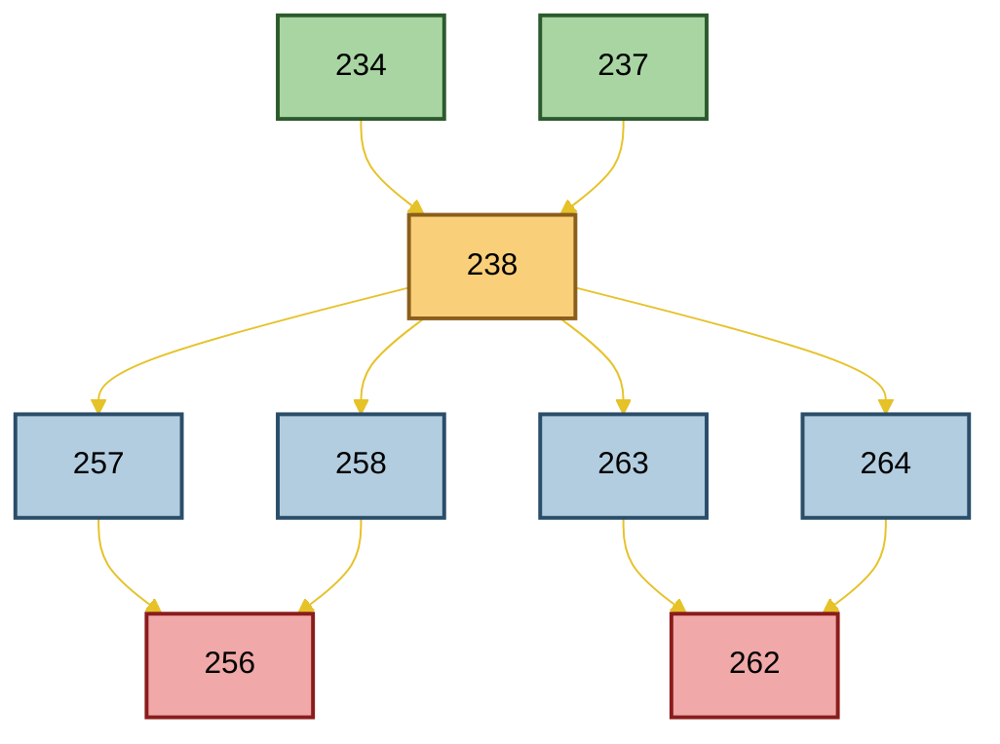
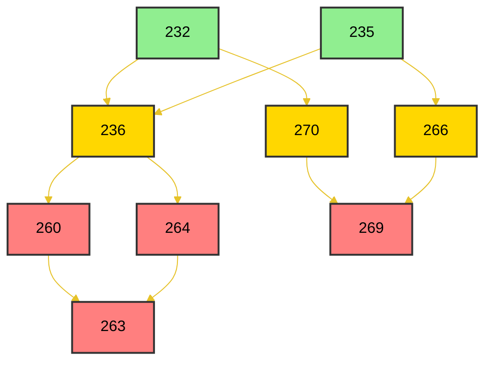
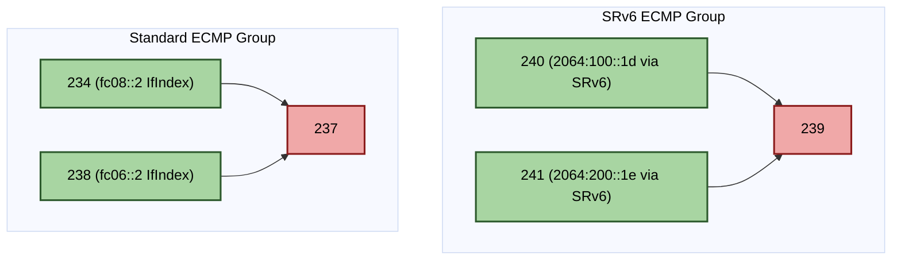

<h1 align="center">RIB FIB Route Convergence Handling LLD </h1>

# Table of Contents <!-- omit in toc -->
- [Problem Statements](#problem-statements)
- [Existing NHG MGR codes](#existing-nhg-mgr-codes)
- [Code Changes](#code-changes)
  - [fib\_nhg\_trigger\_node\_quick\_fixup()](#fib_nhg_trigger_node_quick_fixup)
    - [Functionality:](#functionality)
  - [fib\_nhg\_back\_walk()](#fib_nhg_back_walk)
    - [Parameters:](#parameters)
    - [Usage:](#usage)
    - [Main Logic:](#main-logic)
  - [Changes in  class RIBNHGEntry](#changes-in--class-ribnhgentry)
    - [New Field: m\_resolved\_enable\_group](#new-field-m_resolved_enable_group)
    - [Method Update: RIBNHGEntry::getNextHopGroupFields()](#method-update-ribnhgentrygetnexthopgroupfields)
  - [fib\_nhg\_walk\_spec\_for\_node\_quick\_fixup](#fib_nhg_walk_spec_for_node_quick_fixup)
    - [Main Logic:](#main-logic-1)
  - [fib\_nhg\_prune\_spec\_for\_node\_quick\_fixup](#fib_nhg_prune_spec_for_node_quick_fixup)
    - [Main Logic:](#main-logic-2)
- [Example](#example)
- [Test cases](#test-cases)
  - [Gtest Framework](#gtest-framework)
  - [Test Topology 1 Global table recursive routes](#test-topology-1-global-table-recursive-routes)
    - [Test case Local Failure Simulation](#test-case-local-failure-simulation)
    - [Test case Remote Failure Simulation 1](#test-case-remote-failure-simulation-1)
    - [Test remote failure 2](#test-remote-failure-2)
  - [Test Topology 2 Global table recursive routes](#test-topology-2-global-table-recursive-routes)
    - [Test local failure](#test-local-failure)
    - [Test remote failure 1](#test-remote-failure-1)
    - [Test remote failure 2](#test-remote-failure-2-1)
    - [Test remote failure 3](#test-remote-failure-3)
  - [Test Topology 3 SRv6 VPN case](#test-topology-3-srv6-vpn-case)
    - [Test local failure](#test-local-failure-1)
    - [Test remote failure](#test-remote-failure)


# Problem Statements
In the current SONiC architecture, orchagent handles local port down events by rapidly updating failed load balance members to minimize the traffic loss window. However, in other failure scenarios, FRR creates a new Next Hop Group (NHG) and migrates prefixes sequentially. Consequently, the traffic loss window is proportional to the number of prefixes.

To address this, we propose a Prefix Independent Convergence (PIC) design. This mechanism triggers a process upon receiving a Next Hop Tracking (NHT) update event from zebra to fpmsyncd. fpmsyncd will initiate a backwalk from the flagged NHG to all dependent NHGs, allowing for a rapid fixup of the affected NHGs.

The overall workflow would contains three parts
1. FRR changes to pass NHT event to FPM only via dplane
2. sonic-fib change to create a new data schema to mapp NHT event which contains impacted nexthop and this impacted nexthop's corresponding NHG ID.
3. fpmsyncd would use received impacted nexthop and this impacted nexthop's corresponding NHG ID to perform a walk through all NHGs and fix involved NHG accordingly.


This Low-Level Design (LLD) focuses on the third part, how to implement the backwalk infrastructure within the NHG Manager. The following prompt is designed to instruct an LLM to generate the necessary code for this implementation.

The input information from this NHT event is
* Nexthop address : used in walk spec to decide is the walked NHG is relevent or for SONiC NHG table walk, a.k.a PIC edge case.
* Its current resolved NHG ID : this NHG id is used to start backwalk, a.k.a PIC core case. Be aware, the starting point may still be valid paths.
* Its current original NHG ID : we may not use it for now.

# Existing NHG MGR codes
Here are current  nhg mgr 's  codes

* https://github.com/eddieruan-alibaba/sonic-swss/blob/rib_fib/fpmsyncd/nhgmgr.cpp
* https://github.com/eddieruan-alibaba/sonic-swss/blob/rib_fib/fpmsyncd/nhgmgr.h

# Code Changes
## fib_nhg_trigger_node_quick_fixup()
This function is invoked upon receiving a Next Hop Tracking (NHT) event sent from Zebra to fpmsyncd. It accepts the following input parameters:
* Nexthop Address: The specific IPv4 or IPv6 address associated with the event.
* Resolved NHG ID: The resolved Next Hop Group ID for the nexthop address
* Origial NHG ID: The original Next Hop Group ID for the nexthop address

### Functionality:
This function initializes the fib_nhg_walking_ctx with the following configuration:
* Visited Set: An empty visited_node_set.
* Walk Specification: Uses fib_nhg_walk_spec_for_node_quick_fixup.
* Prune Specification: Uses fib_nhg_prune_spec_for_node_quick_fixup.
* Target: The nexthop address indicating the impacted resource.

Finally, it initiates the traversal by calling fib_nhg_back_walk() via Resolved NHG ID.

Currently, we don't use original NHG ID to initiate backwalk. This could be added in the future with proper use cases.

## fib_nhg_back_walk()
This method is added to the RIBNHGTable class to trigger a backwalk across all maintained RIBNHGEntry objects.

### Parameters:
* uint32_t id: The Zebra NHG ID, used as a key to retrieve the RIBNHGEntry via getEntry(uint32_t id).
* fib_nhg_walking_ctx: A struct containing:
    * visited_node_set: A set of visited node IDs.
    * fib_nhg_walk_spec_func: A callback function to apply necessary updates to the current node.
    * fib_nhg_prune_spec_func: A callback function to determine whether the backwalk should continue from the current node.
    * nexthop_address: Indicates the impacted nexthop.

### Usage:
While currently implemented for NHG quick fixup, this infrastructure is designed to be extensible for other purposes.

### Main Logic:
1. Retrieve the RIBNHGEntry using the incoming ID (getEntry(uint32_t id)).
2. Add the current node ID to the visited_node_set.
3. Execute the walk spec function on the found RIBNHGEntry.
    * This may trigger updates to the object (e.g., disabling failed members).
4. Execute the prune spec function to decide whether to continue the backwalk. This prun spec function gets the walk spec function return value and this RIBNHGEntry object as input.
5. If the backwalk continues:
    * Retrieve the dependency list of the current RIBNHGEntry.
    * Filter out any nodes already present in visited_node_set.
    * Recursively call fib_nhg_back_walk() on each remaining node in the dependency list.

## Changes in  class RIBNHGEntry
### New Field: m_resolved_enable_group
Need to add a new field m_resolved_enable_group to track if resovled NHG is enabled or not.

```
        /*
         * Resolved group of the entry.
         * Contains <ribID, bool> pairs to indicate if the resolved NHG is enabled.
         * - All paths are set as enabled upon Add/Update events from FRR.
         * - Paths are marked as disabled during the backwalk process.
         */
        unordered_map<uint32_t, bool> m_resolved_enable_group;
```

### Method Update: RIBNHGEntry::getNextHopGroupFields()
Added a validation check: if a path is marked as disabled in m_resolved_enable_group, its information is excluded from the output strings.

## fib_nhg_walk_spec_for_node_quick_fixup
This is a specific implementation of fib_nhg_walk_spec_func. The caller defines which spec function is utilized before initiating the backwalk; all nodes in a single traversal use the same spec function.

* Input: The current RIBNHGEntry node object.
* Output: A boolean indicating success.
    * true: Fixup successful; backwalk could be continued from this node.
    * false: Fixup not required or failed; backwalk stops. Returns false if the NHG is irrelevant to the target nexthop or has already been updated.

### Main Logic:
1. Retrieve the list of node IDs this entry depends on.
2. Determine relevance for update by checking:
    * If the RIBNHGEntry's gateway address (or its dependents' gateway addresses) matches the impacted nexthop.
    * If the dependents' m_resolved_enable_group contains disabled paths that have not yet been reflected in the current RIBNHGEntry's m_resolved_enable_group.
3. If an update is required, iterate through the dependents' list:
    * Retrieve the dependent RIBNHGEntry via getEntry(uint32_t id).
    * Inspect the dependent's m_resolved_enable_group to identify disabled paths.
    * Mark the corresponding paths in the current RIBNHGEntry's m_resolved_enable_group as disabled.
4. Trigger getNextHopGroupFields() on the current RIBNHGEntry, eventually calling writeToDB() to update APPDB with the remaining enabled paths. This completes the quick fixup for the current entry. Skip APPDB update if it is the only path and need to be disabled.

TODO: Implement a walk mechanism in the SONiC NHG table.

## fib_nhg_prune_spec_for_node_quick_fixup
This is a specific implementation of fib_nhg_prune_spec_func. Like the walk spec, this is defined by the caller prior to traversal.

* Input:
  * The current RIBNHGEntry node object.
  * The return value from walking spec.
* Output: A boolean indicating whether to prune (stop) the backwalk from this node.

### Main Logic:
1. If the node was not updated during the walk spec phase, stop the backwalk (no further propagation needed).
2. If the node represents a SONiC NHG object, stop the backwalk.

# Example
Assume NHGs form a directed acyclic graph (DAG) through "resolve through" and "resolve via" relationships:

```
   NHG 239 (fc06::2, Ethernet12)    NHG 244 (fc08::2, Ethernet4)
         \                              /
          \                            /
           +--------+   +------------+
                    |   |
                  NHG 243  (resolved NHG for 2064:100::1d and 2064:200::1e)
                   /    \
                  /      \
            NHG 260      NHG 265
          (via 2064:     (via 2064:
          100::1d)       200::1e)
              |               |
              |               |
         NHG 264         NHG 267
       (via 1::1,       (via 1::1)
        via 2::2)
              |
         NHG 275
       (via 3::3,
        via 4::4)
```
The processing work flow described above is the following
```
NHT Event (nexthop=2064:100::1d, resolved_nhg=243)
    |
    v
fib_nhg_trigger_node_quick_fixup()
    |
    +--- Phase 1: fib_nhg_back_walk(243, ctx)
    |       |
    |       +---> NHG 243: walk_spec -> not direct match, but starting point
    |       |     dependents: [260, 265]
    |       |
    |       +---> NHG 260 (via 2064:100::1d): walk_spec -> relevant, single path
    |       |     disable 2064:100::1d path -> skip APPDB (single path)
    |       |     dependents: [264]
    |       |
    |       +---> NHG 265 (via 2064:200::1e): walk_spec -> irrelevant
    |       |     prune: yes (not updated)
    |       |
    |       +---> NHG 264 (via 1::1, via 2::2): walk_spec -> relevant
    |       |     1::1 depends on 260 (disabled) -> disable 1::1 path
    |       |     2::2 depends on 265 (still enabled) -> keep
    |       |     writeToDB() with remaining path 2::2
    |       |     dependents: [275]
    |       |
    |       +---> NHG 275 (via 3::3, via 4::4):
    |             3::3 depends on 264 (partially disabled) -> check
    |             4::4 depends on 264 -> already handled
    |             (continue recursively)
    |
    +--- Phase 2: SONiC NHG table lookup (future)
```

# Test cases
## Gtest Framework
The test cases would be created via gtest, and stored in sonic-swss's tests/mock_tests/fpmsyncd as function level test to fib_nhg_trigger_node_quick_fixup().

The main flow for these set of gtest test cases is
1. Load topology json, convert json str to fib::NextHopGroupFull object and use  m_rib_fib_nhg_mgr.addNHGFull(nhg, addr_family); to add them one by one to create initial testing senario.
2. Run through all the test cases designed for this topology.
   1. For each test case, we need to recover to intital test topology at the end of each test case.
   2. Based on test case, need to trigger fib_nhg_trigger_node_quick_fixup() accordingly.
   3. Check updating proper NHGFULL object as indicated. Assert the test case if the condition is not meet.

## Test Topology 1 Global table recursive routes
Assume we have 2064:100::1d/128 and 2064:200::1e/128 learnt via eBGP. Each route has two paths via fc06::2 and fc08::2

```
B>* 2064:100::1d/128 [20/0] (243) (pic_nh 0) via fc06::2, Ethernet12, weight 1, 3d02h57m
*                                            via fc08::2, Ethernet4, weight 1, 3d02h57m
B>* 2064:200::1e/128 [20/0] (243) (pic_nh 0) via fc06::2, Ethernet12, weight 1, 3d02h57m
*                                            via fc08::2, Ethernet4, weight 1, 3d02h57m
```
Then we add the following static configurations
```
ipv6 route 1::1/128 2064:100::1d
ipv6 route 1::1/128 2064:200::1e
ipv6 route 2::2/128 2064:200::1e
ipv6 route 3::3/128 1::1
ipv6 route 3::3/128 2::2
ipv6 route 4::4/128 1::1
```

The zebra's nexthop groups would be created as
```
PE3# show ipv6 route 1::1 next
Routing entry for 1::1/128
  Known via "static", distance 1, metric 0, best
  Last update 00:12:12 ago
  Nexthop Group ID: 256
  Received Nexthop Group ID: 254
    2064:100::1d (recursive), weight 1
  *   fc06::2, via Ethernet12, weight 1
  *   fc08::2, via Ethernet4, weight 1
    2064:200::1e (recursive), weight 1
      fc06::2, via Ethernet12 (duplicate nexthop removed), weight 1
      fc08::2, via Ethernet4 (duplicate nexthop removed), weight 1

PE3# show ipv6 route 2::2  next
Routing entry for 2::2/128
  Known via "static", distance 1, metric 0, best
  Last update 00:12:20 ago
  Nexthop Group ID: 258
  Installed Nexthop Group ID: 238
  Received Nexthop Group ID: 255
    2064:200::1e (recursive), weight 1
  *   fc06::2, via Ethernet12, weight 1
  *   fc08::2, via Ethernet4, weight 1

PE3# show ipv6 route 3::3  next
Routing entry for 3::3/128
  Known via "static", distance 1, metric 0, best
  Last update 00:08:09 ago
  Nexthop Group ID: 262
  Received Nexthop Group ID: 260
    1::1 (recursive), weight 1
  *   fc06::2, via Ethernet12, weight 1
  *   fc08::2, via Ethernet4, weight 1
    2::2 (recursive), weight 1
      fc06::2, via Ethernet12 (duplicate nexthop removed), weight 1
      fc08::2, via Ethernet4 (duplicate nexthop removed), weight 1

PE3# show ipv6 route 4::4  next
Routing entry for 4::4/128
  Known via "static", distance 1, metric 0, best
  Last update 00:08:17 ago
  Nexthop Group ID: 263
  Installed Nexthop Group ID: 238
  Received Nexthop Group ID: 259
    1::1 (recursive), weight 1
  *   fc06::2, via Ethernet12, weight 1
  *   fc08::2, via Ethernet4, weight 1
```

These nexthop's NHGFUll Json objects are stored in test_topology_1.json. The node graph is shown as the following.



### Test case Local Failure Simulation
* Scenario 1: The route fc06::2/128 is withdrawn.
* Trigger: An NHT event is generated containing the nexthop address fc06::2 and the corresponding NHG ID 237.
* Expected Result:
  * The following affected Next Hop Groups (NHGs) are updated,
    * 238
    * 257
    * 258
    * 263
    * 264
    * 256
    * 262
  * The following Nexthop Groups would not be touched
    * 234 since it is for fc08::2
    * 237 since it is a single path


* Scenario 2: The route 2064:200::1e/128 is updated after zebra handles fc06::2/12 is withdrawn event
* Trigger: An NHT event is generated containing the nexthop address 2064:200::1e and the corresponding NHG ID 238.
* Expected Result: No further NHG update since all of them have been updated.

### Test case Remote Failure Simulation 1
* Scenario: The route 2064:200::1e/128 is withdrawn.
* Trigger: An NHT event is generated containing the nexthop address 2064:200::1e and the corresponding NHG ID 238.
* Expected Result:
  * The following affected Next Hop Groups (NHGs) are updated,
    * 238, marked this path is down, although underlay routes are not impacted. This would be needed for updating its dependents.
    * 257
    * 258
    * 263
    * 264
    * 256
    * 262
  * The following Nexthop Groups would not be touched
    * 234 since it is for fc08::2
    * 237 since it is for fc06::2


### Test remote failure 2
* Scenario: The route 1::1/128 is withdrawn.
* Trigger: An NHT event is generated containing the nexthop address 1::1/128 and the corresponding NHG ID 254.
* Expected Result:
  * The following affected Next Hop Groups (NHGs) are updated,
    * 238, marked this path is down, although underlay routes are not impacted. This would be needed for updating its dependents.
    * 257
    * 258
    * 263
    * 264
    * 256
    * 262
  * The following Nexthop Groups would not be touched
    * 234 since it is for fc08::2
    * 237 since it is for fc06::2

## Test Topology 2 Global table recursive routes
Assume we have 2064:100::1d/128 has two nexthops which are via Ethernet12 and Ethernet4, respectively.

```
B>* 2064:100::1d/128 [20/0] (243) (pic_nh 0) via fc06::2, Ethernet12, weight 1, 3d02h57m
*                                            via fc08::2, Ethernet4, weight 1, 3d02h57m
B>* 2064:200::1e/128 [20/0] (243) (pic_nh 0) via fc06::2, Ethernet12, weight 1, 3d02h57m
*                                            via fc08::2, Ethernet4, weight 1, 3d02h57m
```

We then added the following static configurations to construct an example that illustrates the complexity of handling various NHG group scenarios. Similar route dependencies could also be achieved through a routing protocol.
```
ipv6 route 1::1/128 2064:100::1d
ipv6 route 1::1/128 2064:200::1e
ipv6 route 2::2/128 fc06::2
ipv6 route 3::3/128 fc08::2
ipv6 route 4::4/128 2::2
ipv6 route 4::4/128 3::3
```

In zebra, the routes are pointing to the following nexthops or nexthop groups.
```
PE3# show ipv6 route 1::1 next
Routing entry for 1::1/128
  Known via "static", distance 1, metric 0, best
  Last update 00:00:36 ago
  Nexthop Group ID: 263
  Received Nexthop Group ID: 261
    2064:100::1d (recursive), weight 1
  *   fc06::2, via Ethernet12, weight 1
  *   fc08::2, via Ethernet4, weight 1
    2064:200::1e (recursive), weight 1
      fc06::2, via Ethernet12 (duplicate nexthop removed), weight 1
      fc08::2, via Ethernet4 (duplicate nexthop removed), weight 1

PE3# show ipv6 route 2::2  next
Routing entry for 2::2/128
  Known via "static", distance 1, metric 0, best
  Last update 00:00:55 ago
  Nexthop Group ID: 235
  Received Nexthop Group ID: 233
  * fc06::2, via Ethernet12, weight 1

PE3# show ipv6 route 3::3  next
Routing entry for 3::3/128
  Known via "static", distance 1, metric 0, best
  Last update 00:00:58 ago
  Nexthop Group ID: 232
  Received Nexthop Group ID: 231
  * fc08::2, via Ethernet4, weight 1

PE3# show ipv6 route 4::4   next
Routing entry for 4::4/128
  Known via "static", distance 1, metric 0, best
  Last update 00:00:49 ago
  Nexthop Group ID: 269
  Received Nexthop Group ID: 267
    2::2 (recursive), weight 1
  *   fc06::2, via Ethernet12, weight 1
    3::3 (recursive), weight 1
  *   fc08::2, via Ethernet4, weight 1

PE3# show ipv6 route 2064:100::1d next
Routing entry for 2064:100::1d/128
  Known via "bgp", distance 20, metric 0, best
  Last update 00:01:22 ago
  Nexthop Group ID: 236
  Received Nexthop Group ID: 234
  * fc06::2, via Ethernet12, weight 1
  * fc08::2, via Ethernet4, weight 1

PE3# show ipv6 route 2064:200::1e next
Routing entry for 2064:200::1e/128
  Known via "bgp", distance 20, metric 0, best
  Last update 00:01:40 ago
  Nexthop Group ID: 236
  Received Nexthop Group ID: 234
  * fc06::2, via Ethernet12, weight 1
  * fc08::2, via Ethernet4, weight 1

```
These nexthop's NHGFUll Json objects are stored in test_topology_2.json. The node graph is shown as the following.



### Test local failure
* Scenario: The route fc06::2/128 is withdrawn.
* Trigger: An NHT event is generated containing the nexthop address fc06::2 and the corresponding NHG ID 235.
* Expected Result:
    * The following affected Next Hop Groups (NHGs) are updated,
      * 236
      * 270
      * 266
      * 260
      * 264
      * 269
      * 263
    * The following Nexthop Groups would not be touched
      * 232 since it is for fc08::2
      * 235 since it is a single path


### Test remote failure 1
* Scenario: The route 2064:100::1d/128 is withdrawn.
* Trigger: An NHT event is generated containing the nexthop address 2064:100::1d and the corresponding NHG ID 236.
* Expected Result:
    * The following affected Next Hop Groups (NHGs) are updated,
      * 236, changing to 1 path
      * 270
      * 266
      * 260
      * 264
      * 269
      * 263
    * The following Nexthop Groups would not be touched
      * 232 since it is for fc08::2
      * 235 since it is for fc06::2

### Test remote failure 2
* Scenario: The route 1::1/128 is withdraw.
* Trigger: An NHT event is generated containing the nexthop address 1::1 and the corresponding NHG ID 263.
* Expected Result:
    * The following affected Next Hop Groups (NHGs) are updated,

    * The following Nexthop Groups would not be touched
      * 232 since it is for fc08::2
      * 235 since it is for fc06::2
      * 236
      * 270
      * 266
      * 260
      * 264
      * 269
      * 263 would be the starting point

### Test remote failure 3
* Scenario: The route 2::2/128 is withdrawn.
* Trigger: An NHT event is generated containing the nexthop address 2::2 and the corresponding NHG ID 235.
* Expected Result:
    * The following affected Next Hop Groups (NHGs) are updated,
      * 269

    * The following Nexthop Groups would not be touched
      * 232 since it is for fc08::2
      * 235 since it is for fc06::2, as it is the starting point
      * 236
      * 270
      * 266, recursive via 2::2, but single path.
      * 260
      * 264
      * 263

## Test Topology 3 SRv6 VPN case
Assume we have 2064:100::1d/128 and 2064:200::1e/128 learnt via eBGP. Each route has two paths via fc06::2 and fc08::2

```
PE3# show ipv6 route 2064:100::1d next
Routing entry for 2064:100::1d/128
  Known via "bgp", distance 20, metric 0, best
  Last update 01:03:58 ago
  Nexthop Group ID: 237
  Received Nexthop Group ID: 235
  * fc06::2, via Ethernet12, weight 1
  * fc08::2, via Ethernet4, weight 1
```
The zebra's nexthop groups related to these routes are
```
PE3# show nexthop rib 234
ID: 234 (zebra)
     RefCnt: 19     Flags: 0x3
     Uptime: 01:04:23
     VRF: default(IPv6)
     Nexthop Count: 1
     Valid, Installed
     Interface Index: 143
           via fc08::2, Ethernet4 (vrf default), weight 1
     Dependents: (237)
PE3#
PE3# show nexthop rib 238
ID: 238 (zebra)
     RefCnt: 19     Flags: 0x3
     Uptime: 01:04:28
     VRF: default(IPv6)
     Nexthop Count: 1
     Valid, Installed
     Interface Index: 140
           via fc06::2, Ethernet12 (vrf default), weight 1
     Dependents: (237)
PE3# show nexthop rib 237
ID: 237 (zebra)
     RefCnt: 15     Flags: 0x3
     Uptime: 01:04:28
     VRF: default(No AFI)
     Nexthop Count: 2
     Valid, Installed
     Depends: (234) (238)
           via fc06::2, Ethernet12 (vrf default), weight 1
           via fc08::2, Ethernet4 (vrf default), weight 1
```

We have SRv6 VPN routes via   2064:100::1d and  2064:200::1e
```
PE3# show ip route vrf Vrf1 192.100.0.1 next
Routing entry for 192.100.0.1/32
  Known via "bgp", distance 20, metric 0, vrf Vrf1, best
  Last update 01:04:38 ago
  Nexthop Group ID: 242
  Received Nexthop Group ID: 239
   2064:100::1d(vrf default) (recursive), label 16, weight 1
     fc06::2, via Ethernet12(vrf default), label 16, weight 1
     fc08::2, via Ethernet4(vrf default), label 16, weight 1
   2064:200::1e(vrf default) (recursive), label 32, weight 1
     fc06::2, via Ethernet12(vrf default), label 32, weight 1
     fc08::2, via Ethernet4(vrf default), label 32, weight 1
```

The zebra's nexthop groups for received NHs are
```
PE3# show nexthop rib 240
ID: 240 (zebra)
     RefCnt: 15     Flags: 0x403
     Uptime: 01:14:11
     VRF: default(IPv6)
     Nexthop Count: 1
     Valid, Installed
           via 2064:100::1d (vrf default) inactive, label 16, seg6 fd00:201:201:1::, weight 1
     Dependents: (239)
PE3# show nexthop rib 241
ID: 241 (zebra)
     RefCnt: 15     Flags: 0x403
     Uptime: 01:05:12
     VRF: default(IPv6)
     Nexthop Count: 1
     Valid, Installed
           via 2064:200::1e (vrf default) inactive, label 32, seg6 fd00:202:202:2::, weight 1
     Dependents: (239)
PE3# show nexthop rib 239
ID: 239 (zebra)
     RefCnt: 10     Flags: 0x403
     Uptime: 01:05:00
     VRF: default(No AFI)
     Nexthop Count: 2
     Valid, Installed
     Depends: (240) (241)
           via 2064:100::1d (vrf default) inactive, label 16, seg6 fd00:201:201:1::, weight 1
           via 2064:200::1e (vrf default) inactive, label 32, seg6 fd00:202:202:2::, weight 1
```
These nexthop's NHGFUll Json objects are stored in test_topology_3.json. The node graph is shown as the following.



### Test local failure
* Scenario: The route fc06::2/128 is withdrawn.
* Trigger: An NHT event is generated containing the nexthop address fc06::2/128 and the corresponding NHG ID.
* Expected Result:
  * Update NHG for 2064:100::1d/128
  * Update NHG for 2064:100::1e/128
  * No update for SONiC NHG


### Test remote failure
* Scenario: The route 2064:100::1d/128 is withdrawn.
* Trigger: An NHT event is generated containing the nexthop address 2064:100::1d/128 and the corresponding NHG ID.
* Expected Result:
  * No Update NHG for 2064:100::1e/128
  * Update for SONiC NHG