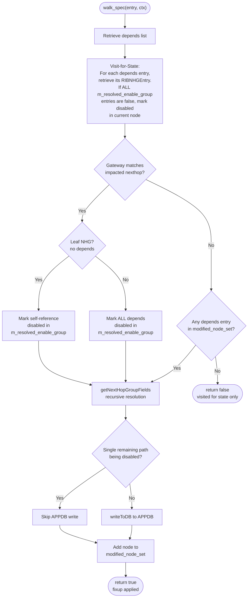
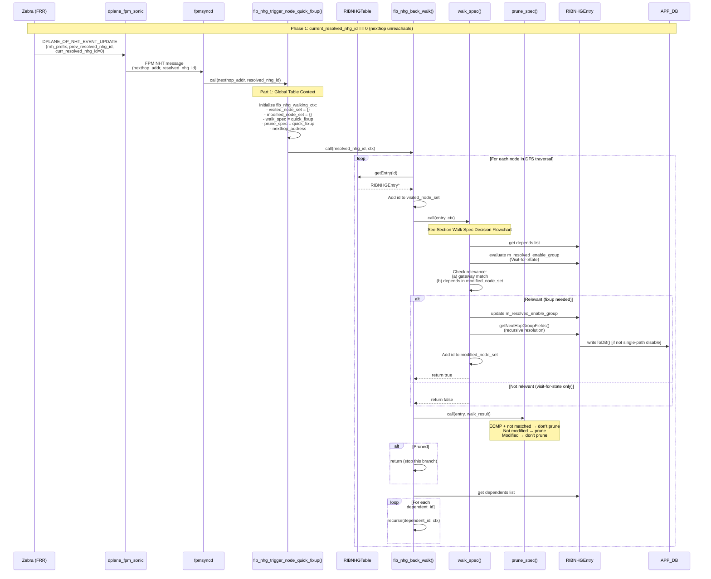
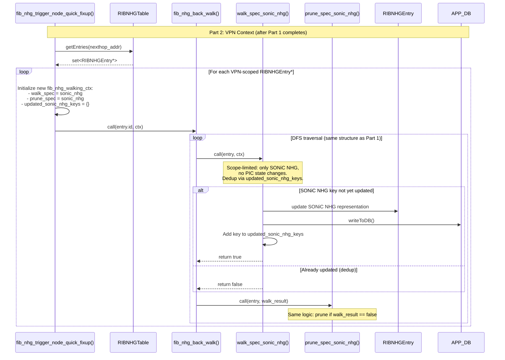
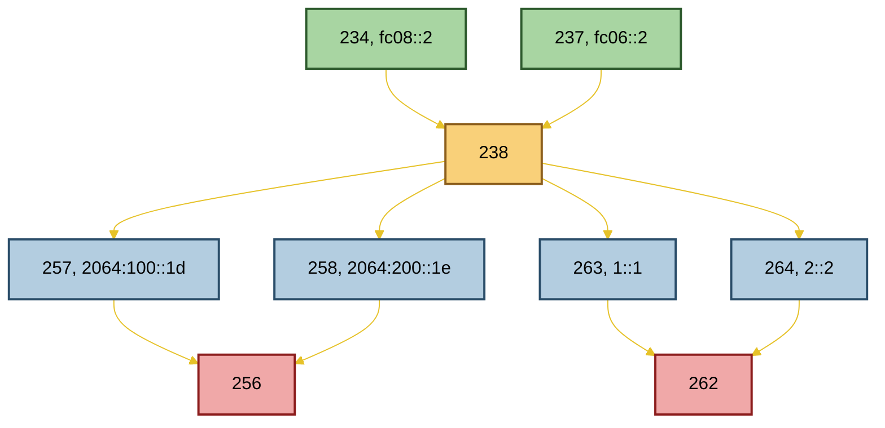
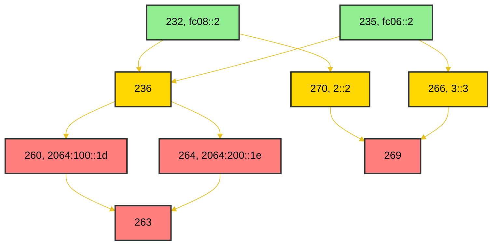
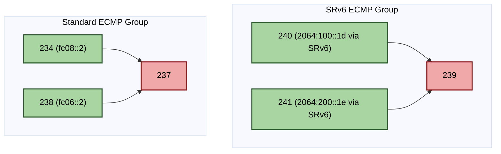

<h1 align="center">RIB FIB Route Convergence Handling LLD </h1>

# Table of Contents <!-- omit in toc -->
- [1. Problem Statements](#1-problem-statements)
- [2. General Code Generation Rules](#2-general-code-generation-rules)
  - [1. Language Standard](#1-language-standard)
  - [2. Header Include Paths: Export vs. Internal Files](#2-header-include-paths-export-vs-internal-files)
- [3. FRR Modifications](#3-frr-modifications)
  - [RNH event information](#rnh-event-information)
    - [Core RNH Tracking Fields](#core-rnh-tracking-fields)
    - [Change Detection Logic](#change-detection-logic)
  - [Dplane Integration: New Event Type \& Context Structure](#dplane-integration-new-event-type--context-structure)
    - [New Dplane Operation Enum](#new-dplane-operation-enum)
    - [Extended Dplane Context](#extended-dplane-context)
    - [RNH Info Structure Definition](#rnh-info-structure-definition)
    - [Event Generation Workflow](#event-generation-workflow)
- [4. FPM Message Serialization (SONiC Integration)](#4-fpm-message-serialization-sonic-integration)
- [5. SONiC-fib Enhancements for NHT events](#5-sonic-fib-enhancements-for-nht-events)
  - [NhtEvent JSON Schema](#nhtevent-json-schema)
    - [Example: nexthop becomes unresolved (Phase 1 trigger)](#example-nexthop-becomes-unresolved-phase-1-trigger)
  - [Generated Code](#generated-code)
  - [C API for FRR Integration](#c-api-for-frr-integration)
  - [Data Flow](#data-flow)
- [6. FPMsyncd Modifications](#6-fpmsyncd-modifications)
  - [Existing NHG MGR codes](#existing-nhg-mgr-codes)
  - [`fib_nhg_trigger_node_quick_fixup()`](#fib_nhg_trigger_node_quick_fixup)
    - [Part 1: Global Table Context Backwalk](#part-1-global-table-context-backwalk)
    - [Part 2: VPN Context Backwalk](#part-2-vpn-context-backwalk)
  - [`fib_nhg_back_walk()`](#fib_nhg_back_walk)
    - [Parameters](#parameters)
    - [Design \& Extensibility](#design--extensibility)
    - [Execution Flow](#execution-flow)
      - [Recursion Flowchart](#recursion-flowchart)
  - [Changes for Part 1](#changes-for-part-1)
    - [Changes in  `class RIBNHGEntry`](#changes-in--class-ribnhgentry)
    - [`fib_nhg_walk_spec_for_node_quick_fixup()`](#fib_nhg_walk_spec_for_node_quick_fixup)
    - [`fib_nhg_prune_spec_for_node_quick_fixup()`](#fib_nhg_prune_spec_for_node_quick_fixup)
    - [Part 1's call flow](#part-1s-call-flow)
  - [Changes for Part 2](#changes-for-part-2)
    - [Motivation](#motivation)
    - [Modifications to `RIBNHGTable` Class](#modifications-to-ribnhgtable-class)
    - [Backwalk for VPN-Scoped RIBNHGEntries](#backwalk-for-vpn-scoped-ribnhgentries)
    - [`fib_nhg_walk_spec_for_node_quick_fixup_sonic_nhg()`](#fib_nhg_walk_spec_for_node_quick_fixup_sonic_nhg)
    - [`fib_nhg_prune_spec_for_node_quick_fixup_sonic_nhg()`](#fib_nhg_prune_spec_for_node_quick_fixup_sonic_nhg)
    - [Part 2's call flow](#part-2s-call-flow)
- [7. Examples](#7-examples)
  - [Test Topology 1 Global table recursive routes](#test-topology-1-global-table-recursive-routes)
    - [Local Failure fc06::2 withdrawn](#local-failure-fc062-withdrawn)
    - [Remote Failure 1 (2064:200::1e withdrawn)](#remote-failure-1-20642001e-withdrawn)
    - [Remote Failure 2 (1::1 withdrawn)](#remote-failure-2-11-withdrawn)
    - [Summary of corrected Topology 1 expectations](#summary-of-corrected-topology-1-expectations)
  - [Test Topology 2 Global table recursive routes](#test-topology-2-global-table-recursive-routes)
    - [Local Failure (`fc06::2` withdrawn)](#local-failure-fc062-withdrawn-1)
    - [Remote Failure 1 (`2064:100::1d` withdrawn)](#remote-failure-1-20641001d-withdrawn)
    - [Remote Failure 2 (`1::1` withdrawn)](#remote-failure-2-11-withdrawn-1)
    - [Remote Failure 3 (`2::2` withdrawn)](#remote-failure-3-22-withdrawn)
    - [Summary of corrected Topology 2 expectations:](#summary-of-corrected-topology-2-expectations)
  - [Test Topology 3 SRv6 VPN case](#test-topology-3-srv6-vpn-case)
    - [Test local failure](#test-local-failure)
    - [Test remote failure](#test-remote-failure)
- [8. Test cases](#8-test-cases)
  - [FRR topotest](#frr-topotest)
  - [sonic-fib unit test](#sonic-fib-unit-test)
  - [sonic-swss unit test](#sonic-swss-unit-test)
  - [sonic-mgmt system level tests](#sonic-mgmt-system-level-tests)
    - [Helper function](#helper-function)
    - [Test Cases](#test-cases)
- [9. Appendix](#9-appendix)
  - [Key refinements identified during LLM-assisted brainstorming:](#key-refinements-identified-during-llm-assisted-brainstorming)
  - [First Round Code Genearted](#first-round-code-genearted)
  - [Couple issues fixed for compiling](#couple-issues-fixed-for-compiling)
  - [Unit Test issues:](#unit-test-issues)
    - [Cached bogus pointer](#cached-bogus-pointer)
    - [Misunderstand m\_nexthop](#misunderstand-m_nexthop)
    - [Not handle IBNHGEntry::getNextHopGroupFields()'s change paths based on m\_resolved\_enable\_group](#not-handle-ibnhgentrygetnexthopgroupfieldss-change-paths-based-on-m_resolved_enable_group)


# 1. Problem Statements
In the current SONiC architecture, orchagent mitigates traffic loss during local port-down events by rapidly removing failed load-balancing members. However, in other failure scenarios, FRR generates a new Next Hop Group (NHG) and migrates dependent prefixes sequentially, causing the traffic loss window to scale linearly with the number of affected prefixes.

To eliminate this prefix-dependent convergence delay, we propose a Prefix-Independent Convergence (PIC) mechanism. When fpmsyncd receives a Next Hop Tracking (NHT) update from zebra, it triggers a targeted reconciliation process. By performing a dependency backwalk from the invalidated NHG, the system identifies all reliant NHGs and applies coordinated updates, bypassing sequential prefix migration. The primary objective is to immediately prune failed forwarding paths to minimize the traffic loss window, allowing the control plane to subsequently recalculate and install optimal routes in the background.

The implementation comprises Four core components:

* **FRR Modification**: Route all NHT events to the FPM interface exclusively through the dplane subsystem.
* **SONiC FPM modifications**: convert NHT events to fpm message.
* **sonic-fib Enhancement**: Introduce a new data schema to map NHT events, capturing both the affected next hop and its corresponding NHG identifier.
* **fpmsyncd Logic**:  Traverse all dependent NHGs and rapidly reconcile the affected forwarding state.


# 2. General Code Generation Rules
This Low-Level Design (LLD) is deliberately authored with implementation-grade specificity to function as a high-fidelity prompt for LLM-powered code generation tools (e.g., Qoder CLI: https://qoder.com/en/cli). The goal is to enable reliable, specification-to-code automation with minimal ambiguity.

## 1. Language Standard
  * C++14 is the required baseline for all SONiC C++ components (sonic-swss, sonic-fib, swss-common, etc.).
  * Do not use C++17/20 features unless the target branch explicitly migrates.
## 2. Header Include Paths: Export vs. Internal Files
When generating code for Debian-packaged components, distinguish between public export headers and internal implementation files:'**
| File Type | Purpose | Include Path Style | Example |
|-----------|---------|-------------------|---------|
| **Export Header** | Installed to `/usr/include/...` for external consumers | Use **installed/public paths** (no `src/` prefix) | `#include "nexthopgroupfull.h"` |
| **Internal Source** | Compiled within the package; not installed | Use **relative build-tree paths** (e.g., `src/`) | `#include "src/nexthopgroupfull.h"` |

**Examples**:
```
// ✅ nexthopgroupfull_json.h (export header — installed)
#include "nexthopgroupfull.h"  // Resolves to /usr/include/nexthopgroupfull.h

// ✅ nexthopgroup_capi.cpp (internal implementation)
#include "src/nexthopgroupfull.h"
#include "src/nexthopgroupfull_json.h"
#include "src/c_nexthopgroupfull.h"
#include "src/nexthopgroup_debug.h"
```

Critical: Mixing these styles causes build failures:
* Export headers using src/ paths → break downstream consumers (file not found at install time).
* Internal files using flat paths → may conflict with system headers or fail in-tree builds.

# 3. FRR Modifications
This section outlines modifications to FRRouting (FRR) to enhance Next Hop Tracking (NHT) event propagation from Zebra to the dplane, enabling fpmsyncd to respond proactively to nexthop changes and minimize traffic loss during convergence.

## RNH event information
### Core RNH Tracking Fields
Each rnh (Route Next Hop) structure maintains the following state for change detection:

| Field | Description |Storage Location |
|:---|:---|:---|
| Tracked Prefix| The prefix being monitored for nexthop changes | rnh->node->p |
| Resolved Route Prefix | The prefix of the route currently resolving the tracked prefix | rnh->resolved_route |
| Resolution State | The active route_entry used to resolve the tracked prefix | rnh->state |

Memory Lifetime Warning:
The function copy_state() frees the existing resolution state (rnh->state) before assigning the new state. Therefore:
❌ Do NOT cache rnh->state as a pointer before calling copy_state() and dereference it afterward. The pointer becomes dangling.
✅ DO extract and cache any required fields (e.g., nhg_id) before invoking copy_state(), since primitive values remain valid independent of memory lifecycle.

### Change Detection Logic
The function zebra_rnh_eval_nexthop_entry() in https://github.com/FRRouting/frr/blob/master/zebra/zebra_rnh.c#L785 evaluates whether an incoming route update affects an RNH by comparing:
* Whether the incoming route_node *prn matches the RNH's current resolved prefix
* Whether the incoming route_entry *re differs from the RNH's cached state

```
static void zebra_rnh_eval_nexthop_entry(struct zebra_vrf *zvrf, afi_t afi,
					 int force, struct route_node *nrn,
					 struct rnh *rnh,
					 struct route_node *prn,
					 struct route_entry *re)
```

When a state change is detected (state_changed == true), Zebra must propagate the following context to dplane to enable informed FIB NHT updates.

The purpose for zebra sends NHT event to fpmsyncd is to give enought information which informs that the current nexthop its holding will make some changes. So fpmsyncd's FIB module could response this event properly for reducing traffic loss window. Therefore, the following information would need to pass down to dplane when state_changed is set.

| Field | Purpose | Unresolved Value |
|:---|:---|:---|
| rnh_prefix | Identifies affected NHGs | — |
| prev_resolved_prefix | Previous resolving route prefix | 0.0.0.0/0 (or equivalent zero prefix)
| prev_resolved_nhg_id | Previous resolving NHG identifier | 0 |
| curr_resolved_prefix | Current resolving route prefix | 0.0.0.0/0 |
| curr_resolved_nhg_id | Current resolving NHG identifier | 0 |

Note: Currently, all related context is sent to dplane. Processing follows a phased approach:
* Phase 1: Trigger backwalk when an RNH prefix becomes unresolvable. Walk from the previous resolved NHG ID to prune failed paths from dependent NHGs.
* Future: Extend handling to cover other caases.

## Dplane Integration: New Event Type & Context Structure
### New Dplane Operation Enum
A new action enum DPLANE_OP_NHT_EVENT_UPDATE would be added in dplane_op_e https://github.com/FRRouting/frr/blob/master/zebra/zebra_dplane.h#L116

```
enum dplane_op_e {
    // ... existing ops ...
    DPLANE_OP_NHT_EVENT_UPDATE,  // New: RNH state change notification
};
```

### Extended Dplane Context
Extend struct zebra_dplane_ctx (https://github.com/FRRouting/frr/blob/master/zebra/zebra_dplane.c#L446) with a dedicated union member:

```
struct zebra_dplane_ctx {
    // ... existing fields ...
    union {
        // ... existing union members ...
        struct dplane_rnh_info rnh_info;  // New: RNH event payload
    };
};
```
### RNH Info Structure Definition
Define the payload structure to carry RNH change context:

```
struct dplane_rnh_info {
  struct prefix p; // Tracked RNH prefix

  struct prefix previous_resolved_prefix;
  uint32_t previous_resolved_nhg_id;

  struct prefix current_resolved_prefix;
  uint32_t current_resolved_nhg_id;

}
```

### Event Generation Workflow
* Implement a helper function to populate dplane_rnh_info from RNH state.
* Enqueue the populated zebra_dplane_ctx into the dplane work queue.
  * For now, we always set dplane_ctx_set_skip_kernel(ctx) for skipping DPLANE_OP_NHT_EVENT_UPDATE in kernel. 
* Invoke this helper from zebra_rnh_eval_nexthop_entry() immediately after detecting a state transition.

We need to create a new function to populate dplane_rnh_info, then put the ctx into the queue. This new function would be triggered from zebra_rnh_eval_nexthop_entry() once we find there is some changes in this rnh. 

# 4. FPM Message Serialization (SONiC Integration)
In fpm_nl_enqueue() https://github.com/sonic-net/sonic-buildimage/blob/master/src/sonic-frr/dplane_fpm_sonic/dplane_fpm_sonic.c#L2451, add a case handler for the new operation:
```
case DPLANE_OP_NHT_EVENT_UPDATE:
    // Extract rnh_info from ctx
    // Serialize to FPM message per sonic-fib schema
    // Enqueue to FPM socket
    break;
```
The FPM message format for NHT_EVENT_UPDATE must be defined in the sonic-fib interface definition, ensuring alignment between FRR's dplane output and fpmsyncd's ingestion logic.

# 5. SONiC-fib Enhancements for NHT events
A new JSON schema `NhtEvent.json` is added to the [sonic-fib](https://github.com/eddieruan-alibaba/sonic-fib) repository, following the same template-driven generation pattern as `NextHopGroupFull.json`.

## NhtEvent JSON Schema

The schema captures the full `dplane_rnh_info` payload so that future phases need no wire-format changes.

| Field | JSON Type | Description | Unresolved Value |
|:---|:---|:---|:---|
| `rnh_prefix` | string (addr/len) | Tracked RNH prefix, e.g. `2064:100::1d/128` | — |
| `prev_resolved_prefix` | string (addr/len) | Previous resolving route prefix | `0.0.0.0/0` or `::/0` |
| `prev_resolved_nhg_id` | integer | Previous resolving NHG identifier | 0 |
| `curr_resolved_prefix` | string (addr/len) | Current resolving route prefix | `0.0.0.0/0` or `::/0` |
| `curr_resolved_nhg_id` | integer | Current resolving NHG identifier | 0 |

Prefix strings use `addr/len` notation. All 5 fields are required.

### Example: nexthop becomes unresolved (Phase 1 trigger)

```json
{
  "rnh_prefix": "2064:200::1e/128",
  "prev_resolved_prefix": "2064:200::1e/128",
  "prev_resolved_nhg_id": 258,
  "curr_resolved_prefix": "::/0",
  "curr_resolved_nhg_id": 0
}
```

Phase 1 uses `rnh_prefix` (converted to nexthop address) and `prev_resolved_nhg_id` when `curr_resolved_nhg_id == 0`.

## Generated Code

The Jinja2 template pipeline generates four files from `schema/NhtEvent.json`:

| Generated File | Purpose |
|:---|:---|
| `src/nhtevent.h` / `src/nhtevent.cpp` | C++ `fib::NhtEvent` struct with constructors, copy/move, equality operators |
| `src/nhtevent_json.h` | `to_json_string()`, `nhtevent_from_json()`, `nhtevent_from_json_string()` via nlohmann/json |
| `src/c_nhtevent.h` | C struct `C_NhtEvent` with fixed-size char arrays (64 bytes per prefix) for FRR |

## C API for FRR Integration

New files `src/c-api/nhtevent_capi.h` and `src/c-api/nhtevent_capi.cpp` provide:

```c
/* Encode: C_NhtEvent -> JSON string (caller must free()) */
char* nhtevent_json_from_c_nht(const struct C_NhtEvent* c_nht);
```

FRR's `fpm_nl_enqueue()` calls `nhtevent_json_from_c_nht()` in the `DPLANE_OP_NHT_EVENT_UPDATE` case to serialize the event before sending over the FPM socket. fpmsyncd deserializes via `nhtevent_from_json_string()`.

## Data Flow

```
FRR (C)                        sonic-fib                      fpmsyncd (C++)
-----------                    ---------                      --------------
dplane_rnh_info
  |
  v
fpm_nl_enqueue()
  DPLANE_OP_NHT_EVENT_UPDATE
  |
  +-> nhtevent_json_from_c_nht() -> JSON string -> FPM socket
                                                      |
                                                      v
                                     nhtevent_from_json_string() -> fib::NhtEvent
                                                                       |
                                                                       v
                                                   fib_nhg_trigger_node_quick_fixup(
                                                       nexthop_addr,
                                                       prev_resolved_nhg_id)
```

# 6. FPMsyncd Modifications
The input data for this NHT event is detailed in the preceding sections. Under the Phase 1 approach, FPMsyncd will invoke fib_nhg_trigger_node_quick_fixup() when current_resolved_nhg_id is zero, indicating that the tracked nexthop address cannot be resolved. Additional scenarios will be addressed in future updates.

## Existing NHG MGR codes
Here are current  nhg mgr 's  codes

* https://github.com/eddieruan-alibaba/sonic-swss/blob/rib_fib/fpmsyncd/nhgmgr.cpp
* https://github.com/eddieruan-alibaba/sonic-swss/blob/rib_fib/fpmsyncd/nhgmgr.h

## `fib_nhg_trigger_node_quick_fixup()`
This function serves as the primary entry point invoked when `fpmsyncd` receives a Next Hop Tracking (NHT) event from Zebra. It accepts the following parameters:
* **Nexthop Address**: The specific IPv4 or IPv6 address associated with the event.
  * *Note*: Input prefixes are converted to nexthop addresses because, for the cases we are interested, the tracked RNH represents a specific next-hop address rather than a network prefix.
* **Resolved NHG ID**: The previously resolved Next Hop Group ID for the given nexthop address. This value serves as the starting point for the backwalk traversal.

The function performs two primary operations:

### Part 1: Global Table Context Backwalk
Uses the incoming resolved NHG ID to trigger a backwalk that updates all relevant NHGs in the global table context.

It initializes a `fib_nhg_walking_ctx` structure with the following configuration:
* **Walk context**: It is a structure which could store various information during the walk. For example 
  * A `visited_node_set`. It starts with an empty set. The visited node set would be added later one by one. Each entry tracks a node ID and a boolean flag indicating whether the node was modified during traversal. 
    * *Note: Even if a node is already present in the visited set, the algorithm may still initiate a forward walk to its dependents to propagate any pending updates.*
  * A `modified_node_set`. It starts with an empty set. When walk_spec applies a fixup to a node (gateway match or depends propagation), that node ID is added to modified_node_set. Downstream nodes check whether any of their depends entries appear in modified_node_set to determine relevance.
* **Walk Specification**: Set to `fib_nhg_walk_spec_for_node_quick_fixup` in part 1, which defines the operations to perform on each visited node.
* **Prune Specification**: Set to `fib_nhg_prune_spec_for_node_quick_fixup` in part 1, which determines whether traversal should terminate at the current node.
* **Nexthop Address**: The address identifying the impacted routing resource.

Finally, the function initiates the traversal by calling `fib_nhg_back_walk()`, using the resolved NHG ID as the root node.

**Caller-level bypass**: Before calling `fib_nhg_back_walk()` on the dependents, the trigger function first evaluates `walk_spec` on the starting node itself. This is the "caller-level bypass" pattern -- the starting node is always evaluated but never pruned. With route-level NHG semantics, the starting node's gateway always matches the withdrawn nexthop for remote failures, so walk_spec returns `true` and the node gets its `m_resolved_enable_group` updated. The trigger function then iterates the starting node's dependents and calls `fib_nhg_back_walk()` on each. This pattern ensures the starting node is processed even when it would otherwise be pruned by prune_spec.

### Part 2: VPN Context Backwalk
Uses the incoming nexthop address to locate all `RIBHNGEntry` instances that reference it across different VPN contexts. The function iterates through each matching entry and triggers a backwalk from that node to update the corresponding SONiC NHGs.

**Note**: 
1. Currently, backwalks are not initiated using the original NHG ID. This capability may be introduced in future updates once specific use cases are validated.
2. Since these NHG have VPN contexts, we can't use part 1's walk to reach these nodes. 

## `fib_nhg_back_walk()`
This function provides a generalized backwalk infrastructure within the `RIBNHGTable` class, enabling traversal across all managed `RIBNHGEntry` objects.

### Parameters
* `id` (`uint32_t`): The Zebra NHG ID, used as a key to retrieve the corresponding `RIBNHGEntry` via `getEntry()`.
* `ctx` (`fib_nhg_walking_ctx`): A configuration structure containing:
  * `walking_ctx_json` : a json data structure to store various information during the walk.
    * `visited_node_set`: A set tracking visited nodes, where each entry stores a node ID and a boolean flag indicating whether the node was modified during traversal.
    * `modified_node_set`: A set tracking nodes that were modified by walk_spec (gateway match or depends propagation). Used by downstream nodes to determine relevance.
  * `fib_nhg_walk_spec_func`: A callback function that applies necessary updates to the current node.
  * `fib_nhg_prune_spec_func`: A callback function that determines whether traversal should terminate at the current node.
  * `nexthop_address`: The nexthop address identifying the impacted routing resource.

### Design & Extensibility
While currently utilized for NHG quick fixup operations, this infrastructure is designed to be extensible and reusable for other backwalk-driven workflows.

### Execution Flow
1. **Entry Retrieval**: Fetches the target `RIBNHGEntry` using the provided `id` via `getEntry()`.
2. **Walk Specification Execution**: Invokes the walk callback (`fib_nhg_walk_spec_func`) on the retrieved entry. This may apply state updates to the object (e.g., marking failed members as inactive).
3. **Visited State Tracking**: Adds the current node ID and its modification status to `visited_node_set`.
4. **Prune Evaluation**: Invokes the prune callback (`fib_nhg_prune_spec_func`), passing the return value from the walk callback and a reference to the current `RIBNHGEntry`. The callback determines whether traversal should halt.
5. **Recursive Traversal**: If pruning is not triggered, the function retrieves the dependents list of the current `RIBNHGEntry` and recursively invokes `fib_nhg_back_walk()` for each dependent node. The ECMP vs single-path continuation logic is handled entirely within `prune_spec` -- `fib_nhg_back_walk` itself simply iterates all dependents when not pruned.

####  Recursion Flowchart


**Note**: `visited_node_set` is maintained for debugging and audit purposes only. Nodes are NOT skipped on revisit -- a node may need re-evaluation when reached from multiple paths (e.g., diamond topologies where a parent depends on two siblings, and the second sibling is modified after the parent's first visit).

## Changes for Part 1
### Changes in  `class RIBNHGEntry`
* New Field: `m_resolved_enable_group`
Need to add a new field m_resolved_enable_group to track if resolved NHG is enabled or not.

```
        /*
         * Resolved group of the entry.
         * Contains <ribID, bool> pairs to indicate if the resolved NHG is enabled.
         * - All paths are set as enabled upon Add/Update events from FRR.
         * - Paths are marked as disabled during the backwalk process.
         * - For leaf NHGs (depends.empty()), a self-reference {self_id, true} is added
         *   after depends-based population so walk_spec can mark the leaf disabled.
         */
        unordered_map<uint32_t, bool> m_resolved_enable_group;
```

* New Field: `m_gateway`
Need to add a new string field `m_gateway` to store NHG's gateway address in single path or recursive case. In single path case, `m_gateway` is the same as `m_nexthop`. But in recursive case, `m_gateway` is the recursive nexthop address, while `m_nexthop` stores this NHG's final resolved nexthop addresses.
```

        /*
         * Gateway  str in FV vector of the entry
         */
        string m_gateway = "";
```
Need to create an accessing api for this m_gateway. It would be used during convergence backwalk. 
```
string RIBNHGEntry::getGatewayAddress() {
    return m_gateway;
}
```

This field is populated from nexthopgroupfull's gate field, when its type is specified, a.k.a recursive or single path case. 
```
    if (nhg.type == fib::NEXTHOP_TYPE_IPV6 || nhg.type == fib::NEXTHOP_TYPE_IPV6_IFINDEX ||
        nhg.type == fib::NEXTHOP_TYPE_IPV4 || nhg.type == fib::NEXTHOP_TYPE_IPV4_IFINDEX) {
        m_gateway = gaddr_to_string(nhg.gate, nhg.type);
        SWSS_LOG_DEBUG("gateway address: %s", m_gateway.c_str());
    }
```

**Self-reference initialization**: When populating `m_resolved_enable_group`, iterate the depends list and set each entry to `true`. For leaf NHGs (`depends.empty()`), add `{self_id, true}` as a self-reference so the entry has a state that walk_spec can set to `false` when the gateway matches.

Note: Forward walk calculations are compared against this stored state to determine whether the node requires an update.

* New Field: `m_last_appdb_fields`
Caches the last APPDB field string written by this entry. Before calling `writeToDB()`, compare the new fields against this cached value. If identical, skip the write (compare-and-skip deduplication).

```
        /*
         * Cached APPDB fields for deduplication.
         * Compared before each writeToDB() to avoid redundant APPDB writes
         * when the flat resolved paths haven't changed.
         */
        string m_last_appdb_fields;
```

* Method Update: `RIBNHGEntry::getNextHopGroupFields()`
Before recursing into each depends entry in `m_resolvedGroup`, check `m_resolved_enable_group`: if the depends entry is marked `false` (disabled), skip it. This produces the correct flat resolved paths reflecting the current enable/disable state at every level of the dependency chain.

### `fib_nhg_walk_spec_for_node_quick_fixup()`
This function provides the Part 1-specific implementation of the `fib_nhg_walk_spec_func` callback. The caller registers this function before initiating the backwalk, ensuring consistent logic across all nodes in a single traversal.

* Input: Reference to the current `RIBNHGEntry` node.
* Output: bool indicating traversal continuation.
  * true: Fixup succeeded; backwalk should continue from this node.
  * false: Fixup was unnecessary or failed; backwalk halts. Returns false if the NHG is unrelated to the impacted nexthop or has already been updated.
* Execution Logic:
  1. **Dependency Retrieval**: Fetch the list of node IDs that the current entry depends on.
  2. **Relevance Evaluation**: Determine if the node requires an update by checking:
    * Single-path/Recursive nexthops: Verify if the entry's gateway address matches the impacted nexthop.
    * ECMP nexthops: Gateway address matching is skipped.
    * **State Comparison (All cases)**: Check whether any depends entries have disabled paths in their m_resolved_enable_group that are not yet reflected in the current node's state (i.e., forward walk results differ from the saved state). Additionally, check if any depends entry appears in modified_node_set.
  3. **State Propagation**: If an update is required:
     * Iterate through the depends list.
     * Retrieve each depends entry's RIBNHGEntry via getEntry().
     * Identify disabled paths in the depends entry's m_resolved_enable_group.
     * Mark the corresponding paths as disabled in the current node's m_resolved_enable_group.
  4. **Database Synchronization**: Invoke `getNextHopGroupFields()` on the current entry, which triggers `writeToDB()` to update APPDB with the remaining enabled paths. This finalizes the quick fixup for the node. Exception: APPDB updates are skipped if the path is the sole remaining member and is being disabled.
* Walk Spec Decision Flowchart



### `fib_nhg_prune_spec_for_node_quick_fixup()`
This function implements the Part 1-specific `fib_nhg_prune_spec_func` callback. Like the walk spec, it is registered by the caller prior to traversal.

* Input:
  * Reference to the current `RIBNHGEntry` node.
  * Boolean return value from the walk spec function.
* Output: bool indicating whether to prune (halt) the backwalk at this node.
* Prune logic
```
fib_nhg_prune_spec_for_node_quick_fixup(entry, walk_result):
    // Rule 1: Multi-path nodes where nexthop wasn't matched always continue --
    //         dependents above may have gateways matching the nexthop
    if entry.depends.size() >= 2 and walk_result == false:
        return false   // don't prune

    // Rule 2: No update means no propagation needed
    if walk_result == false:
        return true    // prune

    return false       // node was modified, continue
```
### Part 1's call flow


## Changes for Part 2
### Motivation
`RIBNHGEntry` objects used to create SONiC NHG table entries carry VPN context information, whereas NHT-resolved NHGs from Zebra do not. Consequently, a standard backwalk traversal cannot naturally reach these VPN-scoped entries. To bridge this gap, we introduce an explicit lookup mechanism.

### Modifications to `RIBNHGTable` Class
* New Field: `m_nexthop_to_RIBNHG_map`
A new index is added to map a nexthop address string to the set of `RIBNHGEntry*` pointers that reference it:
```
    std::map<std::string, std::set<RIBNHGEntry*>> m_nexthop_to_RIBNHG_map;
```
* Supporting APIs
Three helper methods manage this mapping:
```
   void addEntry(const std::string& nexthop, RIBNHGEntry* entry) {
        m_nexthop_to_RIBNHG_map[nexthop].insert(entry);
    }

    bool removeEntry(const std::string& nexthop, RIBNHGEntry* entry) {
        auto it = m_nexthop_to_RIBNHG_map.find(nexthop);
        if (it == m_nexthop_to_RIBNHG_map.end()) {
            return false; // Nexthop key doesn't exist
        }

        // erase() returns 1 if removed, 0 if not found
        if (it->second.erase(entry) == 0) {
            return false; // Entry pointer not in the set
        }

        // 🧹 Clean up: remove the map entry if the set becomes empty
        if (it->second.empty()) {
            m_nexthop_to_RIBNHG_map.erase(it);
        }

        return true;
    }

    const std::set<RIBNHGEntry*>& getEntries(const std::string& nexthop) const {
        auto it = m_nexthop_to_RIBNHG_map.find(nexthop);
        return it != m_nexthop_to_RIBNHG_map.end() ? it->second : emptySet;
    }
```
* Integration Points
* `addEntry()` would be used in `NHGMgr::addNewNHGFull()` when `entry->needCreateSonicObject()` returns true
* `removeEntry()` would be used in `NHGMgr::delNHGFull()` when `entry->hasSonicGatewayObj()` returns true.

### Backwalk for VPN-Scoped RIBNHGEntries
For each `RIBNHGEntry*` returned by `getEntries(nexthop)`, we explicitly trigger `fib_nhg_back_walk()` to propagate state changes.

### `fib_nhg_walk_spec_for_node_quick_fixup_sonic_nhg()`
This variant of the walk spec function is tailored for SONiC NHG updates:
1. **Scope-Limited Updates**: Only modifies the SONiC NHG representation within the RIBNHGEntry; no changes are made to the PIC (Platform Independent Context) state.
2. **Deduplication Tracking**: Since multiple `RIBNHGEntry` instances may map to a single SONiC NHG (many-to-one relationship), a new JSON field `updated_sonic_nhg_keys` is added to `walking_ctx_json`. This tracks which SONiC NHG keys have already been updated during the traversal to avoid redundant APPDB writes.

### `fib_nhg_prune_spec_for_node_quick_fixup_sonic_nhg()`
This prune spec function currently mirrors the behavior of f`ib_nhg_prune_spec_for_node_quick_fixup()`:
* Halts traversal if the node was not modified by the walk spec.

Note: Future enhancements may introduce VPN-specific pruning logic if use cases warrant it.

### Part 2's call flow


# 7. Examples
## Test Topology 1 Global table recursive routes
Assume we have 2064:100::1d/128 and 2064:200::1e/128 learnt via eBGP. Each route has two paths via fc06::2 and fc08::2

```
B>* 2064:100::1d/128 [20/0] (243) (pic_nh 0) via fc06::2, Ethernet12, weight 1, 3d02h57m
*                                            via fc08::2, Ethernet4, weight 1, 3d02h57m
B>* 2064:200::1e/128 [20/0] (243) (pic_nh 0) via fc06::2, Ethernet12, weight 1, 3d02h57m
*                                            via fc08::2, Ethernet4, weight 1, 3d02h57m
```
Then we add the following static configurations
```
ipv6 route 1::1/128 2064:100::1d
ipv6 route 1::1/128 2064:200::1e
ipv6 route 2::2/128 2064:200::1e
ipv6 route 3::3/128 1::1
ipv6 route 3::3/128 2::2
ipv6 route 4::4/128 1::1
```

The zebra's nexthop groups would be created as
```
PE3# show ipv6 route 1::1 next
Routing entry for 1::1/128
  Known via "static", distance 1, metric 0, best
  Last update 00:12:12 ago
  Nexthop Group ID: 256
  Received Nexthop Group ID: 254
    2064:100::1d (recursive), weight 1
  *   fc06::2, via Ethernet12, weight 1
  *   fc08::2, via Ethernet4, weight 1
    2064:200::1e (recursive), weight 1
      fc06::2, via Ethernet12 (duplicate nexthop removed), weight 1
      fc08::2, via Ethernet4 (duplicate nexthop removed), weight 1

PE3# show ipv6 route 2::2  next
Routing entry for 2::2/128
  Known via "static", distance 1, metric 0, best
  Last update 00:12:20 ago
  Nexthop Group ID: 258
  Installed Nexthop Group ID: 238
  Received Nexthop Group ID: 255
    2064:200::1e (recursive), weight 1
  *   fc06::2, via Ethernet12, weight 1
  *   fc08::2, via Ethernet4, weight 1

PE3# show ipv6 route 3::3  next
Routing entry for 3::3/128
  Known via "static", distance 1, metric 0, best
  Last update 00:08:09 ago
  Nexthop Group ID: 262
  Received Nexthop Group ID: 260
    1::1 (recursive), weight 1
  *   fc06::2, via Ethernet12, weight 1
  *   fc08::2, via Ethernet4, weight 1
    2::2 (recursive), weight 1
      fc06::2, via Ethernet12 (duplicate nexthop removed), weight 1
      fc08::2, via Ethernet4 (duplicate nexthop removed), weight 1

PE3# show ipv6 route 4::4  next
Routing entry for 4::4/128
  Known via "static", distance 1, metric 0, best
  Last update 00:08:17 ago
  Nexthop Group ID: 263
  Installed Nexthop Group ID: 238
  Received Nexthop Group ID: 259
    1::1 (recursive), weight 1
  *   fc06::2, via Ethernet12, weight 1
  *   fc08::2, via Ethernet4, weight 1
```

These nexthop's NHGFUll Json objects are stored in test_topology_1.json. The node graph is shown as the following.


Above graph could be presented as the following table

| NHG | Role | Gateway(s) | Depends | Dependents | m_resolved_enable_group init |
|:---|:---|:---|:---|:---|:---|
| 234 | leaf | fc08::2 | -- | [238] | {234: true} (self-ref) |
| 237 | leaf | fc06::2 | -- | [238] | {237: true} (self-ref) |
| 238 | core ECMP | fc06::2, fc08::2 | [234, 237] | [257, 258, 263, 264] | {234: true, 237: true} |
| 257 | intermediate | 2064:100::1d | [238] | [256] | {238: true} |
| 258 | intermediate | 2064:200::1e | [238] | [256] | {238: true} |
| 263 | intermediate | 1::1 | [238] | [262] | {238: true} |
| 264 | intermediate | 2::2 | [238] | [262] | {238: true} |
| 256 | route 1::1 | composite | [257, 258] | -- | {257: true, 258: true} |
| 262 | route 3::3 | composite | [263, 264] | -- | {263: true, 264: true} |
### Local Failure fc06::2 withdrawn
The NHT event contains "nexthop=fc06::2, resolved_nhg_id=237". 
FIB triggers the recursive walk via DFS from 237: `237 → 238 → 257 → 256 → 258 → 256 (revisit) → 263 → 262 → 264 → 262 (revisit)` (234 never reached -- not in backwalk path from 237)

The detailed handling procedure is the following and the initial modified_set is empty.
1. 237 (STARTING, leaf fc06::2):
  * Gateway matches nexthop. Self-ref disabled: `{237: false}`. Skip APPDB (single path).
  * `modified_set += 237`.
2. 238 (ECMP, depends [234, 237]):
  * 237 in modified_set → relevant. 237 fully disabled → mark: `{234: true, 237: false}`.
  * Flat: `{fc08::2}`. APPDB written. `modified_set += 238`.
3. 257 (2064:100::1d, depends [238]):
  * 238 in modified_set → relevant. No gateway match (2064:100::1d != fc06::2).
  * Flat: 238 → `{fc08::2}`. APPDB: `{fc08::2}`. `modified_set += 257`.
4. 256 (route 1::1, depends [257, 258]):
  * 257 in modified_set → relevant.
  * Flat: 257→238→`{fc08::2}`, 258→238→`{fc08::2}`. APPDB: `{fc08::2}`. `modified_set += 256`.
5. 258 (2064:200::1e, depends [238]):
  * 238 in modified_set → relevant.
  * Flat: 238 → `{fc08::2}`. APPDB: `{fc08::2}`. `modified_set += 258`.
6. 256 (revisit, depends [257, 258]):
  * 258 now also in modified_set. Regen: same `{fc08::2}`. APPDB same (compare-and-skip).
7. 263 (1::1, depends [238]):
  * 238 in modified_set → relevant.
  * Flat: 238 → `{fc08::2}`. APPDB: `{fc08::2}`. `modified_set += 263`.
8. 262 (route 3::3, depends [263, 264]):
  * 263 in modified_set → relevant.
  * Flat: 263→238→`{fc08::2}`, 264→238→`{fc08::2}`. APPDB: `{fc08::2}`. `modified_set += 262`.
9. 264 (2::2, depends [238]):
  * 238 in modified_set → relevant.
  * Flat: 238 → `{fc08::2}`. APPDB: `{fc08::2}`. `modified_set += 264`.
10. 262 (revisit, depends [263, 264]):
  * 264 now also in modified_set. Regen: same `{fc08::2}`. APPDB same (compare-and-skip).

The final result:
* **APPDB Updated**: {238, 257, 258, 263, 264, 256, 262}
* **State Modified (skip APPDB)**: {237}
* **Not Reached**: {234}


**Call flow trace through the sequence diagram**:

| Step | back_walk call | walk_spec evaluation | walk_spec result | prune_spec | Continue? | APPDB | modified_node_set after |
|:-----|:---------------|:---------------------|:-----------------|:-----------|:----------|:------|:------------------------|
| 1 | back_walk(237) | Leaf. Gateway fc06::2 matches nexthop. Self-ref: {237: false}. Single path -> skip APPDB. | true | not pruned (modified) | yes -> dependents=[238] | -- | {237} |
| 2 | back_walk(238) | ECMP. Depends [234,237]. 237 fully disabled -> mark {234:true, 237:false}. Relevance: 237 in modified_set. Regen: {fc08::2}. | true | not pruned (modified) | yes -> dependents=[257,258,263,264] | 238: {fc08::2} | {237,238} |
| 3 | back_walk(257) | Depends [238]. 238 NOT fully disabled (partial). No gateway match (2064:100::1d != fc06::2). But 238 in modified_set -> relevant. Regen via 238 -> {fc08::2}. | true | not pruned | yes -> dependents=[256] | 257: {fc08::2} | {237,238,257} |
| 4 | back_walk(256) | Depends [257,258]. 257 in modified_set -> relevant. Regen: 257->{fc08::2}, 258 via 238->{fc08::2}. | true | not pruned | yes -> dependents=[] (none) | 256: {fc08::2} | {237,238,257,256} |
| 5 | back_walk(258) | Depends [238]. 238 in modified_set -> relevant. Regen via 238 -> {fc08::2}. | true | not pruned | yes -> dependents=[256] | 258: {fc08::2} | {237,238,257,256,258} |
| 6 | back_walk(256) | **Revisit**. Depends [257,258]. 258 now also in modified_set. Regen: same {fc08::2}. | true | not pruned | yes -> dependents=[] | 256: {fc08::2} (same) | {237,238,257,256,258} |
| 7 | back_walk(263) | Depends [238]. 238 in modified_set -> relevant. Regen via 238 -> {fc08::2}. | true | not pruned | yes -> dependents=[262] | 263: {fc08::2} | {237,238,257,256,258,263} |
| 8 | back_walk(262) | Depends [263,264]. 263 in modified_set -> relevant. Regen: 263->{fc08::2}, 264 via 238->{fc08::2}. | true | not pruned | yes -> dependents=[] | 262: {fc08::2} | {237,238,257,256,258,263,262} |
| 9 | back_walk(264) | Depends [238]. 238 in modified_set -> relevant. Regen via 238 -> {fc08::2}. | true | not pruned | yes -> dependents=[262] | 264: {fc08::2} | {237,238,257,256,258,263,262,264} |
| 10 | back_walk(262) | **Revisit**. Depends [263,264]. 264 now also in modified_set. Regen: same {fc08::2}. | true | not pruned | yes -> dependents=[] | 262: {fc08::2} (same) | {237,238,257,256,258,263,262,264} |

### Remote Failure 1 (2064:200::1e withdrawn)
The NHT event contains "nexthop=2064:200::1e, resolved_nhg_id=258" (route-level NHG, gateway 2064:200::1e).
FIB triggers the recursive walk starting at 258.

1. **258** (STARTING, gateway `2064:200::1e`):
   - Gateway matches nexthop. Caller-level bypass: evaluate walk_spec but never prune.
   - Disable all depends: `{238: false}`. Single depend, fully disabled -> skip APPDB.
   - `modified_set = {258}`. Continue to dependents `[256]`.
2. **256** (route 1::1, depends `[257, 258]`):
   - `258` in `modified_set` -> relevant!
   - `258` fully disabled -> mark: `{257: true, 258: false}`.
   - Regen: `257 -> 238 -> {fc06::2, fc08::2}`. APPDB: `{fc06::2, fc08::2}`.
   - `modified_set += 256`. Dependents=[] -> end.

The final result:
* **APPDB Updated**: {256}
* **State Modified (skip APPDB)**: {258}
* **Not Reached**: {234, 237, 238, 257, 263, 264, 262}

**Call flow trace (with caller-level bypass)**:

| Step | Action | walk_spec evaluation | walk_spec result | prune_spec | APPDB | modified_node_set after |
|:-----|:-------|:---------------------|:-----------------|:-----------|:------|:------------------------|
| 0 | Caller: walk_spec(258) | Gateway 2064:200::1e == nexthop -> **match**. Disable all depends: {238: false}. Single depend, fully disabled -> skip APPDB. | true | bypassed | -- | {258} |
| 1 | back_walk(256) | Depends [257, 258]. 258 fully disabled -> mark {257:true, 258:false}. 258 in modified_set -> relevant. Regen: 257->{fc06::2, fc08::2} (via 238, all enabled). | true | not pruned | 256: {fc06::2, fc08::2} | {258, 256} |
| | 256 dependents=[] -> end | | | | | |


### Remote Failure 2 (1::1 withdrawn)
The NHT event contains "nexthop=1::1, resolved_nhg_id=263" (route-level NHG, gateway 1::1).
FIB triggers the recursive walk starting at 263.

1. **263** (STARTING, gateway `1::1`):
   - Gateway matches nexthop. Caller-level bypass: evaluate walk_spec but never prune.
   - Disable all depends: `{238: false}`. Single depend, fully disabled -> skip APPDB.
   - `modified_set = {263}`. Continue to dependents `[262]`.
2. **262** (route 3::3, depends `[263, 264]`):
   - `263` in `modified_set` -> relevant!
   - `263` fully disabled -> mark: `{263: false, 264: true}`.
   - Regen: `264 -> 238 -> {fc06::2, fc08::2}`. APPDB: `{fc06::2, fc08::2}`.
   - `modified_set += 262`. Dependents=[] -> end.

The final result:
* **APPDB Updated**: {262}
* **State Modified (skip APPDB)**: {263}
* **Not Reached**: {234, 237, 238, 257, 258, 264, 256}

**Call flow trace (with caller-level bypass)**:

| Step | Action | walk_spec evaluation | walk_spec result | prune_spec | APPDB | modified_node_set after |
|:-----|:-------|:---------------------|:-----------------|:-----------|:------|:------------------------|
| 0 | Caller: walk_spec(263) | Gateway 1::1 == nexthop -> **match**. Disable all depends: {238: false}. Single depend, fully disabled -> skip APPDB. | true | bypassed | -- | {263} |
| 1 | back_walk(262) | Depends [263, 264]. 263 fully disabled -> mark {263:false, 264:true}. 263 in modified_set -> relevant. Regen: 264->{fc06::2, fc08::2} (via 238, all enabled). | true | not pruned | 262: {fc06::2, fc08::2} | {263, 262} |
| | 262 dependents=[] -> end | | | | | |

### Summary of corrected Topology 1 expectations

| Test Case | APPDB Updated | State Modified (skip APPDB) | Not Reached |
|:---|:---|:---|:---|
| Local Failure (fc06::2) | 238, 257, 258, 263, 264, 256, 262 | 237 | 234 |
| Remote Failure 1 (2064:200::1e withdrawn) | 256 | 258 | 234, 237, 238, 257, 263, 264, 262 |
| Remote Failure 2 (1::1 withdrawn) | 262 | 263 | 234, 237, 238, 257, 258, 264, 256 |


## Test Topology 2 Global table recursive routes
Assume we have 2064:100::1d/128 has two nexthops which are via Ethernet12 and Ethernet4, respectively.

```
B>* 2064:100::1d/128 [20/0] (243) (pic_nh 0) via fc06::2, Ethernet12, weight 1, 3d02h57m
*                                            via fc08::2, Ethernet4, weight 1, 3d02h57m
B>* 2064:200::1e/128 [20/0] (243) (pic_nh 0) via fc06::2, Ethernet12, weight 1, 3d02h57m
*                                            via fc08::2, Ethernet4, weight 1, 3d02h57m
```

We then added the following static configurations to construct an example that illustrates the complexity of handling various NHG group scenarios. Similar route dependencies could also be achieved through a routing protocol.
```
ipv6 route 1::1/128 2064:100::1d
ipv6 route 1::1/128 2064:200::1e
ipv6 route 2::2/128 fc06::2
ipv6 route 3::3/128 fc08::2
ipv6 route 4::4/128 2::2
ipv6 route 4::4/128 3::3
```

In zebra, the routes are pointing to the following nexthops or nexthop groups.
```
PE3# show ipv6 route 1::1 next
Routing entry for 1::1/128
  Known via "static", distance 1, metric 0, best
  Last update 00:00:36 ago
  Nexthop Group ID: 263
  Received Nexthop Group ID: 261
    2064:100::1d (recursive), weight 1
  *   fc06::2, via Ethernet12, weight 1
  *   fc08::2, via Ethernet4, weight 1
    2064:200::1e (recursive), weight 1
      fc06::2, via Ethernet12 (duplicate nexthop removed), weight 1
      fc08::2, via Ethernet4 (duplicate nexthop removed), weight 1

PE3# show ipv6 route 2::2  next
Routing entry for 2::2/128
  Known via "static", distance 1, metric 0, best
  Last update 00:00:55 ago
  Nexthop Group ID: 235
  Received Nexthop Group ID: 233
  * fc06::2, via Ethernet12, weight 1

PE3# show ipv6 route 3::3  next
Routing entry for 3::3/128
  Known via "static", distance 1, metric 0, best
  Last update 00:00:58 ago
  Nexthop Group ID: 232
  Received Nexthop Group ID: 231
  * fc08::2, via Ethernet4, weight 1

PE3# show ipv6 route 4::4   next
Routing entry for 4::4/128
  Known via "static", distance 1, metric 0, best
  Last update 00:00:49 ago
  Nexthop Group ID: 269
  Received Nexthop Group ID: 267
    2::2 (recursive), weight 1
  *   fc06::2, via Ethernet12, weight 1
    3::3 (recursive), weight 1
  *   fc08::2, via Ethernet4, weight 1

PE3# show ipv6 route 2064:100::1d next
Routing entry for 2064:100::1d/128
  Known via "bgp", distance 20, metric 0, best
  Last update 00:01:22 ago
  Nexthop Group ID: 236
  Received Nexthop Group ID: 234
  * fc06::2, via Ethernet12, weight 1
  * fc08::2, via Ethernet4, weight 1

PE3# show ipv6 route 2064:200::1e next
Routing entry for 2064:200::1e/128
  Known via "bgp", distance 20, metric 0, best
  Last update 00:01:40 ago
  Nexthop Group ID: 236
  Received Nexthop Group ID: 234
  * fc06::2, via Ethernet12, weight 1
  * fc08::2, via Ethernet4, weight 1

```
These nexthop's NHGFUll Json objects are stored in test_topology_2.json. The node graph is shown as the following.


Above graph could be presented as the following table

| NHG | Role | Gateway(s) | Depends | Dependents | m_resolved_enable_group init |
|:---|:---|:---|:---|:---|:---|
| 232 | leaf | `fc08::2` | -- | `[236, 270]` | `{232: true}` (self-ref) |
| 235 | leaf | `fc06::2` | -- | `[236, 266]` | `{235: true}` (self-ref) |
| 236 | core ECMP | `fc06::2`, `fc08::2` | `[232, 235]` | `[260, 264]` | `{232: true, 235: true}` |
| 260 | intermediate | `2064:100::1d` | `[236]` | `[263]` | `{236: true}` |
| 264 | intermediate | `2064:200::1e` | `[236]` | `[263]` | `{236: true}` |
| 263 | route 1::1 | composite | `[260, 264]` | -- | `{260: true, 264: true}` |
| 266 | intermediate | `3::3` | `[235]` | `[269]` | `{235: true}` |
| 270 | intermediate | `2::2` | `[232]` | `[269]` | `{232: true}` |
| 269 | route 4::4 | composite | `[266, 270]` | -- | `{266: true, 270: true}` |

### Local Failure (`fc06::2` withdrawn)
**NHT:** `nexthop=fc06::2`, `resolved_nhg_id=235`

**DFS order from 235:** `235 → 236 → 260 → 263 → 264 → 263 (revisit) → 266 → 269`  
*(270, 232 never reached -- not in backwalk path from 235)*

1. **235** (STARTING, leaf `fc06::2`):
   - Match. Self-ref disabled. Skip APPDB. `modified_set += 235`.
2. **236** (ECMP, depends `[232, 235]`):
   - Gateway `fc06::2` matches. `235` in `modified_set`.
   - `235` fully disabled → mark: `{232: true, 235: false}`.
   - Flat: `{fc08::2}`. APPDB written. `modified_set += 236`.
3. **260** (`2064:100::1d`, depends `[236]`):
   - `236` in `modified_set` → relevant!
   - `236` partially disabled → NOT marked disabled.
   - Flat: `236 → {fc08::2}`. APPDB: `{fc08::2}`. `modified_set += 260`.
4. **263** (route 1::1, depends `[260, 264]`):
   - `260` in `modified_set` → relevant!
   - Flat: `260 → 236 → {fc08::2}`. `264 → 236 → {fc08::2}`. Dedup: `{fc08::2}`.
   - APPDB: `{fc08::2}`. `modified_set += 263`.
5. **264** (`2064:200::1e`, depends `[236]`):
   - `236` in `modified_set` → relevant!
   - Flat: `236 → {fc08::2}`. APPDB: `{fc08::2}`. `modified_set += 264`.
6. **263** (revisit, route 1::1, depends `[260, 264]`):
   - `264` now also in `modified_set` → relevant. Regen: same `{fc08::2}`. APPDB same (compare-and-skip).
7. **266** (via `3::3`, depends `[235]`):
   - `235` in `modified_set` → relevant!
   - `235` fully disabled → mark: `{235: false}`. Fully disabled. Skip APPDB.
   - `modified_set += 266`. Continue to `[269]`.
8. **269** (route 4::4, depends `[266, 270]`):
   - `266` in `modified_set` → relevant!
   - `266` fully disabled → mark: `{266: false, 270: true}`.
   - Flat: `270` (enabled) → `232 → {fc08::2}`. APPDB: `{fc08::2}`.
   - `modified_set += 269`.

- **Updated (APPDB):** `236, 260, 264, 263, 269`
- **Modified (skip APPDB):** `235, 266`
- **Not touched:** `232, 270`

**Call flow trace**:

| Step | back_walk call | walk_spec evaluation | walk_spec result | prune_spec | Continue? | APPDB | modified_node_set after |
|:-----|:---------------|:---------------------|:-----------------|:-----------|:----------|:------|:------------------------|
| 1 | back_walk(235) | Leaf. Gateway fc06::2 matches nexthop. Self-ref: {235: false}. Single path -> skip APPDB. | true | not pruned (modified) | yes -> dependents=[236, 266] | -- | {235} |
| 2 | back_walk(236) | ECMP. Depends [232, 235]. 235 fully disabled -> mark {232:true, 235:false}. Relevance: 235 in modified_set. Regen: {fc08::2}. | true | not pruned (modified) | yes -> dependents=[260, 264] | 236: {fc08::2} | {235, 236} |
| 3 | back_walk(260) | Depends [236]. 236 NOT fully disabled (partial). No gateway match (2064:100::1d != fc06::2). 236 in modified_set -> relevant. Regen via 236 -> {fc08::2}. | true | not pruned | yes -> dependents=[263] | 260: {fc08::2} | {235, 236, 260} |
| 4 | back_walk(263) | Depends [260, 264]. 260 NOT fully disabled (236 still enabled in 260). 260 in modified_set -> relevant. Regen: 260->{fc08::2}, 264->{fc08::2} via 236. | true | not pruned | yes -> dependents=[] | 263: {fc08::2} | {235, 236, 260, 263} |
| 5 | back_walk(264) | Depends [236]. 236 in modified_set -> relevant. Regen via 236 -> {fc08::2}. | true | not pruned | yes -> dependents=[263] | 264: {fc08::2} | {235, 236, 260, 263, 264} |
| 6 | back_walk(263) | **Revisit**. Depends [260, 264]. 264 now also in modified_set. Regen: same {fc08::2}. | true | not pruned | yes -> dependents=[] | 263: {fc08::2} (same) | {235, 236, 260, 263, 264} |
| 7 | back_walk(266) | Depends [235]. 235 fully disabled -> mark {235: false}. No gateway match (3::3 != fc06::2). 235 in modified_set -> relevant. Regen: no enabled depends -> single path disabled -> skip APPDB. | true | not pruned | yes -> dependents=[269] | -- | {235, 236, 260, 263, 264, 266} |
| 8 | back_walk(269) | Depends [266, 270]. 266 fully disabled -> mark {266:false, 270:true}. 266 in modified_set -> relevant. Regen: 270->{fc08::2} (via 232). | true | not pruned | yes -> dependents=[] | 269: {fc08::2} | {235, 236, 260, 263, 264, 266, 269} |


### Remote Failure 1 (`2064:100::1d` withdrawn)
**NHT:** `nexthop=2064:100::1d`, `resolved_nhg_id=260` (route-level NHG, gateway `2064:100::1d`)

1. **260** (STARTING, gateway `2064:100::1d`):
   - Gateway matches nexthop. Caller-level bypass: evaluate walk_spec but never prune.
   - Disable all depends: `{236: false}`. Single depend, fully disabled -> skip APPDB.
   - `modified_set = {260}`. Continue to dependents `[263]`.
2. **263** (route 1::1, depends `[260, 264]`):
   - `260` in `modified_set` -> relevant!
   - `260` fully disabled -> mark: `{260: false, 264: true}`.
   - Regen: `264 -> 236 -> {fc06::2, fc08::2}`. APPDB: `{fc06::2, fc08::2}`.
   - `modified_set += 263`. Dependents=[] -> end.

- **Updated (APPDB):** `263`
- **Modified (skip APPDB):** `260`
- **Not reached:** `232, 235, 236, 264, 266, 270, 269`

**Call flow trace (with caller-level bypass)**:

| Step | Action | walk_spec evaluation | walk_spec result | prune_spec | APPDB | modified_node_set after |
|:-----|:-------|:---------------------|:-----------------|:-----------|:------|:------------------------|
| 0 | Caller: walk_spec(260) | Gateway 2064:100::1d == nexthop -> **match**. Disable all depends: {236: false}. Single depend, fully disabled -> skip APPDB. | true | bypassed | -- | {260} |
| 1 | back_walk(263) | Depends [260, 264]. 260 fully disabled -> mark {260:false, 264:true}. 260 in modified_set -> relevant. Regen: 264->{fc06::2, fc08::2} (via 236, all enabled). | true | not pruned | 263: {fc06::2, fc08::2} | {260, 263} |
| | 263 dependents=[] -> end | | | | | |


### Remote Failure 2 (`1::1` withdrawn)
**NHT:** `nexthop=1::1`, `resolved_nhg_id=263`

1. **263** (STARTING): No gateway match. `modified_set` empty.
   - Continue to dependents of 263 → NONE. Backwalk ends.

- **Nothing updated.** 

**Call flow trace**:

| Step | back_walk call | walk_spec evaluation | walk_spec result | prune_spec | Continue? | APPDB | modified_node_set after |
|:-----|:---------------|:---------------------|:-----------------|:-----------|:----------|:------|:------------------------|
| 1 | back_walk(263) | ECMP. Depends [260, 264]. Both enabled -> no state change. No gateway match (composite NHG). No depends in modified_set (empty). | false | **ECMP + not matched -> don't prune** | dependents=[] -> end | -- | {} |


### Remote Failure 3 (`2::2` withdrawn)
**NHT:** `nexthop=2::2`, `resolved_nhg_id=270` (route-level NHG, gateway `2::2`)

1. **270** (STARTING, gateway `2::2`):
   - Gateway matches nexthop. Caller-level bypass: evaluate walk_spec but never prune.
   - Disable all depends: `{232: false}`. Single depend, fully disabled -> skip APPDB.
   - `modified_set = {270}`. Continue to dependents `[269]`.
2. **269** (route 4::4, depends `[266, 270]`):
   - `270` in `modified_set` -> relevant!
   - `270` fully disabled -> mark: `{266: true, 270: false}`.
   - Regen: `266 -> 235 -> {fc06::2}`. APPDB: `{fc06::2}`.
   - `modified_set += 269`. Dependents=[] -> end.

- **Updated (APPDB):** `269: {fc06::2}`
- **Modified (skip APPDB):** `270`
- **Not reached:** `232, 235, 236, 260, 264, 263, 266`

**Call flow trace (with caller-level bypass)**:

| Step | Action | walk_spec evaluation | walk_spec result | prune_spec | APPDB | modified_node_set after |
|:-----|:-------|:---------------------|:-----------------|:-----------|:------|:------------------------|
| 0 | Caller: walk_spec(270) | Gateway 2::2 == nexthop -> **match**. Disable all depends: {232: false}. Single depend, fully disabled -> skip APPDB. | true | bypassed | -- | {270} |
| 1 | back_walk(269) | Depends [266, 270]. 270 fully disabled -> mark {266:true, 270:false}. 270 in modified_set -> relevant. Regen: 266->{fc06::2} (via 235). | true | not pruned | 269: {fc06::2} | {270, 269} |
| | 269 dependents=[] -> end | | | | | |


### Summary of corrected Topology 2 expectations:
| Test Case | APPDB Updated | State Modified (skip APPDB) | Not Reached |
|:---|:---|:---|:---|
| Local Failure (`fc06::2`) | `236, 260, 264, 263, 269` | `235, 266` | `232, 270` |
| Remote Failure 1 (`2064:100::1d`) | `263: {fc06::2, fc08::2}` | `260` | `232, 235, 236, 264, 266, 270, 269` |
| Remote Failure 2 (`1::1`) | `--` | `--` | all |
| Remote Failure 3 (`2::2`) | `269: {fc06::2}` | `270` | `232, 235, 236, 260, 264, 263, 266` |

## Test Topology 3 SRv6 VPN case
Assume we have 2064:100::1d/128 and 2064:200::1e/128 learnt via eBGP. Each route has two paths via fc06::2 and fc08::2

```
PE3# show ipv6 route 2064:100::1d next
Routing entry for 2064:100::1d/128
  Known via "bgp", distance 20, metric 0, best
  Last update 01:03:58 ago
  Nexthop Group ID: 237
  Received Nexthop Group ID: 235
  * fc06::2, via Ethernet12, weight 1
  * fc08::2, via Ethernet4, weight 1
```
The zebra's nexthop groups related to these routes are
```
PE3# show nexthop rib 234
ID: 234 (zebra)
     RefCnt: 19     Flags: 0x3
     Uptime: 01:04:23
     VRF: default(IPv6)
     Nexthop Count: 1
     Valid, Installed
     Interface Index: 143
           via fc08::2, Ethernet4 (vrf default), weight 1
     Dependents: (237)
PE3#
PE3# show nexthop rib 238
ID: 238 (zebra)
     RefCnt: 19     Flags: 0x3
     Uptime: 01:04:28
     VRF: default(IPv6)
     Nexthop Count: 1
     Valid, Installed
     Interface Index: 140
           via fc06::2, Ethernet12 (vrf default), weight 1
     Dependents: (237)
PE3# show nexthop rib 237
ID: 237 (zebra)
     RefCnt: 15     Flags: 0x3
     Uptime: 01:04:28
     VRF: default(No AFI)
     Nexthop Count: 2
     Valid, Installed
     Depends: (234) (238)
           via fc06::2, Ethernet12 (vrf default), weight 1
           via fc08::2, Ethernet4 (vrf default), weight 1
```

We have SRv6 VPN routes via   2064:100::1d and  2064:200::1e
```
PE3# show ip route vrf Vrf1 192.100.0.1 next
Routing entry for 192.100.0.1/32
  Known via "bgp", distance 20, metric 0, vrf Vrf1, best
  Last update 01:04:38 ago
  Nexthop Group ID: 242
  Received Nexthop Group ID: 239
   2064:100::1d(vrf default) (recursive), label 16, weight 1
     fc06::2, via Ethernet12(vrf default), label 16, weight 1
     fc08::2, via Ethernet4(vrf default), label 16, weight 1
   2064:200::1e(vrf default) (recursive), label 32, weight 1
     fc06::2, via Ethernet12(vrf default), label 32, weight 1
     fc08::2, via Ethernet4(vrf default), label 32, weight 1
```

The zebra's nexthop groups for received NHs are
```
PE3# show nexthop rib 240
ID: 240 (zebra)
     RefCnt: 15     Flags: 0x403
     Uptime: 01:14:11
     VRF: default(IPv6)
     Nexthop Count: 1
     Valid, Installed
           via 2064:100::1d (vrf default) inactive, label 16, seg6 fd00:201:201:1::, weight 1
     Dependents: (239)
PE3# show nexthop rib 241
ID: 241 (zebra)
     RefCnt: 15     Flags: 0x403
     Uptime: 01:05:12
     VRF: default(IPv6)
     Nexthop Count: 1
     Valid, Installed
           via 2064:200::1e (vrf default) inactive, label 32, seg6 fd00:202:202:2::, weight 1
     Dependents: (239)
PE3# show nexthop rib 239
ID: 239 (zebra)
     RefCnt: 10     Flags: 0x403
     Uptime: 01:05:00
     VRF: default(No AFI)
     Nexthop Count: 2
     Valid, Installed
     Depends: (240) (241)
           via 2064:100::1d (vrf default) inactive, label 16, seg6 fd00:201:201:1::, weight 1
           via 2064:200::1e (vrf default) inactive, label 32, seg6 fd00:202:202:2::, weight 1
```
These nexthop's NHGFUll Json objects are stored in test_topology_3.json. The node graph is shown as the following.



### Test local failure
* Scenario: The route fc06::2/128 is withdrawn.
* Trigger: An NHT event is generated containing the nexthop address fc06::2 and the corresponding NHG ID 238.
* Expected Result:
  * Part 1 starting from node 238
    1. **238** (STARTING, leaf `fc06::2`):
        - Match. Self-ref disabled. Skip APPDB. `modified_set += 238`.
    2. **237** (ECMP, depends `[234, 238]`):
        - Gateway `fc06::2` matches. `238` in `modified_set`.
        - `238` fully disabled → mark: `{234: true, 238: false}`.
        - Flat: `{fc08::2}`. APPDB written. `modified_set += 237`.
  * Part 2 starting from fc06::2
    _ no match for fc06::2 in m_nexthop_to_RIBNHG_map

**Call flow trace**:

Part 1 (Global Table Context):

| Step | back_walk call | walk_spec evaluation | walk_spec result | prune_spec | Continue? | APPDB | modified_node_set after |
|:-----|:---------------|:---------------------|:-----------------|:-----------|:----------|:------|:------------------------|
| 1 | back_walk(238) | Leaf. Gateway fc06::2 matches nexthop. Self-ref: {238: false}. Single path -> skip APPDB. | true | not pruned (modified) | yes -> dependents=[237] | -- | {238} |
| 2 | back_walk(237) | ECMP. Depends [234, 238]. 238 fully disabled -> mark {234:true, 238:false}. 238 in modified_set -> relevant. Regen: {fc08::2}. | true | not pruned (modified) | yes -> dependents=[] | 237: {fc08::2} | {238, 237} |

Part 2 (VPN Context): Lookup fc06::2 in `m_nexthop_to_RIBNHG_map` -> **no match** (no VPN NHGs use fc06::2 as gateway). Done.

### Test remote failure
* Scenario: The route 2064:100::1d/128 is withdrawn.
* Trigger: An NHT event is generated containing the nexthop address 2064:100::1d and the corresponding NHG ID 237.
* Expected Result:
  * Part 1 starting from node 237
    - No update
  * Part 2 starting from nexthop 2064:100::1d
    - Find NHG node 240 from  m_nexthop_to_RIBNHG_map, trigger fib_nhg_back_walk from this node
    1. **240** (STARTING, leaf `2064:100::1d`):
        - Match. Self-ref disabled. Skip APPDB. `modified_set += 240`.
    2. **239** (ECMP, depends `[240, 241]`):
        -  `240` in `modified_set`.
        - `240` fully disabled → mark: `{241: true, 240: false}`.
        - Update SONiC NHG from node 239: `{2064:200::1e}`. APPDB written. `modified_set += 239`.  

**Call flow trace**:

Part 1 (Global Table Context):

| Step | back_walk call | walk_spec evaluation | walk_spec result | prune_spec | Continue? | APPDB | modified_node_set after |
|:-----|:---------------|:---------------------|:-----------------|:-----------|:----------|:------|:------------------------|
| 1 | back_walk(237) | ECMP. Depends [234, 238]. Both enabled -> no state change. No gateway match (ECMP). No depends in modified_set (empty). | false | **ECMP + not matched -> don't prune** | dependents=[] -> end | -- | {} |

Part 1 result: No updates. 237 has no dependents in the Standard cluster.

Part 2 (VPN Context): Lookup 2064:100::1d in `m_nexthop_to_RIBNHG_map` -> **finds NHG 240** (gateway 2064:100::1d via SRv6).

Part 2 backwalk from 240 (using `walk_spec_sonic_nhg` / `prune_spec_sonic_nhg`):

| Step | back_walk call | walk_spec evaluation | walk_spec result | prune_spec | Continue? | APPDB | modified_node_set after |
|:-----|:---------------|:---------------------|:-----------------|:-----------|:----------|:------|:------------------------|
| 1 | back_walk(240) | Leaf. Gateway 2064:100::1d matches nexthop. Self-ref: {240: false}. Single path -> skip APPDB. | true | not pruned (modified) | yes -> dependents=[239] | -- | {240} |
| 2 | back_walk(239) | ECMP. Depends [240, 241]. 240 fully disabled -> mark {240:false, 241:true}. 240 in modified_set -> relevant. Regen SONiC NHG: {2064:200::1e}. | true | not pruned (modified) | yes -> dependents=[] | SONiC NHG: {2064:200::1e} | {240, 239} |


# 8. Test cases
## FRR topotest
TODO

## sonic-fib unit test
Generated via LLM

## sonic-swss unit test
The test cases would be created via gtest infra, and stored in sonic-swss's tests/mock_tests/fpmsyncd as function level test to fib_nhg_trigger_node_quick_fixup().

The main flow for these set of gtest test cases is
1. Load topology json, convert json str to fib::NextHopGroupFull object and use  m_rib_fib_nhg_mgr.addNHGFull(nhg, addr_family); to add them one by one to create initial testing senario.
2. Run through all the test cases designed for this topology.
   1. For each test case, we need to recover to intital test topology at the end of each test case.
   2. Based on the test case, need to trigger fib_nhg_trigger_node_quick_fixup() accordingly.
   3. Check updating proper NHGFULL object as indicated. Assert the test case if the condition is not meet.

## sonic-mgmt system level tests
In current songic-mgmt, https://github.com/sonic-net/sonic-mgmt/blob/master/tests/srv6/test_srv6_basic_sanity.py provides a system level test with 7 nodes topology. The previous example's three Topologies are built from this 7 nodes topology. 

### Helper function
1. Create a function apply_config_cmmds_to_vtysh(cmd_list) in srv6_utils.py 
The code base is at https://github.com/sonic-net/sonic-mgmt/blob/master/tests/srv6/srv6_utils.py

Input:
cmd_list: a list of an array of string, which provide a list of commands needed to be run.
nbrhost: the device node which needs to apply these commands

Functionality:
This function would loop through cmd_list and use the following format to apply intput_cmd from cmd_list to the vtysh configuration.

```
    cmd = "vtysh -c 'configure terminal' -c '{}'".format(input_cmd)
    nbrhost.command(cmd)
```

2. Collect record files
On each node's /var/log/swss directory, we have sairedis.rec  swss.rec two files.

What we want to do is the following
1. Before running each test case, we want to tail them into a swss_<testcase name>.rec and sairedis_<testcase name>.rec
2. After running each test case, we want to stop this tail function and copy them into ~/testlogs/ directory. 

Need to create some python util functions in srv6_utils.py for this purpose.


### Test Cases
We will create test cases for Topology 1 and Topology 2 above

The main test work flow is

1.  Use apply_config_cmmds_to_vtysh() to set up needed configurations
2.  Run local fail test case
    1.  Enable collecting swss and sairedis record file
    2.  Issue "sudo ifconfig Ethernet12 down" on PE3
    3.  Disable collecting swss and sairedis record file
    4.  Issue "sudo ifconfig Ethernet12 up" on PE3
3. Run Remote fail 1 test case
    1.  Enable collecting swss and sairedis record file
    2.  Issue "sudo ifconfig Ethernet0 down" and "sudo ifconfig Ethernet4 down" on PE1
    3.  Disable collecting swss and sairedis record file
    4.  Issue  sudo ifconfig Ethernet0 down" and "sudo ifconfig Ethernet4 down" on PE1
4. Use apply_config_cmmds_to_vtysh() to set up needed Step 1's reverse configurations to recover

# 9. Appendix
This section documents all the issues met when using LLM to brainstorm, code generation, compile and testing. The main skills are similar to skills listed in https://github.com/obra/superpowers/tree/main/skills and https://github.com/numman-ali/openskills. At high level, we use brainstorm skill to go over LLD in detail and use writing-plan skill to generate codes after brainstorming.

## Key refinements identified during LLM-assisted brainstorming:
* **Intermediate Verification**: The LLM can emit step-by-step intermediate states to validate the correctness of recursive call outcomes.
* **Idempotency Clarification**: The LLM flagged a potential idempotency concern, prompting us to explicitly scope Phase 1 support to RNH transitions only into the unresolved state.
* **Trace-Driven Validation**: The LLM generates structured call flow trace artifacts and can cross-validate them against the step-by-step intermediate results to ensure behavioral consistency.
* **topology json error**: Flagged topology json error with missing nexthop type and gate in topology 2's json after LLM comparing LLD with json file file.

## First Round Code Genearted
| Repo | link | Comments |Unit Test cases |
|:-----|:---------------|:---------------------|:-----------------|
| sonic-frr | https://github.com/eddieruan-alibaba/sonic-frr/tree/eruan-ai | AI codes with fixing `Cached bogus pointer` | No, need to add topotest |
| sonic-buildimage | https://github.com/eddieruan-alibaba/sonic-buildimage/tree/eruan-ai | AI codes with fixing header including path | n/a |
| sonic-fib | https://github.com/eddieruan-alibaba/sonic-fib/tree/eruan-ai | AI codes with fixing header including path | Yes, included |
| sonic-swss | https://github.com/eddieruan-alibaba/sonic-swss/tree/eruan-ai2 | AI codes with C++ 14 fix and `Misunderstand m_nexthop`'s fix | Yes, included |

## Couple issues fixed for compiling
* Language Standard, C++14 vs C++17, See the [Language Standard](#1-language-standard) section
* Header Include Paths: Export vs. Internal Files, See the [Include Path Rules](#2-header-include-paths-export-vs-internal-files) section

## Unit Test issues:
###  Cached bogus pointer
In commit https://github.com/eddieruan-alibaba/sonic-frr/commit/53b7503dec00d3b3889e57c061b22de6b46a793d#diff-4bc931e0979fe77074f30df99e44b72472dc4b143a84a2929933d017bde5ce0d, AI generated codes the caches a pointer to a `struct route_entry`.
```
struct route_entry *old_re = rnh->state;
```

However, this pointer is invalidated during the execution of `copy_state()`, which explicitly frees the existing state:
```
static void copy_state(struct rnh *rnh, const struct route_entry *re,
		       struct route_node *rn)
{
	struct route_entry *state;

	if (rnh->state) {
		free_state(rnh->vrf_id, rnh->state, rn);
		rnh->state = NULL;
	}

	if (!re)
		return;

```

Accessing the cached pointer after copy_state() results in undefined behavior. In practice, this causes incorrect prev_nhg_id values in Zebra logs:

```
2026/05/05 17:45:52 ZEBRA: [JZW23-YKRTG] NHT event: rnh=2064:100::1d/128 prev_pfx=2064:100::1d/128 prev_nhg=463787600 curr_pfx=::/0 curr_nhg=0
```

**Resolution**:
Update the design specification to explicitly forbid caching route_entry pointers across state-copy operations. Instead, cache primitive values (e.g., nhg_id) which remain valid regardless of memory reallocation.

**Process Reflection**:
We need to analyze why this memory lifecycle detail was missed during the code generation. If LLM-assisted development requires the spec to explicitly describe every low-level memory management constraint, it implies that spec authors must possess deep implementation-level knowledge. We need to determine if this level of granularity is sustainable for future developing.

###  Misunderstand m_nexthop
LLM misunderstood m_nexthop's meaning and created the following API for getting NHG's gateway address 
```
string RIBNHGEntry::getGatewayAddress() {
    return m_nexthop;
}
```

Then use this api in the following walk spec, which is not correct.
```
    /* Step 2: Relevance check — gateway match */
    string gateway = entry->getGatewayAddress();
    if (!gateway.empty() && gateway == ctx.nexthop_address) {
        if (depends.empty()) {
            /* Leaf NHG: mark self-reference disabled, skip APPDB write */
            enable_group[entry_id] = false;
            ctx.modified_node_set.insert(entry_id);
            SWSS_LOG_NOTICE("walk_spec: leaf node %d gateway match, disabled self", entry_id);
            return true;
        } else {
            /* Non-leaf with gateway match: mark ALL depends disabled */
            for (auto& kv : enable_group) {
                kv.second = false;
            }
            is_relevant = true;
        }
    }
```
**Resolution**:
The fix is to update this LLD spec to add `m_gateway` field explictly. 

###  Not handle IBNHGEntry::getNextHopGroupFields()'s change paths based on m_resolved_enable_group
```
Method Update: RIBNHGEntry::getNextHopGroupFields()
Before recursing into each depends entry in m_resolvedGroup, check m_resolved_enable_group: if the depends entry is marked false (disabled), skip it. This produces the correct flat resolved paths reflecting the current enable/disable state at every level of the dependency chain.
```