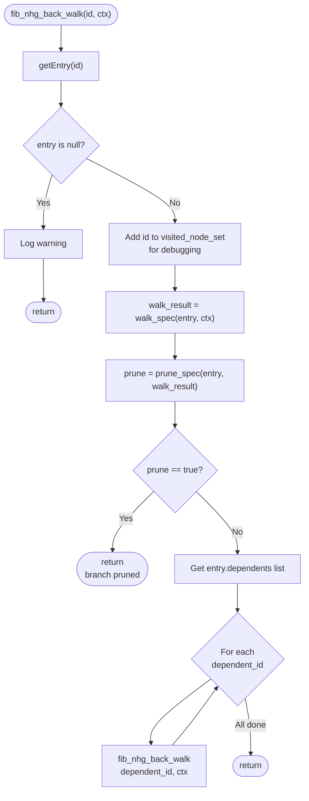
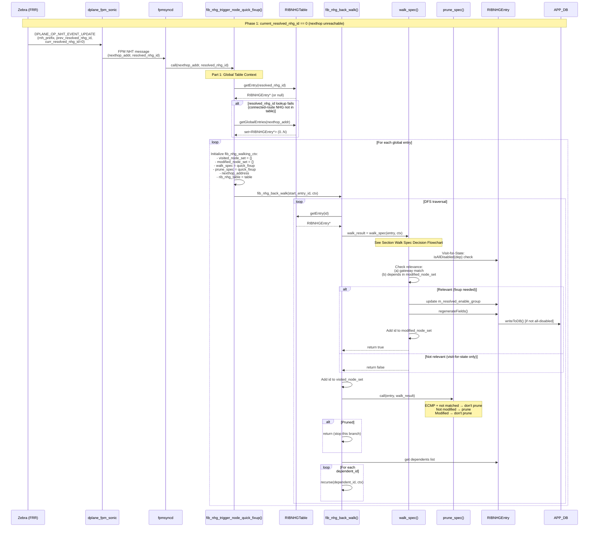
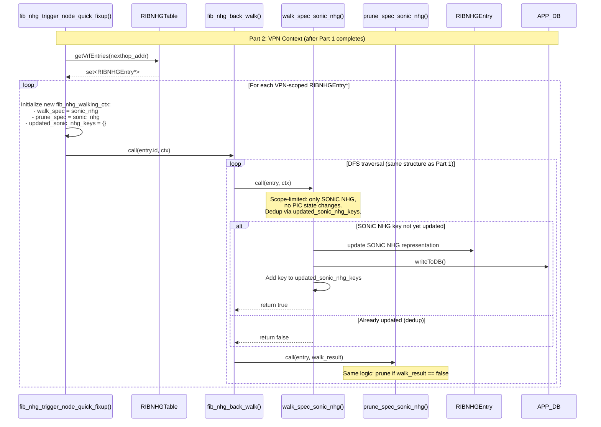
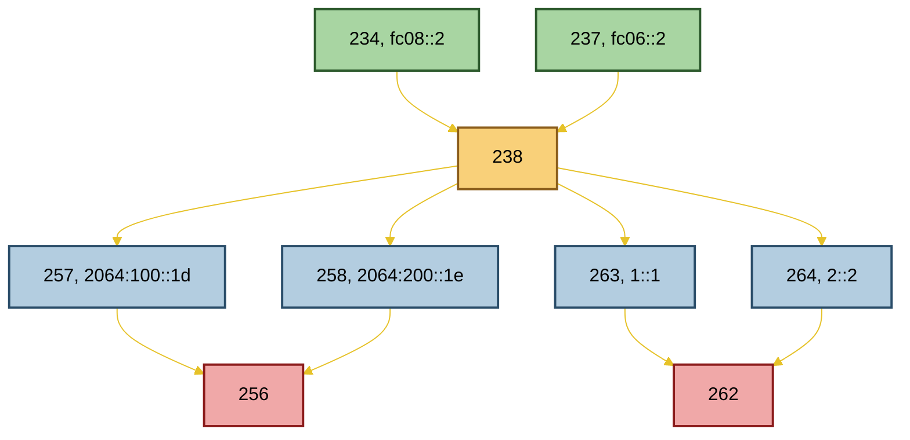
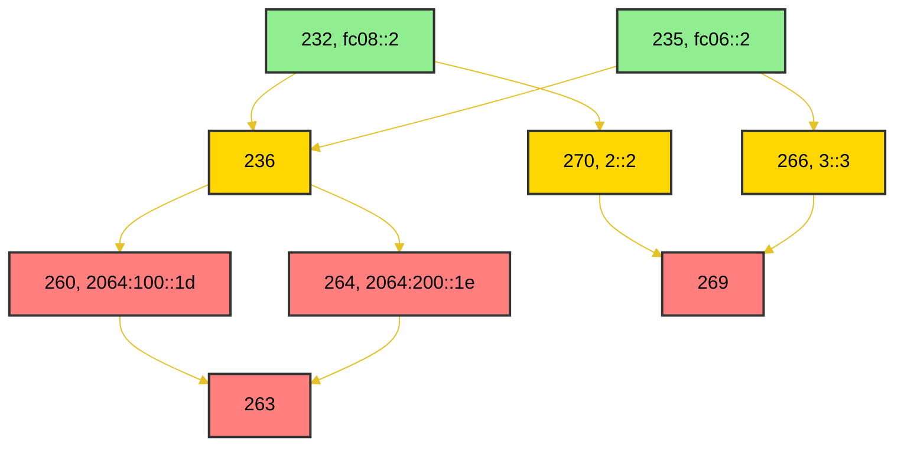
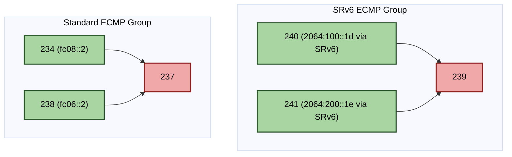

<h1 align="center">RIB FIB Route Convergence Handling LLD </h1>

# Table of Contents <!-- omit in toc -->
- [1. Problem Statements](#1-problem-statements)
- [2. General Code Generation Rules](#2-general-code-generation-rules)
  - [1. Language Standard](#1-language-standard)
  - [2. Header Include Paths: Export vs. Internal Files](#2-header-include-paths-export-vs-internal-files)
- [3. FRR Modifications](#3-frr-modifications)
  - [Some Common FRR changes](#some-common-frr-changes)
    - [Queued-route filter relaxation in `zebra_rnh_resolve_nexthop_entry()`](#queued-route-filter-relaxation-in-zebra_rnh_resolve_nexthop_entry)
    - [`copy_state()` Fix: Preserve NHE ID](#copy_state-fix-preserve-nhe-id)
    - [Tolerating `ENOENT` / `ESRCH` on `RTM_DELNEXTHOP` in `netlink_parse_error()`](#tolerating-enoent--esrch-on-rtm_delnexthop-in-netlink_parse_error)
    - [Skipping inactive singleton members in `zebra_nhg_nhe2grp_internal()`](#skipping-inactive-singleton-members-in-zebra_nhg_nhe2grp_internal)
  - [RNH event information](#rnh-event-information)
    - [Core RNH Tracking Fields](#core-rnh-tracking-fields)
    - [Change Detection Logic](#change-detection-logic)
  - [Dplane Integration: New Event Type \& Context Structure](#dplane-integration-new-event-type--context-structure)
    - [New Dplane Operation Enum](#new-dplane-operation-enum)
    - [Extended Dplane Context](#extended-dplane-context)
    - [RNH Info Structure Definition](#rnh-info-structure-definition)
    - [Event Generation Workflow](#event-generation-workflow)
      - [Reference implementation: `zebra_rnh_eval_nexthop_entry()`](#reference-implementation-zebra_rnh_eval_nexthop_entry)
      - [`dplane_nht_event_update()` Function](#dplane_nht_event_update-function)
      - [Accessor Functions](#accessor-functions)
      - [Boilerplate Switch Cases](#boilerplate-switch-cases)
      - [Include Dependency](#include-dependency)
  - [Triggering `REINSTALL_FPM_ONLY` for in-flight and KEEP\_AROUND-revival cases](#triggering-reinstall_fpm_only-for-in-flight-and-keep_around-revival-cases)
    - [Setting `REINSTALL_FPM_ONLY` at the right level (parent NHG, not inserted child)](#setting-reinstall_fpm_only-at-the-right-level-parent-nhg-not-inserted-child)
    - [Case A: dependents change while an install is in flight (QUEUED)](#case-a-dependents-change-while-an-install-is-in-flight-queued)
    - [Case B: NHG revived from KEEP\_AROUND (delayed-delete)](#case-b-nhg-revived-from-keep_around-delayed-delete)
    - [Summary](#summary)
- [4. FPM Message Serialization (SONiC Integration)](#4-fpm-message-serialization-sonic-integration)
  - [Include Dependency](#include-dependency-1)
  - [Custom Message Type](#custom-message-type)
  - [Encoder Function: `netlink_nhtevent_msg_encode()`](#encoder-function-netlink_nhtevent_msg_encode)
    - [Field Extraction and NULL Handling](#field-extraction-and-null-handling)
    - [JSON Serialization](#json-serialization)
    - [Error Handling](#error-handling)
    - [Debug Logging](#debug-logging)
    - [Memory](#memory)
  - [Switch Case in `fpm_nl_enqueue()`](#switch-case-in-fpm_nl_enqueue)
- [5. SONiC-fib Enhancements for NHT events](#5-sonic-fib-enhancements-for-nht-events)
  - [NhtEvent JSON Schema](#nhtevent-json-schema)
    - [Example: nexthop becomes unresolved (Phase 1 trigger)](#example-nexthop-becomes-unresolved-phase-1-trigger)
  - [Generated Code](#generated-code)
    - [Design Decisions](#design-decisions)
  - [C API for FRR Integration](#c-api-for-frr-integration)
  - [Generated Code Templates](#generated-code-templates)
    - [Template: `nhtevent.h.j2` (mode: `header`)](#template-nhteventhj2-mode-header)
    - [Template: `nhtevent.cpp.j2` (mode: `source`)](#template-nhteventcppj2-mode-source)
    - [Template: `nhtevent_json.h.j2` (mode: `json_bindings`)](#template-nhtevent_jsonhj2-mode-json_bindings)
    - [Template: `c_nhtevent.h.j2` (mode: `c_header`)](#template-c_nhteventhj2-mode-c_header)
    - [`render_schema.py` Template Selection](#render_schemapy-template-selection)
  - [Data Flow](#data-flow)
  - [Build Integration (`src/Makefile.am`)](#build-integration-srcmakefileam)
  - [Template Reference Files](#template-reference-files)
- [6. FPMsyncd Modifications](#6-fpmsyncd-modifications)
  - [Existing NHG MGR codes](#existing-nhg-mgr-codes)
  - [NHT Event Message Reception (`onNhtEventMsg`)](#nht-event-message-reception-onnhteventmsg)
    - [FPM Link Layer: `fpmlink.h` / `fpmlink.cpp`](#fpm-link-layer-fpmlinkh--fpmlinkcpp)
    - [`onMsgRaw()` Whitelist Guard](#onmsgraw-whitelist-guard)
    - [Message Length Calculation and Dispatch in `onMsgRaw()`](#message-length-calculation-and-dispatch-in-onmsgraw)
    - [`RouteSync::onNhtEventMsg()`](#routesynconnhteventmsg)
  - [`fib_nhg_trigger_node_quick_fixup()`](#fib_nhg_trigger_node_quick_fixup)
    - [Part 1: Global Table Context Backwalk](#part-1-global-table-context-backwalk)
    - [Part 2: VPN Context Backwalk](#part-2-vpn-context-backwalk)
  - [`fib_nhg_back_walk()`](#fib_nhg_back_walk)
    - [Parameters](#parameters)
    - [Design \& Extensibility](#design--extensibility)
    - [Execution Flow](#execution-flow)
      - [Recursion Flowchart](#recursion-flowchart)
  - [Changes for Part 1](#changes-for-part-1)
    - [Changes in  `class RIBNHGEntry`](#changes-in--class-ribnhgentry)
    - [New Helper Methods](#new-helper-methods)
      - [`isAllDisabled()` (static file-scope helper)](#isalldisabled-static-file-scope-helper)
      - [`RIBNHGEntry::resetResolvedEnableGroup()`](#ribnhgentryresetresolvedenablegroup)
      - [`RIBNHGEntry::regenerateFields()`](#ribnhgentryregeneratefields)
      - [`RIBNHGEntry::addDependentsMember()` / `removeDependentsMember()`](#ribnhgentryadddependentsmember--removedependentsmember)
      - [`RIBNHGTable::addNHGDependents()` / `removeNHGDependents()`](#ribnhgtableaddnhgdependents--removenhgdependents)
    - [Method Update: `RIBNHGEntry::checkNeedUpdate()`](#method-update-ribnhgentrycheckneedupdate)
    - [Method Update: `NHGMgr::updateExistingNHGFull()`](#method-update-nhgmgrupdateexistingnhgfull)
    - [Method Update: `NHGMgr::addNewNHGFull()` — Index Map Population](#method-update-nhgmgraddnewnhgfull--index-map-population)
    - [Method Update: `NHGMgr::delNHGFull()` — Index Map Cleanup](#method-update-nhgmgrdelnhgfull--index-map-cleanup)
    - [`backwalk` Parameter Threading](#backwalk-parameter-threading)
    - [Method Update: `RIBNHGEntry::getNextHopGroupFields()`](#method-update-ribnhgentrygetnexthopgroupfields)
      - [New Helper: `resolveLeafEnableFlags()`](#new-helper-resolveleafenableflags)
      - [Updated `getNextHopGroupFields()` Usage](#updated-getnexthopgroupfields-usage)
      - [Example Trace (Topology 1, fc06::2 down, NHG 257)](#example-trace-topology-1-fc062-down-nhg-257)
    - [`fib_nhg_walk_spec_for_node_quick_fixup()`](#fib_nhg_walk_spec_for_node_quick_fixup)
    - [`fib_nhg_prune_spec_for_node_quick_fixup()`](#fib_nhg_prune_spec_for_node_quick_fixup)
    - [Part 1's call flow](#part-1s-call-flow)
  - [Changes for Part 2](#changes-for-part-2)
    - [Motivation](#motivation)
    - [Modifications to `RIBNHGTable` Class](#modifications-to-ribnhgtable-class)
    - [Backwalk for VPN-Scoped RIBNHGEntries](#backwalk-for-vpn-scoped-ribnhgentries)
    - [`fib_nhg_walk_spec_for_node_quick_fixup_sonic_nhg()`](#fib_nhg_walk_spec_for_node_quick_fixup_sonic_nhg)
    - [`fib_nhg_prune_spec_for_node_quick_fixup_sonic_nhg()`](#fib_nhg_prune_spec_for_node_quick_fixup_sonic_nhg)
    - [Part 2's call flow](#part-2s-call-flow)
    - [One variation for part 1](#one-variation-for-part-1)
- [7. Examples](#7-examples)
  - [Test Topology 1 Global table recursive routes](#test-topology-1-global-table-recursive-routes)
    - [Local Failure fc06::2 withdrawn](#local-failure-fc062-withdrawn)
    - [Remote Failure 1 (2064:200::1e withdrawn)](#remote-failure-1-20642001e-withdrawn)
    - [Remote Failure 2 (1::1 withdrawn)](#remote-failure-2-11-withdrawn)
    - [Summary of corrected Topology 1 expectations](#summary-of-corrected-topology-1-expectations)
  - [Test Topology 2 Global table recursive routes](#test-topology-2-global-table-recursive-routes)
    - [Local Failure (`fc06::2` withdrawn)](#local-failure-fc062-withdrawn-1)
    - [Remote Failure 1 (`2064:100::1d` withdrawn)](#remote-failure-1-20641001d-withdrawn)
    - [Remote Failure 2 (`1::1` withdrawn)](#remote-failure-2-11-withdrawn-1)
    - [Remote Failure 3 (`2::2` withdrawn)](#remote-failure-3-22-withdrawn)
    - [Summary of corrected Topology 2 expectations:](#summary-of-corrected-topology-2-expectations)
  - [Test Topology 3 SRv6 VPN case](#test-topology-3-srv6-vpn-case)
    - [Test local failure](#test-local-failure)
    - [Test remote failure](#test-remote-failure)
- [8. Test cases](#8-test-cases)
  - [8.1 FRR topotest](#81-frr-topotest)
  - [8.2 sonic-fib unit test](#82-sonic-fib-unit-test)
    - [Build Integration (`tests/Makefile.am`)](#build-integration-testsmakefileam)
    - [Test File: `tests/nhtevent_ut.cpp`](#test-file-testsnhtevent_utcpp)
    - [Test Cases](#test-cases)
      - [Suite: `NhtEvent_Json`](#suite-nhtevent_json)
      - [Suite: `NhtEvent_CAPI`](#suite-nhtevent_capi)
    - [Coverage Analysis](#coverage-analysis)
  - [8.3 sonic-swss unit test](#83-sonic-swss-unit-test)
    - [Test Fixture: `FpmSyncdNhtBackwalk`](#test-fixture-fpmsyncdnhtbackwalk)
    - [Test Cases](#test-cases-1)
      - [Backwalk Tests (using `runPart1Backwalk` / `runPart2Backwalk`)](#backwalk-tests-using-runpart1backwalk--runpart2backwalk)
      - [General Tests (using `fib_nhg_trigger_node_quick_fixup`)](#general-tests-using-fib_nhg_trigger_node_quick_fixup)
      - [`resolveLeafEnableFlags()` Tests](#resolveleafenableflags-tests)
      - [Function-Level Unit Tests](#function-level-unit-tests)
    - [Build Integration](#build-integration)
    - [Topology JSON Files](#topology-json-files)
    - [Main Test Flow](#main-test-flow)
  - [8.4 sonic-mgmt system level tests](#84-sonic-mgmt-system-level-tests)
    - [8.4.1 7-Node Topology Key Connections](#841-7-node-topology-key-connections)
    - [8.4.2 Helper Functions](#842-helper-functions)
      - [1. apply\_config\_cmmds\_to\_vtysh(nbrhost, cmd\_list)](#1-apply_config_cmmds_to_vtyshnbrhost-cmd_list)
      - [2. collect\_db\_entries(duthost, testcase\_name, db\_name, collecting\_prefix)](#2-collect_db_entriesduthost-testcase_name-db_name-collecting_prefix)
      - [3. collect\_vtysh\_route\_snapshot(duthost, snapshot\_name)](#3-collect_vtysh_route_snapshotduthost-snapshot_name)
      - [4. Record Collection](#4-record-collection)
        - [`start_record_collection(duthost, testcase_name)`](#start_record_collectionduthost-testcase_name)
        - [`stop_record_collection(duthost, testcase_name)`](#stop_record_collectionduthost-testcase_name)
      - [5. APPDB Assertion Helpers](#5-appdb-assertion-helpers)
        - [`assert_appdb_nexthop_removed(duthost, nexthop, timeout=10, poll_interval=1)`](#assert_appdb_nexthop_removedduthost-nexthop-timeout10-poll_interval1)
        - [`assert_appdb_nexthop_present(duthost, nexthop)`](#assert_appdb_nexthop_presentduthost-nexthop)
      - [6. `_extract_sonic_nhg_id_from_rec_line(line)`](#6-_extract_sonic_nhg_id_from_rec_lineline)
      - [7. `_is_skipable_nhg(duthost, sonic_nhg_id)`](#7-_is_skipable_nhgduthost-sonic_nhg_id)
      - [8. `verify_nhg_before_routes(duthost, testcase_name, trigger_nexthop, trigger_ts=None)`](#8-verify_nhg_before_routesduthost-testcase_name-trigger_nexthop-trigger_tsnone)
      - [9. `verify_no_nhg_update(duthost, testcase_name, trigger_ts=None)`](#9-verify_no_nhg_updateduthost-testcase_name-trigger_tsnone)
      - [10. `get_dut_timestamp(duthost)`](#10-get_dut_timestampduthost)
      - [11. `_parse_rec_timestamp(line)`](#11-_parse_rec_timestampline)
    - [8.4.3 Failure Triggers](#843-failure-triggers)
    - [8.4.4 Test Cases](#844-test-cases)
      - [Module-Level Constants](#module-level-constants)
      - [Common Test Pattern](#common-test-pattern)
      - [Function Signatures](#function-signatures)
      - [`test_topology1_local_failure`](#test_topology1_local_failure)
      - [`test_topology1_remote_bgp_failure`](#test_topology1_remote_bgp_failure)
      - [`test_topology1_remote_igp_failure`](#test_topology1_remote_igp_failure)
      - [`test_topology2_local_failure`](#test_topology2_local_failure)
      - [`test_topology2_remote_bgp_failure`](#test_topology2_remote_bgp_failure)
      - [`test_topology2_remote_igp_failure`](#test_topology2_remote_igp_failure)
- [9. Appendix](#9-appendix)
  - [Key refinements identified during LLM-assisted brainstorming:](#key-refinements-identified-during-llm-assisted-brainstorming)
  - [First Round Code Generated](#first-round-code-generated)
  - [Couple issues fixed for compiling](#couple-issues-fixed-for-compiling)
  - [Unit Test issues:](#unit-test-issues)
    - [Cached bogus pointer](#cached-bogus-pointer)
    - [Misunderstand m\_nexthop](#misunderstand-m_nexthop)
    - [Not handle IBNHGEntry::getNextHopGroupFields()'s change paths based on m\_resolved\_enable\_group](#not-handle-ibnhgentrygetnexthopgroupfieldss-change-paths-based-on-m_resolved_enable_group)
  - [Second Round Code Generated](#second-round-code-generated)


# 1. Problem Statements
In the current SONiC architecture, `orchagent` mitigates traffic loss during local port-down events by rapidly removing failed load-balancing members. However, in broader failure scenarios, FRR generates a replacement Next Hop Group (NHG) and sequentially migrates dependent prefixes. This approach causes the traffic loss window to scale linearly with the number of affected prefixes, resulting in suboptimal convergence latency.To eliminate this prefix-dependent convergence delay, we propose a Prefix-Independent Convergence (PIC) mechanism. The detail of PIC and RIB/FIB archtitecture could be found in corresponding HLDs. This document focuses on how to implement route convergence in RIB/FIB architecture to support PIC.

When fpmsyncd receives a Next Hop Tracking (NHT) update from zebra, it initiates a targeted reconciliation process. By performing a dependency backwalk from the invalidated NHG, the system identifies all downstream NHGs and applies coordinated state updates. The primary objective is to immediately prune failed forwarding paths, minimizing the traffic loss window while the control plane asynchronously recalculates and installs optimal routes in the background.

The implementation comprises five core components:
* **FRR Modification**: Route all NHT events to the FPM interface exclusively through the dplane subsystem. The code changes are in FRR
* **SONiC FPM Adaptation**: Translate NHT events into standardized FPM messages. The code changes are in sonic-buildimage's sonic fpm.
* **sonic-fib Enhancement**: Introduce a new data schema to map NHT events, capturing both the impacted next hop and its corresponding NHG identifier. The code changes are in sonic-buildimage's sonic fib lib.
* **fpmsyncd Logic**: Traverse all dependent NHGs and rapidly reconcile the affected forwarding state. The code changes are in sonic-swss.
* **7-Node System Verification**: Validate route convergence correctness through comprehensive end-to-end testing on a seven-node topology. The code changes are in sonic-mgmt.


# 2. General Code Generation Rules
This Low-Level Design (LLD) is deliberately authored with implementation-grade specificity to function as a high-fidelity prompt for LLM-powered code generation tools (e.g., Qoder CLI: https://qoder.com/en/cli, Claude CLI: https://code.claude.com/docs/en/cli-reference). The goal is to enable reliable, specification-to-code automation with minimal ambiguity.

The following are couple general coding rules to guide LLM to generate codes.

## 1. Language Standard
  * C++14 is the required baseline for all SONiC C++ components (sonic-swss, sonic-fib, etc.).
  * Do not use C++17/20 features unless the target branch explicitly migrates.
## 2. Header Include Paths: Export vs. Internal Files
When generating code for Debian-packaged components, distinguish between public export headers and internal implementation files:'**
| File Type | Purpose | Include Path Style | Example |
|-----------|---------|-------------------|---------|
| **Export Header** | Installed to `/usr/include/...` for external consumers | Use **installed/public paths** (no `src/` prefix) | `#include "nexthopgroupfull.h"` |
| **Internal Source** | Compiled within the package; not installed | Use **relative build-tree paths** (e.g., `src/`) | `#include "src/nexthopgroupfull.h"` |

**Examples**:
```
// ✅ nexthopgroupfull_json.h (export header — installed)
#include "nexthopgroupfull.h"  // Resolves to /usr/include/nexthopgroupfull.h

// ✅ nexthopgroup_capi.cpp (internal implementation)
#include "src/nexthopgroupfull.h"
#include "src/nexthopgroupfull_json.h"
#include "src/c_nexthopgroupfull.h"
#include "src/nexthopgroup_debug.h"
```

Critical: Mixing these styles causes build failures:
* Export headers using src/ paths → break downstream consumers (file not found at install time).
* Internal files using flat paths → may conflict with system headers or fail in-tree builds.

# 3. FRR Modifications
This section outlines modifications to FRRouting (FRR) to enhance Next Hop Tracking (NHT) event propagation from Zebra to the dplane, enabling fpmsyncd to respond proactively to nexthop changes and minimize traffic loss during convergence.

## Some Common FRR changes
### Queued-route filter relaxation in `zebra_rnh_resolve_nexthop_entry()`

This relaxation has been accepted upstream as FRR PR 22221 ("zebra: Allow rnh evaluation for a queued and !installed rn", merged 2026-06-05): https://github.com/FRRouting/frr/pull/22221. It is no longer a SONiC-local patch; once that commit is in the FRR baseline this section is informational only.

The upstream resolver in `zebra_rnh_resolve_nexthop_entry()` (in `zebra/zebra_rnh.c`) skipped any RE that had `ROUTE_ENTRY_QUEUED` set. This is too strict: a route can be both QUEUED (because zebra has re-scheduled an install) and already INSTALLED (because a previous install already completed). In that case the route is still a valid resolver, and we want the NHT state-change to flow through to the dplane event.

Relax the filter so that only routes that are QUEUED **and not yet INSTALLED** are skipped (PR 22221 hunk):

```diff
-                       if (CHECK_FLAG(re->status, ROUTE_ENTRY_QUEUED)) {
+                       if (CHECK_FLAG(re->status, ROUTE_ENTRY_QUEUED) &&
+                           !CHECK_FLAG(re->status, ROUTE_ENTRY_INSTALLED)) {
                                if (IS_ZEBRA_DEBUG_NHT_DETAILED)
                                        zlog_debug(
                                                "        Route Entry %s queued",
```

Without this change, an already-installed RE that gets re-queued (e.g. on metric change or recursive resolver flap) would be silently skipped by the resolver, `re` would be returned NULL, and the NHT event for the affected rnh would never be generated.

### `copy_state()` Fix: Preserve NHE ID

The existing `copy_state()` call uses `zebra_nhe_copy(re->nhe, 0)`, which zeroes the NHE ID in the cached state. This breaks `prev_nhg_id` caching — when `zebra_rnh_eval_nexthop_entry()` reads `rnh->state->nhe->id` before `copy_state()`, it gets 0 instead of the actual previous NHG ID.

**Fix**: based on Mark's comments, we cache the resolved NHG ID directly on `struct rnh` rather than re-stamping it onto the cached `nhe`. This is implemented as upstream FRR PR 21892 (https://github.com/FRRouting/frr/pull/21892). The two hunks are:

**1. Add `resolved_nhg_id` field to `struct rnh` in `zebra/rib.h`:**

```diff
diff --git a/zebra/rib.h b/zebra/rib.h
@@ -50,6 +50,14 @@ struct rnh {
 	uint32_t seqno;

 	struct route_entry *state;
+
+	/* The NHG ID of the resolved route entry. Used by NHT consumers
+	 * (e.g. fpmsyncd) to identify the nexthop-group when building FIB
+	 * entries from NHT notifications. We cache this ID in rnh instead
+	 * of the cached NHG entry due to some misuse concern on the cached
+	 * NHG entry after it gets a valid NHG ID.
+	 */
+	uint32_t resolved_nhg_id;
 	struct prefix resolved_route;
 	struct list *client_list;
```

**2. Reset / stamp `rnh->resolved_nhg_id` inside `copy_state()` in `zebra/zebra_rnh.c`:**

```diff
diff --git a/zebra/zebra_rnh.c b/zebra/zebra_rnh.c
@@ -867,6 +867,7 @@ static void copy_state(struct rnh *rnh, const struct route_entry *re,
 		free_state(rnh->vrf_id, rnh->state, rn);
 		rnh->state = NULL;
 	}
+	rnh->resolved_nhg_id = 0;

 	if (!re)
 		return;
@@ -879,6 +880,7 @@ static void copy_state(struct rnh *rnh, const struct route_entry *re,
 	state->status = re->status;

 	state->nhe = zebra_nhe_copy(re->nhe, 0);
+	rnh->resolved_nhg_id = re->nhe->id;
```

Note: `state->nhe = zebra_nhe_copy(re->nhe, 0)` is left intact — the cached NHE retains id=0 by design to avoid id collisions on the cached copy. The real id is now carried on `rnh->resolved_nhg_id`, which is what NHT consumers (and the dplane event below) read.

### Tolerating `ENOENT` / `ESRCH` on `RTM_DELNEXTHOP` in `netlink_parse_error()`

The dplane runs providers in a chain (kernel → FPM → ...). When the kernel provider returns a hard failure for an NHG delete, zebra marks the ctx as failed and the FPM provider never gets to run. That breaks SONiC convergence in a specific scenario:

1. An interface goes down. The kernel auto-purges every NHG that recursively pointed through that interface.
2. Zebra later issues `RTM_DELNEXTHOP` for those same NHGs as part of its own cleanup.
3. The kernel responds with `-ENOENT` (or `-ESRCH`) because the NHG is already gone.
4. Zebra treats that as a real error, the dplane ctx never reaches the FPM provider, and SONiC's APPDB is left with stale `NEXTHOP_GROUP_TABLE` entries that should have been deleted.

The fix is to add `RTM_DELNEXTHOP` + `ENOENT|ESRCH` to the existing "expected error" allowlist in `netlink_parse_error()`. When matched, `netlink_parse_error()` returns success so the ctx continues down the provider chain to FPM, which then issues the corresponding APPDB delete.

```diff
diff --git a/zebra/kernel_netlink.c b/zebra/kernel_netlink.c
@@ -1015,6 +1015,8 @@ static int netlink_parse_error(const struct nlsock *nl, struct nlmsghdr *h,
 	      (-errnum == ENODEV || -errnum == ESRCH)) ||
 	     (msg_type == RTM_NEWROUTE &&
 	      (-errnum == ENETDOWN || -errnum == EEXIST)) ||
+	     (msg_type == RTM_DELNEXTHOP &&
+	      (-errnum == ENOENT || -errnum == ESRCH)) ||
 	     ((msg_type == RTM_NEWTUNNEL || msg_type == RTM_DELTUNNEL ||
 	       msg_type == RTM_GETTUNNEL) &&
 	      (-errnum == EOPNOTSUPP)))) {
```

Rationale: the kernel having already removed the NHG is not a bug from zebra's perspective — the desired end-state (NHG absent from kernel) is achieved. What matters for SONiC is that the *FPM provider still runs* and emits the delete, so the rest of the stack can converge. The allowlist treats these two errnos as benign for `RTM_DELNEXTHOP` only; other RTM ops and other errnos continue to be flagged.

### Skipping inactive singleton members in `zebra_nhg_nhe2grp_internal()`

When zebra builds the per-group dependent list to hand down to the dplane install path, every depend (singleton NHG) is appended unconditionally, including those whose underlying nexthop has gone inactive (e.g. interface down, recursive resolver lost). The kernel then rejects the entire group because one of its members is invalid, and the result is that SONiC sees a missing group rather than a group with the inactive member pruned.

This is addressed upstream by FRR PR 22133 ("zebra: skip inactive nexthop when building NHG for kernel install", https://github.com/FRRouting/frr/pull/22133, currently open). The fix adds a per-depend `NEXTHOP_FLAG_ACTIVE` check before appending to the install array — inactive singletons are skipped so they don't poison the whole NHG programming, while the rest of the group still installs.

```diff
diff --git a/zebra/zebra_nhg.c b/zebra/zebra_nhg.c
@@ -3389,6 +3415,17 @@ static uint16_t zebra_nhg_nhe2grp_internal(struct nh_grp *grp, uint16_t curr_ind
 				continue;
 			}

+			if (depend->nhg.nexthop &&
+			    !CHECK_FLAG(depend->nhg.nexthop->flags,
+					NEXTHOP_FLAG_ACTIVE)) {
+				if (IS_ZEBRA_DEBUG_RIB_DETAILED
+				    || IS_ZEBRA_DEBUG_NHG)
+					zlog_debug(
+						"%s: Nexthop ID (%u) is inactive, not appending to dataplane install group",
+						__func__, depend->id);
+				continue;
+			}
+
 			/* Check for duplicate IDs, ignore if found. */
 			for (int j = 0; j < i; j++) {
 				if (depend->id == grp[j].id) {
```

Interaction with the rest of section 3: this skip happens at install-group assembly time, which runs *before* `zebra_nhg_dplane_result()` and the `REINSTALL_FPM_ONLY` consumer (Case A above). When the inactive depend later flips back to active — typically via NHT re-resolution — the parent NHG becomes a candidate for `REINSTALL_FPM_ONLY`, and the dplane-result path described earlier will re-emit the now-complete group to FPM. The two changes are complementary: PR 22133 prevents kernel-side rejection during the failure transient; the QUEUED-window handling ensures FPM converges back to the healthy state once the underlay recovers.

## RNH event information
### Core RNH Tracking Fields
Each rnh (Route Next Hop) structure maintains the following state for change detection:

| Field | Description |Storage Location |
|:---|:---|:---|
| Tracked Prefix| The prefix being monitored for nexthop changes | rnh->node->p |
| Resolved Route Prefix | The prefix of the route currently resolving the tracked prefix | rnh->resolved_route |
| Resolution State | The active route_entry used to resolve the tracked prefix | rnh->state |

Memory Lifetime Warning:
The function copy_state() frees the existing resolution state (rnh->state) before assigning the new state. Therefore:
❌ Do NOT cache rnh->state as a pointer before calling copy_state() and dereference it afterward. The pointer becomes dangling.
✅ DO extract and cache any required fields (e.g., nhg_id) before invoking copy_state(), since primitive values remain valid independent of memory lifecycle.

### Change Detection Logic
The function zebra_rnh_eval_nexthop_entry() in https://github.com/FRRouting/frr/blob/master/zebra/zebra_rnh.c#L785 evaluates whether an incoming route update affects an RNH by comparing:
* Whether the incoming route_node *prn matches the RNH's current resolved prefix
* Whether the incoming route_entry *re differs from the RNH's cached state

```
static void zebra_rnh_eval_nexthop_entry(struct zebra_vrf *zvrf, afi_t afi,
					 int force, struct route_node *nrn,
					 struct rnh *rnh,
					 struct route_node *prn,
					 struct route_entry *re)
```

When a state change is detected (state_changed == true), Zebra must propagate the following context to dplane to enable informed FIB NHT updates.

The purpose for zebra sends NHT event to fpmsyncd is to give enough information which informs that the current nexthop its holding will make some changes. So fpmsyncd's FIB module could response this event properly for reducing traffic loss window. Therefore, the following information would need to pass down to dplane when state_changed is set.

| Field | Purpose | Unresolved Value |
|:---|:---|:---|
| rnh_prefix | Identifies affected NHGs | — |
| prev_resolved_prefix | Previous resolving route prefix | 0.0.0.0/0 (or equivalent zero prefix)
| prev_resolved_nhg_id | Previous resolving NHG identifier which is got from rnh->resolved_nhg_id | 0 |
| curr_resolved_prefix | Current resolving route prefix | 0.0.0.0/0 |
| curr_resolved_nhg_id | Current resolving NHG identifier which is got from rnh->resolved_nhg_id | 0 |

Note: Currently, all related context is sent to dplane. Processing follows a phased approach:
* Phase 1: Trigger backwalk when an RNH prefix becomes unresolvable. Walk from the previous resolved NHG ID to prune failed paths from dependent NHGs.
* Future: Extend handling to cover other cases.

## Dplane Integration: New Event Type & Context Structure
### New Dplane Operation Enum
A new action enum DPLANE_OP_NHT_EVENT_UPDATE would be added in dplane_op_e https://github.com/FRRouting/frr/blob/master/zebra/zebra_dplane.h#L116

```
enum dplane_op_e {
    // ... existing ops ...
    DPLANE_OP_NHT_EVENT_UPDATE,  // New: RNH state change notification
};
```

### Extended Dplane Context
Extend struct zebra_dplane_ctx (https://github.com/FRRouting/frr/blob/master/zebra/zebra_dplane.c#L446) with a dedicated union member:

```
struct zebra_dplane_ctx {
    // ... existing fields ...
    union {
        // ... existing union members ...
        struct dplane_rnh_info rnh_info;  // New: RNH event payload
    };
};
```
### RNH Info Structure Definition
Define the payload structure to carry RNH change context:

```
struct dplane_rnh_info {
  struct prefix p; // Tracked RNH prefix

  struct prefix previous_resolved_prefix;
  uint32_t previous_resolved_nhg_id;

  struct prefix current_resolved_prefix;
  uint32_t current_resolved_nhg_id;

}
```

### Event Generation Workflow
#### Reference implementation: `zebra_rnh_eval_nexthop_entry()`
Insert the dplane NHT event generation at two specific points in `zebra/zebra_rnh.c::zebra_rnh_eval_nexthop_entry()`:

1. **Capture previous state at the very top of the function**, before `zebra_rnh_remove_from_routing_table()` runs and before any branch that calls `copy_state()`. Reading `rnh->resolved_nhg_id` and `rnh->resolved_route` here guarantees we observe the pre-update values.
2. **Fire `dplane_nht_event_update()` only when `state_changed` is true**, nested inside the existing `if (state_changed || force)` block. A `force`-only re-evaluation does not represent an actual change in resolution, so no NHT event is emitted in that case — fpmsyncd would have nothing actionable to do.

```diff
diff --git a/zebra/zebra_rnh.c b/zebra/zebra_rnh.c
@@ -34,6 +34,7 @@
 #include "zebra/zebra_srte.h"
 #include "zebra/interface.h"
 #include "zebra/zebra_errors.h"
+#include "zebra/zebra_dplane.h"

 DEFINE_MTYPE_STATIC(ZEBRA, RNH, "Nexthop tracking object");

@@ -660,6 +661,12 @@ static void zebra_rnh_eval_nexthop_entry(struct zebra_vrf *zvrf, afi_t afi,
 					 struct route_entry *re)
 {
 	int state_changed = 0;
+	uint32_t prev_nhg_id;
+	struct prefix prev_resolved;
+
+	/* Cache previous state BEFORE copy_state() updates rnh. */
+	prev_nhg_id = rnh->resolved_nhg_id;
+	prefix_copy(&prev_resolved, &rnh->resolved_route);

 	/* If we're resolving over a different route, resolution has changed or
 	 * the resolving route has some change (e.g., metric), there is a state
@@ -695,6 +702,28 @@ static void zebra_rnh_eval_nexthop_entry(struct zebra_vrf *zvrf, afi_t afi,
 	zebra_rnh_store_in_routing_table(rnh);

 	if (state_changed || force) {
+		/* Generate NHT dplane event for FPM consumers.
+		 * Only emit when the resolution actually changed; a force
+		 * re-evaluation by itself does not need an event.
+		 */
+		if (state_changed) {
+			struct prefix curr_resolved;
+			uint32_t curr_nhg_id;
+			enum zebra_dplane_result dplane_res;
+
+			prefix_copy(&curr_resolved, &rnh->resolved_route);
+			curr_nhg_id = rnh->resolved_nhg_id;
+
+			if (IS_ZEBRA_DEBUG_NHT)
+				zlog_debug("NHT event: rnh=%pFX prev_nhg=%u curr_nhg=%u",
+					   &nrn->p, prev_nhg_id, curr_nhg_id);
+
+			dplane_res = dplane_nht_event_update(
+				&nrn->p, &prev_resolved, prev_nhg_id,
+				&curr_resolved, curr_nhg_id);
+			if (dplane_res != ZEBRA_DPLANE_REQUEST_QUEUED)
+				zlog_warn("NHT event enqueue failed for rnh=%pFX: result=%d",
+					  &nrn->p, dplane_res);
+		}
+
 		/* NOTE: Use the "copy" of resolving route stored in 'rnh' i.e.,
 		 * rnh->state.
 		 */
```

Order of operations inside the function (top to bottom): capture prev state → `zebra_rnh_remove_from_routing_table()` → branch on `prefix_same`/`compare_state` (each of which may call `copy_state()` and set `state_changed = 1`) → `zebra_rnh_store_in_routing_table()` → enter `if (state_changed || force)` block → emit dplane event when `state_changed` → notify protocol clients → process pseudowires.


#### `dplane_nht_event_update()` Function

| Aspect | Specification |
|:---|:---|
| Declared in | `zebra/zebra_dplane.h` |
| Implemented in | `zebra/zebra_dplane.c` |
| Signature | `enum zebra_dplane_result dplane_nht_event_update(const struct prefix *rnh_prefix, const struct prefix *prev_resolved_prefix, uint32_t prev_nhg_id, const struct prefix *curr_resolved_prefix, uint32_t curr_nhg_id)` |
| Return | `ZEBRA_DPLANE_REQUEST_QUEUED` on success, `ZEBRA_DPLANE_REQUEST_FAILURE` on error |
| Kernel skip | Always sets `dplane_ctx_set_skip_kernel(ctx)` — NHT events only target FPM consumers |
| NULL check | Returns failure immediately if `rnh_prefix` is NULL |
| Debug logging | Logs rnh prefix and NHG IDs at `IS_ZEBRA_DEBUG_DPLANE_DETAIL` level |
| Cleanup | Frees ctx on enqueue failure |

Note: The function takes `const struct prefix *` parameters (not `struct rnh *`) for clean dplane separation — the dplane layer should not know about RNH internals.

#### Accessor Functions

Declared in `zebra/zebra_dplane.h`, implemented in `zebra/zebra_dplane.c`:

| Function | Return Type |
|:---|:---|
| `dplane_ctx_get_rnh_prefix(ctx)` | `const struct prefix *` |
| `dplane_ctx_get_rnh_prev_resolved_prefix(ctx)` | `const struct prefix *` |
| `dplane_ctx_get_rnh_prev_resolved_nhg_id(ctx)` | `uint32_t` |
| `dplane_ctx_get_rnh_curr_resolved_prefix(ctx)` | `const struct prefix *` |
| `dplane_ctx_get_rnh_curr_resolved_nhg_id(ctx)` | `uint32_t` |

Each accessor calls `DPLANE_CTX_VALID(ctx)` and reads from `ctx->u.rnh_info`.

#### Boilerplate Switch Cases

`DPLANE_OP_NHT_EVENT_UPDATE` must be added to every exhaustive switch on `dplane_op_e` across these files:

| File | Switch Location | Action |
|:---|:---|:---|
| `zebra/zebra_dplane.c` | `dplane_op2str()` | Return `"NHT_EVENT_UPDATE"` |
| `zebra/zebra_dplane.c` | `dplane_ctx_free_internal()` | `break` (no resources to free) |
| `zebra/zebra_dplane.c` | `kernel_dplane_log_detail()` | Log rnh prefix via `dplane_ctx_get_nht_rnh_prefix()` |
| `zebra/zebra_dplane.c` | `kernel_dplane_handle_result()` | Increment `dg_other_errors` on failure |
| `zebra/zebra_rib.c` | `rib_process_dplane_results()` | `break` (no-op, handled by FPM provider) |
| `zebra/dplane_fpm_nl.c` | `fpm_nl_enqueue()` | `break` (handled by sonic-buildimage's FPM provider, not upstream) |
| `zebra/kernel_netlink.c` | `nl_put_msg()` | Return `FRR_NETLINK_ERROR` (not a kernel op) |
| `zebra/kernel_socket.c` | `kernel_update_multi()` | Log error + set failure (not a kernel op) |
| `zebra/zebra_script.c` | Lua dplane ctx push | `break` (no Lua binding) |

#### Include Dependency

Add `#include "zebra/zebra_dplane.h"` to `zebra/zebra_rnh.c` for the `dplane_nht_event_update()` declaration and `enum zebra_dplane_result` type.

## Triggering `REINSTALL_FPM_ONLY` for in-flight and KEEP_AROUND-revival cases

`NEXTHOP_GROUP_REINSTALL_FPM_ONLY` is the flag that tells the FPM-only fast path to re-emit an NHG to fpmsyncd without doing a kernel install. Two corner cases need explicit handling in `zebra/zebra_nhg.c` so the flag actually causes a re-install when the NHG eventually settles:

### Setting `REINSTALL_FPM_ONLY` at the right level (parent NHG, not inserted child)

The flag was originally being set inside the low-level RB-tree helpers `nhg_connected_tree_add_nhe()` / `nhg_connected_tree_del_nhe()`, but on the wrong NHE: those helpers operate on a node being inserted into / removed from a tree, and the existing code marked the *inserted* NHE (`depend`) with `REINSTALL_FPM_ONLY`. The intent, however, is to re-emit the **tree owner** (the parent NHG whose dependents list just changed) — not the child. The fix is to remove the SET_FLAG from the tree primitives and move it up one level into the `zebra_nhg_dependents_add()` / `zebra_nhg_dependents_del()` callers, which know which NHE owns the dependents tree.

The same hunk also widens the gate from "parent is INSTALLED" to "parent is INSTALLED **or** QUEUED". Without QUEUED in the gate, a dependent change that arrives while the parent's install is still in flight would silently fail to set the flag, and Case A (below) would have nothing to consume.

```diff
diff --git a/zebra/zebra_nhg.c b/zebra/zebra_nhg.c
@@ -158,13 +158,6 @@ nhg_connected_tree_del_nhe(struct nhg_connected_tree_head *head,
 	if (remove) {
 		removed_nhe = remove->nhe;
 		nhg_connected_free(remove);
-		/*
-		 * If nhg fib is enabled, we need to reinstall this nhg due to depends or dependents information
-		 * is updated.
-		 */
-		if (zebra_nhg_fib_enabled && CHECK_FLAG(depend->flags, NEXTHOP_GROUP_INSTALLED)) {
-			SET_FLAG(depend->flags, NEXTHOP_GROUP_REINSTALL_FPM_ONLY);
-		}
 		return removed_nhe;
 	}

@@ -186,13 +179,6 @@ nhg_connected_tree_add_nhe(struct nhg_connected_tree_head *head,
 	 * RB code.
 	 */
 	if (new && (nhg_connected_tree_add(head, new) == NULL)) {
-		/*
-		 * If nhg fib is enabled, we need to reinstall this nhg due to depends or dependents information
-		 * is updated
-		 */
-		if (zebra_nhg_fib_enabled && CHECK_FLAG(depend->flags, NEXTHOP_GROUP_INSTALLED)) {
-			SET_FLAG(depend->flags, NEXTHOP_GROUP_REINSTALL_FPM_ONLY);
-		}
 		return NULL;
 	}

@@ -271,12 +257,38 @@ static void zebra_nhg_dependents_del(struct nhg_hash_entry *from,
 				     struct nhg_hash_entry *dependent)
 {
 	nhg_connected_tree_del_nhe(&from->nhg_dependents, dependent);
+
+	/*
+	 * If nhg fib is enabled and the tree owner is already installed
+	 * (or its install is in flight), reinstall it so FPM gets the
+	 * updated dependents list. The QUEUED case is handled at install
+	 * completion: after INSTALLED is set, the dplane callback will
+	 * see REINSTALL_FPM_ONLY and trigger another install.
+	 */
+	if (zebra_nhg_fib_enabled &&
+	    (CHECK_FLAG(from->flags, NEXTHOP_GROUP_INSTALLED) ||
+	     CHECK_FLAG(from->flags, NEXTHOP_GROUP_QUEUED))) {
+		SET_FLAG(from->flags, NEXTHOP_GROUP_REINSTALL_FPM_ONLY);
+	}
 }

 static void zebra_nhg_dependents_add(struct nhg_hash_entry *to,
 				     struct nhg_hash_entry *dependent)
 {
 	nhg_connected_tree_add_nhe(&to->nhg_dependents, dependent);
+
+	/*
+	 * If nhg fib is enabled and the tree owner is already installed
+	 * (or its install is in flight), reinstall it so FPM gets the
+	 * updated dependents list. The QUEUED case is handled at install
+	 * completion: after INSTALLED is set, the dplane callback will
+	 * see REINSTALL_FPM_ONLY and trigger another install.
+	 */
+	if (zebra_nhg_fib_enabled &&
+	    (CHECK_FLAG(to->flags, NEXTHOP_GROUP_INSTALLED) ||
+	     CHECK_FLAG(to->flags, NEXTHOP_GROUP_QUEUED))) {
+		SET_FLAG(to->flags, NEXTHOP_GROUP_REINSTALL_FPM_ONLY);
+	}
 }
```

After this, the flag is reliably set on the correct NHG whenever its dependents list changes and it is either fully installed or has an install in flight. Cases A and B below cover the two consumers of that flag.

### Case A: dependents change while an install is in flight (QUEUED)

If a dependent NHG is added or removed while the parent NHG is still in the QUEUED state (install dispatched to dplane but not yet acknowledged), setting `REINSTALL_FPM_ONLY` alone is not enough — the parent's own install completion path must observe the flag and trigger another install. Without this, FPM would never see the updated dependents list.

In `zebra_nhg_dplane_result()`, after the install succeeds and the QUEUED bit has been cleared and INSTALLED bit set, check `REINSTALL_FPM_ONLY` and re-invoke `zebra_nhg_install_kernel()`:

```diff
diff --git a/zebra/zebra_nhg.c b/zebra/zebra_nhg.c
@@ -3900,6 +3937,20 @@ void zebra_nhg_dplane_result(struct zebra_dplane_ctx *ctx)
 				zsend_nhg_notify(nhe->type, nhe->zapi_instance,
 						 nhe->zapi_session, nhe->id,
 						 ZAPI_NHG_INSTALLED);
+
+			/*
+			 * If REINSTALL_FPM_ONLY was set while this install was
+			 * in flight (e.g. a dependent was added/removed while
+			 * QUEUED), trigger another install now so FPM sees the
+			 * updated dependents list. QUEUED is already cleared
+			 * and INSTALLED is now set, so the install condition in
+			 * zebra_nhg_install_kernel() will fire on the
+			 * REINSTALL_FPM_ONLY branch.
+			 */
+			if (zebra_nhg_fib_enabled &&
+			    CHECK_FLAG(nhe->flags,
+				       NEXTHOP_GROUP_REINSTALL_FPM_ONLY))
+				zebra_nhg_install_kernel(nhe, ZEBRA_ROUTE_MAX);
 			break;
 		case ZEBRA_DPLANE_REQUEST_FAILURE:
```

This pairs with the existing `dependents_add` / `dependents_del` setters that mark the parent with `REINSTALL_FPM_ONLY` when the parent is either INSTALLED or QUEUED — the QUEUED branch is now actually serviced.

### Case B: NHG revived from KEEP_AROUND (delayed-delete)

When an NHG's refcnt drops to zero, zebra schedules it for deletion via the `KEEP_AROUND` timer rather than freeing it immediately. If something references the NHG again before the timer fires, `zebra_nhg_increment_ref()` cancels the timer and clears `KEEP_AROUND`. From the kernel's perspective the NHG was never deleted (the kernel install is still live), but FPM/SONiC needs an explicit re-notification so the SAI / PIC layers re-create their per-group state.

Mark the NHG and all its direct depends with `REINSTALL_FPM_ONLY` at the moment it's revived:

```diff
diff --git a/zebra/zebra_nhg.c b/zebra/zebra_nhg.c
@@ -1842,6 +1854,20 @@ void zebra_nhg_increment_ref(struct nhg_hash_entry *nhe)
 		event_cancel(&nhe->timer);
 		nhe->refcnt--;
 		UNSET_FLAG(nhe->flags, NEXTHOP_GROUP_KEEP_AROUND);
+		/* NHG is already installed in kernel but FPM/SONiC needs
+		 * re-notification for PIC HW update since the NHG was
+		 * previously marked for deletion.
+		 */
+		if (zebra_nhg_fib_enabled) {
+			struct nhg_connected *rb_node_dep = NULL;
+
+			SET_FLAG(nhe->flags, NEXTHOP_GROUP_REINSTALL_FPM_ONLY);
+			frr_each(nhg_connected_tree, &nhe->nhg_depends,
+				 rb_node_dep) {
+				SET_FLAG(rb_node_dep->nhe->flags,
+					 NEXTHOP_GROUP_REINSTALL_FPM_ONLY);
+			}
+		}
 	}

 	if (!zebra_nhg_depends_is_empty(nhe))
```

The flag is propagated to direct depends because PIC convergence needs each member group re-notified — a parent-only re-emit would leave the leaf groups absent from the FPM-side cache.

### Summary

Together, the producer hunk and the two consumer hunks close every window where `REINSTALL_FPM_ONLY` would otherwise be a no-op:

| Role | Hunk | Resolution |
|:---|:---|:---|
| Producer | `zebra_nhg_dependents_{add,del}()` | Sets the flag on the **parent** NHG when its dependents list changes and it is INSTALLED or QUEUED |
| Consumer (Case A) | `zebra_nhg_dplane_result()` | Consumes the flag on REQUEST_SUCCESS and re-dispatches the install so FPM sees the new dependents list |
| Consumer (Case B) | `zebra_nhg_increment_ref()` | Sets the flag on the NHG and its depends when it is revived from KEEP_AROUND, so FPM re-receives the (still-kernel-installed) group |

# 4. FPM Message Serialization (SONiC Integration)

**File**: `src/sonic-frr/dplane_fpm_sonic/dplane_fpm_sonic.c`

## Include Dependency

Add at the top with existing sonic-fib includes:
```c
#include <nexthopgroup/c-api/nhtevent_capi.h>
#include <nexthopgroup/c_nhtevent.h>
```

Both headers are needed: `c_nhtevent.h` provides the `struct C_NhtEvent` definition, `nhtevent_capi.h` declares `nhtevent_json_from_c_nht()`.

## Custom Message Type

Add to the `enum custom_nlmsg_types` block:
```c
RTM_NEWNHTEVENT = 6000,
```

## Encoder Function: `netlink_nhtevent_msg_encode()`

A standalone encoder function following the same pattern as `netlink_nhg_fib_msg_encode()`.

| Aspect | Specification |
|:---|:---|
| Signature | `static ssize_t netlink_nhtevent_msg_encode(const struct zebra_dplane_ctx *ctx, void *buf, size_t buflen)` |
| Return value | `-1` on failure, `0` when msg doesn't fit in buffer, otherwise number of bytes written |
| Netlink header | Uses `struct rtmsg` (not `nhmsg`); type = `RTM_NEWNHTEVENT`; flags = `NLM_F_CREATE \| NLM_F_REQUEST` |
| Family | `req->rtm.rtm_family = rnh_pfx ? rnh_pfx->family : AF_UNSPEC` |
| Buffer check | Returns `0` if `buflen < sizeof(*req)` |
| JSON attribute | Encoded as `FPM_NHA_JSON_STR` via `nl_attr_put()` with return value check |

### Field Extraction and NULL Handling

| Field | Accessor | NULL/Zero-family Fallback |
|:---|:---|:---|
| `rnh_prefix` | `dplane_ctx_get_rnh_prefix(ctx)` | `::/0` |
| `prev_resolved_prefix` | `dplane_ctx_get_rnh_prev_resolved_prefix(ctx)` | `::/0` |
| `prev_resolved_nhg_id` | `dplane_ctx_get_rnh_prev_resolved_nhg_id(ctx)` | (uint32_t, always valid) |
| `curr_resolved_prefix` | `dplane_ctx_get_rnh_curr_resolved_prefix(ctx)` | `::/0` |
| `curr_resolved_nhg_id` | `dplane_ctx_get_rnh_curr_resolved_nhg_id(ctx)` | (uint32_t, always valid) |

For each prefix field: if the pointer is non-NULL and `family != 0`, convert via `prefix2str()` directly into the `struct C_NhtEvent` char array. Otherwise, write the fallback string `::/0` via `snprintf()`.

### JSON Serialization

Declare a `struct C_NhtEvent` and populate its fields directly (no intermediate local buffers). Use `prefix2str()` or `snprintf()` to write directly into the struct's char arrays:
```c
struct C_NhtEvent c_nht;
memset(&c_nht, 0, sizeof(c_nht));

if (rnh_pfx && rnh_pfx->family != 0)
    prefix2str(rnh_pfx, c_nht.rnh_prefix, sizeof(c_nht.rnh_prefix));
else
    snprintf(c_nht.rnh_prefix, sizeof(c_nht.rnh_prefix), "::/0");

if (prev_pfx && prev_pfx->family != 0)
    prefix2str(prev_pfx, c_nht.prev_resolved_prefix, sizeof(c_nht.prev_resolved_prefix));
else
    snprintf(c_nht.prev_resolved_prefix, sizeof(c_nht.prev_resolved_prefix), "::/0");

c_nht.prev_resolved_nhg_id = dplane_ctx_get_rnh_prev_resolved_nhg_id(ctx);

if (curr_pfx && curr_pfx->family != 0)
    prefix2str(curr_pfx, c_nht.curr_resolved_prefix, sizeof(c_nht.curr_resolved_prefix));
else
    snprintf(c_nht.curr_resolved_prefix, sizeof(c_nht.curr_resolved_prefix), "::/0");

c_nht.curr_resolved_nhg_id = dplane_ctx_get_rnh_curr_resolved_nhg_id(ctx);

json_str = nhtevent_json_from_c_nht(&c_nht);
```

This matches the sonic-fib C API signature: `char* nhtevent_json_from_c_nht(const struct C_NhtEvent* c_nht)`.

### Error Handling

| Condition | Action |
|:---|:---|
| `nhtevent_json_from_c_nht()` returns NULL | `zlog_err("%s: nhtevent_json_from_c_nht failed for rnh=%s", __func__, rnh_prefix)` → return -1 |
| `nl_attr_put()` returns false (buffer overflow) | `zlog_err` → `free(json_str)` → return -1 |

### Debug Logging

On successful encode: `zlog_debug("%s: encoded NHT event rnh=%s ret=%zd", __func__, rnh_prefix, ret)`

### Memory

`free(json_str)` after netlink message is fully constructed (before return).

## Switch Case in `fpm_nl_enqueue()`

```c
case DPLANE_OP_NHT_EVENT_UPDATE:
    rv = netlink_nhtevent_msg_encode(ctx, nl_buf, sizeof(nl_buf));
    if (rv <= 0) {
        zlog_err("%s: netlink_nhtevent_msg_encode failed", __func__);
        dplane_ctx_set_status(ctx, ZEBRA_DPLANE_REQUEST_FAILURE);
        return 0;
    }
    nl_buf_len = (size_t)rv;
    break;
```

This follows the same error-handling pattern as other encoder call sites: on failure, set status and return 0 (message not enqueued).

# 5. SONiC-fib Enhancements for NHT events
A new JSON schema `NhtEvent.json` is added to the [sonic-fib](https://github.com/eddieruan-alibaba/sonic-fib) repository, following the same template-driven generation pattern as `NextHopGroupFull.json`.

## NhtEvent JSON Schema

The schema captures the full `dplane_rnh_info` payload so that future phases need no wire-format changes.

| Field | JSON Type | Description | Unresolved Value |
|:---|:---|:---|:---|
| `rnh_prefix` | string (addr/len) | Tracked RNH prefix, e.g. `2064:100::1d/128` | — |
| `prev_resolved_prefix` | string (addr/len) | Previous resolving route prefix | `0.0.0.0/0` or `::/0` |
| `prev_resolved_nhg_id` | integer | Previous resolving NHG identifier | 0 |
| `curr_resolved_prefix` | string (addr/len) | Current resolving route prefix | `0.0.0.0/0` or `::/0` |
| `curr_resolved_nhg_id` | integer | Current resolving NHG identifier | 0 |

Prefix strings use `addr/len` notation. All 5 fields are required. The schema enforces `"required"` and `"additionalProperties": false` to catch malformed JSON at parse time.

**Schema file** (`schema/NhtEvent.json`):
```json
{
  "$schema": "https://json-schema.org/draft/2020-12/schema",
  "$id": "NhtEvent.json",
  "title": "NhtEvent",
  "description": "NHT (Nexthop Tracking) event from FRR zebra to fpmsyncd",
  "type": "object",
  "properties": {
    "rnh_prefix": {
      "type": "string",
      "position": 1,
      "default_value": "\"\"",
      "description": "Tracked RNH prefix in addr/len format (e.g. 2064:100::1d/128)"
    },
    "prev_resolved_prefix": {
      "type": "string",
      "position": 1,
      "default_value": "\"\"",
      "description": "Previous resolving route prefix in addr/len format. 0.0.0.0/0 or ::/0 when unresolved"
    },
    "prev_resolved_nhg_id": {
      "type": "integer",
      "position": 1,
      "minimum": 0,
      "default_value": "0",
      "description": "Previous resolving NHG identifier. 0 when unresolved"
    },
    "curr_resolved_prefix": {
      "type": "string",
      "position": 1,
      "default_value": "\"\"",
      "description": "Current resolving route prefix in addr/len format. 0.0.0.0/0 or ::/0 when unresolved"
    },
    "curr_resolved_nhg_id": {
      "type": "integer",
      "position": 1,
      "minimum": 0,
      "default_value": "0",
      "description": "Current resolving NHG identifier. 0 when unresolved (Phase 1 trigger)"
    }
  },
  "required": [
    "rnh_prefix",
    "prev_resolved_prefix",
    "prev_resolved_nhg_id",
    "curr_resolved_prefix",
    "curr_resolved_nhg_id"
  ],
  "additionalProperties": false
}
```

Note: The `"default_value"` field uses C++ literal notation (`"\"\""` for empty string, `"0"` for integer) — these are passed directly into generated code as initializers.

### Example: nexthop becomes unresolved (Phase 1 trigger)

```json
{
  "rnh_prefix": "2064:200::1e/128",
  "prev_resolved_prefix": "2064:200::1e/128",
  "prev_resolved_nhg_id": 258,
  "curr_resolved_prefix": "::/0",
  "curr_resolved_nhg_id": 0
}
```

Phase 1 uses `rnh_prefix` (converted to nexthop address) and `prev_resolved_nhg_id` when `curr_resolved_nhg_id == 0`.

## Generated Code

The Jinja2 template pipeline generates four files from `schema/NhtEvent.json`:

| Generated File | Purpose |
|:---|:---|
| `src/nhtevent.h` / `src/nhtevent.cpp` | C++ `fib::NhtEvent` POD struct with default initializers (no custom constructors, copy ops, or equality operators needed for simple scalar/string fields) |
| `src/nhtevent_json.h` | ADL-based `to_json()`/`from_json()` for nlohmann/json integration, plus `nhtevent_to_json_string()` and `nhtevent_from_json_string()` convenience helpers |
| `src/c_nhtevent.h` | C struct `C_NhtEvent` with `NHT_PREFIX_MAXLEN` (64) fixed-size char arrays for FRR, wrapped in `extern "C"` guards |

### Design Decisions

* **POD struct over class**: `NhtEvent` has only 5 trivial fields (3 strings, 2 integers). Default copy/move/equality from the compiler are sufficient. This reduces template complexity and generated code size.
* **ADL `to_json`/`from_json`**: The idiomatic nlohmann/json pattern. Enables `nlohmann::ordered_json j = evt;` and `j.get<NhtEvent>()` directly.
* **`nhtevent_to_json_string()`**: Named helper (not generic `to_json_string()`) to avoid collisions with other types in the `fib` namespace.
* **C API takes `const struct C_NhtEvent*`**: Single-pointer parameter is more extensible than individual arguments — adding fields requires no signature change.

## C API for FRR Integration

**Files**: `src/c-api/nhtevent_capi.h` and `src/c-api/nhtevent_capi.cpp`

**Function**: `char* nhtevent_json_from_c_nht(const struct C_NhtEvent* c_nht)`

| Aspect | Specification |
|:---|:---|
| Linkage | `extern "C"` — callable from C (FRR) |
| Input | `const struct C_NhtEvent*` (generated C struct from `c_nhtevent.h.j2`) |
| Output | `malloc`'d JSON string; caller must `free()`. Returns `NULL` on failure. |
| Serialization flow | 1. Field-by-field copy from `C_NhtEvent` → `fib::NhtEvent` (POD struct) <br> 2. Call `fib::nhtevent_to_json_string(evt)` to produce JSON <br> 3. `malloc` + `memcpy` the result string for C ownership |
| Error handling | NULL pointer check → log `FIB_LOG(ERROR)` + return NULL <br> Serialization exception (catch-all) → log `FIB_LOG(ERROR)` + return NULL <br> malloc failure → log `FIB_LOG(ERROR)` + return NULL |
| Debug logging | On success, log JSON string length and content at `DEBUG` level via `FIB_LOG` |
| Header guard | Standard `#ifndef NHTEVENT_CAPI_H` with `extern "C"` block; forward-declares `struct C_NhtEvent` |

FRR's `fpm_nl_enqueue()` calls `nhtevent_json_from_c_nht()` in the `DPLANE_OP_NHT_EVENT_UPDATE` case to serialize the event before sending over the FPM socket. fpmsyncd deserializes via `nhtevent_from_json_string()`.

## Generated Code Templates

Four Jinja2 templates in `templates/` are rendered by `scripts/render_schema.py` to produce generated code from the JSON schema. Each template follows the existing `nexthopgroupfull` conventions.

### Template: `nhtevent.h.j2` (mode: `header`)

Generates the C++ POD struct header.

| Aspect | Description |
|:---|:---|
| Output | `#pragma once` header in `namespace fib` |
| Structure | A single `struct {root_struct_name}` with one member per schema property |
| Field iteration | Iterates `structs[root_struct_name].fields` (consistent with `nexthopgroupfull.h.j2`) |
| Default values | Each field uses `= {field.default_value}` inline initializer from schema's `default_value` (C++ literal notation) |
| Includes | `<string>`, `<cstdint>` |

### Template: `nhtevent.cpp.j2` (mode: `source`)

Generates an empty implementation file (POD structs need no custom methods).

| Aspect | Description |
|:---|:---|
| Output | Includes the header; contains only a namespace placeholder comment |
| Rationale | POD struct — no constructors, destructors, or operators needed |
| Context | Only `root_struct_name` needed |

### Template: `nhtevent_json.h.j2` (mode: `json_bindings`)

Generates nlohmann/json ADL bindings and string helpers.

| Aspect | Description |
|:---|:---|
| Pattern | nlohmann ADL: free functions `to_json(ordered_json&, const T&)` and `from_json(const ordered_json&, T&)` |
| `to_json` | Constructs `ordered_json` initializer list from all `root_struct.fields` (preserves field order) |
| `from_json` | Calls `j.at("{field.name}").get_to(obj.{field.name})` for each field (strict — throws on missing keys) |
| String helpers | `nhtevent_to_json_string(const T&)` → `ordered_json(obj).dump()` <br> `nhtevent_from_json_string(const string&)` → `parse` + `get<T>()` |
| All functions | `inline` in header (header-only library pattern) |
| Includes | The struct header + `<nlohmann/json.hpp>` + `<string>` |

### Template: `c_nhtevent.h.j2` (mode: `c_header`)

Generates a C-compatible struct for FRR integration.

| Aspect | Description |
|:---|:---|
| Output | `#ifndef` guarded C header with `extern "C"` block |
| Constant | `#define NHT_PREFIX_MAXLEN 64` for fixed-size char arrays |
| Field mapping | `char*` schema fields → `char name[NHT_PREFIX_MAXLEN]`; numeric fields → direct C type |
| Field iteration | Uses `root_struct.fields` directly |
| Includes | `<stdint.h>`, `<stdbool.h>` |

### `render_schema.py` Template Selection

| Aspect | Description |
|:---|:---|
| Template naming | Derived from schema `title.lower()` — e.g., `"NhtEvent"` → base `"nhtevent"` |
| Mode → filename | `header` → `{base}.h.j2`, `source` → `{base}.cpp.j2`, `json_bindings` → `{base}_json.h.j2`, `c_header` → `c_{base}.h.j2` |
| C struct name | `build_c_root_struct()` derives the name as `"C_" + schema.get("title", "NextHopGroupFull")` — e.g., `"NhtEvent"` → `"C_NhtEvent"`. This replaces the previous hardcoded `"C_NextHopGroupFull"`. |
| No explicit map | Convention-based discovery; adding a new schema only requires matching template filenames |

Template context by mode:

| Mode | Context Variables |
|:---|:---|
| `header` | `enums`, `structs`, `special_structs`, `root_struct_name` |
| `source` | `root_struct_name` |
| `json_bindings` | `enums`, `root_struct_name`, `root_struct`, `special_structs`, `all_structs` |
| `c_header` | `c_enums`, `structs`, `special_structs`, `root_struct`, `root_struct_name` |

Note: The `header` template uses `structs[root_struct_name].fields` (consistent with `nexthopgroupfull.h.j2`), while `json_bindings` and `c_header` use `root_struct.fields` directly.

## Data Flow

```
FRR (C)                        sonic-fib                      fpmsyncd (C++)
-----------                    ---------                      --------------
dplane_rnh_info
  |
  v
fpm_nl_enqueue()
  DPLANE_OP_NHT_EVENT_UPDATE
  |
  +-> nhtevent_json_from_c_nht() -> JSON string -> FPM socket
                                                      |
                                                      v
                                     nhtevent_from_json_string() -> fib::NhtEvent
                                                                       |
                                                                       v
                                                   fib_nhg_trigger_node_quick_fixup(
                                                       nexthop_addr,
                                                       prev_resolved_nhg_id)
```

## Build Integration (`src/Makefile.am`)

The following additions integrate NhtEvent into the existing sonic-fib build system:

**New variable**:
```makefile
nhtevent_schema_file = $(top_srcdir)/schema/NhtEvent.json
```

**BUILT_SOURCES** — add 4 generated files:
```makefile
BUILT_SOURCES = ... \
                src/nhtevent.h \
                src/nhtevent.cpp \
                src/nhtevent_json.h \
                src/c_nhtevent.h
```

**Build rules** — one per generated file, each depending on its template + schema + render_script. Follow the same pattern as the existing `nexthopgroupfull` rules:

| Target | Template | Mode |
|:---|:---|:---|
| `src/nhtevent.h` | `templates/nhtevent.h.j2` | `header` |
| `src/nhtevent.cpp` | `templates/nhtevent.cpp.j2` | `source` |
| `src/nhtevent_json.h` | `templates/nhtevent_json.h.j2` | `json_bindings` |
| `src/c_nhtevent.h` | `templates/c_nhtevent.h.j2` | `c_header` |

Each rule invokes: `$(PYTHON) $(render_script) $(nhtevent_schema_file) $(top_srcdir)/templates $@ <mode>`

**CLEANFILES** — add the same 4 generated files.

**EXTRA_DIST** — add all 4 templates and the schema:
```makefile
EXTRA_DIST = ... \
    templates/nhtevent.h.j2 \
    templates/nhtevent.cpp.j2 \
    templates/nhtevent_json.h.j2 \
    templates/c_nhtevent.h.j2 \
    schema/NhtEvent.json
```

**Library sources** (`src_libnexthopgroup_la_SOURCES`) — add:
```makefile
    src/nhtevent.cpp              \
    src/c-api/nhtevent_capi.cpp
```

**Installed headers** (`nexthopgroup_header_HEADERS`) — add:
```makefile
    src/nhtevent.h \
    src/nhtevent_json.h \
    src/c_nhtevent.h
```

**C-API installed headers** (`nexthopgroup_capi_header_HEADERS`) — add:
```makefile
    src/c-api/nhtevent_capi.h
```

## Template Reference Files

Add expected-output reference files under `templates/references/` for each generated file. These contain the fully rendered output (with `NhtEvent` as the schema title) and serve as baselines for validating template rendering:

| Reference File | Corresponds To |
|:---|:---|
| `templates/references/nhtevent.h` | `src/nhtevent.h` |
| `templates/references/nhtevent.cpp` | `src/nhtevent.cpp` |
| `templates/references/nhtevent_json.h` | `src/nhtevent_json.h` |
| `templates/references/c_nhtevent.h` | `src/c_nhtevent.h` |

Each reference file is the exact output that the corresponding template should produce when rendered with `schema/NhtEvent.json`. The content matches the template patterns described above with all Jinja2 variables resolved (e.g., `{{ root_struct_name }}` → `NhtEvent`, `{{ root_struct.fields }}` expanded to the 5 schema fields).

# 6. FPMsyncd Modifications
The input data for this NHT event is detailed in the preceding sections. Under the Phase 1 approach, FPMsyncd will invoke fib_nhg_trigger_node_quick_fixup() when current_resolved_nhg_id is zero, indicating that the tracked nexthop address cannot be resolved. Additional scenarios will be addressed in future updates.

## Existing NHG MGR codes
Here are current  nhg mgr 's  codes

* https://github.com/eddieruan-alibaba/sonic-swss/blob/rib_fib/fpmsyncd/nhgmgr.cpp
* https://github.com/eddieruan-alibaba/sonic-swss/blob/rib_fib/fpmsyncd/nhgmgr.h

## NHT Event Message Reception (`onNhtEventMsg`)

### FPM Link Layer: `fpmlink.h` / `fpmlink.cpp`

**Define** (`fpmlink.h`): Add `RTM_NEWNHTEVENT` as a new netlink message type alongside existing custom types:
```cpp
#define RTM_DELSRV6VPNROUTE     3001
#define RTM_NEWNHGFIB           5000
#define RTM_DELNHGFIB           5001
#define RTM_NEWNHTEVENT         6000
```

**Dispatch** (`fpmlink.cpp`): In `FpmLink::processFpmMessage()`, add `RTM_NEWNHTEVENT` to the raw-message routing condition (the `else if` block that handles types not supported by rtnl API):
```cpp
else if(nl_hdr->nlmsg_type == RTM_NEWNEXTHOP || nl_hdr->nlmsg_type == RTM_DELNEXTHOP
        || nl_hdr->nlmsg_type == RTM_NEWNHGFIB || nl_hdr->nlmsg_type == RTM_DELNHGFIB
        || nl_hdr->nlmsg_type == RTM_NEWNHTEVENT)
{
    /* rtnl api dont support RTM_NEWNEXTHOP/RTM_DELNEXTHOP/RTM_NEWNHTEVENT yet. Processing as raw message*/
    processRawMsg(nl_hdr);
}
```

### `onMsgRaw()` Whitelist Guard

In `RouteSync::onMsgRaw()`, the whitelist guard at the top of the function must include `RTM_NEWNHTEVENT` to prevent early return:
```cpp
    && (h->nlmsg_type != RTM_NEWNHGFIB)
    && (h->nlmsg_type != RTM_DELNHGFIB)
    && (h->nlmsg_type != RTM_NEWNHTEVENT)
    && (h->nlmsg_type != RTM_NEWSRV6VPNROUTE)
```

### Message Length Calculation and Dispatch in `onMsgRaw()`
The NHT event message uses netlink type `RTM_NEWNHTEVENT` (6000). In `onMsgRaw()`, the message length is calculated using `struct rtmsg` as the header:
```cpp
else if(h->nlmsg_type == RTM_NEWNHTEVENT)
{
    len = (int)(h->nlmsg_len - NLMSG_LENGTH(sizeof(struct rtmsg)));
}
```

After length calculation and the `len < 0` guard, dispatch to the handler before reaching the NHG_FIB handlers:
```cpp
if(h->nlmsg_type == RTM_NEWNHTEVENT)
{
    onNhtEventMsg(h, len);
    return;
}
```

### `RouteSync::onNhtEventMsg()`
Parses the netlink message and invokes the backwalk trigger.

**Message format**: The encoder (in sonic-buildimage) uses `struct rtmsg` as the netlink message header with a single `NHA_JSON_STR` attribute containing the JSON-serialized NHT event.

**Implementation**:
```cpp
void RouteSync::onNhtEventMsg(struct nlmsghdr *h, int len)
{
    struct rtmsg *rtm = (struct rtmsg *)NLMSG_DATA(h);
    struct rtattr *tb[RTA_MAX + 1] = {};

    netlink_parse_rtattr(tb, RTA_MAX, RTM_RTA(rtm), len);

    if (!tb[NHA_JSON_STR]) {
        SWSS_LOG_ERROR("NHT event message without JSON string");
        return;
    }

    char *json_str = (char *)RTA_DATA(tb[NHA_JSON_STR]);

    try {
        fib::NhtEvent nht_event = fib::nhtevent_from_json_string(string(json_str));

        // Phase 1: Only trigger when curr_resolved_nhg_id == 0 (nexthop unreachable)
        if (nht_event.curr_resolved_nhg_id != 0) {
            return;  // not Phase 1, skip
        }

        // Convert rnh_prefix to nexthop address (strip /prefix_len)
        string nexthop_addr = nht_event.rnh_prefix;
        size_t slash_pos = nexthop_addr.find('/');
        if (slash_pos != string::npos) {
            nexthop_addr = nexthop_addr.substr(0, slash_pos);
        }

        m_rib_fib_nhg_mgr.fib_nhg_trigger_node_quick_fixup(
            nexthop_addr, nht_event.prev_resolved_nhg_id);

    } catch (const std::exception &e) {
        SWSS_LOG_ERROR("Failed to parse NHT event JSON: %s", e.what());
    }
}
```

**Key design points**:
1. Uses `struct rtmsg` + `RTM_RTA(rtm)` to extract attributes (matching the encoder's format).
2. JSON deserialization is wrapped in `try/catch` to handle malformed messages gracefully.
3. Early-return with debug log when `curr_resolved_nhg_id != 0` — Phase 1 only handles nexthop-unreachable events.
4. The `rnh_prefix` (e.g., `"fc06::2/128"`) is stripped of its prefix length to produce the nexthop address for the backwalk.

## `fib_nhg_trigger_node_quick_fixup()`
This function serves as the primary entry point invoked when `fpmsyncd` receives a Next Hop Tracking (NHT) event from Zebra. It accepts the following parameters:
* **Nexthop Address**: The specific IPv4 or IPv6 address associated with the event.
  * *Note*: Input prefixes are converted to nexthop addresses because, for the cases we are interested, the tracked RNH represents a specific next-hop address rather than a network prefix.
* **Resolved NHG ID**: The previously resolved Next Hop Group ID for the given nexthop address. This value serves as the starting point for the backwalk traversal.

The function performs two primary operations:

### Part 1: Global Table Context Backwalk
Locates the starting RIBNHGEntries for the global table context and triggers a backwalk that updates all relevant NHGs.

**Entry point resolution (two-step lookup)**:
1. **Try `resolved_nhg_id` first**: Call `getEntry(resolved_nhg_id)`. If found, use it as the sole starting entry.
2. **Fallback to `m_nexthop_to_global_RIBNHG`**: If `getEntry(resolved_nhg_id)` returns nullptr (the `resolved_nhg_id` points to a connected-route NHG not in our table — see "One variation for part 1" below), fall back to `m_nexthop_to_global_RIBNHG.getGlobalEntries(nexthop_addr)` which returns the set of global-table RIBNHGEntries whose gateway matches the nexthop address.

```
    // Phase 1: Global Table Context
    global_entries = {}
    entry_by_id = getEntry(resolved_nhg_id)
    if entry_by_id != nullptr:
        global_entries = {entry_by_id}
    else:
        // resolved_nhg_id points to connected-route NHG (not in our table)
        // Fallback: use nexthop address to find leaf RIBNHGEntries
        global_entries = m_nexthop_to_global_RIBNHG.getGlobalEntries(nexthop_addr)
```

**For each global entry**, it initializes a `fib_nhg_walking_ctx` structure with the following configuration:
* **Walk context fields**:
  * `visited_node_set`: Starts as an empty `std::set<uint32_t>`. Nodes are added one by one as they are visited.
    * *Note: Even if a node is already present in the visited set, the algorithm may still initiate a forward walk to its dependents to propagate any pending updates.*
  * `modified_node_set`: Starts as an empty `std::set<uint32_t>`. When walk_spec applies a fixup to a node (gateway match or depends propagation), that node ID is added. Downstream nodes check whether any of their depends entries appear in this set to determine relevance.
  * `rib_nhg_table`: Pointer to the `RIBNHGTable` for entry lookups during traversal.
* **Walk Specification**: Set to `fib_nhg_walk_spec_for_node_quick_fixup` in part 1, which defines the operations to perform on each visited node.
* **Prune Specification**: Set to `fib_nhg_prune_spec_for_node_quick_fixup` in part 1, which determines whether traversal should terminate at the current node.
* **Nexthop Address**: The address identifying the impacted routing resource.

**Backwalk invocation**: The trigger function calls `fib_nhg_back_walk(start_entry->getRIBID(), ctx)` directly on each starting entry. The generic back_walk infrastructure invokes walk_spec on it — since the starting node's gateway always matches the withdrawn nexthop (for remote failures), walk_spec returns `true` and the node gets its `m_resolved_enable_group` updated. The backwalk then continues to the starting node's dependents via the standard recursion path.

### Part 2: VPN Context Backwalk
Uses the incoming nexthop address to locate all `RIBHNGEntry` instances that reference it across different VPN contexts. The function iterates through each matching entry and triggers a backwalk from that node to update the corresponding SONiC NHGs.

**Note**:
1. Currently, backwalks are not initiated using the original NHG ID. This capability may be introduced in future updates once specific use cases are validated.
2. Since these NHG have VPN contexts, we can't use part 1's walk to reach these nodes.

## `fib_nhg_back_walk()`
This function provides a generalized backwalk infrastructure within the `RIBNHGTable` class, enabling traversal across all managed `RIBNHGEntry` objects.

### Parameters
* `id` (`uint32_t`): The Zebra NHG ID, used as a key to retrieve the corresponding `RIBNHGEntry` via `getEntry()`.
* `ctx` (`fib_nhg_walking_ctx&`): A configuration structure containing:
  * `visited_node_set` (`std::set<uint32_t>`): Tracks visited node IDs during the walk.
  * `modified_node_set` (`std::set<uint32_t>`): Tracks nodes that were modified by walk_spec (gateway match or depends propagation). Downstream nodes check whether any of their depends entries appear in this set to determine relevance.
  * `updated_sonic_nhg_keys` (`std::set<std::string>`): Used in Part 2 to deduplicate SONiC NHG updates when multiple RIBNHGEntries map to the same SONiC NHG key.
  * `fib_nhg_walk_spec_func` (`std::function<bool(RIBNHGEntry*, fib_nhg_walking_ctx&)>`): A callback function that applies necessary updates to the current node.
  * `fib_nhg_prune_spec_func` (`std::function<bool(RIBNHGEntry*, bool, fib_nhg_walking_ctx&)>`): A callback function that determines whether traversal should terminate at the current node. Receives the walk_result and the context.
  * `nexthop_address` (`std::string`): The nexthop address identifying the impacted routing resource.
  * `rib_nhg_table` (`RIBNHGTable*`): Pointer to the RIBNHGTable for looking up entries during traversal.

```cpp
struct fib_nhg_walking_ctx {
    std::set<uint32_t> visited_node_set;
    std::set<uint32_t> modified_node_set;
    std::set<std::string> updated_sonic_nhg_keys;
    std::function<bool(RIBNHGEntry*, fib_nhg_walking_ctx&)> fib_nhg_walk_spec_func;
    std::function<bool(RIBNHGEntry*, bool, fib_nhg_walking_ctx&)> fib_nhg_prune_spec_func;
    std::string nexthop_address;
    RIBNHGTable* rib_nhg_table = nullptr;
};
```

### Design & Extensibility
While currently utilized for NHG quick fixup operations, this infrastructure is designed to be extensible and reusable for other backwalk-driven workflows.

### Execution Flow
1. **Entry Retrieval**: Fetches the target `RIBNHGEntry` using the provided `id` via `getEntry()`.
2. **Walk Specification Execution**: Invokes the walk callback (`fib_nhg_walk_spec_func`) on the retrieved entry. This may apply state updates to the object (e.g., marking failed members as inactive).
3. **Visited State Tracking**: Adds the current node ID and its modification status to `visited_node_set`.
4. **Prune Evaluation**: Invokes the prune callback (`fib_nhg_prune_spec_func`), passing the return value from the walk callback and a reference to the current `RIBNHGEntry`. The callback determines whether traversal should halt.
5. **Recursive Traversal**: If pruning is not triggered, the function retrieves the dependents list of the current `RIBNHGEntry` and recursively invokes `fib_nhg_back_walk()` for each dependent node. The ECMP vs single-path continuation logic is handled entirely within `prune_spec` -- `fib_nhg_back_walk` itself simply iterates all dependents when not pruned.

####  Recursion Flowchart


**Note**: `visited_node_set` is maintained for debugging and audit purposes only. Nodes are NOT skipped on revisit -- a node may need re-evaluation when reached from multiple paths (e.g., diamond topologies where a parent depends on two siblings, and the second sibling is modified after the parent's first visit).

## Changes for Part 1
### Changes in  `class RIBNHGEntry`
* New Field: `m_resolved_enable_group`
Need to add a new field m_resolved_enable_group to track if resolved NHG is enabled or not.

```
        /*
         * Resolved group of the entry.
         * Contains <ribID, bool> pairs to indicate if the resolved NHG is enabled.
         * - All paths are set as enabled upon Add/Update events from FRR.
         * - Paths are marked as disabled during the backwalk process.
         * - For leaf NHGs (depends.empty()), a self-reference {self_id, true} is added
         *   after depends-based population so walk_spec can mark the leaf disabled.
         */
        unordered_map<uint32_t, bool> m_resolved_enable_group;
```

* New Field: `m_gateway`
Need to add a new string field `m_gateway` to store NHG's gateway address in single path or recursive case. In single path case, `m_gateway` is the same as `m_nexthop`. But in recursive case, `m_gateway` is the recursive nexthop address, while `m_nexthop` stores this NHG's final resolved nexthop addresses.
```

        /*
         * Gateway  str in FV vector of the entry
         */
        string m_gateway = "";
```
Need to create an accessing api for this m_gateway. It would be used during convergence backwalk.
```
string RIBNHGEntry::getGatewayAddress() {
    return m_gateway;
}
```

This field is populated from nexthopgroupfull's gate field, when its type is specified, a.k.a recursive or single path case.
```
    if (nhg.type == fib::NEXTHOP_TYPE_IPV6 || nhg.type == fib::NEXTHOP_TYPE_IPV6_IFINDEX ||
        nhg.type == fib::NEXTHOP_TYPE_IPV4 || nhg.type == fib::NEXTHOP_TYPE_IPV4_IFINDEX) {
        m_gateway = gaddr_to_string(nhg.gate, nhg.type);
        SWSS_LOG_DEBUG("gateway address: %s", m_gateway.c_str());
    }
```

**Self-reference initialization**: When populating `m_resolved_enable_group`, iterate the depends list and set each entry to `true`. For leaf NHGs (`depends.empty()`), add `{self_id, true}` as a self-reference so the entry has a state that walk_spec can set to `false` when the gateway matches.

Note: Forward walk calculations are compared against this stored state to determine whether the node requires an update.

* New Field: `m_last_appdb_fields`
Caches the last APPDB field string written by this entry. Before calling `writeToDB()`, compare the new fields against this cached value. If identical, skip the write (compare-and-skip deduplication).

```
        /*
         * Cached APPDB fields for deduplication.
         * Compared before each writeToDB() to avoid redundant APPDB writes
         * when the flat resolved paths haven't changed.
         */
        string m_last_appdb_fields;
```

### New Helper Methods

#### `isAllDisabled()` (static file-scope helper)
Checks if all entries in a `RIBNHGEntry`'s `m_resolved_enable_group` are `false`. Used in walk_spec's Visit-for-State pattern: before evaluating relevance, each depends entry is checked — if all its paths are disabled, the corresponding entry in the parent's `m_resolved_enable_group` is marked disabled.

```cpp
static bool isAllDisabled(RIBNHGEntry* entry) {
    auto& enable_group = entry->getResolvedEnableGroup();
    for (const auto& kv : enable_group) {
        if (kv.second) return false;
    }
    return true;
}
```

#### `RIBNHGEntry::resetResolvedEnableGroup()`
Resets all entries in `m_resolved_enable_group` to `true`. Called when the NHG is updated by a new Add/Update event from FRR, restoring the entry to its fully-enabled state.

```cpp
void resetResolvedEnableGroup() {
    for (auto& kv : m_resolved_enable_group) {
        kv.second = true;
    }
}
```

#### `RIBNHGEntry::regenerateFields()`
Combines `getNHGFields()` + `syncFvVector()` into a single call. Used by the PIC backwalk after modifying `m_resolved_enable_group` — regenerates the flat nexthop/ifname/weight strings with disabled paths excluded, then syncs the FV vector.

```cpp
int regenerateFields() {
    if (getNHGFields() != 0) return -1;
    return syncFvVector();
}
```

#### `RIBNHGEntry::addDependentsMember()` / `removeDependentsMember()`
Manage the reverse-pointer graph. `addDependentsMember(id)` inserts `id` into `m_dependents`; `removeDependentsMember(id)` erases it.

#### `RIBNHGTable::addNHGDependents()` / `removeNHGDependents()`
Bulk reverse-pointer operations. For each entry ID in the `depends` set, look up its `RIBNHGEntry` and call `addDependentsMember(id)` or `removeDependentsMember(id)`. This ensures the dependency graph is bidirectional — when entry A depends on entry B, B's `m_dependents` contains A's ID, enabling the backwalk to discover A from B.

```cpp
int RIBNHGTable::addNHGDependents(std::set<uint32_t> depends, uint32_t id) {
    for (auto dep_id : depends) {
        RIBNHGEntry* e = getEntry(dep_id);
        if (e == nullptr) return -1;
        e->addDependentsMember(id);
    }
    return 0;
}

void RIBNHGTable::removeNHGDependents(std::set<uint32_t> depends, uint32_t id) {
    for (auto dep_id : depends) {
        RIBNHGEntry* e = getEntry(dep_id);
        if (e == nullptr) continue;
        e->removeDependentsMember(id);
    }
}
```

### Method Update: `RIBNHGEntry::checkNeedUpdate()`

Add a check at the end of `checkNeedUpdate()` (after existing field comparisons): if any entry in `m_resolved_enable_group` is `false`, force `updated = true`. This ensures that when FRR re-sends a valid NHG (e.g., after reconvergence), the sticky disabled state is cleared and HW state is re-pushed even if no other fields changed.

```cpp
    /* If PIC previously marked any path as disabled in m_resolved_enable_group,
     * an incoming NHG refresh from FRR should trigger a full setEntry to clear
     * the sticky disabled state and re-push HW state. */
    for (const auto& kv : m_resolved_enable_group) {
        if (!kv.second) {
            updated = true;
            break;
        }
    }
```

### Method Update: `NHGMgr::updateExistingNHGFull()`

Two changes:

**1. Refresh APP_DB when key unchanged**: In the existing branch where the SONiC NHG key hasn't changed (the `else` of the key-comparison `if`), add a refresh write when the entry has a valid SONiC object ID. This handles the case where `checkNeedUpdate()` detected a disabled `m_resolved_enable_group` — the entry needs its fields re-pushed even though the key is the same.

```cpp
        } else {
            /* Key unchanged — refresh APP_DB with updated NHG fields */
            if (entry->getSonicObjID() != 0) {
                m_rib_nhg_table->writeToDB(entry);
            }
        }
```

**2. Early return before gateway section**: Add `return ret;` immediately after the NHG creation/refresh block closes, before the existing "check if sonic gateway nhg object updated" section. This skips the gateway object update logic during normal updates (gateway updates are handled separately during initial creation).

```cpp
    }
    return ret;
    // Ignore Gateway update
```

### Method Update: `NHGMgr::addNewNHGFull()` — Index Map Population

After `addEntry()` succeeds and before the "Process NHG offload" section, populate the nexthop-to-NHG index maps. The distinction between global and VRF maps uses `hasSonicGatewayObj()`:

```cpp
    /* Populate nexthop-to-NHG index maps for PIC backwalk */
    const string& gw = entry->getGatewayAddress();
    if (!gw.empty()) {
        if (!entry->hasSonicGatewayObj()) {
            /* Global table context (Part 1 fallback) */
            m_rib_nhg_table->addGlobalEntry(gw, entry);
        } else {
            /* VRF/VPN context (Part 2) */
            m_rib_nhg_table->addVrfEntry(gw, entry);
        }
    }
```

### Method Update: `NHGMgr::delNHGFull()` — Index Map Cleanup

Before calling `m_rib_nhg_table->delEntry(id)`, remove the entry from index maps. Placement is after any sonic gateway object cleanup and before the actual table deletion:

```cpp
    /* Remove from nexthop-to-NHG index maps before deletion */
    const string& gw = entry->getGatewayAddress();
    if (!gw.empty()) {
        if (!entry->hasSonicGatewayObj()) {
            m_rib_nhg_table->removeGlobalEntry(gw, entry);
        } else {
            m_rib_nhg_table->removeVrfEntry(gw, entry);
        }
    }
```

### `backwalk` Parameter Threading

The PIC backwalk uses a `bool backwalk` parameter threaded through the field generation call chain to enable leaf-disable filtering only during backwalk (not during normal zebra-event processing where FRR is the source of truth).

**Declaration changes** (in `nhgmgr.h`):
```cpp
int syncFvVector(bool backwalk = false);
int getNHGFields(bool backwalk = false);
int getNextHopGroupFields(bool backwalk = false);
```

**`regenerateFields()`** calls `syncFvVector(true)` to enable filtering:
```cpp
int regenerateFields() {
    return syncFvVector(true);
}
```

**Call chain**: `regenerateFields()` → `syncFvVector(true)` → `getNHGFields(true)` → `getNextHopGroupFields(true)` → `resolveLeafEnableFlags()` + skip disabled leaves.

Normal FRR-event path continues to call `syncFvVector()` (default `false`), which skips the leaf-disable filter entirely.

### Method Update: `RIBNHGEntry::getNextHopGroupFields()`
Before iterating `m_resolvedGroup` to build the flat nexthop/ifname/weight strings, call `resolveLeafEnableFlags()` to determine each leaf's effective enable/disable status. Skip any leaf that resolves to disabled.

#### New Helper: `resolveLeafEnableFlags()`

**Problem**: `m_resolved_enable_group` tracks depends-level IDs (direct children), while `m_resolvedGroup` contains leaf-level IDs (entries with `num_direct==0`). For intermediate nodes, these sets don't overlap — a direct lookup of a leaf ID in `m_resolved_enable_group` always misses.

**Solution**: Recursively walk the depends tree from the current node down to the leaves, respecting enable/disable gates at each level.

```cpp
std::unordered_map<uint32_t, bool> RIBNHGEntry::resolveLeafEnableFlags() {
    std::unordered_map<uint32_t, bool> result;

    /* Leaf node: m_resolved_enable_group has self-reference {self_id: bool} */
    if (m_depends.empty()) {
        for (const auto& kv : m_resolved_enable_group) {
            result[kv.first] = kv.second;
        }
        return result;
    }

    /* Non-leaf: initialize all leaves in m_resolvedGroup as disabled */
    for (const auto& nh : m_resolvedGroup) {
        result[nh.first] = false;
    }

    /* Walk each depends subtree */
    for (uint32_t dep_id : m_depends) {
        /* If this depends path is disabled at our level, skip entire subtree */
        auto it = m_resolved_enable_group.find(dep_id);
        if (it != m_resolved_enable_group.end() && !it->second) {
            continue;
        }

        /* Recurse into the dep entry to get its leaf flags */
        RIBNHGEntry* dep_entry = m_table->getEntry(dep_id);
        if (dep_entry == nullptr) continue;

        auto dep_leaf_flags = dep_entry->resolveLeafEnableFlags();

        /* Merge: a leaf is enabled if ANY enabled depends path has it enabled */
        for (const auto& lf : dep_leaf_flags) {
            if (lf.second && result.count(lf.first)) {
                result[lf.first] = true;
            }
        }
    }

    return result;
}
```

**Key properties**:
- **Leaf nodes**: direct lookup in own `m_resolved_enable_group` (self-reference `{self_id: bool}`)
- **ECMP nodes** (depends are leaves): one level of recursion resolves directly since leaf IDs match enable_group keys
- **Intermediate nodes**: recursion walks through depends → their depends → ... → leaves
- **Union semantics**: if a leaf is reachable via ANY enabled path, it's enabled
- **Recursion depth**: matches the NHG tree depth (typically 3-4 levels max)

#### Updated `getNextHopGroupFields()` Usage

```cpp
int RIBNHGEntry::getNextHopGroupFields(bool backwalk) {
    // ...

    /* Only apply leaf-disable filter during PIC backwalk.
     * For zebra events, zebra is the source of truth — all paths are valid. */
    std::unordered_map<uint32_t, bool> leaf_flags;
    if (backwalk) {
        leaf_flags = resolveLeafEnableFlags();
    }

    for (const auto &nh: m_resolvedGroup) {
        uint32_t id = nh.first;

        if (backwalk) {
            auto leaf_it = leaf_flags.find(id);
            if (leaf_it != leaf_flags.end() && !leaf_it->second) {
                SWSS_LOG_NOTICE("NextHop id %d skipped (disabled via resolved leaf flags)", id);
                continue;
            }
        }
        // ... build nexthop, ifname, weight strings from enabled entries
    }
    // ...
}
```

#### Example Trace (Topology 1, fc06::2 down, NHG 257)

NHG 257: `m_depends={238}`, `m_resolved_enable_group={238: true}`, `m_resolvedGroup={234, 237}`

1. `resolveLeafEnableFlags()` on NHG 257:
   - dep 238 enabled → recurse into 238
   - `resolveLeafEnableFlags()` on NHG 238:
     - `m_depends={234, 237}`, `m_resolved_enable_group={234: true, 237: false}`
     - dep 234 enabled → recurse into 234 (leaf): returns `{234: true}`
     - dep 237 disabled → skip
     - returns `{234: true, 237: false}`
   - Merge into result: `{234: true, 237: false}`
2. `getNextHopGroupFields()` skips 237, includes only 234 → APPDB output: `{fc08::2}`


### `fib_nhg_walk_spec_for_node_quick_fixup()`
This function provides the Part 1-specific implementation of the `fib_nhg_walk_spec_func` callback. The caller registers this function before initiating the backwalk, ensuring consistent logic across all nodes in a single traversal.

* Input: Reference to the current `RIBNHGEntry` node and `fib_nhg_walking_ctx&`.
* Output: bool indicating traversal continuation.
  * true: Fixup succeeded; backwalk should continue from this node.
  * false: Fixup was unnecessary or failed; backwalk halts. Returns false if the NHG is unrelated to the impacted nexthop or has already been updated.
* Execution Logic:
  1. **Visit-for-State (first)**: For each depends entry, retrieve its `RIBNHGEntry` via `ctx.rib_nhg_table->getEntry()`. If `isAllDisabled(dep_entry)` returns true, mark that dep as disabled in the current node's `m_resolved_enable_group`. This propagates disabled state from children before evaluating relevance.
  2. **Relevance Evaluation**: Determine if the node requires a fixup by checking:
    * Gateway match: If the entry's gateway address matches `ctx.nexthop_address`:
      * Leaf NHG (no depends): mark self-reference disabled in `m_resolved_enable_group`, add to `modified_node_set`, return true immediately.
      * Non-leaf: mark ALL entries in `m_resolved_enable_group` as disabled.
    * Modified depends: If no gateway match, check if any depends entry appears in `ctx.modified_node_set`.
  3. **All-disabled check**: If all entries in `m_resolved_enable_group` are disabled, add to `modified_node_set` and skip APPDB write (return true).
  4. **Database Synchronization**: Call `entry->regenerateFields()` (which invokes `getNHGFields()` + `syncFvVector()`) to regenerate the flat nexthop strings with disabled paths excluded. Then call `ctx.rib_nhg_table->writeToDB(entry)` to update APPDB — guarded by `needCreateSonicObject() && getSonicObjID() != 0`.
     * APPDB writes are skipped when:
       1. All paths are disabled (no valid nexthop to write).
       2. SONiC ID is zero (entry not assigned to APPDB, used for convergence walk only).

* Walk Spec Decision Flowchart


### `fib_nhg_prune_spec_for_node_quick_fixup()`
This function implements the Part 1-specific `fib_nhg_prune_spec_func` callback. Like the walk spec, it is registered by the caller prior to traversal.

* Input:
  * Reference to the current `RIBNHGEntry` node.
  * Boolean return value from the walk spec function.
  * Reference to `fib_nhg_walking_ctx` for accessing shared traversal state.
* Output: bool indicating whether to prune (halt) the backwalk at this node.
* Prune logic
```
fib_nhg_prune_spec_for_node_quick_fixup(entry, walk_result, ctx):
    // Rule 1: Multi-path nodes where nexthop wasn't matched always continue --
    //         dependents above may have gateways matching the nexthop
    if entry.depends.size() >= 2 and walk_result == false:
        return false   // don't prune

    // Rule 2: No update means no propagation needed
    if walk_result == false:
        return true    // prune

    return false       // node was modified, continue
```
### Part 1's call flow


## Changes for Part 2
### Motivation
`RIBNHGEntry` objects used to create SONiC NHG table entries carry VPN context information, whereas NHT-resolved NHGs from Zebra do not. Consequently, a standard backwalk traversal cannot naturally reach these VPN-scoped entries. To bridge this gap, we introduce an explicit lookup mechanism.

### Modifications to `RIBNHGTable` Class
* New Field: `m_nexthop_to_global_RIBNHG`
A new index maps a nexthop address string to the set of `RIBNHGEntry*` pointers in the **global routing table context** (default VRF). This map is the fallback for Part 1 when `resolved_nhg_id` lookup fails (connected nexthop case):
```
    std::map<std::string, std::set<RIBNHGEntry*>> m_nexthop_to_global_RIBNHG;
```

* Renamed Field: `m_nexthop_to_vrf_RIBNHG` (was `m_nexthop_to_RIBNHG_map`)
The existing VRF/VPN nexthop map is renamed for clarity. It maps a nexthop address string to the set of `RIBNHGEntry*` pointers that reference it in **VRF context** (VPN NHGs):
```
    std::map<std::string, std::set<RIBNHGEntry*>> m_nexthop_to_vrf_RIBNHG;
```

* Supporting APIs (uniform interface for both maps)
```
    // Global map APIs (Part 1 fallback)
    void addGlobalEntry(const std::string& nexthop, RIBNHGEntry* entry) {
        m_nexthop_to_global_RIBNHG[nexthop].insert(entry);
    }

    bool removeGlobalEntry(const std::string& nexthop, RIBNHGEntry* entry) {
        auto it = m_nexthop_to_global_RIBNHG.find(nexthop);
        if (it == m_nexthop_to_global_RIBNHG.end()) return false;
        if (it->second.erase(entry) == 0) return false;
        if (it->second.empty()) m_nexthop_to_global_RIBNHG.erase(it);
        return true;
    }

    const std::set<RIBNHGEntry*>& getGlobalEntries(const std::string& nexthop) const {
        static const std::set<RIBNHGEntry*> emptySet;
        auto it = m_nexthop_to_global_RIBNHG.find(nexthop);
        return it != m_nexthop_to_global_RIBNHG.end() ? it->second : emptySet;
    }

    // VRF map APIs (Part 2, renamed from addEntry/removeEntry/getEntries)
    void addVrfEntry(const std::string& nexthop, RIBNHGEntry* entry) {
        m_nexthop_to_vrf_RIBNHG[nexthop].insert(entry);
    }

    bool removeVrfEntry(const std::string& nexthop, RIBNHGEntry* entry) {
        auto it = m_nexthop_to_vrf_RIBNHG.find(nexthop);
        if (it == m_nexthop_to_vrf_RIBNHG.end()) return false;
        if (it->second.erase(entry) == 0) return false;
        if (it->second.empty()) m_nexthop_to_vrf_RIBNHG.erase(it);
        return true;
    }

    const std::set<RIBNHGEntry*>& getVrfEntries(const std::string& nexthop) const {
        static const std::set<RIBNHGEntry*> emptySet;
        auto it = m_nexthop_to_vrf_RIBNHG.find(nexthop);
        return it != m_nexthop_to_vrf_RIBNHG.end() ? it->second : emptySet;
    }
```
* Integration Points
  * **Global map population**: `addGlobalEntry()` is called in `NHGMgr::addNewNHGFull()` when the entry belongs to the global routing table (NOT VPN context) AND has a non-empty gateway address. This includes leaf NHGs (e.g., NHG 237 with gateway fc06::2) and intermediate NHGs (e.g., NHG 258 with gateway 2064:200::1e). ECMP NHGs without explicit gateway are excluded.
  * **Global map removal**: `removeGlobalEntry()` is called in `NHGMgr::delNHGFull()` for global-table entries with gateway.
  * **VRF map population**: `addVrfEntry()` is called in `NHGMgr::addNewNHGFull()` when `entry->needCreateSonicObject()` returns true (unchanged logic, just renamed).
  * **VRF map removal**: `removeVrfEntry()` is called in `NHGMgr::delNHGFull()` when `entry->hasSonicGatewayObj()` returns true.

### Backwalk for VPN-Scoped RIBNHGEntries
For each `RIBNHGEntry*` returned by `getVrfEntries(nexthop)`, we explicitly trigger `fib_nhg_back_walk()` to propagate state changes.

### `fib_nhg_walk_spec_for_node_quick_fixup_sonic_nhg()`
This variant of the walk spec function is tailored for SONiC NHG updates:
1. **Scope-Limited Updates**: Only modifies the SONiC NHG representation within the RIBNHGEntry; no changes are made to the PIC (Platform Independent Context) state.
2. **Deduplication Tracking**: Since multiple `RIBNHGEntry` instances may map to a single SONiC NHG (many-to-one relationship), the `updated_sonic_nhg_keys` field (`std::set<std::string>`) in the walking context tracks which SONiC NHG keys have already been updated during the traversal. The key is formed as `nexthop + "|" + vpnSid + "|" + segSrc`. If the key is already present, the write is skipped.

### `fib_nhg_prune_spec_for_node_quick_fixup_sonic_nhg()`
This prune spec function currently mirrors the behavior of f`ib_nhg_prune_spec_for_node_quick_fixup()`:
* Halts traversal if the node was not modified by the walk spec.

Note: Future enhancements may introduce VPN-specific pruning logic if use cases warrant it.

### Part 2's call flow


### One variation for part 1
In the following example, 2064:100::1d points NHG 235, which points to NHG 232 and 236. Both NHG 232 and 236's nexthop is /128 prefix.

```
PE3# show ipv6 route 2064:100::1d next
Routing entry for 2064:100::1d/128
  Known via "bgp", distance 20, metric 0, best
  Last update 16:27:18 ago
  Nexthop Group ID: 235
  Received Nexthop Group ID: 233
  * fc06::2, via Ethernet12, weight 1
  * fc08::2, via Ethernet4, weight 1

PE3# show nexthop rib 235
ID: 235 (zebra)
     RefCnt: 15     Flags: 0x3
     Uptime: 16:27:38
     VRF: default(No AFI)
     Nexthop Count: 2
     Valid, Installed
     Depends: (232) (236)
           via fc06::2, Ethernet12 (vrf default), weight 1
           via fc08::2, Ethernet4 (vrf default), weight 1
PE3# show nexthop rib 232
ID: 232 (zebra)
     RefCnt: 19     Flags: 0x3
     Uptime: 16:27:41
     VRF: default(IPv6)
     Nexthop Count: 1
     Valid, Installed
     Interface Index: 140
           via fc06::2, Ethernet12 (vrf default), weight 1
     Dependents: (235)
PE3# show nexthop rib 236
ID: 236 (zebra)
     RefCnt: 19     Flags: 0x3
     Uptime: 16:27:49
     VRF: default(IPv6)
     Nexthop Count: 1
     Valid, Installed
     Interface Index: 143
           via fc08::2, Ethernet4 (vrf default), weight 1
     Dependents: (235)
                                          via fc08::2, Ethernet4, weight 1, 3d02h57m
```

But since fc06::2 and fc08::2 are connected routes, zebra would resolve them via its interface prefix. Zebra doesn't have ARP/ND learnt routes in its LPM table.
```
PE3# show ipv6 route fc06::2 next
Routing entry for fc06::/120
  Known via "connected", distance 0, metric 0, best
  Last update 16:54:22 ago
  Nexthop Group ID: 210
  Received Nexthop Group ID: 209
  * directly connected, Ethernet12, weight 1

Routing entry for fc06::/120
  Known via "kernel", distance 0, metric 256
  Last update 16:54:22 ago
  Nexthop Group ID: 210
  Received Nexthop Group ID: 209
  * directly connected, Ethernet12, weight 1

PE3# show nexthop rib 210
ID: 210 (zebra)
     RefCnt: 7     Flags: 0x203
     Uptime: 16:35:26
     VRF: default(IPv6)
     Nexthop Count: 1
     Valid, Installed, Initial Delay
     Interface Index: 140
           is directly connected, Ethernet12 (vrf default), weight 1
PE3#
```
So their NHT would be via connected routes' NHG instead of ARP/ND learnt routes' NHG. This would lead NHG look up fail in part one.
```
fc06::2(Connected)
 resolved via connected, prefix fc06::/120
 is directly connected, Ethernet12 (vrf default), weight 1
 Client list: bgp(fd 71)
fc08::2(Connected)
 resolved via connected, prefix fc08::/120
 is directly connected, Ethernet4 (vrf default), weight 1
 Client list: bgp(fd 71)
```

Therefore, we need `m_nexthop_to_global_RIBNHG` to track all interface's nexthops (single-path nexthop RIBNHGEntries in the global table context). In Part 1, if `getEntry(resolved_nhg_id)` fails (because `resolved_nhg_id` points to the connected-route NHG, e.g., NHG 210, which is NOT in our RIBNHGEntry table), we fall back to `m_nexthop_to_global_RIBNHG.getGlobalEntries(nexthop_addr)` to find the set of leaf RIBNHGEntries whose gateway matches the nexthop address (e.g., NHG 232 with gateway fc06::2). In Part 2, `m_nexthop_to_vrf_RIBNHG.getVrfEntries(nexthop_addr)` returns VPN-scoped RIBNHGEntries for the VRF context backwalk.


# 7. Examples
## Test Topology 1 Global table recursive routes
Assume we have 2064:100::1d/128 and 2064:200::1e/128 learnt via eBGP. Each route has two paths via fc06::2 and fc08::2

```
B>* 2064:100::1d/128 [20/0] (243) (pic_nh 0) via fc06::2, Ethernet12, weight 1, 3d02h57m
*                                            via fc08::2, Ethernet4, weight 1, 3d02h57m
B>* 2064:200::1e/128 [20/0] (243) (pic_nh 0) via fc06::2, Ethernet12, weight 1, 3d02h57m
*                                            via fc08::2, Ethernet4, weight 1, 3d02h57m
```
Then we add the following static configurations
```
ipv6 route 1::1/128 2064:100::1d
ipv6 route 1::1/128 2064:200::1e
ipv6 route 2::2/128 2064:200::1e
ipv6 route 3::3/128 1::1
ipv6 route 3::3/128 2::2
ipv6 route 4::4/128 1::1
```

The zebra's nexthop groups would be created as
```
PE3# show ipv6 route 1::1 next
Routing entry for 1::1/128
  Known via "static", distance 1, metric 0, best
  Last update 00:12:12 ago
  Nexthop Group ID: 256
  Received Nexthop Group ID: 254
    2064:100::1d (recursive), weight 1
  *   fc06::2, via Ethernet12, weight 1
  *   fc08::2, via Ethernet4, weight 1
    2064:200::1e (recursive), weight 1
      fc06::2, via Ethernet12 (duplicate nexthop removed), weight 1
      fc08::2, via Ethernet4 (duplicate nexthop removed), weight 1

PE3# show ipv6 route 2::2  next
Routing entry for 2::2/128
  Known via "static", distance 1, metric 0, best
  Last update 00:12:20 ago
  Nexthop Group ID: 258
  Installed Nexthop Group ID: 238
  Received Nexthop Group ID: 255
    2064:200::1e (recursive), weight 1
  *   fc06::2, via Ethernet12, weight 1
  *   fc08::2, via Ethernet4, weight 1

PE3# show ipv6 route 3::3  next
Routing entry for 3::3/128
  Known via "static", distance 1, metric 0, best
  Last update 00:08:09 ago
  Nexthop Group ID: 262
  Received Nexthop Group ID: 260
    1::1 (recursive), weight 1
  *   fc06::2, via Ethernet12, weight 1
  *   fc08::2, via Ethernet4, weight 1
    2::2 (recursive), weight 1
      fc06::2, via Ethernet12 (duplicate nexthop removed), weight 1
      fc08::2, via Ethernet4 (duplicate nexthop removed), weight 1

PE3# show ipv6 route 4::4  next
Routing entry for 4::4/128
  Known via "static", distance 1, metric 0, best
  Last update 00:08:17 ago
  Nexthop Group ID: 263
  Installed Nexthop Group ID: 238
  Received Nexthop Group ID: 259
    1::1 (recursive), weight 1
  *   fc06::2, via Ethernet12, weight 1
  *   fc08::2, via Ethernet4, weight 1
```

These nexthop's NHGFUll Json objects are stored in test_topology_1.json. The node graph is shown as the following.


Above graph could be presented as the following table

| NHG | Role | Gateway(s) | Depends | Dependents | m_resolved_enable_group init |
|:---|:---|:---|:---|:---|:---|
| 234 | leaf | fc08::2 | -- | [238] | {234: true} (self-ref) |
| 237 | leaf | fc06::2 | -- | [238] | {237: true} (self-ref) |
| 238 | core ECMP | fc06::2, fc08::2 | [234, 237] | [257, 258, 263, 264] | {234: true, 237: true} |
| 257 | intermediate | 2064:100::1d | [238] | [256] | {238: true} |
| 258 | intermediate | 2064:200::1e | [238] | [256] | {238: true} |
| 263 | intermediate | 1::1 | [238] | [262] | {238: true} |
| 264 | intermediate | 2::2 | [238] | [262] | {238: true} |
| 256 | route 1::1 | composite | [257, 258] | -- | {257: true, 258: true} |
| 262 | route 3::3 | composite | [263, 264] | -- | {263: true, 264: true} |
### Local Failure fc06::2 withdrawn
The NHT event contains "nexthop=fc06::2, resolved_nhg_id=210" (connected-route NHG for fc06::/120).

**Entry point resolution**: `getEntry(210)` returns nullptr (NHG 210 is a connected-route NHG, not in our RIBNHGEntry table). Fallback: `getGlobalEntries("fc06::2")` returns {NHG 237} (leaf, gateway fc06::2).
FIB triggers the recursive walk via DFS from 237: `237 → 238 → 257 → 256 → 258 → 256 (revisit) → 263 → 262 → 264 → 262 (revisit)` (234 never reached -- not in backwalk path from 237)

The detailed handling procedure is the following and the initial modified_set is empty.
1. 237 (STARTING, leaf fc06::2):
  * Gateway matches nexthop. Self-ref disabled: `{237: false}`. Skip APPDB (single path).
  * `modified_set += 237`.
2. 238 (ECMP, depends [234, 237]):
  * 237 in modified_set → relevant. 237 fully disabled → mark: `{234: true, 237: false}`.
  * Flat: `{fc08::2}`. APPDB written. `modified_set += 238`.
3. 257 (2064:100::1d, depends [238]):
  * 238 in modified_set → relevant. No gateway match (2064:100::1d != fc06::2).
  * Flat: 238 → `{fc08::2}`. APPDB: `{fc08::2}`. `modified_set += 257`.
4. 256 (route 1::1, depends [257, 258]):
  * 257 in modified_set → relevant.
  * Flat: 257→238→`{fc08::2}`, 258→238→`{fc08::2}`. APPDB: `{fc08::2}`. `modified_set += 256`.
5. 258 (2064:200::1e, depends [238]):
  * 238 in modified_set → relevant.
  * Flat: 238 → `{fc08::2}`. APPDB: `{fc08::2}`. `modified_set += 258`.
6. 256 (revisit, depends [257, 258]):
  * 258 now also in modified_set. Regen: same `{fc08::2}`. APPDB same (compare-and-skip).
7. 263 (1::1, depends [238]):
  * 238 in modified_set → relevant.
  * Flat: 238 → `{fc08::2}`. APPDB: `{fc08::2}`. `modified_set += 263`.
8. 262 (route 3::3, depends [263, 264]):
  * 263 in modified_set → relevant.
  * Flat: 263→238→`{fc08::2}`, 264→238→`{fc08::2}`. APPDB: `{fc08::2}`. `modified_set += 262`.
9. 264 (2::2, depends [238]):
  * 238 in modified_set → relevant.
  * Flat: 238 → `{fc08::2}`. APPDB: `{fc08::2}`. `modified_set += 264`.
10. 262 (revisit, depends [263, 264]):
  * 264 now also in modified_set. Regen: same `{fc08::2}`. APPDB same (compare-and-skip).

The final result:
* **APPDB Updated**: {238, 257, 258, 263, 264, 256, 262}
* **State Modified (skip APPDB)**: {237}
* **Not Reached**: {234}


**Call flow trace through the sequence diagram**:

| Step | back_walk call | walk_spec evaluation | walk_spec result | prune_spec | Continue? | APPDB | modified_node_set after |
|:-----|:---------------|:---------------------|:-----------------|:-----------|:----------|:------|:------------------------|
| 1 | back_walk(237) | Leaf. Gateway fc06::2 matches nexthop. Self-ref: {237: false}. Single path -> skip APPDB. | true | not pruned (modified) | yes -> dependents=[238] | -- | {237} |
| 2 | back_walk(238) | ECMP. Depends [234,237]. 237 fully disabled -> mark {234:true, 237:false}. Relevance: 237 in modified_set. Regen: {fc08::2}. | true | not pruned (modified) | yes -> dependents=[257,258,263,264] | 238: {fc08::2} | {237,238} |
| 3 | back_walk(257) | Depends [238]. 238 NOT fully disabled (partial). No gateway match (2064:100::1d != fc06::2). But 238 in modified_set -> relevant. Regen via 238 -> {fc08::2}. | true | not pruned | yes -> dependents=[256] | 257: {fc08::2} | {237,238,257} |
| 4 | back_walk(256) | Depends [257,258]. 257 in modified_set -> relevant. Regen: 257->{fc08::2}, 258 via 238->{fc08::2}. | true | not pruned | yes -> dependents=[] (none) | 256: {fc08::2} | {237,238,257,256} |
| 5 | back_walk(258) | Depends [238]. 238 in modified_set -> relevant. Regen via 238 -> {fc08::2}. | true | not pruned | yes -> dependents=[256] | 258: {fc08::2} | {237,238,257,256,258} |
| 6 | back_walk(256) | **Revisit**. Depends [257,258]. 258 now also in modified_set. Regen: same {fc08::2}. | true | not pruned | yes -> dependents=[] | 256: {fc08::2} (same) | {237,238,257,256,258} |
| 7 | back_walk(263) | Depends [238]. 238 in modified_set -> relevant. Regen via 238 -> {fc08::2}. | true | not pruned | yes -> dependents=[262] | 263: {fc08::2} | {237,238,257,256,258,263} |
| 8 | back_walk(262) | Depends [263,264]. 263 in modified_set -> relevant. Regen: 263->{fc08::2}, 264 via 238->{fc08::2}. | true | not pruned | yes -> dependents=[] | 262: {fc08::2} | {237,238,257,256,258,263,262} |
| 9 | back_walk(264) | Depends [238]. 238 in modified_set -> relevant. Regen via 238 -> {fc08::2}. | true | not pruned | yes -> dependents=[262] | 264: {fc08::2} | {237,238,257,256,258,263,262,264} |
| 10 | back_walk(262) | **Revisit**. Depends [263,264]. 264 now also in modified_set. Regen: same {fc08::2}. | true | not pruned | yes -> dependents=[] | 262: {fc08::2} (same) | {237,238,257,256,258,263,262,264} |

### Remote Failure 1 (2064:200::1e withdrawn)
The NHT event contains "nexthop=2064:200::1e, resolved_nhg_id=258" (route-level NHG, gateway 2064:200::1e).
FIB triggers `fib_nhg_back_walk(258, ctx)`.

1. **258** (STARTING, gateway `2064:200::1e`):
   - Gateway matches nexthop.
   - Disable all depends: `{238: false}`. Single depend, fully disabled -> skip APPDB.
   - `modified_set = {258}`. Continue to dependents `[256]`.
2. **256** (route 1::1, depends `[257, 258]`):
   - `258` in `modified_set` -> relevant!
   - `258` fully disabled -> mark: `{257: true, 258: false}`.
   - Regen: `257 -> 238 -> {fc06::2, fc08::2}`. APPDB: `{fc06::2, fc08::2}`.
   - `modified_set += 256`. Dependents=[] -> end.

The final result:
* **APPDB Updated**: {256}
* **State Modified (skip APPDB)**: {258}
* **Not Reached**: {234, 237, 238, 257, 263, 264, 262}

**Call flow trace**:

| Step | back_walk call | walk_spec evaluation | walk_spec result | prune_spec | Continue? | APPDB | modified_node_set after |
|:-----|:---------------|:---------------------|:-----------------|:-----------|:----------|:------|:------------------------|
| 1 | back_walk(258) | Gateway 2064:200::1e == nexthop -> **match**. Disable all depends: {238: false}. Single depend, fully disabled -> skip APPDB. | true | not pruned (modified) | yes -> dependents=[256] | -- | {258} |
| 2 | back_walk(256) | Depends [257, 258]. 258 fully disabled -> mark {257:true, 258:false}. 258 in modified_set -> relevant. Regen: 257->{fc06::2, fc08::2} (via 238, all enabled). | true | not pruned | yes -> dependents=[] | 256: {fc06::2, fc08::2} | {258, 256} |


### Remote Failure 2 (1::1 withdrawn)
The NHT event contains "nexthop=1::1, resolved_nhg_id=263" (route-level NHG, gateway 1::1).
FIB triggers `fib_nhg_back_walk(263, ctx)`.

1. **263** (STARTING, gateway `1::1`):
   - Gateway matches nexthop.
   - Disable all depends: `{238: false}`. Single depend, fully disabled -> skip APPDB.
   - `modified_set = {263}`. Continue to dependents `[262]`.
2. **262** (route 3::3, depends `[263, 264]`):
   - `263` in `modified_set` -> relevant!
   - `263` fully disabled -> mark: `{263: false, 264: true}`.
   - Regen: `264 -> 238 -> {fc06::2, fc08::2}`. APPDB: `{fc06::2, fc08::2}`.
   - `modified_set += 262`. Dependents=[] -> end.

The final result:
* **APPDB Updated**: {262}
* **State Modified (skip APPDB)**: {263}
* **Not Reached**: {234, 237, 238, 257, 258, 264, 256}

**Call flow trace**:

| Step | back_walk call | walk_spec evaluation | walk_spec result | prune_spec | Continue? | APPDB | modified_node_set after |
|:-----|:---------------|:---------------------|:-----------------|:-----------|:----------|:------|:------------------------|
| 1 | back_walk(263) | Gateway 1::1 == nexthop -> **match**. Disable all depends: {238: false}. Single depend, fully disabled -> skip APPDB. | true | not pruned (modified) | yes -> dependents=[262] | -- | {263} |
| 2 | back_walk(262) | Depends [263, 264]. 263 fully disabled -> mark {263:false, 264:true}. 263 in modified_set -> relevant. Regen: 264->{fc06::2, fc08::2} (via 238, all enabled). | true | not pruned | yes -> dependents=[] | 262: {fc06::2, fc08::2} | {263, 262} |

### Summary of corrected Topology 1 expectations

| Test Case | APPDB Updated | State Modified (skip APPDB) | Not Reached |
|:---|:---|:---|:---|
| Local Failure (fc06::2) | 238, 257, 258, 263, 264, 256, 262 | 237 | 234 |
| Remote Failure 1 (2064:200::1e withdrawn) | 256 | 258 | 234, 237, 238, 257, 263, 264, 262 |
| Remote Failure 2 (1::1 withdrawn) | 262 | 263 | 234, 237, 238, 257, 258, 264, 256 |


## Test Topology 2 Global table recursive routes
Assume we have 2064:100::1d/128 has two nexthops which are via Ethernet12 and Ethernet4, respectively.

```
B>* 2064:100::1d/128 [20/0] (243) (pic_nh 0) via fc06::2, Ethernet12, weight 1, 3d02h57m
*                                            via fc08::2, Ethernet4, weight 1, 3d02h57m
B>* 2064:200::1e/128 [20/0] (243) (pic_nh 0) via fc06::2, Ethernet12, weight 1, 3d02h57m
*                                            via fc08::2, Ethernet4, weight 1, 3d02h57m
```

We then added the following static configurations to construct an example that illustrates the complexity of handling various NHG group scenarios. Similar route dependencies could also be achieved through a routing protocol.
```
ipv6 route 1::1/128 2064:100::1d
ipv6 route 1::1/128 2064:200::1e
ipv6 route 2::2/128 fc06::2
ipv6 route 3::3/128 fc08::2
ipv6 route 4::4/128 2::2
ipv6 route 4::4/128 3::3
```

In zebra, the routes are pointing to the following nexthops or nexthop groups.
```
PE3# show ipv6 route 1::1 next
Routing entry for 1::1/128
  Known via "static", distance 1, metric 0, best
  Last update 00:00:36 ago
  Nexthop Group ID: 263
  Received Nexthop Group ID: 261
    2064:100::1d (recursive), weight 1
  *   fc06::2, via Ethernet12, weight 1
  *   fc08::2, via Ethernet4, weight 1
    2064:200::1e (recursive), weight 1
      fc06::2, via Ethernet12 (duplicate nexthop removed), weight 1
      fc08::2, via Ethernet4 (duplicate nexthop removed), weight 1

PE3# show ipv6 route 2::2  next
Routing entry for 2::2/128
  Known via "static", distance 1, metric 0, best
  Last update 00:00:55 ago
  Nexthop Group ID: 235
  Received Nexthop Group ID: 233
  * fc06::2, via Ethernet12, weight 1

PE3# show ipv6 route 3::3  next
Routing entry for 3::3/128
  Known via "static", distance 1, metric 0, best
  Last update 00:00:58 ago
  Nexthop Group ID: 232
  Received Nexthop Group ID: 231
  * fc08::2, via Ethernet4, weight 1

PE3# show ipv6 route 4::4   next
Routing entry for 4::4/128
  Known via "static", distance 1, metric 0, best
  Last update 00:00:49 ago
  Nexthop Group ID: 269
  Received Nexthop Group ID: 267
    2::2 (recursive), weight 1
  *   fc06::2, via Ethernet12, weight 1
    3::3 (recursive), weight 1
  *   fc08::2, via Ethernet4, weight 1

PE3# show ipv6 route 2064:100::1d next
Routing entry for 2064:100::1d/128
  Known via "bgp", distance 20, metric 0, best
  Last update 00:01:22 ago
  Nexthop Group ID: 236
  Received Nexthop Group ID: 234
  * fc06::2, via Ethernet12, weight 1
  * fc08::2, via Ethernet4, weight 1

PE3# show ipv6 route 2064:200::1e next
Routing entry for 2064:200::1e/128
  Known via "bgp", distance 20, metric 0, best
  Last update 00:01:40 ago
  Nexthop Group ID: 236
  Received Nexthop Group ID: 234
  * fc06::2, via Ethernet12, weight 1
  * fc08::2, via Ethernet4, weight 1

```
These nexthop's NHGFUll Json objects are stored in test_topology_2.json. The node graph is shown as the following.


Above graph could be presented as the following table

| NHG | Role | Gateway(s) | Depends | Dependents | m_resolved_enable_group init |
|:---|:---|:---|:---|:---|:---|
| 232 | leaf | `fc08::2` | -- | `[236, 270]` | `{232: true}` (self-ref) |
| 235 | leaf | `fc06::2` | -- | `[236, 266]` | `{235: true}` (self-ref) |
| 236 | core ECMP | `fc06::2`, `fc08::2` | `[232, 235]` | `[260, 264]` | `{232: true, 235: true}` |
| 260 | intermediate | `2064:100::1d` | `[236]` | `[263]` | `{236: true}` |
| 264 | intermediate | `2064:200::1e` | `[236]` | `[263]` | `{236: true}` |
| 263 | route 1::1 | composite | `[260, 264]` | -- | `{260: true, 264: true}` |
| 266 | intermediate | `3::3` | `[235]` | `[269]` | `{235: true}` |
| 270 | intermediate | `2::2` | `[232]` | `[269]` | `{232: true}` |
| 269 | route 4::4 | composite | `[266, 270]` | -- | `{266: true, 270: true}` |

### Local Failure (`fc06::2` withdrawn)
**NHT:** `nexthop=fc06::2`, `resolved_nhg_id=210` (connected-route NHG for fc06::/120)

**Entry point resolution**: `getEntry(210)` returns nullptr (NHG 210 is a connected-route NHG, not in our RIBNHGEntry table). Fallback: `getGlobalEntries("fc06::2")` returns {NHG 235} (leaf, gateway fc06::2).

**DFS order from 235:** `235 → 236 → 260 → 263 → 264 → 263 (revisit) → 266 → 269`
*(270, 232 never reached -- not in backwalk path from 235)*

1. **235** (STARTING, leaf `fc06::2`):
   - Match. Self-ref disabled. Skip APPDB. `modified_set += 235`.
2. **236** (ECMP, depends `[232, 235]`):
   - Gateway `fc06::2` matches. `235` in `modified_set`.
   - `235` fully disabled → mark: `{232: true, 235: false}`.
   - Flat: `{fc08::2}`. APPDB written. `modified_set += 236`.
3. **260** (`2064:100::1d`, depends `[236]`):
   - `236` in `modified_set` → relevant!
   - `236` partially disabled → NOT marked disabled.
   - Flat: `236 → {fc08::2}`. APPDB: `{fc08::2}`. `modified_set += 260`.
4. **263** (route 1::1, depends `[260, 264]`):
   - `260` in `modified_set` → relevant!
   - Flat: `260 → 236 → {fc08::2}`. `264 → 236 → {fc08::2}`. Dedup: `{fc08::2}`.
   - APPDB: `{fc08::2}`. `modified_set += 263`.
5. **264** (`2064:200::1e`, depends `[236]`):
   - `236` in `modified_set` → relevant!
   - Flat: `236 → {fc08::2}`. APPDB: `{fc08::2}`. `modified_set += 264`.
6. **263** (revisit, route 1::1, depends `[260, 264]`):
   - `264` now also in `modified_set` → relevant. Regen: same `{fc08::2}`. APPDB same (compare-and-skip).
7. **266** (via `3::3`, depends `[235]`):
   - `235` in `modified_set` → relevant!
   - `235` fully disabled → mark: `{235: false}`. Fully disabled. Skip APPDB.
   - `modified_set += 266`. Continue to `[269]`.
8. **269** (route 4::4, depends `[266, 270]`):
   - `266` in `modified_set` → relevant!
   - `266` fully disabled → mark: `{266: false, 270: true}`.
   - Flat: `270` (enabled) → `232 → {fc08::2}`. APPDB: `{fc08::2}`.
   - `modified_set += 269`.

- **Updated (APPDB):** `236, 260, 264, 263, 269`
- **Modified (skip APPDB):** `235, 266`
- **Not touched:** `232, 270`

**Call flow trace**:

| Step | back_walk call | walk_spec evaluation | walk_spec result | prune_spec | Continue? | APPDB | modified_node_set after |
|:-----|:---------------|:---------------------|:-----------------|:-----------|:----------|:------|:------------------------|
| 1 | back_walk(235) | Leaf. Gateway fc06::2 matches nexthop. Self-ref: {235: false}. Single path -> skip APPDB. | true | not pruned (modified) | yes -> dependents=[236, 266] | -- | {235} |
| 2 | back_walk(236) | ECMP. Depends [232, 235]. 235 fully disabled -> mark {232:true, 235:false}. Relevance: 235 in modified_set. Regen: {fc08::2}. | true | not pruned (modified) | yes -> dependents=[260, 264] | 236: {fc08::2} | {235, 236} |
| 3 | back_walk(260) | Depends [236]. 236 NOT fully disabled (partial). No gateway match (2064:100::1d != fc06::2). 236 in modified_set -> relevant. Regen via 236 -> {fc08::2}. | true | not pruned | yes -> dependents=[263] | 260: {fc08::2} | {235, 236, 260} |
| 4 | back_walk(263) | Depends [260, 264]. 260 NOT fully disabled (236 still enabled in 260). 260 in modified_set -> relevant. Regen: 260->{fc08::2}, 264->{fc08::2} via 236. | true | not pruned | yes -> dependents=[] | 263: {fc08::2} | {235, 236, 260, 263} |
| 5 | back_walk(264) | Depends [236]. 236 in modified_set -> relevant. Regen via 236 -> {fc08::2}. | true | not pruned | yes -> dependents=[263] | 264: {fc08::2} | {235, 236, 260, 263, 264} |
| 6 | back_walk(263) | **Revisit**. Depends [260, 264]. 264 now also in modified_set. Regen: same {fc08::2}. | true | not pruned | yes -> dependents=[] | 263: {fc08::2} (same) | {235, 236, 260, 263, 264} |
| 7 | back_walk(266) | Depends [235]. 235 fully disabled -> mark {235: false}. No gateway match (3::3 != fc06::2). 235 in modified_set -> relevant. Regen: no enabled depends -> single path disabled -> skip APPDB. | true | not pruned | yes -> dependents=[269] | -- | {235, 236, 260, 263, 264, 266} |
| 8 | back_walk(269) | Depends [266, 270]. 266 fully disabled -> mark {266:false, 270:true}. 266 in modified_set -> relevant. Regen: 270->{fc08::2} (via 232). | true | not pruned | yes -> dependents=[] | 269: {fc08::2} | {235, 236, 260, 263, 264, 266, 269} |


### Remote Failure 1 (`2064:100::1d` withdrawn)
**NHT:** `nexthop=2064:100::1d`, `resolved_nhg_id=260` (route-level NHG, gateway `2064:100::1d`)

FIB triggers `fib_nhg_back_walk(260, ctx)`.

1. **260** (STARTING, gateway `2064:100::1d`):
   - Gateway matches nexthop.
   - Disable all depends: `{236: false}`. Single depend, fully disabled -> skip APPDB.
   - `modified_set = {260}`. Continue to dependents `[263]`.
2. **263** (route 1::1, depends `[260, 264]`):
   - `260` in `modified_set` -> relevant!
   - `260` fully disabled -> mark: `{260: false, 264: true}`.
   - Regen: `264 -> 236 -> {fc06::2, fc08::2}`. APPDB: `{fc06::2, fc08::2}`.
   - `modified_set += 263`. Dependents=[] -> end.

- **Updated (APPDB):** `263`
- **Modified (skip APPDB):** `260`
- **Not reached:** `232, 235, 236, 264, 266, 270, 269`

**Call flow trace**:

| Step | back_walk call | walk_spec evaluation | walk_spec result | prune_spec | Continue? | APPDB | modified_node_set after |
|:-----|:---------------|:---------------------|:-----------------|:-----------|:----------|:------|:------------------------|
| 1 | back_walk(260) | Gateway 2064:100::1d == nexthop -> **match**. Disable all depends: {236: false}. Single depend, fully disabled -> skip APPDB. | true | not pruned (modified) | yes -> dependents=[263] | -- | {260} |
| 2 | back_walk(263) | Depends [260, 264]. 260 fully disabled -> mark {260:false, 264:true}. 260 in modified_set -> relevant. Regen: 264->{fc06::2, fc08::2} (via 236, all enabled). | true | not pruned | yes -> dependents=[] | 263: {fc06::2, fc08::2} | {260, 263} |


### Remote Failure 2 (`1::1` withdrawn)
**NHT:** `nexthop=1::1`, `resolved_nhg_id=263`

1. **263** (STARTING): No gateway match. `modified_set` empty.
   - Continue to dependents of 263 → NONE. Backwalk ends.

- **Nothing updated.**

**Call flow trace**:

| Step | back_walk call | walk_spec evaluation | walk_spec result | prune_spec | Continue? | APPDB | modified_node_set after |
|:-----|:---------------|:---------------------|:-----------------|:-----------|:----------|:------|:------------------------|
| 1 | back_walk(263) | ECMP. Depends [260, 264]. Both enabled -> no state change. No gateway match (composite NHG). No depends in modified_set (empty). | false | **ECMP + not matched -> don't prune** | dependents=[] -> end | -- | {} |


### Remote Failure 3 (`2::2` withdrawn)
**NHT:** `nexthop=2::2`, `resolved_nhg_id=270` (route-level NHG, gateway `2::2`)

FIB triggers `fib_nhg_back_walk(270, ctx)`.

1. **270** (STARTING, gateway `2::2`):
   - Gateway matches nexthop.
   - Disable all depends: `{232: false}`. Single depend, fully disabled -> skip APPDB.
   - `modified_set = {270}`. Continue to dependents `[269]`.
2. **269** (route 4::4, depends `[266, 270]`):
   - `270` in `modified_set` -> relevant!
   - `270` fully disabled -> mark: `{266: true, 270: false}`.
   - Regen: `266 -> 235 -> {fc06::2}`. APPDB: `{fc06::2}`.
   - `modified_set += 269`. Dependents=[] -> end.

- **Updated (APPDB):** `269: {fc06::2}`
- **Modified (skip APPDB):** `270`
- **Not reached:** `232, 235, 236, 260, 264, 263, 266`

**Call flow trace**:

| Step | back_walk call | walk_spec evaluation | walk_spec result | prune_spec | Continue? | APPDB | modified_node_set after |
|:-----|:---------------|:---------------------|:-----------------|:-----------|:----------|:------|:------------------------|
| 1 | back_walk(270) | Gateway 2::2 == nexthop -> **match**. Disable all depends: {232: false}. Single depend, fully disabled -> skip APPDB. | true | not pruned (modified) | yes -> dependents=[269] | -- | {270} |
| 2 | back_walk(269) | Depends [266, 270]. 270 fully disabled -> mark {266:true, 270:false}. 270 in modified_set -> relevant. Regen: 266->{fc06::2} (via 235). | true | not pruned | yes -> dependents=[] | 269: {fc06::2} | {270, 269} |


### Summary of corrected Topology 2 expectations:
| Test Case | APPDB Updated | State Modified (skip APPDB) | Not Reached |
|:---|:---|:---|:---|
| Local Failure (`fc06::2`) | `236, 260, 264, 263, 269` | `235, 266` | `232, 270` |
| Remote Failure 1 (`2064:100::1d`) | `263: {fc06::2, fc08::2}` | `260` | `232, 235, 236, 264, 266, 270, 269` |
| Remote Failure 2 (`1::1`) | `--` | `--` | all |
| Remote Failure 3 (`2::2`) | `269: {fc06::2}` | `270` | `232, 235, 236, 260, 264, 263, 266` |

## Test Topology 3 SRv6 VPN case
Assume we have 2064:100::1d/128 and 2064:200::1e/128 learnt via eBGP. Each route has two paths via fc06::2 and fc08::2

```
PE3# show ipv6 route 2064:100::1d next
Routing entry for 2064:100::1d/128
  Known via "bgp", distance 20, metric 0, best
  Last update 01:03:58 ago
  Nexthop Group ID: 237
  Received Nexthop Group ID: 235
  * fc06::2, via Ethernet12, weight 1
  * fc08::2, via Ethernet4, weight 1
```
The zebra's nexthop groups related to these routes are
```
PE3# show nexthop rib 234
ID: 234 (zebra)
     RefCnt: 19     Flags: 0x3
     Uptime: 01:04:23
     VRF: default(IPv6)
     Nexthop Count: 1
     Valid, Installed
     Interface Index: 143
           via fc08::2, Ethernet4 (vrf default), weight 1
     Dependents: (237)
PE3#
PE3# show nexthop rib 238
ID: 238 (zebra)
     RefCnt: 19     Flags: 0x3
     Uptime: 01:04:28
     VRF: default(IPv6)
     Nexthop Count: 1
     Valid, Installed
     Interface Index: 140
           via fc06::2, Ethernet12 (vrf default), weight 1
     Dependents: (237)
PE3# show nexthop rib 237
ID: 237 (zebra)
     RefCnt: 15     Flags: 0x3
     Uptime: 01:04:28
     VRF: default(No AFI)
     Nexthop Count: 2
     Valid, Installed
     Depends: (234) (238)
           via fc06::2, Ethernet12 (vrf default), weight 1
           via fc08::2, Ethernet4 (vrf default), weight 1
```

We have SRv6 VPN routes via   2064:100::1d and  2064:200::1e
```
PE3# show ip route vrf Vrf1 192.100.0.1 next
Routing entry for 192.100.0.1/32
  Known via "bgp", distance 20, metric 0, vrf Vrf1, best
  Last update 01:04:38 ago
  Nexthop Group ID: 242
  Received Nexthop Group ID: 239
   2064:100::1d(vrf default) (recursive), label 16, weight 1
     fc06::2, via Ethernet12(vrf default), label 16, weight 1
     fc08::2, via Ethernet4(vrf default), label 16, weight 1
   2064:200::1e(vrf default) (recursive), label 32, weight 1
     fc06::2, via Ethernet12(vrf default), label 32, weight 1
     fc08::2, via Ethernet4(vrf default), label 32, weight 1
```

The zebra's nexthop groups for received NHs are
```
PE3# show nexthop rib 240
ID: 240 (zebra)
     RefCnt: 15     Flags: 0x403
     Uptime: 01:14:11
     VRF: default(IPv6)
     Nexthop Count: 1
     Valid, Installed
           via 2064:100::1d (vrf default) inactive, label 16, seg6 fd00:201:201:1::, weight 1
     Dependents: (239)
PE3# show nexthop rib 241
ID: 241 (zebra)
     RefCnt: 15     Flags: 0x403
     Uptime: 01:05:12
     VRF: default(IPv6)
     Nexthop Count: 1
     Valid, Installed
           via 2064:200::1e (vrf default) inactive, label 32, seg6 fd00:202:202:2::, weight 1
     Dependents: (239)
PE3# show nexthop rib 239
ID: 239 (zebra)
     RefCnt: 10     Flags: 0x403
     Uptime: 01:05:00
     VRF: default(No AFI)
     Nexthop Count: 2
     Valid, Installed
     Depends: (240) (241)
           via 2064:100::1d (vrf default) inactive, label 16, seg6 fd00:201:201:1::, weight 1
           via 2064:200::1e (vrf default) inactive, label 32, seg6 fd00:202:202:2::, weight 1
```
These nexthop's NHGFUll Json objects are stored in test_topology_3.json. The node graph is shown as the following.



### Test local failure
* Scenario: The route fc06::2/128 is withdrawn.
* Trigger: An NHT event is generated containing the nexthop address fc06::2 and the resolved_nhg_id=210 (connected-route NHG for fc06::/120).
* Entry point resolution: `getEntry(210)` returns nullptr. Fallback: `getGlobalEntries("fc06::2")` returns {NHG 238} (leaf, gateway fc06::2).
* Expected Result:
  * Part 1 starting from node 238
    1. **238** (STARTING, leaf `fc06::2`):
        - Match. Self-ref disabled. Skip APPDB. `modified_set += 238`.
    2. **237** (ECMP, depends `[234, 238]`):
        - Gateway `fc06::2` matches. `238` in `modified_set`.
        - `238` fully disabled → mark: `{234: true, 238: false}`.
        - Flat: `{fc08::2}`. APPDB written. `modified_set += 237`.
  * Part 2 starting from fc06::2
    - no match for fc06::2 in m_nexthop_to_vrf_RIBNHG

**Call flow trace**:

Part 1 (Global Table Context):

| Step | back_walk call | walk_spec evaluation | walk_spec result | prune_spec | Continue? | APPDB | modified_node_set after |
|:-----|:---------------|:---------------------|:-----------------|:-----------|:----------|:------|:------------------------|
| 1 | back_walk(238) | Leaf. Gateway fc06::2 matches nexthop. Self-ref: {238: false}. Single path -> skip APPDB. | true | not pruned (modified) | yes -> dependents=[237] | -- | {238} |
| 2 | back_walk(237) | ECMP. Depends [234, 238]. 238 fully disabled -> mark {234:true, 238:false}. 238 in modified_set -> relevant. Regen: {fc08::2}. | true | not pruned (modified) | yes -> dependents=[] | 237: {fc08::2} | {238, 237} |

Part 2 (VPN Context): Lookup fc06::2 in `m_nexthop_to_vrf_RIBNHG` -> **no match** (no VPN NHGs use fc06::2 as gateway). Done.

### Test remote failure
* Scenario: The route 2064:100::1d/128 is withdrawn.
* Trigger: An NHT event is generated containing the nexthop address 2064:100::1d and the corresponding NHG ID 237.
* Expected Result:
  * Part 1 starting from node 237
    - No update
  * Part 2 starting from nexthop 2064:100::1d
    - Find NHG node 240 from  m_nexthop_to_vrf_RIBNHG, trigger fib_nhg_back_walk from this node
    1. **240** (STARTING, leaf `2064:100::1d`):
        - Match. Self-ref disabled. Skip APPDB. `modified_set += 240`.
    2. **239** (ECMP, depends `[240, 241]`):
        -  `240` in `modified_set`.
        - `240` fully disabled → mark: `{241: true, 240: false}`.
        - Update SONiC NHG from node 239: `{2064:200::1e}`. APPDB written. `modified_set += 239`.

**Call flow trace**:

Part 1 (Global Table Context):

| Step | back_walk call | walk_spec evaluation | walk_spec result | prune_spec | Continue? | APPDB | modified_node_set after |
|:-----|:---------------|:---------------------|:-----------------|:-----------|:----------|:------|:------------------------|
| 1 | back_walk(237) | ECMP. Depends [234, 238]. Both enabled -> no state change. No gateway match (ECMP). No depends in modified_set (empty). | false | **ECMP + not matched -> don't prune** | dependents=[] -> end | -- | {} |

Part 1 result: No updates. 237 has no dependents in the Standard cluster.

Part 2 (VPN Context): Lookup 2064:100::1d in `m_nexthop_to_vrf_RIBNHG` -> **finds NHG 240** (gateway 2064:100::1d via SRv6).

Part 2 backwalk from 240 (using `walk_spec_sonic_nhg` / `prune_spec_sonic_nhg`):

| Step | back_walk call | walk_spec evaluation | walk_spec result | prune_spec | Continue? | APPDB | modified_node_set after |
|:-----|:---------------|:---------------------|:-----------------|:-----------|:----------|:------|:------------------------|
| 1 | back_walk(240) | Leaf. Gateway 2064:100::1d matches nexthop. Self-ref: {240: false}. Single path -> skip APPDB. | true | not pruned (modified) | yes -> dependents=[239] | -- | {240} |
| 2 | back_walk(239) | ECMP. Depends [240, 241]. 240 fully disabled -> mark {240:false, 241:true}. 240 in modified_set -> relevant. Regen SONiC NHG: {2064:200::1e}. | true | not pruned (modified) | yes -> dependents=[] | SONiC NHG: {2064:200::1e} | {240, 239} |


# 8. Test cases
## 8.1 FRR topotest
TODO

## 8.2 sonic-fib unit test

Unit tests for the NhtEvent serialization layer are in `tests/nhtevent_ut.cpp`. The goal is 80% line coverage of the changed set (`src/nhtevent.h`, `src/nhtevent_json.h`, `src/c_nhtevent.h`, `src/c-api/nhtevent_capi.cpp`).

### Build Integration (`tests/Makefile.am`)

Add `tests/nhtevent_ut.cpp` to `tests_tests_SOURCES`.

### Test File: `tests/nhtevent_ut.cpp`

**Includes**:
```cpp
#include <cstdio>
#include <cstring>
#include <cstdlib>
#include <gtest/gtest.h>

#include "src/nhtevent.h"
#include "src/nhtevent_json.h"
#include "src/c_nhtevent.h"
#include "src/c-api/nhtevent_capi.h"
```

### Test Cases

#### Suite: `NhtEvent_Json`

**`to_json_basic`** — Serialize a `fib::NhtEvent` to `nlohmann::ordered_json` and verify all 5 fields:
```cpp
TEST(NhtEvent_Json, to_json_basic)
{
    fib::NhtEvent evt;
    evt.rnh_prefix = "fc06::2/128";
    evt.prev_resolved_prefix = "fc06::/64";
    evt.prev_resolved_nhg_id = 237;
    evt.curr_resolved_prefix = "";
    evt.curr_resolved_nhg_id = 0;

    nlohmann::ordered_json j;
    fib::to_json(j, evt);

    EXPECT_EQ(j["rnh_prefix"], "fc06::2/128");
    EXPECT_EQ(j["prev_resolved_prefix"], "fc06::/64");
    EXPECT_EQ(j["prev_resolved_nhg_id"], 237);
    EXPECT_EQ(j["curr_resolved_prefix"], "");
    EXPECT_EQ(j["curr_resolved_nhg_id"], 0);
}
```

**`from_json_basic`** — Deserialize a JSON string to `fib::NhtEvent` and verify all fields:
```cpp
TEST(NhtEvent_Json, from_json_basic)
{
    std::string json_str = R"({
        "rnh_prefix": "10.0.0.1/32",
        "prev_resolved_prefix": "10.0.0.0/24",
        "prev_resolved_nhg_id": 100,
        "curr_resolved_prefix": "10.0.0.0/24",
        "curr_resolved_nhg_id": 200
    })";

    auto j = nlohmann::ordered_json::parse(json_str);
    fib::NhtEvent evt;
    fib::from_json(j, evt);

    EXPECT_EQ(evt.rnh_prefix, "10.0.0.1/32");
    EXPECT_EQ(evt.prev_resolved_prefix, "10.0.0.0/24");
    EXPECT_EQ(evt.prev_resolved_nhg_id, 100u);
    EXPECT_EQ(evt.curr_resolved_prefix, "10.0.0.0/24");
    EXPECT_EQ(evt.curr_resolved_nhg_id, 200u);
}
```

**`roundtrip`** — Serialize then deserialize, verify all fields match the original:
```cpp
TEST(NhtEvent_Json, roundtrip)
{
    fib::NhtEvent original;
    original.rnh_prefix = "2001:db8::1/128";
    original.prev_resolved_prefix = "2001:db8::/48";
    original.prev_resolved_nhg_id = 500;
    original.curr_resolved_prefix = "";
    original.curr_resolved_nhg_id = 0;

    std::string json_str = fib::nhtevent_to_json_string(original);
    fib::NhtEvent parsed = fib::nhtevent_from_json_string(json_str);

    EXPECT_EQ(parsed.rnh_prefix, original.rnh_prefix);
    EXPECT_EQ(parsed.prev_resolved_prefix, original.prev_resolved_prefix);
    EXPECT_EQ(parsed.prev_resolved_nhg_id, original.prev_resolved_nhg_id);
    EXPECT_EQ(parsed.curr_resolved_prefix, original.curr_resolved_prefix);
    EXPECT_EQ(parsed.curr_resolved_nhg_id, original.curr_resolved_nhg_id);
}
```

**`nexthop_unreachable_event`** — Phase 1 trigger scenario (curr_resolved_nhg_id == 0):
```cpp
TEST(NhtEvent_Json, nexthop_unreachable_event)
{
    fib::NhtEvent evt;
    evt.rnh_prefix = "fc06::2/128";
    evt.prev_resolved_prefix = "fc06::/64";
    evt.prev_resolved_nhg_id = 237;
    evt.curr_resolved_prefix = "0.0.0.0/0";
    evt.curr_resolved_nhg_id = 0;

    std::string json_str = fib::nhtevent_to_json_string(evt);
    fib::NhtEvent parsed = fib::nhtevent_from_json_string(json_str);

    EXPECT_EQ(parsed.curr_resolved_nhg_id, 0u);
    EXPECT_EQ(parsed.prev_resolved_nhg_id, 237u);
}
```

#### Suite: `NhtEvent_CAPI`

**`basic_serialization`** — C API `nhtevent_json_from_c_nht()` produces valid JSON that round-trips correctly:
```cpp
TEST(NhtEvent_CAPI, basic_serialization)
{
    struct C_NhtEvent c_nht;
    memset(&c_nht, 0, sizeof(c_nht));

    strncpy(c_nht.rnh_prefix, "fc06::2/128", NHT_PREFIX_MAXLEN - 1);
    strncpy(c_nht.prev_resolved_prefix, "fc06::/64", NHT_PREFIX_MAXLEN - 1);
    c_nht.prev_resolved_nhg_id = 237;
    strncpy(c_nht.curr_resolved_prefix, "", NHT_PREFIX_MAXLEN - 1);
    c_nht.curr_resolved_nhg_id = 0;

    char* json_str = nhtevent_json_from_c_nht(&c_nht);
    ASSERT_NE(json_str, nullptr);

    fib::NhtEvent parsed = fib::nhtevent_from_json_string(json_str);
    EXPECT_EQ(parsed.rnh_prefix, "fc06::2/128");
    EXPECT_EQ(parsed.prev_resolved_prefix, "fc06::/64");
    EXPECT_EQ(parsed.prev_resolved_nhg_id, 237u);
    EXPECT_EQ(parsed.curr_resolved_prefix, "");
    EXPECT_EQ(parsed.curr_resolved_nhg_id, 0u);

    free(json_str);
}
```

**`null_input`** — NULL pointer returns NULL without crashing:
```cpp
TEST(NhtEvent_CAPI, null_input)
{
    char* json_str = nhtevent_json_from_c_nht(nullptr);
    EXPECT_EQ(json_str, nullptr);
}
```

**`ipv4_event`** — IPv4 prefix handling via C API:
```cpp
TEST(NhtEvent_CAPI, ipv4_event)
{
    struct C_NhtEvent c_nht;
    memset(&c_nht, 0, sizeof(c_nht));

    strncpy(c_nht.rnh_prefix, "10.0.0.1/32", NHT_PREFIX_MAXLEN - 1);
    strncpy(c_nht.prev_resolved_prefix, "10.0.0.0/24", NHT_PREFIX_MAXLEN - 1);
    c_nht.prev_resolved_nhg_id = 42;
    strncpy(c_nht.curr_resolved_prefix, "10.0.0.0/24", NHT_PREFIX_MAXLEN - 1);
    c_nht.curr_resolved_nhg_id = 99;

    char* json_str = nhtevent_json_from_c_nht(&c_nht);
    ASSERT_NE(json_str, nullptr);

    fib::NhtEvent parsed = fib::nhtevent_from_json_string(json_str);
    EXPECT_EQ(parsed.rnh_prefix, "10.0.0.1/32");
    EXPECT_EQ(parsed.prev_resolved_nhg_id, 42u);
    EXPECT_EQ(parsed.curr_resolved_nhg_id, 99u);

    free(json_str);
}
```

### Coverage Analysis

| Source File | Lines Covered By |
|:---|:---|
| `src/nhtevent_json.h` (`to_json`, `from_json`, string helpers) | `to_json_basic`, `from_json_basic`, `roundtrip`, `nexthop_unreachable_event` |
| `src/c_nhtevent.h` (struct definition, `NHT_PREFIX_MAXLEN`) | All `NhtEvent_CAPI` tests |
| `src/c-api/nhtevent_capi.cpp` (NULL check, field copy, JSON call, malloc, error paths) | `basic_serialization`, `null_input`, `ipv4_event` |
| `src/nhtevent.h` (struct default values) | All tests (struct instantiation) |

The 7 tests cover: successful serialization (IPv4 + IPv6), deserialization, round-trip integrity, NULL input error path, and the Phase 1 trigger scenario. This achieves >80% line coverage of the changed set.

## 8.3 sonic-swss unit test
The test cases are implemented via gtest in `tests/mock_tests/fpmsyncd/nhg_nht_ut.cpp`, using the `FpmSyncdNhtBackwalk` fixture class.

### Test Fixture: `FpmSyncdNhtBackwalk`
- Sets up `NHGMgr` with mock APPDB pipeline
- Provides `loadTopologyFromJson(filename)`: loads topology JSON, parses each entry via `fib::from_json_string()`, adds entries in dependency order via `addNHGFull()`
- Provides `resetAllEnableGroups(ids)`: resets all entries to enabled state
- Provides `runPart1Backwalk(nexthop, start_id)`: runs Part 1 backwalk (`fib_nhg_back_walk()` with `fib_nhg_walk_spec_for_node_quick_fixup` / `fib_nhg_prune_spec_for_node_quick_fixup`), returns the walking context for inspection of `visited_node_set`, `modified_node_set`, etc.
- Provides `runPart2Backwalk(nexthop, start_id)`: runs Part 2 (sonic_nhg) backwalk (`fib_nhg_back_walk()` with `fib_nhg_walk_spec_for_node_quick_fixup_sonic_nhg` / `fib_nhg_prune_spec_for_node_quick_fixup_sonic_nhg`), returns the walking context

### Test Cases

#### Backwalk Tests (using `runPart1Backwalk` / `runPart2Backwalk`)

These tests call `fib_nhg_back_walk()` directly via helpers to inspect walk context sets (`visited_node_set`, `modified_node_set`) and `m_resolved_enable_group` state.

| Test Name | Topology | Trigger | Key Assertions |
|:----------|:---------|:--------|:---------------|
| `Topology1_LocalFailure` | test_topology_1.json | `runPart1Backwalk("fc06::2", 237)` | visited={237,238,257,256,258,263,262,264}; 234 not visited; 237 self-disabled; 238: {234:true, 237:false} |
| `Topology1_RemoteFailure1` | test_topology_1.json | `runPart1Backwalk("2064:200::1e", 258)` | visited={258,256}; 258: {238:false}; 256: {258:false, 257:true}; 238 untouched |
| `Topology1_RemoteFailure2` | test_topology_1.json | `runPart1Backwalk("1::1", 263)` | visited={263,262}; 263: {238:false}; 262: {263:false, 264:true}; 256,238 untouched |
| `Topology2_LocalFailure` | test_topology_2.json | `runPart1Backwalk("fc06::2", 235)` | visited={235,236,260,263,264,266,269}; 232,270 not visited; 235 self-disabled; 236: {235:false, 232:true}; 266: {235:false}; 269: {266:false, 270:true}; 232 untouched |
| `Topology2_RemoteFailure1` | test_topology_2.json | `runPart1Backwalk("2064:100::1d", 260)` | visited={260,263}; 260: {236:false}; 263: {260:false, 264:true} |
| `Topology2_RemoteFailure2` | test_topology_2.json | `runPart1Backwalk("1::1", 263)` | visited={263}, modified={}; 263: enable_group untouched {260:true, 264:true} (no gateway match, no modified deps, ECMP not pruned) |
| `Topology2_RemoteFailure3` | test_topology_2.json | `runPart1Backwalk("2::2", 270)` | visited={270,269}; 270: {232:false}; 269: {270:false, 266:true} |
| `Topology3_LocalFailure` | test_topology_3.json | `runPart1Backwalk("fc06::2", 238)` | visited={238,237}; 238 self-disabled; 237: {238:false, 234:true} |
| `Topology3_RemoteFailure` | test_topology_3.json | Part 1: `runPart1Backwalk("2064:100::1d", 237)` then Part 2: `runPart2Backwalk("2064:100::1d", 240)` | Part 1: visited={237}, modified={} (ECMP, no gateway match); 237 untouched. Part 2: visited={240,239}; 240 self-disabled; 239: {240:false, 241:true}; updated_sonic_nhg_keys non-empty |

#### General Tests (using `fib_nhg_trigger_node_quick_fixup`)

These tests use the high-level `fib_nhg_trigger_node_quick_fixup()` API to verify end-to-end behavior.

| Test Name | Topology | Trigger | Key Assertions |
|:----------|:---------|:--------|:---------------|
| `ResolvedEnableGroupInit` | test_topology_1.json | (no trigger) | Leaf 234: size=1, {234:true}; Leaf 237: size=1, {237:true}; ECMP 238: size=2, {234:true, 237:true}; Composite 256: {257:true, 258:true} |
| `ResetEnableGroup` | test_topology_1.json | `fib_nhg_trigger_node_quick_fixup("fc06::2", 237)` then `resetResolvedEnableGroup()` | After trigger: {237:false}; after reset: {237:true} |
| `NonExistentResolvedNhgId` | test_topology_1.json | `fib_nhg_trigger_node_quick_fixup("fc06::2", 99999)` | No crash (graceful fallback to getGlobalEntries) |

#### `resolveLeafEnableFlags()` Tests

These tests verify the recursive tree walk that bridges depends-level `m_resolved_enable_group` to leaf-level flags for `getNextHopGroupFields()` filtering.

| Test Name | Topology | Trigger | Key Assertions |
|:----------|:---------|:--------|:---------------|
| `ResolveLeafEnableFlags` | test_topology_1.json | `fib_nhg_trigger_node_quick_fixup("fc06::2", 237)` | Leaf 234: {234:true}; Leaf 237: {237:false}; ECMP 238: {234:true, 237:false}; Intermediate 257 (depends=[238]): resolves to {234:true, 237:false} by recursing into 238; Composite 256 (depends=[257,258]): {234:true, 237:false} via union merge |
| `ResolveLeafEnableFlagsRemoteFailure` | test_topology_1.json | `fib_nhg_trigger_node_quick_fixup("2064:200::1e", 258)` | 256 (depends=[257,258], 258 disabled): all leaves reachable via enabled 257, result {234:true, 237:true}; 258 (depends=[238], all-disabled): skips 238 subtree, result {234:false, 237:false} |

#### Function-Level Unit Tests

These tests target individual functions for 80% code coverage of the PIC backwalk infrastructure. They use the same `FpmSyncdNhtBackwalk` fixture but focus on isolated behavior rather than full topology walks.

| Test Name | Function Under Test | Setup | Key Assertions |
|:----------|:-------------------|:------|:---------------|
| `CheckNeedUpdate_DisabledEnableGroup` | `RIBNHGEntry::checkNeedUpdate()` | Load topology, trigger backwalk to disable path, then call `checkNeedUpdate()` with same NHG data | `updated` is `true` even though fields are identical (disabled m_resolved_enable_group forces update) |
| `CheckNeedUpdate_AllEnabled` | `RIBNHGEntry::checkNeedUpdate()` | Load topology, no backwalk, call `checkNeedUpdate()` with same NHG data | `updated` is `false` (no disabled entries, no field changes) |
| `GlobalMapAddRemove` | `addGlobalEntry()` / `removeGlobalEntry()` / `getGlobalEntries()` | Load topology, verify entries indexed by gateway | `getGlobalEntries("fc06::2")` returns leaf entries; after `removeGlobalEntry()`, set is empty |
| `VrfMapAddRemove` | `addVrfEntry()` / `removeVrfEntry()` / `getVrfEntries()` | Load topology 3 (has VPN entries), verify VRF-context entries | `getVrfEntries("2064:100::1d")` returns VPN entries; after remove, returns empty |
| `AddNHGDependents` | `RIBNHGTable::addNHGDependents()` | Load topology, check dependents lists | ECMP 238's depends={234,237} → 234.dependents contains 238, 237.dependents contains 238 |
| `RemoveNHGDependents` | `RIBNHGTable::removeNHGDependents()` | Load topology, call `removeNHGDependents()` | 234.dependents no longer contains 238 |
| `OnNhtEventMsg_Parse` | `RouteSync::onNhtEventMsg()` | Build a raw netlink message with RTM_NEWNHTEVENT type, embed JSON NHT event with `curr_resolved_nhg_id=0` | Backwalk triggered; verify `m_resolved_enable_group` disabled on target entry |
| `OnNhtEventMsg_NonZeroCurr` | `RouteSync::onNhtEventMsg()` | Build netlink msg with `curr_resolved_nhg_id != 0` | Early return, no backwalk (Phase 1 only handles unreachable) |
| `GetNextHopGroupFields_BackwalkTrue` | `RIBNHGEntry::getNextHopGroupFields(true)` | Load topology, disable path via backwalk, then call `getNextHopGroupFields(true)` on ECMP node | FV vector excludes disabled leaf nexthop; only enabled paths appear in nexthop string |
| `GetNextHopGroupFields_BackwalkFalse` | `RIBNHGEntry::getNextHopGroupFields(false)` | Load topology, disable path via backwalk, then call `getNextHopGroupFields(false)` | FV vector includes ALL paths (no filtering, zebra is source of truth) |
| `WriteToDB_Dedup` | `RIBNHGTable::writeToDB()` via `m_last_appdb_fields` | Load topology, trigger backwalk, call `writeToDB()` twice with same state | Second call skips APPDB write (compare-and-skip dedup via `m_last_appdb_fields`) |
| `WriteToDB_Changed` | `RIBNHGTable::writeToDB()` | Trigger backwalk (changes fields), then trigger different backwalk | Both calls write to APPDB (fields differ from cached `m_last_appdb_fields`) |

### Build Integration

The test file is compiled via `tests/mock_tests/Makefile.am`. Add the new source:
```makefile
fpmsyncd_nhg_nht_ut_SOURCES = fpmsyncd/nhg_nht_ut.cpp
```

### Topology JSON Files

Three topology JSON files define the test NHG graphs (located in `tests/mock_tests/fpmsyncd/`):
- `test_topology_1.json` — 9 entries (NHGs 234, 237, 238, 256, 257, 258, 262, 263, 264)
- `test_topology_2.json` — 9 entries (NHGs 232, 235, 236, 260, 263, 264, 266, 269, 270)
- `test_topology_3.json` — 6 entries (NHGs 234, 237, 238, 239, 240, 241) — includes VRF/VPN entries

Each file is a JSON object keyed by entry name, with values being full `NextHopGroupFull` JSON matching the sonic-fib schema.

### Main Test Flow
Three test patterns are used:

**Pattern 1 — Direct backwalk (topology-specific tests):**
1. Load topology JSON, convert to `fib::NextHopGroupFull` objects, add via `addNHGFull()` in dependency order
2. Call `runPart1Backwalk(nexthop, start_id)` (or `runPart2Backwalk()` for sonic_nhg phase)
3. Assert walk context: `visited_node_set`, `modified_node_set`
4. Assert `m_resolved_enable_group` state on affected entries

**Pattern 2 — High-level trigger (general and resolveLeafEnableFlags tests):**
1. Load topology JSON via `loadTopologyFromJson()`
2. Trigger `fib_nhg_trigger_node_quick_fixup(nexthop, resolved_nhg_id)` — runs both Part 1 and Part 2 internally
3. Assert `m_resolved_enable_group` state and/or `resolveLeafEnableFlags()` output on affected entries

**Pattern 3 — Function-level isolation:**
1. Load topology, optionally trigger backwalk to set up pre-conditions
2. Call individual function under test directly
3. Assert return value and/or side effects on entry state

## 8.4 sonic-mgmt system level tests
Within the current sonic-mgmt framework, system-level SRv6 validation is anchored by [tests/srv6/test_srv6_basic_sanity.py](https://github.com/sonic-net/sonic-mgmt/blob/master/tests/srv6/test_srv6_basic_sanity.py), which implements a baseline 7-node topology. The three topologies discussed previously are derived from this reference setup. All new test additions are integrated directly into this file, with supporting utilities centralized in `srv6_utils.py` to promote maintainability and reusability.

### 8.4.1 7-Node Topology Key Connections

| Node | Interface | IP | Peer Node | Peer Interface | Peer IP | Role |
|------|-----------|-----|-----------|----------------|---------|------|
| PE3 (DUT) | Ethernet12 | fc06::1 | P4 | Ethernet12 | fc06::2 | Local path |
| PE3 (DUT) | Ethernet4 | fc08::1 | P2 | Ethernet12 | fc08::2 | Local path |
| PE1 | Ethernet0 | fc00::72 | P1 | Ethernet112 | fc00::71 | PE1 uplink |
| PE1 | Ethernet4 | fc02::1 | P3 | Ethernet4 | fc02::2 | PE1 uplink |
| PE2 | Ethernet0 | fc00::76 | P1 | Ethernet116 | fc00::75 | PE2 uplink |
| PE2 | Ethernet8 | fc03::1 | P3 | Ethernet8 | fc03::2 | PE2 uplink |

**Route Origins**

| Prefix | Origin Node | Reaches PE3 via |
|--------|-------------|-----------------|
| 2064:100::1d/128 | PE1 | P1/P3 → P2(fc08::2) + P4(fc06::2) |
| 2064:200::1e/128 | PE2 | P1/P3 → P2(fc08::2) + P4(fc06::2) |

Both prefixes have 2-path ECMP at PE3: via fc06::2 (Ethernet12→P4) and fc08::2 (Ethernet4→P2).

### 8.4.2 Helper Functions
All helper functions are centralized in `tests/srv6/srv6_utils.py` and adhere to the following design guidelines:
* Minimize RPC overhead: Prefer executing multiple device commands through a single local Python script rather than issuing individual RPC calls for each command.
* Batch vtysh configurations: Use the -c flag to pass multiple configuration commands to vtysh in a single invocation.

#### 1. apply_config_cmmds_to_vtysh(nbrhost, cmd_list)
Apply a list of vtysh configuration commands to the given device in a single SSH round-trip.

Builds one `vtysh` invocation with `'configure terminal'` followed by each command as a `-c` argument. Returns immediately if `cmd_list` is empty.

Inputs:
* nbrhost: the device which would apply a list of commands.
* cmd_list: a list of commands.

```python
def apply_config_cmmds_to_vtysh(nbrhost, cmd_list):
    if not cmd_list:
        return
    args = "-c 'configure terminal'"
    for input_cmd in cmd_list:
        args += " -c '{}'".format(input_cmd)
    nbrhost.command("vtysh {}".format(args))
```


#### 2. collect_db_entries(duthost, testcase_name, db_name, collecting_prefix)
A util function to collect a given database's entries into a JSON file on the DUT.

Inputs:
* duthost: the device to run to collect redis db entries.
* testcase_name: test case name
* db_name: database name, used to find out redis db port and instance
* collecting_prefix: the collecting entries' prefix (e.g., `"NEXTHOP_GROUP_TABLE"`).

First, we use db_name to find out redis db port and instance. In current phrase, we only support two db instances with hardcoded value approach.

```python
    # 1. Determine Redis credentials
    if db_name == "appdb":
        db_num, port = 0, 6378
    elif db_name == "appstatedb":
        db_num, port = 14, 6379
    else:
        logger.error(f"Invalid db_name {db_name}")
        return
```

Then create a bash script wrapping a `python3` invocation that uses the `redis` library to:
1. Connect to Redis with the determined port/db_num using `decode_responses=True`
2. Get all keys matching `{collecting_prefix}:*` via `r.keys()`
3. For each key, read the full hash via `r.hgetall(k)`
4. Write the result as JSON (with `indent=2`) to the output file

The output file path is: `{test_log_dir}/{testcase_name}_{collecting_prefix}.json`

Deploy the script to the device via base64 encoding (bypasses Jinja2 templating issues with special characters):

```python
    script_b64 = base64.b64encode(script_content.encode('utf-8')).decode('ascii')

    script_path = "/tmp/collect_redis.sh"
    out_path = f"{test_log_dir}/{testcase_name}_{collecting_prefix}.json"

    # Write script using base64 (bypasses Jinja2)
    duthost.shell(f"echo '{script_b64}' | base64 -d > {script_path}")
    duthost.command(f"chmod +x {script_path}")

    # Run with the determined Redis credentials
    duthost.command(f"{script_path} {db_num} {port} '{collecting_prefix}' {out_path}")
```


#### 3. collect_vtysh_route_snapshot(duthost, snapshot_name)
Run vtysh route/nexthop show commands and save output to a single file in one RPC call.

Each command's output is preceded by a header line (`=== <command> ===`) for readability. All commands are combined into a single shell invocation using `&&` to minimize SSH round-trips.

Inputs:
* duthost: DUT host object
* snapshot_name: name prefix for the output file

Output file: `{test_log_dir}/{snapshot_name}_snapshot.txt`

Commands captured:
* `show ipv6 route nexthop`
* `show ip route vrf Vrf1 nexthop`
* `show ip route vrf Vrf1 192.100.0.1 nexthop`
* `show next rib`

Implementation: Build a shell command string where the first command uses `>` (overwrite) and subsequent commands use `>>` (append). Each command is preceded by an `echo '=== <cmd> ==='` line. Execute the combined command with `duthost.shell(cmd, module_ignore_errors=True)`.

#### 4. Record Collection
There are two collection functions that work as a pair:

##### `start_record_collection(duthost, testcase_name)`
Capture a "before" snapshot, then start tailing swss.rec/sairedis.rec/syslog on DUT.

**Execution order is critical**: Snapshot collection MUST complete before starting tail processes, so tails only capture events triggered by the subsequent test action (not by the snapshot commands themselves).

Steps:
1. `duthost.command("mkdir -p {}".format(test_log_dir))` — ensure log directory exists
2. Collect "before" snapshot:
   * `collect_db_entries(duthost, "{testcase_name}_before", "appdb", "NEXTHOP_GROUP_TABLE")`
   * `collect_db_entries(duthost, "{testcase_name}_before", "appstatedb", "NHG_FULL_STATE_TABLE")`
   * `collect_vtysh_route_snapshot(duthost, "{testcase_name}_before")`
3. Start background tails using `setsid` (properly daemonizes the process, unlike `nohup` which may not survive SSH session drops):
   * For swss.rec and sairedis.rec (source: `/var/log/swss/`):
     ```
     duthost.command(
         "setsid sh -c 'tail -f /var/log/swss/{rec} > {outfile} 2>&1 &' </dev/null >/dev/null 2>&1")
     ```
     Output file: `{test_log_dir}/{prefix}_{testcase_name}.rec` where `prefix` = filename without `.rec` (e.g., `swss`, `sairedis`)
   * For syslog (source: `/var/log/syslog`):
     ```
     duthost.command(
         "setsid sh -c 'tail -f /var/log/syslog > {outfile} 2>&1 &' </dev/null >/dev/null 2>&1")
     ```
     Output file: `{test_log_dir}/syslog_{testcase_name}`

##### `stop_record_collection(duthost, testcase_name)`
Stop tailing and capture an "after" snapshot.

Steps:
1. Kill tail processes:
   * `duthost.command("pkill -f 'tail -f /var/log/swss'")`
   * `duthost.command("pkill -f 'tail -f /var/log/'")`
2. Collect "after" snapshot (same as "before" but with `"{testcase_name}_after"` prefix):
   * `collect_db_entries(duthost, "{testcase_name}_after", "appdb", "NEXTHOP_GROUP_TABLE")`
   * `collect_db_entries(duthost, "{testcase_name}_after", "appstatedb", "NHG_FULL_STATE_TABLE")`
   * `collect_vtysh_route_snapshot(duthost, "{testcase_name}_after")`

#### 5. APPDB Assertion Helpers

##### `assert_appdb_nexthop_removed(duthost, nexthop, timeout=10, poll_interval=1)`

Poll APPDB until the given nexthop string is absent from ALL NHG entries' `nexthop` field, or fail after timeout.

**Signature**: `assert_appdb_nexthop_removed(duthost, nexthop, timeout=10, poll_interval=1)`

**Polling mechanism**:
```python
deadline = time.time() + timeout
while time.time() < deadline:
    # single RPC: run check script on DUT
    # if output == "not_found": return (success)
    # if output startswith "found:": record last_found_key
    time.sleep(poll_interval)
pytest_assert(False, "Nexthop '{}' still present in APPDB after {}s".format(nexthop, timeout))
```

**On-DUT script**: A self-contained python3 script deployed via base64. It connects to:
* appdb: `redis.Redis(host='127.0.0.1', port=6378, db=0, decode_responses=True)`
* appstatedb: `redis.Redis(host='127.0.0.1', port=6379, db=14, decode_responses=False)`

The script iterates `NEXTHOP_GROUP_TABLE:*` keys, checks if `nexthop` appears in the `nexthop` hash field. For each match, it applies skip logic before reporting. Output protocol: prints `"found:<key>"` if nexthop is still present in a non-skipped NHG, or `"not_found"` if absent from all relevant NHGs.

**Skip logic** (`should_skip` function in the on-DUT script):

| Skip Case | How to Check |
|:----------|:-------------|
| 1. Gateway NHG | Find the RIB ID for this sonic NHG ID (scan `NHG_FULL_STATE_TABLE:*` keys, compare `sonic_nhg_id` field). Parse the JSON field. If `nhg_data["gate"] == nexthop`, skip. |
| 2. SRv6 NHG | Recursively check: parse JSON from `NHG_FULL_STATE_TABLE:{rib_id}`. If `nh_srv6` is non-null, skip. Otherwise, read `depends` field (JSON list of IDs), recurse into each dep's `NHG_FULL_STATE_TABLE:{dep_id}` entry. Use a visited set to avoid cycles. |
| 3. Pending deletion | Run `subprocess.check_output(['vtysh', '-c', 'show nexthop rib {rib_id}'])` and check if output contains `"Time to Deletion"`. |

**RIB ID lookup** (`find_rib_id_by_sonic_nhg_id`): Scan all `NHG_FULL_STATE_TABLE:*` keys, for each key read the `sonic_nhg_id` hash field, compare with the target. Return the key suffix (the RIB ID portion) on match.

##### `assert_appdb_nexthop_present(duthost, nexthop)`

Assert the given nexthop exists in at least one NHG entry's `nexthop` field. Single RPC call (no polling needed — presence is immediate to verify).

Deploys a simpler python3 script (no skip logic) that iterates `NEXTHOP_GROUP_TABLE:*` keys and checks if `nexthop` appears in the `nexthop` hash field. Output protocol: `"found:<key>"` or `"not_found"`. Fails with `pytest_assert` if not found.


#### 6. `_extract_sonic_nhg_id_from_rec_line(line)`

Extract the sonic NHG ID from a swss rec file line using regex.

```python
def _extract_sonic_nhg_id_from_rec_line(line):
    match = re.search(r'NEXTHOP_GROUP_TABLE:(\d+)', line)
    if match:
        return match.group(1)
    return None
```

#### 7. `_is_skipable_nhg(duthost, sonic_nhg_id)`

Returns True if the NHG should be excluded from PIC ordering violation checks. Used by both `verify_nhg_before_routes` and `verify_no_nhg_update`.

Skips when:
* The NHG's RIB entry has SRv6 info in its depends (zebra convergence update, not PIC), or
* The RIB ID is pending deletion in zebra.

**Implementation**: Deploys a python3 script to the DUT via base64 that:
1. Finds the RIB ID from `sonic_nhg_id` by scanning `NHG_FULL_STATE_TABLE:*` (same lookup as `assert_appdb_nexthop_removed`)
2. If no RIB ID found, prints `"no_rib_id"` (not skipped)
3. Checks `any_nh_srv6_present` recursively through depends (same logic as assertion helper)
4. Checks `has_time_to_deletion` via `vtysh -c 'show nexthop rib {rib_id}'`
5. Prints `"skip"` or `"not_skip"`

Returns `output == 'skip'` in the Python caller.

#### 8. `verify_nhg_before_routes(duthost, testcase_name, trigger_nexthop, trigger_ts=None)`

Assert all NEXTHOP_GROUP_TABLE updates happen before ROUTE_TABLE updates after the trigger event. This confirms PIC fast-path pushes NHG updates before RIB reconvergence route updates.

**Args**:
* duthost: DUT host object
* testcase_name: test case name
* trigger_nexthop: the nexthop address whose NEIGH_TABLE DEL is the trigger
* trigger_ts: datetime captured with `get_dut_timestamp()` immediately before firing the trigger. Optional — if None, all lines are checked.

**Rec file path**: `{test_log_dir}/swss_{testcase_name}.rec`

**Algorithm**:
1. Read the rec file from DUT via `duthost.command("cat {rec_file}")`
2. **Timestamp filtering**: If `trigger_ts` is provided, filter lines to only those within a 3-second window `[trigger_ts, trigger_ts + 3s]` using `_parse_rec_timestamp()`. Lines outside this window are not part of the PIC convergence event.
3. **Find trigger line**: Scan for a line containing both `"NEIGH_TABLE:"` and `":{trigger_nexthop}|DEL"`. Fail with `pytest_assert` if not found.
4. **Check ordering** after the trigger line:
   * Track `saw_route` flag (set to True on first `ROUTE_TABLE:` line)
   * Skip `ROUTE_TABLE` lines containing `"protocol:kernel"` (loopback routes, not part of reconvergence)
   * After `saw_route` is True, if a `NEXTHOP_GROUP_TABLE:` line appears:
     * **Skip** if the line does NOT contain `trigger_nexthop` (these are unrelated NHG updates from zebra recursive resolution)
     * **Skip** if `_is_skipable_nhg(duthost, sonic_nhg_id)` returns True (SRv6 depends or pending deletion)
     * Otherwise → **ordering violation**: fail with `pytest_assert`

```python
def verify_nhg_before_routes(duthost, testcase_name, trigger_nexthop, trigger_ts=None):
    """Assert all NEXTHOP_GROUP_TABLE updates happen before ROUTE_TABLE after trigger."""
```

#### 9. `verify_no_nhg_update(duthost, testcase_name, trigger_ts=None)`

Assert no unexpected NEXTHOP_GROUP_TABLE SET operation in the swss record file.

Used in BGP remote failure tests where route withdrawal should result in only ROUTE_TABLE updates (2 paths to 1 path), with no NHG changes pushed to hardware.

**Args**:
* duthost: DUT host object
* testcase_name: test case name
* trigger_ts: datetime captured with `get_dut_timestamp()`. Optional — if None, all lines are checked.

**Rec file path**: `{test_log_dir}/swss_{testcase_name}.rec`

**Algorithm**:
1. Read the rec file from DUT
2. For each line containing `"NEXTHOP_GROUP_TABLE:"`:
   * **Skip** if timestamp is outside the 3-second window `[trigger_ts, trigger_ts + 3s]` (not caused by the test action)
   * **Skip** if line does NOT contain `"|SET|"` (DEL operations don't push NHG changes to hardware)
   * **Skip** if `_is_skipable_nhg(duthost, sonic_nhg_id)` returns True (SRv6 depends or pending deletion)
   * Otherwise → **violation**: fail with `pytest_assert`

A NEXTHOP_GROUP_TABLE entry is NOT flagged as a violation when:
  - its timestamp is outside the `[trigger_ts, trigger_ts + 3s]` window (not caused by the test action)
  - it is a DEL (deletion) rather than a SET
  - the NHG's RIB entry has SRv6 info in its depends (legitimate zebra convergence update), or its RIB ID is pending deletion. This is the same skip logic used by `_is_skipable_nhg()`.

#### 10. `get_dut_timestamp(duthost)`

Return the current DUT time as a datetime object (one RPC call). Uses the same microsecond precision as swss rec file timestamps so the returned value can be compared directly against parsed rec line timestamps.

**Implementation**: Run `date +%Y-%m-%d.%H:%M:%S.%6N` on the DUT, parse the result with `datetime.datetime.strptime(ts_str, "%Y-%m-%d.%H:%M:%S.%f")`. Returns `None` on parse failure.

#### 11. `_parse_rec_timestamp(line)`

Extract the timestamp from a swss rec line as a datetime object.

Rec line format: `YYYY-MM-DD.HH:MM:SS.ffffff|<rest>`

**Implementation**: Use regex `r'^(\d{4}-\d{2}-\d{2}\.\d{2}:\d{2}:\d{2}\.\d+)'` to extract the timestamp prefix, then parse with `datetime.datetime.strptime(match.group(1), "%Y-%m-%d.%H:%M:%S.%f")`. Returns `None` if the line doesn't start with a recognizable timestamp.

### 8.4.3 Failure Triggers

All tests begin by applying static routes via `apply_config_cmmds_to_vtysh` then waiting 30s for FRR convergence and ASIC offload to complete before triggering any failure.

Three failure mechanisms are used across the six test cases:

| Mechanism | Trigger | Nodes | Effect |
|-----------|---------|-------|--------|
| **Local link down** | PE3: `sudo ifconfig Ethernet12 down` | PE3 | fc06::2 unreachable, immediate NHT event |
| **Remote BGP shutdown** | PE1: `vtysh -c 'configure terminal' -c 'router bgp 64600' -c 'neighbor 2064:300::1f shutdown'` | PE1 | BGP NOTIFICATION sent, immediate clean withdrawal of 2064:100::1d (single ROUTE_DELETE, no replacement) |
| **Remote IGP sequential** | Step 1: P1 `sudo ifconfig Ethernet112 down`, wait 40s; Step 2: P3 `sudo ifconfig Ethernet4 down` | P1, P3 | First link causes route replacement (PE1 reconverges via remaining path); 40s cooldown lets replacement settle (including NHT re-evaluation after ASIC offload); second link causes full withdrawal of 2064:100::1d |

**Recovery**

| Failure | Recovery | Wait Time |
|---------|----------|-----------|
| Local | PE3: `sudo ifconfig Ethernet12 up` | 20s |
| Remote BGP | PE1: `vtysh -c 'configure terminal' -c 'router bgp 64600' -c 'no neighbor 2064:300::1f shutdown'` | 20s |
| Remote IGP | P1: `sudo ifconfig Ethernet112 up` + P3: `sudo ifconfig Ethernet4 up` | 15s |

**Assertions**

| Test Case | Assert ABSENT | Assert PRESENT | Timeout | Verification |
|-----------|---------------|----------------|---------|--------------|
| T1/T2 Local (fc06::2 down) | `fc06::2` | `fc08::2` | 10s | `verify_nhg_before_routes` Check if NHG updates would be triggered by NHT before routes updates|
| T1/T2 Remote BGP (PE1 BGP shutdown) | `2064:100::1d` | `2064:200::1e` | 10s | `verify_no_nhg_update`, check if there is no NHG update since it is BGP routes switch from 2->1 one by one case |
| T1/T2 Remote IGP (sequential link failure) | `2064:100::1d` | `2064:200::1e` | 30s | None — BGP does not give priority to infra route updates over VRF route updates, so PIC NHG ordering cannot be reliably verified from the swss record file. |

### 8.4.4 Test Cases

We create 6 independent test cases (3 per topology). Each test:
- Sets up its own topology (static routes via vtysh)
- Verifies initial state before triggering failure
- Asserts after APPDB or swss rec file verification
- Cleans up (recover + remove routes)

Tests are added to the existing `test_srv6_basic_sanity.py` file, importing helpers from `srv6_utils.py`:
```python
from srv6_utils import (
    apply_config_cmmds_to_vtysh,
    start_record_collection,
    stop_record_collection,
    assert_appdb_nexthop_removed,
    assert_appdb_nexthop_present,
    verify_no_nhg_update,
    verify_nhg_before_routes,
    get_dut_timestamp,
    turn_on_off_frr_debug,
    collect_frr_debugfile,
)
```

#### Module-Level Constants

Define static route lists and their removal counterparts (with `no` prefix):

```python
# Topology 1: Global Table Recursive Routes (applied on PE3)
TOPO1_STATIC_ROUTES = [
    "ipv6 route 1::1/128 2064:100::1d",
    "ipv6 route 1::1/128 2064:200::1e",
    "ipv6 route 2::2/128 2064:200::1e",
    "ipv6 route 3::3/128 1::1",
    "ipv6 route 3::3/128 2::2",
    "ipv6 route 4::4/128 1::1",
]

TOPO1_STATIC_ROUTES_REMOVE = [
    "no ipv6 route 1::1/128 2064:100::1d",
    "no ipv6 route 1::1/128 2064:200::1e",
    "no ipv6 route 2::2/128 2064:200::1e",
    "no ipv6 route 3::3/128 1::1",
    "no ipv6 route 3::3/128 2::2",
    "no ipv6 route 4::4/128 1::1",
]

# Topology 2: Global Table with Direct + Recursive Mix (applied on PE3)
TOPO2_STATIC_ROUTES = [
    "ipv6 route 1::1/128 2064:100::1d",
    "ipv6 route 1::1/128 2064:200::1e",
    "ipv6 route 2::2/128 fc06::2",
    "ipv6 route 3::3/128 fc08::2",
    "ipv6 route 4::4/128 2::2",
    "ipv6 route 4::4/128 3::3",
]

TOPO2_STATIC_ROUTES_REMOVE = [
    "no ipv6 route 1::1/128 2064:100::1d",
    "no ipv6 route 1::1/128 2064:200::1e",
    "no ipv6 route 2::2/128 fc06::2",
    "no ipv6 route 3::3/128 fc08::2",
    "no ipv6 route 4::4/128 2::2",
    "no ipv6 route 4::4/128 3::3",
]
```

#### Common Test Pattern

All 6 test cases follow a shared structure.
Note: for IGP fail case, due to current BGP implementation, we can't achieve all PIC NHG handled before service routes a.k.a vrf routes in this case.

**Local, IGP and BGP failure tests** (`test_failed` flag pattern):

```python
def test_topologyN_xxx_failure(duthosts, nbrhosts):  # or (duthosts, rand_one_dut_hostname, nbrhosts)
    duthost = nbrhosts["PE3"]['host']
    testcase_name = "<name>"  # e.g., "t1_local", "t1_remote_bgp", "t2_remote"

    # Setup: apply routes and wait for convergence
    apply_config_cmmds_to_vtysh(duthost, TOPON_STATIC_ROUTES)
    time.sleep(30)  # wait for FRR convergence + ASIC offload

    zebra_debug_file = "/tmp/zebra_log_{testcase_name}.txt"
    test_failed = True
    try:
        # PRE-TRIGGER: verify expected initial state
        assert_appdb_nexthop_present(duthost, "<nexthop_that_will_be_removed>")
        assert_appdb_nexthop_present(duthost, "<nexthop_that_should_remain>")

        # Start instrumentation
        turn_on_off_frr_debug(duthosts, "", nbrhosts, zebra_debug_file, "PE3", True)
        start_record_collection(duthost, testcase_name)

        # TRIGGER: capture timestamp immediately before the failure action
        trigger_ts = get_dut_timestamp(duthost)
        <trigger action>

        # POST-TRIGGER: verify convergence
        assert_appdb_nexthop_removed(duthost, "<nexthop>", timeout=10)
        assert_appdb_nexthop_present(duthost, "<remaining_nexthop>")

        # VERIFICATION: ordering or absence check
        verify_nhg_before_routes(duthost, testcase_name, "<nexthop>", trigger_ts)
        # or: verify_no_nhg_update(duthost, testcase_name, trigger_ts)
        test_failed = False

    finally:
        # RECOVERY
        <recovery action>
        time.sleep(20)

        try:
            # RECOVERY PATH CHECK: verify nexthops restored
            # Only run if the test itself passed (avoid flagging known bad state)
            if not test_failed:
                assert_appdb_nexthop_present(duthost, "<nexthop_that_was_removed>")
                assert_appdb_nexthop_present(duthost, "<remaining_nexthop>")
        finally:
            # CLEANUP (always runs, even if recovery assertions fail)
            stop_record_collection(duthost, testcase_name)
            turn_on_off_frr_debug(duthosts, "", nbrhosts, zebra_debug_file, "PE3", False)
            collect_frr_debugfile(duthosts, "", nbrhosts, zebra_debug_file, "PE3")
            apply_config_cmmds_to_vtysh(duthost, TOPON_STATIC_ROUTES_REMOVE)
```

**Key design decisions**:
- `time.sleep(30)` after applying routes: ensures FRR convergence and ASIC offload complete before testing.
- `time.sleep(40)` for IGP cooldown: the route replace event must fully settle (including re-evaluation) before the second link failure.
- `time.sleep(20)` after recovery: allows enough time for NHG re-notification and APPDB restoration.
- `test_failed` flag: prevents recovery path assertions from running when the primary test already failed (avoids cascading failures masking the root cause).
- Nested try/finally: ensures cleanup always runs regardless of assertion failures.
- `trigger_ts`: captured immediately before the trigger action via `get_dut_timestamp()`, passed to verification functions for 3-second window filtering.

#### Function Signatures

| Test | Parameters | Needs P1/P3? |
|:-----|:-----------|:-------------|
| `test_topology1_local_failure` | `(duthosts, nbrhosts)` | No |
| `test_topology1_remote_bgp_failure` | `(duthosts, rand_one_dut_hostname, nbrhosts)` | PE1 only |
| `test_topology1_remote_igp_failure` | `(duthosts, rand_one_dut_hostname, nbrhosts)` | P1 + P3 |
| `test_topology2_local_failure` | `(duthosts, nbrhosts)` | No |
| `test_topology2_remote_bgp_failure` | `(duthosts, rand_one_dut_hostname, nbrhosts)` | PE1 only |
| `test_topology2_remote_igp_failure` | `(duthosts, rand_one_dut_hostname, nbrhosts)` | P1 + P3 |

Node access patterns:
- `duthost = nbrhosts["PE3"]['host']` — DUT (where static routes are applied)
- `pe1_host = nbrhosts["PE1"]['host']` — for BGP shutdown
- `p1 = duthosts[rand_one_dut_hostname]` — P1 node (is the actual DUT host in the testbed)
- `p3 = nbrhosts["P3"]['host']` — P3 node

#### `test_topology1_local_failure`

**testcase_name:** `"t1_local"`

**Trigger:**
```
duthost.command("sudo ifconfig Ethernet12 down")
```

**Post-trigger assertions:**
- `assert_appdb_nexthop_removed(duthost, "fc06::2", timeout=10)`
- `assert_appdb_nexthop_present(duthost, "fc08::2")`

**Verification:**
- `verify_nhg_before_routes(duthost, testcase_name, "fc06::2", trigger_ts)`

**Recovery:** `duthost.command("sudo ifconfig Ethernet12 up")`, wait 20s

**Recovery path check:** verify both `fc06::2` and `fc08::2` are present again.


#### `test_topology1_remote_bgp_failure`

**testcase_name:** `"t1_remote_bgp"`

**Trigger:**
```python
pe1_host.command("vtysh -c 'configure terminal' -c 'router bgp 64600' "
                 "-c 'neighbor 2064:300::1f shutdown'")
```
BGP NOTIFICATION sent immediately → clean single ROUTE_DELETE, no intermediate replacement.

**Post-trigger assertions:**
- `assert_appdb_nexthop_removed(duthost, "2064:100::1d", timeout=10)`
- `assert_appdb_nexthop_present(duthost, "2064:200::1e")`

**Verification:**
- `verify_no_nhg_update(duthost, testcase_name, trigger_ts)` — confirms no NHG update since this is a BGP route withdrawal (2 paths to 1 path) handled by route-level updates only.

**Recovery:**
```python
pe1_host.command("vtysh -c 'configure terminal' -c 'router bgp 64600' "
                 "-c 'no neighbor 2064:300::1f shutdown'")
```
Wait 20s.

**Recovery path check:** verify both `2064:100::1d` and `2064:200::1e` are present again.

Here is an example swss record file showing only ROUTE_TABLE updates (no NEXTHOP_GROUP_TABLE):
```
2026-05-20.02:43:45.709923|ROUTE_TABLE:2::2|DEL
2026-05-20.02:43:45.749917|ROUTE_TABLE:3::3|DEL
2026-05-20.02:43:48.145862|SRV6_MY_SID_TABLE:32:16:32:0:fd00:203:203:3::|DEL
2026-05-20.02:43:48.147758|SRV6_MY_SID_TABLE:32:16:32:0:fd00:203:203:33::|DEL
2026-05-20.02:43:50.513075|ROUTE_TABLE:1::1|SET|nexthop_group:1|protocol:0xc4
2026-05-20.02:43:51.335303|ROUTE_TABLE:1::1|SET|nexthop_group:15|protocol:0xc4
2026-05-20.02:43:52.233996|ROUTE_TABLE:2::2|SET|nexthop_group:1|protocol:0xc4
2026-05-20.02:43:53.154349|ROUTE_TABLE:3::3|SET|nexthop_group:1|protocol:0xc4
2026-05-20.02:43:54.078665|ROUTE_TABLE:3::3|SET|nexthop_group:18|protocol:0xc4
2026-05-20.02:43:54.978983|ROUTE_TABLE:4::4|SET|nexthop_group:1|protocol:0xc4
2026-05-20.02:44:20.638916|ROUTE_TABLE:Vrf1:192.100.0.1|SET|pic_context_id:2|nexthop_group:8|nexthop:|vpn_sid:|seg_src:|ifname:
2026-05-20.02:44:20.680869|ROUTE_TABLE:Vrf1:192.100.0.4|SET|pic_context_id:2|nexthop_group:8|nexthop:|vpn_sid:|seg_src:|ifname:
2026-05-20.02:44:20.680970|ROUTE_TABLE:Vrf1:192.100.0.2|SET|pic_context_id:2|nexthop_group:8|nexthop:|vpn_sid:|seg_src:|ifname:
2026-05-20.02:44:20.681057|ROUTE_TABLE:Vrf1:192.100.0.10|SET|pic_context_id:2|nexthop_group:8|nexthop:|vpn_sid:|seg_src:|ifname:
2026-05-20.02:44:20.681085|ROUTE_TABLE:Vrf1:192.100.0.3|SET|pic_context_id:2|nexthop_group:8|nexthop:|vpn_sid:|seg_src:|ifname:
2026-05-20.02:44:20.681099|ROUTE_TABLE:Vrf1:192.100.0.9|SET|pic_context_id:2|nexthop_group:8|nexthop:|vpn_sid:|seg_src:|ifname:
2026-05-20.02:44:20.681111|ROUTE_TABLE:Vrf1:192.100.0.6|SET|pic_context_id:2|nexthop_group:8|nexthop:|vpn_sid:|seg_src:|ifname:
2026-05-20.02:44:20.681123|ROUTE_TABLE:Vrf1:192.100.0.8|SET|pic_context_id:2|nexthop_group:8|nexthop:|vpn_sid:|seg_src:|ifname:
2026-05-20.02:44:20.681134|ROUTE_TABLE:Vrf1:192.100.0.7|SET|pic_context_id:2|nexthop_group:8|nexthop:|vpn_sid:|seg_src:|ifname:
2026-05-20.02:44:20.681146|ROUTE_TABLE:Vrf1:192.100.0.5|SET|pic_context_id:2|nexthop_group:8|nexthop:|vpn_sid:|seg_src:|ifname:
```

#### `test_topology1_remote_igp_failure`

**testcase_name:** `"t1_remote_igp"`

**Trigger (sequential):**
```
Step 1: p1.command("sudo ifconfig Ethernet112 down")
        → time.sleep(40)  (route replace event cools down, ASIC offload settles)
        → start instrumentation (turn_on_off_frr_debug + start_record_collection)
Step 2: p3.command("sudo ifconfig Ethernet4 down")
```
First link causes a route replacement (PE1 reconverges via remaining uplink). The 40s gap lets the replacement fully settle (including NHT re-evaluation after ASIC offload notification) before the second link triggers full withdrawal of `2064:100::1d`, exercising PIC edge handling.

**Post-trigger assertions:**
- `assert_appdb_nexthop_removed(duthost, "2064:100::1d", timeout=30)`
- `assert_appdb_nexthop_present(duthost, "2064:200::1e")`

**Verification:** None — in the remote IGP failure scenario, BGP does not give priority to infra route updates over VRF route updates, so we cannot reliably verify PIC NHG ordering from the swss record file.

**Recovery:** `p1.command("sudo ifconfig Ethernet112 up")` + `p3.command("sudo ifconfig Ethernet4 up")`, wait 15s


#### `test_topology2_local_failure`

**testcase_name:** `"t2_local"`

**Trigger:**
```
duthost.command("sudo ifconfig Ethernet12 down")
```

**Post-trigger assertions:**
- `assert_appdb_nexthop_removed(duthost, "fc06::2", timeout=10)`
- `assert_appdb_nexthop_present(duthost, "fc08::2")`

**Verification:**
- `verify_nhg_before_routes(duthost, testcase_name, "fc06::2", trigger_ts)`

**Recovery:** `duthost.command("sudo ifconfig Ethernet12 up")`, wait 20s

**Recovery path check:** verify both `fc06::2` and `fc08::2` are present again.


#### `test_topology2_remote_bgp_failure`

**testcase_name:** `"t2_remote"`

**Trigger:**
```python
pe1_host.command("vtysh -c 'configure terminal' -c 'router bgp 64600' "
                 "-c 'neighbor 2064:300::1f shutdown'")
```
BGP NOTIFICATION sent immediately → clean single ROUTE_DELETE, no intermediate replacement.

**Post-trigger assertions:**
- `assert_appdb_nexthop_removed(duthost, "2064:100::1d", timeout=10)`
- `assert_appdb_nexthop_present(duthost, "2064:200::1e")`

**Verification:**
- `verify_no_nhg_update(duthost, testcase_name, trigger_ts)` — confirms no NHG update.

**Recovery:**
```python
pe1_host.command("vtysh -c 'configure terminal' -c 'router bgp 64600' "
                 "-c 'no neighbor 2064:300::1f shutdown'")
```
Wait 20s.

**Recovery path check:** verify both `2064:100::1d` and `2064:200::1e` are present again.


#### `test_topology2_remote_igp_failure`

**testcase_name:** `"t2_remote_igp"`

**Trigger (sequential):**
```
Step 1: p1.command("sudo ifconfig Ethernet112 down")
        → time.sleep(40)
        → start instrumentation
Step 2: p3.command("sudo ifconfig Ethernet4 down")
```
Same rationale as topology 1 IGP failure. Topology 2's direct + recursive mix means the withdrawal triggers PIC edge handling across both direct-path (2::2, 3::3) and recursive-path (1::1) NHGs.

**Post-trigger assertions:**
- `assert_appdb_nexthop_removed(duthost, "2064:100::1d", timeout=30)`
- `assert_appdb_nexthop_present(duthost, "2064:200::1e")`

**Verification:** None (same reasoning as topology 1 IGP failure).

**Recovery:** `p1.command("sudo ifconfig Ethernet112 up")` + `p3.command("sudo ifconfig Ethernet4 up")`, wait 15s

# 9. Appendix
This section documents all the issues met when using LLM to brainstorm, code generation, compile and testing. The main skills are similar to skills listed in https://github.com/obra/superpowers/tree/main/skills and https://github.com/numman-ali/openskills. At high level, we use brainstorm skill to go over LLD in detail and use writing-plan skill to generate codes after brainstorming.

## Key refinements identified during LLM-assisted brainstorming:
* **Intermediate Verification**: The LLM can emit step-by-step intermediate states to validate the correctness of recursive call outcomes.
* **Idempotency Clarification**: The LLM flagged a potential idempotency concern, prompting us to explicitly scope Phase 1 support to RNH transitions only into the unresolved state.
* **Trace-Driven Validation**: The LLM generates structured call flow trace artifacts and can cross-validate them against the step-by-step intermediate results to ensure behavioral consistency.
* **topology json error**: Flagged topology json error with missing nexthop type and gate in topology 2's json after LLM comparing LLD with json file file.

## First Round Code Generated
| Repo | link | Comments |Unit Test cases |
|:-----|:---------------|:---------------------|:-----------------|
| sonic-frr | https://github.com/eddieruan-alibaba/sonic-frr/tree/eruan-ai | AI codes with fixing `Cached bogus pointer` | No, need to add topotest |
| sonic-buildimage | https://github.com/eddieruan-alibaba/sonic-buildimage/tree/eruan-ai | AI codes with fixing header including path | n/a |
| sonic-fib | https://github.com/eddieruan-alibaba/sonic-fib/tree/eruan-ai | AI codes with fixing header including path | Yes, included |
| sonic-swss | https://github.com/eddieruan-alibaba/sonic-swss/tree/eruan-ai2 | AI codes with C++ 14 fix and `Misunderstand m_nexthop`'s fix | Yes, included |
| sonic-mgmt | https://code.alibaba-inc.com/SONiC/sonic-mgmt/tree/eruan-ai/ | AI codes | [sonic-mgmt system level tests](#sonic-mgmt-system-level-tests) |
## Couple issues fixed for compiling
* Language Standard, C++14 vs C++17, See the [Language Standard](#1-language-standard) section
* Header Include Paths: Export vs. Internal Files, See the [Include Path Rules](#2-header-include-paths-export-vs-internal-files) section

## Unit Test issues:
###  Cached bogus pointer
In commit https://github.com/eddieruan-alibaba/sonic-frr/commit/53b7503dec00d3b3889e57c061b22de6b46a793d#diff-4bc931e0979fe77074f30df99e44b72472dc4b143a84a2929933d017bde5ce0d, AI generated codes the caches a pointer to a `struct route_entry`.
```
struct route_entry *old_re = rnh->state;
```

However, this pointer is invalidated during the execution of `copy_state()`, which explicitly frees the existing state:
```
static void copy_state(struct rnh *rnh, const struct route_entry *re,
		       struct route_node *rn)
{
	struct route_entry *state;

	if (rnh->state) {
		free_state(rnh->vrf_id, rnh->state, rn);
		rnh->state = NULL;
	}

	if (!re)
		return;

```

Accessing the cached pointer after copy_state() results in undefined behavior. In practice, this causes incorrect prev_nhg_id values in Zebra logs:

```
2026/05/05 17:45:52 ZEBRA: [JZW23-YKRTG] NHT event: rnh=2064:100::1d/128 prev_pfx=2064:100::1d/128 prev_nhg=463787600 curr_pfx=::/0 curr_nhg=0
```

**Resolution**:
Update the design specification to explicitly forbid caching route_entry pointers across state-copy operations. Instead, cache primitive values (e.g., nhg_id) which remain valid regardless of memory reallocation.

**Process Reflection**:
We need to analyze why this memory lifecycle detail was missed during the code generation. If LLM-assisted development requires the spec to explicitly describe every low-level memory management constraint, it implies that spec authors must possess deep implementation-level knowledge. We need to determine if this level of granularity is sustainable for future developing.

###  Misunderstand m_nexthop
LLM misunderstood m_nexthop's meaning and created the following API for getting NHG's gateway address
```
string RIBNHGEntry::getGatewayAddress() {
    return m_nexthop;
}
```

Then use this api in the following walk spec, which is not correct.
```
    /* Step 2: Relevance check — gateway match */
    string gateway = entry->getGatewayAddress();
    if (!gateway.empty() && gateway == ctx.nexthop_address) {
        if (depends.empty()) {
            /* Leaf NHG: mark self-reference disabled, skip APPDB write */
            enable_group[entry_id] = false;
            ctx.modified_node_set.insert(entry_id);
            SWSS_LOG_NOTICE("walk_spec: leaf node %d gateway match, disabled self", entry_id);
            return true;
        } else {
            /* Non-leaf with gateway match: mark ALL depends disabled */
            for (auto& kv : enable_group) {
                kv.second = false;
            }
            is_relevant = true;
        }
    }
```
**Resolution**:
The fix is to update this LLD spec to add `m_gateway` field explictly.

###  Not handle IBNHGEntry::getNextHopGroupFields()'s change paths based on m_resolved_enable_group
```
Method Update: RIBNHGEntry::getNextHopGroupFields()
Before recursing into each depends entry in m_resolvedGroup, check m_resolved_enable_group: if the depends entry is marked false (disabled), skip it. This produces the correct flat resolved paths reflecting the current enable/disable state at every level of the dependency chain.
```

**Root Cause**: `m_resolved_enable_group` tracks depends-level IDs (e.g., {238: true}), while `m_resolvedGroup` contains leaf-level IDs (e.g., {234, 237}). A direct lookup of leaf ID 237 in `m_resolved_enable_group` misses because 237 is not a key there — only the depends ID 238 is.

**Resolution**: Implemented `resolveLeafEnableFlags()` which recursively walks the depends tree from the current node down to leaves, respecting enable/disable gates at each level. `getNextHopGroupFields()` now calls this method once before iterating `m_resolvedGroup`, and uses the returned leaf-level flags for filtering. See [Method Update: `RIBNHGEntry::getNextHopGroupFields()`](#method-update-ribnhgentrygetnexthopgroupfields) for full details.

## Second Round Code Generated
| Repo | link | Comments |Unit Test cases |
|:-----|:---------------|:---------------------|:-----------------|
| sonic-frr | https://github.com/eddieruan-alibaba/sonic-frr/tree/eruan-ai3 | | |
| sonic-buildimage | https://github.com/eddieruan-alibaba/sonic-buildimage/tree/eruan-ai3 | |  |
| sonic-fib | https://github.com/eddieruan-alibaba/sonic-fib/tree/eruan-ai3 | | |
| sonic-swss | https://github.com/eddieruan-alibaba/sonic-swss/tree/eruan-ai3 |  |  |
| sonic-mgmt | https://code.alibaba-inc.com/SONiC/sonic-mgmt/tree/eruan-ai3/ | | |