# RIB/FIB Convergence — AI-Native SDD Process Artifacts

This folder captures the **Spec-Driven Development (SDD)** process behind the RIB/FIB
Convergence (Phase 2) feature — the human↔AI dialogue and decision evolution, not just
the final design. It is meant to show *how* the design was reached: what intent was
stated, which approaches were weighed, which decisions were reversed under pressure, and
how the work was broken into implementation plans.

> The detailed artifacts below are written in Chinese (the working language of the
> development session), preserving key verbatim exchanges. The clean, delivery-oriented
> **LLD** (English) lives in the sibling folder [`../convergence-lld/`](../convergence-lld/).

## The SDD flow

```mermaid
%%{init: {'themeVariables': {'edgeLabelBackground': '#ffffff'}}}%%
flowchart LR
    B["Brainstorming<br/><small>explore intent · weigh approaches</small>"]
    G["Grill-me<br/><small>challenge decisions<br/>cross-check code</small>"]
    P["Writing-plans<br/><small>per-repo TDD task plans</small>"]

    subgraph EX ["Execute & evaluate"]
        direction LR
        GEN["Generate"] --> BUILD["Build"] --> DEP["Deploy"] --> TEST["Test"]
    end

    Q{"Tests<br/>green?"}
    OUT["Delivered<br/><small>code + LLD</small>"]

    B --> G --> P --> GEN
    TEST --> Q
    Q -->|no| GEN
    Q -->|yes| OUT

    classDef stage fill:#eef2ff,stroke:#4f46e5,stroke-width:1px,color:#1e1b4b;
    classDef step  fill:#f1f5f9,stroke:#64748b,stroke-width:1px,color:#0f172a;
    classDef gate  fill:#fff7ed,stroke:#ea580c,stroke-width:1px,color:#7c2d12;
    classDef done  fill:#ecfdf5,stroke:#059669,stroke-width:1px,color:#064e3b;
    class B,G,P stage;
    class GEN,BUILD,DEP,TEST step;
    class Q gate;
    class OUT done;
    style EX fill:#fef9c3,stroke:#ca8a04,stroke-width:1px,color:#713f12;
```

## Artifacts

| Stage | Artifact | What it shows |
|-------|----------|---------------|
| Brainstorming + Grill-me | [`specs/2026-07-05-ribfib-convergence-design.md`](specs/2026-07-05-ribfib-convergence-design.md) | Original intent & constraints, the clarifying Q&A and real choices, the A/B/C approach trade-offs and why B was chosen, the evolution of each key design decision (with rejected alternatives), and the grill-me pressure-test record (what was overturned vs. what survived). |
| Brainstorming (tail step) | [`ribfib-convergence_design.md`](ribfib-convergence_design.md) | Project-level single source of truth — distilled core decisions + change log. |
| Writing-plans | [`plans/2026-07-06-ribfib-convergence-A-buildimage.md`](plans/2026-07-06-ribfib-convergence-A-buildimage.md) | Per-repo, task-by-task implementation plan for `sonic-buildimage` (sonic-fib + FPM encoding). |
| Writing-plans | [`plans/2026-07-06-ribfib-convergence-B-frr.md`](plans/2026-07-06-ribfib-convergence-B-frr.md) | Implementation plan for `sonic-frr` (NHT event generation). |
| Writing-plans | [`plans/2026-07-06-ribfib-convergence-C-swss.md`](plans/2026-07-06-ribfib-convergence-C-swss.md) | Implementation plan for `sonic-swss/fpmsyncd` (backwalk fast-fixup). |

## Relationship to the delivered LLD

- **This folder (`sdd-process/`)** = the AI-facing *process* record (dialogue, decision
  evolution, pressure-testing).
- **[`../convergence-lld/`](../convergence-lld/)** = the human-facing *LLD* delivered
  alongside the code (overview + frr + sonic-fib + dplane-encoding + swss + test).

The two are complementary: the SDD process explains *why* the design looks the way it
does; the LLD documents *what* was built.
